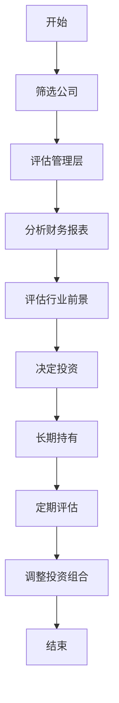
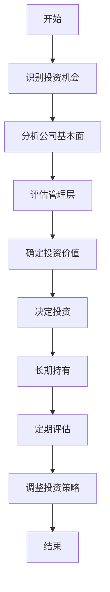

                 

# 巴菲特的股东信：投资智慧的结晶

> 关键词：巴菲特，股东信，价值投资，投资策略，财务分析

> 摘要：本文深入分析巴菲特的投资理念和策略，通过对其股东信的解读，揭示价值投资的核心原则和实际应用。文章结合巴菲特的投资哲学、财务分析方法、投资决策流程，以及实际案例，为读者提供全面的投资智慧。

---

# 第一部分：巴菲特的生平与投资理念

## 第1章：巴菲特的早年经历与投资起步

### 1.1 出生与早年教育

沃伦·巴菲特（Warren Buffett）于1930年8月31日出生在美国密苏里州的奥马哈市。他的父亲霍伊·巴菲特是一位成功的房地产开发商和律师，同时也是一位政治家。巴菲特从小就展现出了对数字和投资的兴趣。他在童年时期就开始阅读各种书籍，尤其是与金融和投资相关的书籍。

### 1.2 初入投资界

巴菲特在高中时期就展现出了非凡的投资天赋。1942年，他通过购买股票和债券开始了自己的投资生涯。他最初的投资是购买美国运通公司的股票，这是他从父亲那里学到的股票分析方法的结果。这次投资不仅让他赚到了第一桶金，也让他对投资产生了浓厚的兴趣。

### 1.3 建立早期投资理念

在早期的投资生涯中，巴菲特逐渐形成了自己的投资理念。他开始研究价值投资，并意识到市场的波动性和短期价格波动的不可预测性。他开始注重公司的基本面分析，包括财务报表、管理层素质、行业地位等因素。

---

## 第2章：巴菲特的投资哲学

### 2.1 价值投资的定义

价值投资是一种以低于内在价值的价格买入优质股票的投资策略。巴菲特认为，市场的波动性是投资者的朋友，因为市场往往会过度反应，从而为价值投资者提供了低价买入的机会。

### 2.2 投资的三项黄金法则

1. **只投资你理解的公司**：巴菲特强调，投资者应该只投资于自己理解的行业和公司。只有当投资者对公司的业务模式和财务状况有深刻的理解时，才能做出明智的投资决策。
2. **长期持有优质股票**：巴菲特主张长期投资，避免频繁买卖。他认为，长期持有优质股票能够最大化复利效应，从而实现财富的长期增长。
3. **保持安全边际**：巴菲特认为，安全边际是投资成功的关键。他建议投资者以低于内在价值的价格买入股票，从而在市场波动时能够避免重大损失。

### 2.3 长期投资的重要性

巴菲特强调长期投资的重要性。他认为，市场的短期波动是无法预测的，但长期趋势是可以通过公司基本面分析来预测的。通过长期持有优质股票，投资者能够避免短期市场的波动，实现财富的稳步增长。

---

# 第二部分：巴菲特股东信的核心内容

## 第3章：股东信的背景与发展

### 3.1 股东信的起源

巴菲特自1951年开始撰写股东信，最初是为了向合伙企业的投资者汇报投资情况。随着时间的推移，这些信件逐渐成为巴菲特分享投资理念和策略的重要平台。股东信的内容涵盖了他对市场的看法、投资策略、财务表现等多个方面。

### 3.2 股东信的重要性

股东信是巴菲特投资智慧的重要体现。通过这些信件，投资者可以了解巴菲特的投资理念、策略和决策过程。这些信件不仅为投资者提供了宝贵的投资知识，也为后来的研究者提供了丰富的研究材料。

### 3.3 股东信的核心内容

1. **财务表现分析**：巴菲特在股东信中详细分析了公司的财务表现，包括收入、利润、现金流等关键指标。
2. **投资策略阐述**：巴菲特在股东信中分享了他的投资策略，包括价值投资、长期持有等核心理念。
3. **未来市场看法**：巴菲特在股东信中表达了他对未来市场的看法，包括他对经济趋势、行业前景的预测。

---

## 第4章：巴菲特的价值投资策略

### 4.1 股票分析方法

### 4.1.1 财务报表分析

巴菲特非常重视财务报表分析。他认为，财务报表是了解公司基本面的重要工具。他重点关注公司的收入、利润、现金流等关键指标，并通过这些指标评估公司的财务健康状况。

### 4.1.2 估值方法

巴菲特使用多种估值方法来评估公司的内在价值，包括市盈率、市净率、股息率等指标。他强调，投资者应该以低于内在价值的价格买入股票。

### 4.1.3 行业分析

巴菲特认为，行业分析是投资的重要组成部分。他倾向于投资于具有强大竞争优势和长期增长潜力的行业。

### 4.2 管理层评估

### 4.2.1 管理层的品质

巴菲特非常重视管理层的品质。他倾向于投资于由诚实、有能力的管理层领导的公司。

### 4.2.2 管理层的决策能力

巴菲特认为，管理层的决策能力是公司成功的关键。他倾向于投资于能够做出明智决策的管理层。

### 4.2.3 管理层的诚信

巴菲特强调，管理层的诚信是投资成功的重要因素。他倾向于投资于具有良好诚信记录的管理层。

---

## 第5章：巴菲特投资策略与其他投资策略的比较

### 5.1 价值投资与成长投资的对比

### 5.1.1 定义与目标

价值投资的目标是以低于内在价值的价格买入股票，而成长投资的目标是投资于具有高增长潜力的公司。

### 5.1.2 投资策略的差异

价值投资者更注重公司的基本面和安全边际，而成长投资者更注重公司的增长潜力。

### 5.1.3 适用场景

价值投资适用于市场低估的时期，而成长投资适用于高增长的时期。

### 5.2 价值投资与技术分析的对比

### 5.2.1 定义与目标

技术分析是一种通过分析市场的历史价格和成交量来预测未来价格走势的方法。

### 5.2.2 价值投资与技术分析的优缺点

价值投资注重基本面分析，而技术分析注重市场趋势分析。

### 5.2.3 适用性分析

价值投资适用于长期投资者，而技术分析适用于短期交易者。

---

# 第三部分：巴菲特股东信的系统分析

## 第6章：巴菲特投资系统的架构

### 6.1 投资系统的组成

### 6.1.1 股票筛选标准

巴菲特的股票筛选标准包括：公司具有强大的竞争优势、管理层诚信、财务状况健康等。

### 6.1.2 投资组合管理

巴菲特的投资组合管理策略包括：分散投资、长期持有等。

### 6.1.3 风险控制机制

巴菲特的风险控制机制包括：避免杠杆投资、保持安全边际等。

### 6.2 投资流程的系统图

以下是一个巴菲特投资流程的系统图：

---

## 第7章：巴菲特投资决策的流程图

### 7.1 投资决策的步骤

以下是一个巴菲特投资决策的流程图：

---

# 第四部分：巴菲特股东信的项目实战

## 第8章：实际案例分析

### 8.1 苹果公司的投资分析

### 8.1.1 公司基本面分析

苹果公司是一家全球领先的科技公司，其产品包括iPhone、iPad、Mac等。公司的财务状况非常健康，收入和利润持续增长。

### 8.1.2 投资决策

巴菲特的投资决策包括：评估苹果公司的管理层、分析财务报表、评估行业前景等。

### 8.1.3 投资结果

通过长期持有苹果股票，巴菲特获得了丰厚的回报。

---

## 第9章：投资组合管理

### 9.1 构建投资组合

巴菲特建议投资者构建一个多样化的投资组合，包括股票、债券等。

### 9.2 投资组合的调整

巴菲特建议投资者定期评估投资组合，并根据市场变化进行调整。

---

# 第五部分：总结与最佳实践

## 第10章：巴菲特的投资智慧总结

### 10.1 投资理念

巴菲特的投资理念包括：价值投资、长期持有、安全边际等。

### 10.2 投资策略

巴菲特的投资策略包括：基本面分析、管理层评估、分散投资等。

---

## 第11章：给读者的建议

### 11.1 投资建议

巴菲特建议投资者：只投资于自己理解的公司、长期持有股票、保持安全边际等。

### 11.2 注意事项

投资者应该避免短期交易、杠杆投资等高风险行为。

### 11.3 拓展阅读

推荐读者阅读巴菲特的《股东信》以及其他相关书籍，以深入理解价值投资的理念和策略。

---

# 作者：AI天才研究院/AI Genius Institute & 禅与计算机程序设计艺术 /Zen And The Art of Computer Programming

