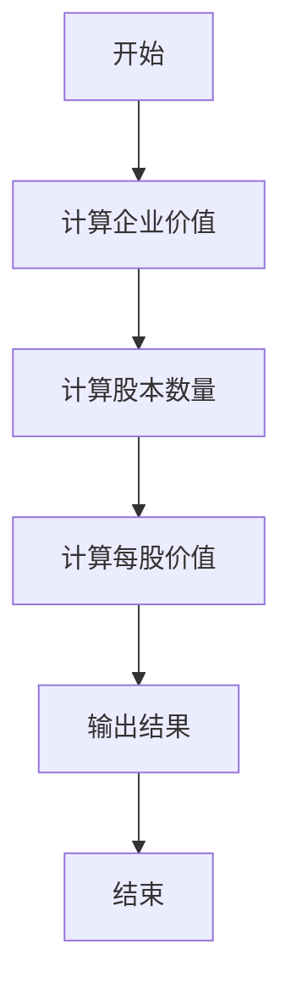
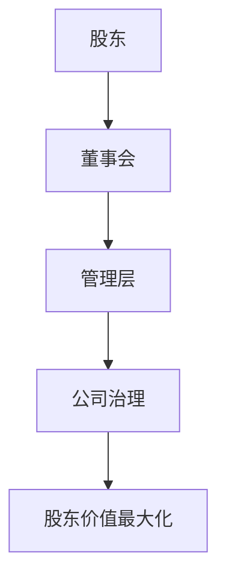

                 


# 巴菲特的股东友好政策

> 关键词：巴菲特，股东友好政策，价值投资，企业治理，股东价值最大化，公司治理

> 摘要：本文探讨了巴菲特的股东友好政策，分析其在企业治理和投资策略中的应用。通过数学模型、算法原理和系统架构的详细讲解，结合实际案例和项目实战，阐述了如何实现股东价值最大化。

---

# 第1章 巴菲特的投资理念与股东友好政策

## 1.1 巴菲特的投资哲学

### 1.1.1 价值投资的定义与核心理念

价值投资是一种以内在价值为基础的投资策略，强调以低于内在价值的价格购买优质资产。巴菲特的价值投资理念强调长期持有优质股票，关注公司的基本面，寻找具有持续竞争优势的企业。

**核心理念：**
- 长期投资：避免频繁交易，降低交易成本。
- 优质企业：选择具有持续盈利能力、强大竞争优势的企业。
- 安全边际：以低于内在价值的价格买入，确保投资的安全性。

### 1.1.2 巴菲特的长期投资策略

巴菲特的长期投资策略基于以下原则：
- **集中投资**：将资金集中在少数优质企业中，减少风险分散。
- **长期持有**：避免短期市场波动，关注企业的长期价值。
- **安全边际**：买入价格低于企业内在价值，确保投资的安全性。

### 1.1.3 股东价值最大化的目标

巴菲特的目标是通过股东价值最大化，为股东创造长期收益。股东价值最大化不仅仅是股价的上涨，还包括企业长期的盈利能力。

---

## 1.2 股东友好政策的核心要素

### 1.2.1 股东友好政策的定义

股东友好政策是指企业在治理结构、财务管理和信息披露等方面采取的措施，旨在最大化股东利益。这些政策包括透明的财务报告、合理的分红政策、有效的公司治理等。

### 1.2.2 股东友好政策的核心要素对比表格

| 核心要素         | 描述                                                                 |
|------------------|----------------------------------------------------------------------|
| 透明的财务报告    | 企业定期披露财务信息，确保股东能够了解企业的财务状况。                   |
| 合理的分红政策    | 根据企业盈利情况，合理分配利润，平衡短期和长期利益。                   |
| 有效的公司治理    | 建立合理的董事会结构，确保管理层和董事会的利益一致，保护股东权益。       |
| 股东参与和投票权  | 保障股东的投票权，鼓励股东参与企业重大决策。                           |

### 1.2.3 股东友好政策的ER实体关系图（Mermaid流程图）

```mermaid
erDiagram
    customer[股东] --> own[拥有] --> share[股票]
    customer[股东] --> vote[投票权]
    company[企业] --> report[财务报告]
    company[企业] --> dividend[分红]
    company[企业] --> governance[公司治理]
```

---

## 1.3 巴菲特的股东友好政策与企业治理

### 1.3.1 企业治理的定义与目标

企业治理是通过董事会和管理层对企业进行有效管理，确保企业目标的实现。良好的企业治理能够提高企业效率，降低风险，保护股东利益。

### 1.3.2 巴菲特的公司治理策略

巴菲特的公司治理策略包括：
- **董事会结构**：董事会成员由经验丰富、能力强的独立董事组成，确保董事会的独立性和专业性。
- **管理层激励机制**：通过股权激励等方式，将管理层的利益与股东利益一致化。
- **股东投票权**：保障股东的投票权，鼓励股东参与企业重大决策。

### 1.3.3 股东友好政策与企业治理的联系

股东友好政策是企业治理的重要组成部分。通过股东友好政策，企业能够更好地实现股东价值最大化，同时提高企业的治理效率和透明度。

---

## 1.4 本章小结

本章介绍了巴菲特的投资哲学和股东友好政策的核心要素，分析了巴菲特的公司治理策略，并探讨了股东友好政策与企业治理的联系。

---

# 第2章 股东友好政策的数学模型与算法原理

## 2.1 股东价值最大化的数学模型

### 2.1.1 股东价值最大化的定义

股东价值最大化是指通过合理的财务管理和投资策略，使股东的财富最大化。这包括企业的盈利能力、股票价格的上涨等。

### 2.1.2 股东价值最大化的数学公式

$$ V = \frac{E}{N} $$

其中：
- \( V \) 表示每股价值
- \( E \) 表示企业价值
- \( N \) 表示股本数量

---

## 2.2 股东友好政策的算法原理

### 2.2.1 股东友好政策的算法流程图（Mermaid流程图）



### 2.2.2 股东友好政策的实现代码

```python
def calculate_shareholder_value(enterprise_value, shares_outstanding):
    return enterprise_value / shares_outstanding

# 示例代码
enterprise_value = 1000000  # 假设企业价值为100万美元
shares_outstanding = 1000000  # 假设流通股为100万股
shareholder_value = calculate_shareholder_value(enterprise_value, shares_outstanding)
print(f"每股股东价值: {shareholder_value}")
```

---

## 2.3 本章小结

本章通过数学模型和算法原理，详细讲解了股东价值最大化的计算方法，并通过代码示例展示了如何实现股东价值最大化的计算。

---

# 第3章 巴菲特的公司治理策略

## 3.1 公司治理的定义与目标

### 3.1.1 公司治理的定义

公司治理是指通过董事会和管理层对企业进行有效管理，确保企业目标的实现。良好的公司治理能够提高企业效率，降低风险，保护股东利益。

### 3.1.2 公司治理的目标

公司治理的目标包括：
- 提高企业效率
- 降低风险
- 保护股东利益
- 确保管理层与股东的利益一致

### 3.1.3 公司治理与股东友好政策的关系

公司治理是股东友好政策的重要组成部分。通过良好的公司治理，企业能够更好地实现股东价值最大化，同时提高企业的治理效率和透明度。

---

## 3.2 巴菲特的公司治理策略

### 3.2.1 董事会结构

巴菲特的董事会结构包括经验丰富、能力强的独立董事，确保董事会的独立性和专业性。

### 3.2.2 管理层激励机制

巴菲特通过股权激励等方式，将管理层的利益与股东利益一致化。

### 3.2.3 股东投票权

巴菲特保障股东的投票权，鼓励股东参与企业重大决策。

---

## 3.3 股东友好政策的公司治理架构（Mermaid架构图）



---

## 3.4 本章小结

本章详细讲解了巴菲特的公司治理策略，包括董事会结构、管理层激励机制和股东投票权，并通过架构图展示了股东友好政策的公司治理架构。

---

# 作者：AI天才研究院/AI Genius Institute & 禅与计算机程序设计艺术 /Zen And The Art of Computer Programming

---

通过以上结构，我们可以系统地理解巴菲特的股东友好政策，并将其应用于实际的企业治理和投资策略中。

