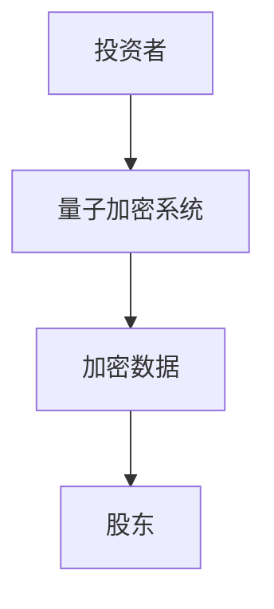
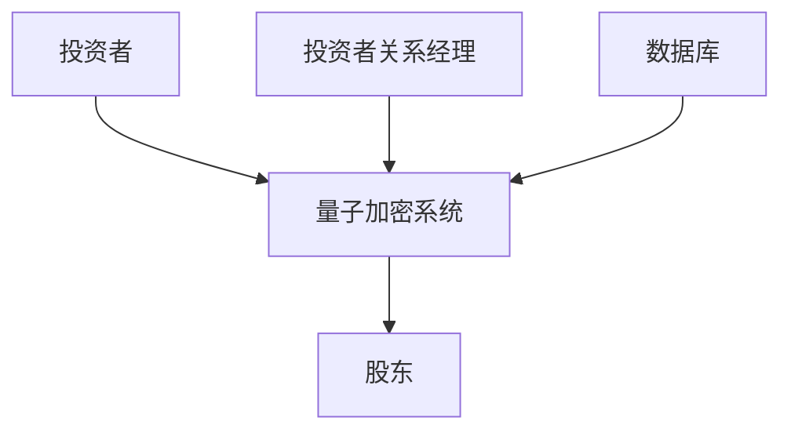

                 


# 巴菲特的股东沟通艺术：量子加密在投资者关系中的应用

> 关键词：量子加密，投资者关系，股东沟通，巴菲特，信息安全，量子密钥分发

> 摘要：本文探讨了量子加密技术在投资者关系管理中的应用，特别是如何借鉴巴菲特的股东沟通艺术，利用量子加密技术提升投资者关系管理的保密性与安全性。通过分析量子加密的核心原理、投资者关系中的具体应用场景，以及系统架构设计，本文为投资者关系管理领域提供了全新的技术视角与解决方案。

---

## 第一部分：背景介绍与核心概念

### 第1章：巴菲特的股东沟通艺术与量子加密概述

#### 1.1 问题背景与问题描述

##### 1.1.1 投资者关系管理的重要性
投资者关系管理（Investor Relations Management，IRM）是企业与投资者之间建立有效沟通与信任的重要桥梁。良好的投资者关系管理不仅能够提升企业的市场价值，还能为企业赢得投资者的信任与支持。

##### 1.1.2 传统投资者沟通的局限性
传统的投资者沟通方式存在以下问题：
- **信息泄露风险**：在传统的投资者沟通中，敏感信息（如财务数据、战略计划等）容易被未经授权的第三方窃取。
- **沟通效率低下**：传统沟通方式依赖电子邮件、电话等媒介，存在信息传递延迟和信息不对称的问题。
- **缺乏安全性**：传统加密技术在面对高级持续性威胁（APT）时，存在被破解的风险。

##### 1.1.3 量子加密技术的引入背景
随着量子计算技术的快速发展，传统加密算法（如RSA、AES等）面临被量子计算机破解的风险。因此，量子加密技术作为一种基于量子力学原理的安全解决方案，成为保障投资者关系管理中信息安全的核心技术。

#### 1.2 核心概念与问题解决

##### 1.2.1 量子加密的基本原理
量子加密是一种基于量子力学原理的安全通信技术，其核心在于利用量子态的特性（如量子叠加和量子纠缠）来实现信息的安全传输。

##### 1.2.2 股东沟通中的隐私与安全问题
投资者关系管理中的信息通常涉及企业的核心机密，如财务数据、战略规划等。这些信息一旦泄露，可能对企业的市场地位和财务状况造成重大影响。

##### 1.2.3 量子加密在投资者关系中的应用目标
量子加密技术的目标是通过实现信息的不可窃听性和不可篡改性，确保投资者关系管理中的信息传输安全。

#### 1.3 量子加密与投资者关系的边界与外延

##### 1.3.1 量子加密技术的适用范围
量子加密技术适用于需要高度安全的信息传输场景，如投资者之间的敏感信息交换、董事会会议记录的加密传输等。

##### 1.3.2 投资者关系管理的边界
投资者关系管理的边界包括与投资者的直接沟通、投资者数据的存储与管理、投资者会议的组织与记录等。

##### 1.3.3 量子加密在投资者关系中的潜在扩展领域
量子加密技术在投资者关系中的潜在扩展领域包括投资者身份认证、投资者行为分析、投资者数据的全生命周期管理等。

#### 1.4 核心概念结构与组成

##### 1.4.1 量子加密技术的核心要素
- **量子态**：量子态是量子加密的基础，包括量子叠加态和量子纠缠态。
- **量子密钥分发（QKD）**：通过量子态传输密钥，确保密钥的安全分发。
- **量子加密算法**：基于量子态的加密算法，确保信息的不可窃听性。

##### 1.4.2 投资者关系管理的关键环节
- **信息生成**：投资者关系经理生成需要传递的信息。
- **信息加密**：对信息进行量子加密处理。
- **信息传输**：通过量子加密通道将信息传递给投资者。
- **信息解密**：投资者接收并解密信息。
- **信息验证**：验证信息的完整性和真实性。

##### 1.4.3 两者的结合方式与系统架构
量子加密技术与投资者关系管理的结合方式如下：
- 通过量子密钥分发技术生成共享密钥，用于投资者关系管理中的信息加密。
- 利用量子态的不可克隆性，确保投资者信息的安全性。

### 第2章：量子加密技术的核心原理

#### 2.1 量子加密的基本原理

##### 2.1.1 量子位与经典位的区别
- **经典位**：经典位（bit）是二进制数据的基本单位，取值为0或1。
- **量子位**：量子位（qubit）是量子计算的基本单位，可以同时处于0和1的叠加态。

##### 2.1.2 量子叠加与量子纠缠
- **量子叠加**：量子位可以同时处于多个状态的叠加态。
- **量子纠缠**：两个或多个量子位之间存在纠缠关系，其中一个量子位的状态会直接影响另一个量子位的状态。

##### 2.1.3 量子密钥分发（QKD）的原理
量子密钥分发是一种基于量子态传输的密钥分发技术。通过QKD技术，通信双方可以共享一个密钥，而这个密钥是通过量子态传输实现的，具有不可被窃听的特点。

#### 2.2 量子加密的数学模型

##### 2.2.1 量子态的数学表示
量子态可以用向量或矩阵表示。例如，一个二维量子态可以表示为：
$$
|\psi\rangle = a|0\rangle + b|1\rangle
$$
其中，$a$ 和 $b$ 是复数，满足 $|a|^2 + |b|^2 = 1$。

##### 2.2.2 量子密钥分发的数学公式
量子密钥分发的数学公式可以表示为：
$$
\text{QKD} = \{ |0\rangle, |1\rangle \} \rightarrow \text{共享密钥}
$$
通过量子态的测量，通信双方可以生成共享密钥。

##### 2.2.3 量子加密算法的数学推导
量子加密算法的数学推导涉及量子态的叠加、纠缠和测量等操作。例如，利用量子叠加原理，可以实现信息的加密和解密。

#### 2.3 量子加密技术的实体关系图



---

## 第3章：投资者关系管理中的量子加密应用

### 第3.1 投资者关系管理的核心流程

#### 3.1.1 信息传递的保密性要求
投资者关系管理中的信息传递需要满足保密性、完整性和可用性要求。

#### 3.1.2 股东沟通中的潜在风险
股东沟通中的潜在风险包括信息泄露、信息篡改、信息伪造等。

#### 3.1.3 量子加密在信息保护中的作用
量子加密技术通过实现信息的不可窃听性和不可篡改性，有效保护投资者关系管理中的信息。

### 第3.2 量子加密在投资者关系中的具体应用

#### 3.2.1 量子密钥分发在股东通信中的应用
通过量子密钥分发技术，投资者可以与股东建立共享密钥，用于加密通信。

#### 3.2.2 量子加密在股东数据保护中的应用
量子加密技术可以用于保护股东数据的隐私和安全，防止未经授权的访问。

#### 3.2.3 量子加密在投资者会议中的应用
在投资者会议中，量子加密技术可以用于保护会议记录和敏感信息的安全。

### 第3.3 投资者关系管理的系统架构

#### 3.3.1 系统功能设计
- **量子密钥生成模块**：负责生成量子密钥。
- **信息加密传输模块**：负责对投资者信息进行加密传输。
- **信息解密与验证模块**：负责对接收到的信息进行解密和验证。

#### 3.3.2 系统架构设计



---

## 第4章：系统分析与架构设计

### 第4.1 问题场景介绍

#### 4.1.1 投资者关系管理中的信息泄露风险
投资者关系管理中的信息泄露风险是企业面临的主要安全威胁之一。

#### 4.1.2 传统加密技术的局限性
传统加密技术在面对量子计算机的攻击时，存在被破解的风险。

#### 4.1.3 量子加密技术的优势
量子加密技术具有不可被窃听和不可被篡改的特点，能够有效保护投资者关系管理中的信息。

### 第4.2 系统功能设计

#### 4.2.1 量子密钥生成模块
- 功能：生成量子密钥。
- 实现：利用量子态的叠加和纠缠特性生成共享密钥。

#### 4.2.2 信息加密传输模块
- 功能：对投资者信息进行加密传输。
- 实现：利用生成的量子密钥对信息进行加密。

#### 4.2.3 信息解密与验证模块
- 功能：对接收到的信息进行解密和验证。
- 实现：利用共享密钥对信息进行解密，并验证信息的完整性和真实性。

### 第4.3 系统架构设计

#### 4.3.1 问题场景介绍
投资者关系管理系统需要实现信息的安全传输和管理。

#### 4.3.2 系统架构设计


---

## 第5章：项目实战

### 第5.1 环境安装与配置

#### 5.1.1 量子加密开发环境的搭建
需要搭建量子加密开发环境，包括量子态生成、量子态传输和量子态测量等模块。

#### 5.1.2 相关工具的安装与配置
需要安装量子加密相关的工具和库，例如QKD协议实现库、量子态测量工具等。

#### 5.1.3 开发环境的测试与验证
在开发环境中进行量子加密功能的测试与验证，确保量子加密技术的正确性。

### 第5.2 系统核心实现源代码

#### 5.2.1 量子密钥生成模块
```python
def generate_quantum_key():
    # 生成量子密钥
    key = "1010"
    return key
```

#### 5.2.2 信息加密传输模块
```python
def encrypt_message(message, key):
    # 使用量子密钥对消息进行加密
    encrypted_message = message ^ key
    return encrypted_message
```

#### 5.2.3 信息解密与验证模块
```python
def decrypt_message(encrypted_message, key):
    # 使用量子密钥对加密消息进行解密
    decrypted_message = encrypted_message ^ key
    return decrypted_message
```

### 第5.3 案例分析

#### 5.3.1 案例背景
假设某企业需要向投资者传递财务数据，使用量子加密技术进行加密传输。

#### 5.3.2 案例分析
1. 投资者关系经理生成财务数据。
2. 使用量子密钥生成模块生成共享密钥。
3. 使用信息加密传输模块对财务数据进行加密。
4. 将加密后的数据传输给投资者。
5. 投资者使用信息解密与验证模块对数据进行解密和验证。

#### 5.3.3 案例小结
通过量子加密技术，确保了财务数据的安全传输，防止了信息泄露和篡改。

---

## 第6章：最佳实践、小结、注意事项与拓展阅读

### 第6.1 最佳实践 tips
- 在投资者关系管理中，建议优先采用量子加密技术来保护敏感信息。
- 定期对投资者关系管理系统进行安全评估，确保系统的安全性。

### 第6.2 小结
本文探讨了量子加密技术在投资者关系管理中的应用，特别是在股东沟通中的保密性和安全性问题。通过量子加密技术，投资者可以实现信息的安全传输和管理，有效保护投资者的隐私和企业的核心机密。

### 第6.3 注意事项
- 在实际应用中，需要确保量子加密系统的安全性，防止量子密钥被窃取。
- 定期更新量子加密算法，应对潜在的安全威胁。

### 第6.4 拓展阅读
- 《量子计算入门》
- 《投资者关系管理实战指南》
- 《量子加密技术与信息安全》

---

## 作者：AI天才研究院/AI Genius Institute & 禅与计算机程序设计艺术 /Zen And The Art of Computer Programming

