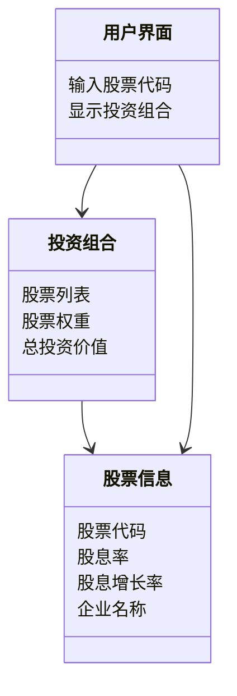
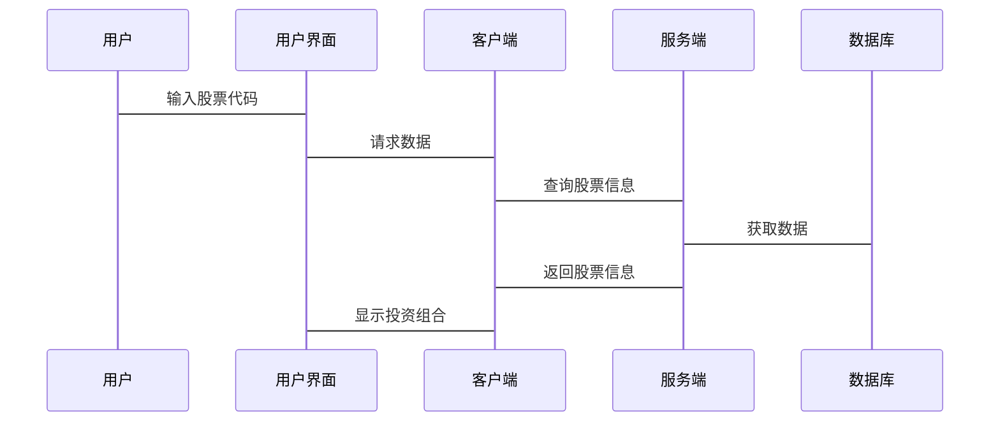

                 


# 巴菲特的股息增长策略：稳定现金流的长期价值

## 关键词：巴菲特，股息增长策略，股息支付率，股息增长模型，价值投资

## 摘要：巴菲特的股息增长策略是一种通过投资于能够持续增长股息的公司来实现长期稳定现金流的方法。本文将详细探讨该策略的核心概念、数学模型、算法实现以及在实际投资中的应用，帮助读者理解如何通过股息增长策略实现财富的长期增值。

---

# 第一部分：股息增长策略的背景与基础

## 第1章：股息增长策略概述

### 1.1 股息增长策略的核心概念

#### 1.1.1 股息的定义与作用
股息是公司分配给股东的利润部分，通常以现金或股票形式支付。股息的作用包括：
- 为股东提供直接回报
- 增强股东对公司的信心
- 为公司提供再投资资金

#### 1.1.2 股息增长策略的起源与发展
股息增长策略起源于价值投资理念，由巴菲特发扬光大。该策略强调选择那些能够持续增长股息的公司，从而实现长期稳定的现金流。

#### 1.1.3 巴菲特与股息增长策略的关系
巴菲特认为，股息增长策略是实现长期投资收益的重要手段，尤其是通过投资于那些股息增长稳定且股息收益率合理的企业。

### 1.2 股息增长策略的背景与重要性

#### 1.2.1 现金流在投资中的重要性
现金流是企业运营和投资的基础，稳定的现金流意味着企业具备持续发展的能力。对于投资者而言，稳定的现金流来源于股息收入，能够提供持续的回报。

#### 1.2.2 股息增长策略的优势与适用场景
- 优势：
  - 稳定的现金流
  - 抗跌性强
  - 长期增值潜力大
- 适用场景：
  - 长期投资
  - 风险厌恶型投资者

#### 1.2.3 股息增长策略与长期投资目标的结合
股息增长策略通过选择股息增长稳定的公司，帮助投资者实现长期的财富增值，同时提供稳定的现金流。

### 1.3 股息增长策略的基本原理

#### 1.3.1 股息支付率的计算与影响
股息支付率=（股息总额/净利润）×100%。支付率过高可能影响公司再投资能力，过低则可能影响股东回报。

#### 1.3.2 股息增长模型的介绍
股息增长模型用于评估股票的内在价值，考虑了股息的持续增长。

#### 1.3.3 如何评估股息增长的可持续性
通过分析公司的盈利能力、现金流情况、行业地位等，评估股息增长的可持续性。

---

# 第二部分：股息增长策略的核心概念与联系

## 第2章：股息增长策略的原理与数学模型

### 2.1 股息增长模型的原理

#### 2.1.1 股息增长模型的基本假设
- 股息将按固定比率增长。
- 股票的内在价值由股息的现值总和决定。

#### 2.1.2 模型的数学推导
股票价值公式：$$ V = \frac{D_1}{k - g} $$
其中，D1为下一年的股息，k为折现率，g为股息增长率。

#### 2.1.3 模型的适用条件与限制
- 股息增长率g必须低于折现率k，确保公式成立。
- 适用于股息持续增长的企业。

### 2.2 股息增长模型的数学公式

#### 2.2.1 股息增长模型的公式
$$ V = \frac{D_1}{k - g} $$

#### 2.2.2 各变量的定义与解释
- D1：下一年的股息
- k：折现率
- g：股息增长率

---

# 第三部分：股息增长策略的算法与实现

## 第3章：股息增长模型的算法实现

### 3.1 股息增长模型的算法流程

#### 3.1.1 确定初始股息率
分析公司历史股息支付情况，确定初始股息率。

#### 3.1.2 计算股息增长率
通过历史数据或管理层目标确定股息增长率。

#### 3.1.3 评估股票的内在价值
使用股息增长模型计算股票的内在价值。

### 3.2 股息增长模型的Python实现

#### 3.2.1 代码示例
```python
def calculate_stock_value(dividend, growth_rate, discount_rate):
    return dividend * (1 + growth_rate) / (discount_rate - growth_rate)

# 示例计算
dividend = 1.0
growth_rate = 0.05
discount_rate = 0.10
value = calculate_stock_value(dividend, growth_rate, discount_rate)
print(f"股票的内在价值为: {value:.2f}")
```

#### 3.2.2 代码解读
- `calculate_stock_value`函数计算股票的内在价值。
- 参数包括初始股息、增长率和折现率。
- 返回计算出的股票价值。

---

## 第四部分：股息增长策略的系统分析与架构设计

## 第4章：系统分析与架构设计方案

### 4.1 问题场景介绍
投资者希望基于股息增长策略构建投资组合，需要分析多个公司的股息增长情况。

### 4.2 项目介绍
设计一个投资管理系统，帮助投资者分析和管理基于股息增长策略的投资组合。

### 4.3 系统功能设计（领域模型）



### 4.4 系统架构设计


### 4.5 系统接口设计
- 用户输入股票代码
- 系统查询股票信息并计算投资组合价值

### 4.6 系统交互设计



---

## 第五部分：股息增长策略的项目实战

## 第5章：项目实战

### 5.1 环境安装
安装Python和必要的库，如pandas、numpy。

### 5.2 核心代码实现

```python
import pandas as pd

def calculate_growth(dividends):
    growth = []
    for i in range(1, len(dividends)):
        growth.append((dividends[i] - dividends[i-1])/dividends[i-1])
    return pd.Series(growth)

# 示例数据
dividends = pd.Series([1.0, 1.05, 1.10, 1.15])
growth = calculate_growth(dividends)
print(growth)
```

### 5.3 代码应用解读与分析
- `calculate_growth`函数计算股息增长率。
- 使用示例数据，计算每年的股息增长率。

### 5.4 实际案例分析
分析某公司股息增长情况，评估其投资价值。

### 5.5 项目小结
总结项目实现的过程和成果，强调股息增长策略的实际应用价值。

---

## 第六部分：股息增长策略的最佳实践

## 第6章：最佳实践

### 6.1 小结
股息增长策略通过选择股息增长稳定的公司，实现长期稳定的现金流回报。

### 6.2 注意事项
- 选择股息增长率合理的公司
- 考虑宏观经济环境
- 定期评估投资组合

### 6.3 拓展阅读
推荐相关书籍和资源，进一步深入学习股息增长策略。

---

作者：AI天才研究院/AI Genius Institute & 禅与计算机程序设计艺术/Zen And The Art of Computer Programming

