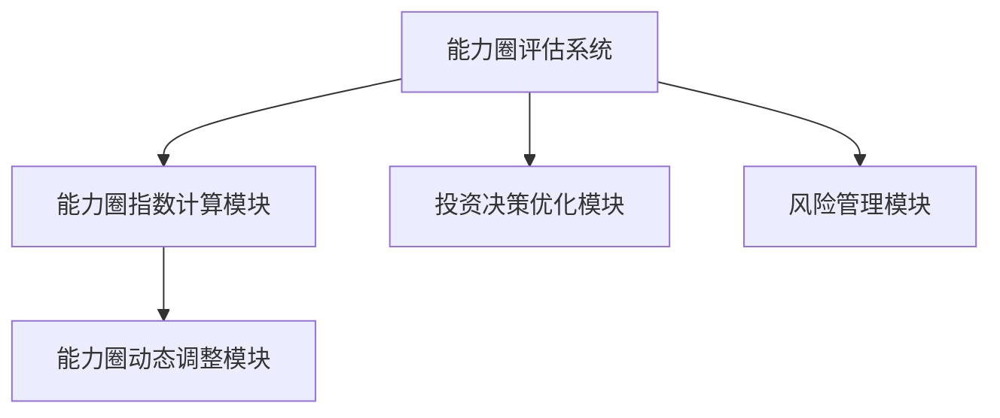
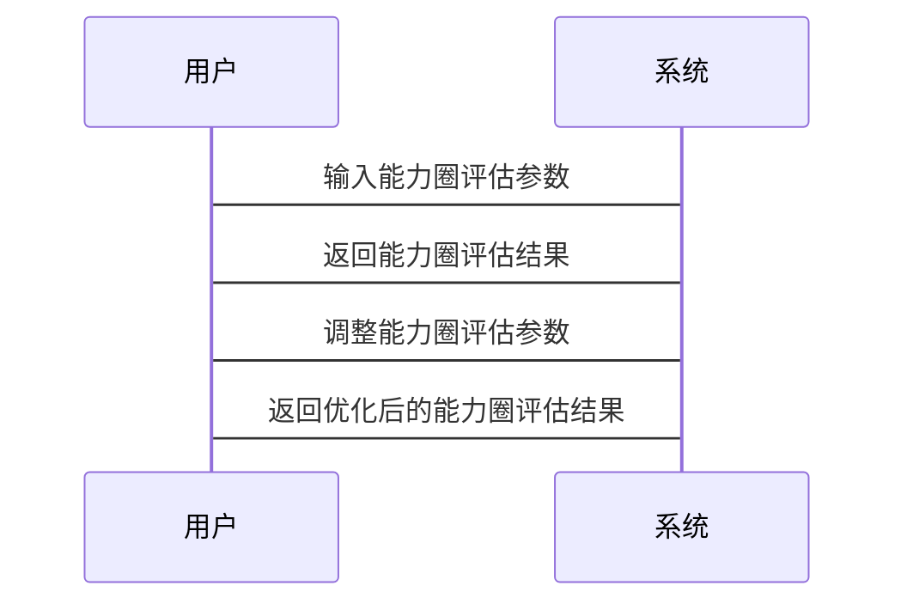

                 

# 巴菲特的能力圈理论：了解自己的优势和局限

关键词：巴菲特、能力圈理论、投资决策、认知局限、风险管理

摘要：本文系统地探讨了巴菲特的能力圈理论，从理论背景、核心概念、数学模型到实际应用，全面分析了能力圈理论在投资决策中的重要性。通过详细的案例分析和系统架构设计，本文为读者提供了理解和应用能力圈理论的实用方法，帮助投资者更好地识别和管理自己的优势与局限。

---

## 第1章: 巴菲特的能力圈理论概述

### 1.1 巴菲特的生平与投资理念

#### 1.1.1 巴菲特的早期经历与投资起步
- 巴菲特的童年与青少年时期
- 巴菲特的早期投资经历
- 巴菲特的价值观与投资哲学

#### 1.1.2 巴菲特的价值投资理念
- 价值投资的核心思想
- 巴菲特的“安全边际”概念
- 巴菲特对长期投资的坚持

#### 1.1.3 巴菲特投资哲学的核心思想
- 巴菲特的投资理念与“能力圈”理论的关联
- 巴菲特对市场的看法
- 巴菲特对投资者心理的理解

### 1.2 能力圈理论的定义与背景

#### 1.2.1 能力圈的定义
- 能力圈的定义与内涵
- 能力圈的边界与外延
- 能力圈的核心要素组成

#### 1.2.2 能力圈理论的提出背景
- 巴菲特提出能力圈理论的目的
- 能力圈理论与价值投资的联系
- 能力圈理论在投资决策中的作用

#### 1.2.3 能力圈理论的核心要素
- 知识储备与专业能力
- 经验与直觉的结合
- 对自身局限性的认知

### 1.3 能力圈理论与投资决策的关系

#### 1.3.1 能力圈在投资中的作用
- 能力圈对投资决策的影响
- 能力圈与投资回报的关系
- 能力圈在风险管理中的应用

#### 1.3.2 能力圈与风险管理
- 能力圈理论对风险控制的意义
- 能力圈边界与投资风险的关系
- 如何通过能力圈理论避免重大投资失误

#### 1.3.3 能力圈理论的实践意义
- 能力圈理论对个人投资者的启示
- 能力圈理论在机构投资中的应用
- 能力圈理论对投资策略的影响

---

## 第2章: 能力圈的核心概念与特征

### 2.1 能力圈的核心概念

#### 2.1.1 能力圈的边界与外延
- 能力圈的边界定义
- 能力圈的动态变化
- 能力圈的外延与扩展

#### 2.1.2 能力圈的核心要素组成
- 知识与经验的结合
- 逻辑思维与分析能力
- 对市场的深刻理解

#### 2.1.3 能力圈的动态变化
- 能力圈的可变性与稳定性
- 如何通过学习和实践扩大能力圈
- 能力圈的自我评估与调整

### 2.2 能力圈与认知局限的关系

#### 2.2.1 认知局限的定义
- 认知局限的内涵与外延
- 认知局限在投资中的表现
- 认知局限与决策错误的关系

#### 2.2.2 能力圈与认知局限的关联
- 能力圈如何影响认知局限
- 认知局限如何限制能力圈的扩展
- 如何通过能力圈理论克服认知局限

#### 2.2.3 超越能力圈的潜在风险
- 超越能力圈可能导致的后果
- 如何识别和避免超越能力圈的风险
- 能力圈理论对风险管理的启示

### 2.3 能力圈的特征对比

#### 2.3.1 能力圈的稳定性与可变性
- 能力圈的稳定性特征
- 能力圈的可变性特征
- 如何在动态变化中保持能力圈的稳定性

#### 2.3.2 能力圈的广度与深度
- 能力圈的广度与深度的定义
- 广度与深度的权衡与选择
- 如何在广度与深度之间找到平衡

#### 2.3.3 能力圈的个人化与差异化
- 能力圈的个性化特征
- 能力圈的差异化表现
- 不同投资者能力圈的比较与借鉴

---

## 第3章: 能力圈理论的数学模型与公式

### 3.1 能力圈评估的数学模型

#### 3.1.1 能力圈评估的基本假设
- 能力圈评估的理论基础
- 能力圈评估的变量定义
- 能力圈评估的假设条件

#### 3.1.2 能力圈评估的数学公式
$$ C = \sum_{i=1}^{n} w_i \cdot S_i $$
其中，$C$为能力圈指数，$w_i$为第$i$项能力的权重，$S_i$为第$i$项能力的水平评分

#### 3.1.3 公式的应用场景
- 如何通过数学公式量化能力圈
- 如何根据公式调整能力圈的评估权重
- 如何通过公式优化能力圈的评估结果

### 3.2 能力圈与投资决策的数学关系

#### 3.2.1 投资决策的数学模型
$$ D = \sum_{j=1}^{m} p_j \cdot C_j $$
其中，$D$为投资决策指数，$p_j$为第$j$项决策的权重，$C_j$为第$j$项决策的能力圈评分

#### 3.2.2 数学关系的实际应用
- 如何通过数学模型优化投资决策
- 如何通过能力圈理论指导投资决策
- 如何通过数学公式量化投资风险

### 3.3 能力圈的动态调整公式

#### 3.3.1 能力圈动态调整的数学表达
$$ C_{\text{new}} = C_{\text{old}} + \Delta C $$
其中，$\Delta C$为能力圈的变化量，$C_{\text{old}}$为旧能力圈指数，$C_{\text{new}}$为新能力圈指数

#### 3.3.2 动态调整的实现方法
- 如何通过动态调整公式优化能力圈评估
- 如何根据实际情况调整能力圈指数
- 如何通过动态调整公式预测未来能力圈的变化

---

## 第4章: 能力圈理论的系统分析与架构设计

### 4.1 能力圈评估的系统架构

#### 4.1.1 系统功能模块划分
- 系统功能模块的定义与划分
- 各功能模块之间的关系
- 系统功能模块的实现方式

#### 4.1.2 系统功能设计
- 系统功能设计的需求分析
- 系统功能设计的模块划分
- 系统功能设计的实现细节

#### 4.1.3 系统架构图

### 4.2 能力圈评估的系统架构

#### 4.2.1 系统架构设计的背景
- 系统架构设计的目标
- 系统架构设计的依据
- 系统架构设计的原则

#### 4.2.2 系统架构图

#### 4.2.3 系统架构的实现细节
- 系统架构的实现步骤
- 系统架构的实现方法
- 系统架构的实现注意事项

### 4.3 能力圈评估的系统交互

#### 4.3.1 系统交互的定义与设计
- 系统交互的定义
- 系统交互的设计原则
- 系统交互的实现方法

#### 4.3.2 系统交互图

#### 4.3.3 系统交互的实际应用
- 如何通过系统交互优化能力圈评估
- 如何通过系统交互提升投资决策效率
- 如何通过系统交互降低投资风险

---

## 第5章: 能力圈理论的项目实战

### 5.1 项目背景介绍

#### 5.1.1 项目目标
- 项目目标的定义与设定
- 项目目标的实现路径
- 项目目标的评估标准

#### 5.1.2 项目需求分析
- 项目需求的来源
- 项目需求的分析方法
- 项目需求的优先级排序

#### 5.1.3 项目实施计划
- 项目实施的时间安排
- 项目实施的资源分配
- 项目实施的风险管理

### 5.2 项目核心实现

#### 5.2.1 环境安装与配置
- 项目环境的安装步骤
- 项目环境的配置方法
- 项目环境的测试与验证

#### 5.2.2 核心代码实现
- 核心代码的编写步骤
- 核心代码的实现细节
- 核心代码的测试与优化

#### 5.2.3 代码应用解读与分析
- 代码的结构与功能分析
- 代码的关键部分解读
- 代码的优化建议与注意事项

### 5.3 项目实战案例分析

#### 5.3.1 案例背景介绍
- 案例的背景信息
- 案例的分析目标
- 案例的实施步骤

#### 5.3.2 案例分析与解读
- 案例的分析过程
- 案例的关键点解读
- 案例的结论与启示

#### 5.3.3 案例的优化与改进
- 案例的优化方案
- 案例的改进措施
- 案例的实施效果评估

### 5.4 项目小结

#### 5.4.1 项目总结
- 项目的整体实施情况
- 项目的主要收获与体会
- 项目的不足与改进方向

#### 5.4.2 经验与教训
- 项目实施中的经验总结
- 项目实施中的教训分析
- 项目实施中的注意事项

#### 5.4.3 项目未来展望
- 项目的后续发展计划
- 项目的潜在应用领域
- 项目对能力圈理论的推动作用

---

## 第6章: 能力圈理论的最佳实践

### 6.1 最佳实践 tips

#### 6.1.1 知识储备与能力提升
- 如何通过学习扩大能力圈
- 如何通过实践提升能力圈
- 如何通过反思优化能力圈

#### 6.1.2 风险管理与决策优化
- 如何通过能力圈理论优化投资决策
- 如何通过能力圈理论降低投资风险
- 如何通过能力圈理论提高投资回报

#### 6.1.3 持续改进与自我完善
- 如何通过能力圈理论实现持续改进
- 如何通过能力圈理论实现自我完善
- 如何通过能力圈理论提升投资能力

### 6.2 小结

#### 6.2.1 核心内容回顾
- 能力圈理论的核心思想
- 能力圈理论的关键点
- 能力圈理论的实践意义

#### 6.2.2 重要启示
- 能力圈理论对个人投资者的启示
- 能力圈理论对机构投资者的启示
- 能力圈理论对投资决策的启示

### 6.3 注意事项

#### 6.3.1 能力圈评估的注意事项
- 如何避免能力圈评估的偏差
- 如何克服能力圈评估的局限
- 如何确保能力圈评估的准确性

#### 6.3.2 投资决策中的注意事项
- 如何避免能力圈理论的滥用
- 如何防止能力圈理论的误用
- 如何确保能力圈理论的有效应用

### 6.4 拓展阅读

#### 6.4.1 相关书籍推荐
- 巴菲特的经典著作
- 其他相关投资理论书籍
- 专业投资分析书籍

#### 6.4.2 网络资源推荐
- 相关投资网站
- 专业投资论坛
- 优质投资博客

#### 6.4.3 专家访谈与案例分析
- 专家访谈内容
- 典型案例分析
- 专业投资建议

---

## 第7章: 总结与展望

### 7.1 总结

#### 7.1.1 核心内容总结
- 能力圈理论的核心思想
- 能力圈理论的实践意义
- 能力圈理论的未来发展趋势

#### 7.1.2 重要启示总结
- 对个人投资者的启示
- 对机构投资者的启示
- 对投资决策的启示

### 7.2 展望

#### 7.2.1 能力圈理论的未来发展
- 能力圈理论的未来研究方向
- 能力圈理论的潜在应用领域
- 能力圈理论的创新与突破

#### 7.2.2 能力圈理论的推广与普及
- 如何进一步推广能力圈理论
- 如何让更多投资者了解能力圈理论
- 如何通过教育与培训普及能力圈理论

#### 7.2.3 能力圈理论与技术的结合
- 能力圈理论与人工智能的结合
- 能力圈理论与大数据技术的结合
- 能力圈理论与金融科技的结合

---

## 作者：AI天才研究院/AI Genius Institute & 禅与计算机程序设计艺术/Zen And The Art of Computer Programming

