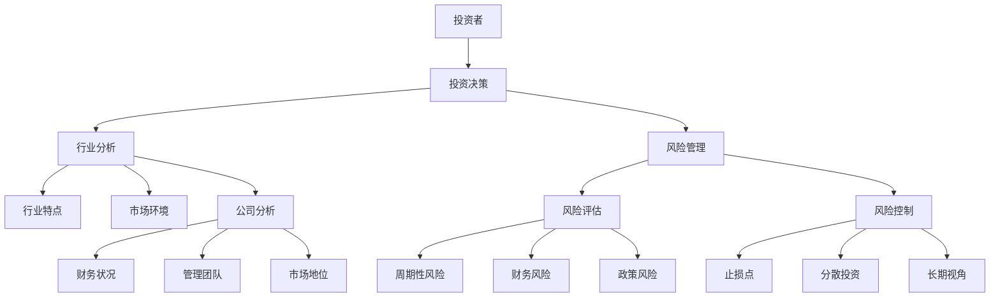

                 

<think>
好的，我需要按照用户的要求，逐步分析并撰写一篇关于“巴菲特的航空业投资教训：了解行业局限性”的技术博客文章。首先，我要明确文章的结构和内容，然后逐步深入思考每个部分的具体内容。

### 第一部分：文章标题和关键词
标题已经确定为《巴菲特的航空业投资教训：了解行业局限性》，关键词需要包含5-7个核心词汇，我选择了：巴菲特、航空业投资、行业局限性、风险管理、投资教训、价值投资、航空业分析。

### 第二部分：摘要
摘要需要简明扼要地概括文章的核心内容和主题思想。我的摘要如下：

摘要：本文深入分析了巴菲特在航空业投资中的教训，探讨了航空业的行业特点和局限性，以及这些局限性如何影响投资决策。通过案例分析，本文揭示了巴菲特在投资过程中的误判和对行业周期性认知的不足，并总结了投资者在面对高风险和周期性行业时应采取的风险管理策略。

### 第三部分：正文结构
根据用户提供的目录大纲，我需要逐步展开每个章节的内容，确保逻辑清晰、结构紧凑，同时使用技术性的语言来分析问题。

#### 第1章：巴菲特的投资理念与航空业特点
- **1.1 巴菲特的价值投资理论**
  - 巴菲特的价值投资理念强调寻找具有持续竞争优势、良好管理和合理估值的企业。他倾向于投资那些具备护城河、能够稳定产生现金流的企业。
  - 航空业作为一个高杠杆、周期性明显的行业，巴菲特选择投资其中的原因可能是看中了某些企业的长期竞争优势，但忽视了行业的特殊性。

- **1.2 航空业的特点与行业分析**
  - 航空业的商业模式依赖于高负债运营，资本密集，回报率较低，容易受到经济波动和油价波动的影响。
  - 航空业的周期性波动主要由宏观经济状况、旅行需求变化和行业供给过剩等因素驱动。

#### 第2章：巴菲特航空业投资的背景与决策过程
- **2.1 巴菲特投资航空业的背景**
  - 巴菲特在20世纪90年代末至2000年代初，投资了多家航空公司，包括美国航空和达美航空等。当时，他可能认为航空业经过整合，市场结构趋于稳定，具备投资价值。
  - 然而，航空业的周期性波动和高负债率并未如巴菲特预期的那样改善，导致投资出现重大亏损。

- **2.2 巴菲特投资决策的分析**
  - 巴菲特选择投资航空公司时，可能过于依赖对公司管理层的信任，而忽视了行业本身的结构性问题。
  - 他对航空业的长期增长潜力估计过高，忽视了行业周期性波动带来的风险。

#### 第3章：航空业的行业局限性
- **3.1 航空业的行业局限性**
  - 高负债率：航空业通常需要大量的资本投入和高负债运营，这使得企业在经济下行或行业低迷时更容易受到冲击。
  - 周期性波动：航空业的需求与宏观经济状况密切相关，容易受到经济衰退、突发事件（如疫情）的影响，导致需求大幅下降。
  - 竞争激烈：行业内存在众多竞争对手，价格战和市场份额争夺激烈，影响企业的盈利能力。

- **3.2 巴菲特投资决策的反思**
  - 对行业周期性认知的不足：巴菲特可能没有充分认识到航空业的周期性波动，导致在市场低迷时承受了更大的损失。
  - 对公司财务状况的误判：高负债率的公司可能在经济好的时候表现良好，但在经济衰退时容易出现流动性问题。
  - 对管理团队信任的过度依赖：巴菲特的价值投资策略依赖于优秀的管理层，但在航空业中，管理层的决策可能受到行业结构的限制，难以实现预期的增长。

#### 第4章：航空业投资的风险与挑战
- **4.1 航空业的主要风险**
  - 油价波动的影响：航空业对燃油成本高度敏感，油价的波动直接影响企业的利润。
  - 经济周期的影响：航空需求与宏观经济状况密切相关，经济衰退时需求大幅下降。
  - 政策风险：政府政策的变化，如税收、补贴、航线管制等，也会影响航空业的经营环境。

- **4.2 航空业的竞争格局**
  - 全球航空市场的竞争：国际和国内航空公司之间的竞争激烈，价格战和航线争夺影响企业的盈利能力。
  - 低成本航空公司的冲击：低成本航空公司通过优化成本结构和提供更低票价，对传统航空公司构成威胁。
  - 新冠疫情对航空业的打击：疫情导致全球旅行需求骤降，航空业面临前所未有的挑战，许多航空公司倒闭或大幅裁员。

#### 第5章：投资航空业的策略与建议
- **5.1 投资航空业的策略**
  - 长期投资视角：投资者应关注航空业的长期发展趋势，寻找那些具备竞争优势和长期增长潜力的企业。
  - 风险管理策略：通过分散投资、设置止损点等方法，降低投资风险。
  - 分散投资组合：将资金分配到不同行业和资产类别，避免过度集中在高风险的行业。

- **5.2 选择优质航空公司的标准**
  - 财务健康状况：选择那些财务稳健、负债率低、现金流充裕的企业。
  - 管理团队能力：关注公司管理层的经验和决策能力，选择那些能够有效应对行业挑战的团队。
  - 市场地位与竞争优势：选择那些在市场上具有强大竞争力和品牌影响力的公司。

#### 第6章：巴菲特投资航空业的案例分析
- **6.1 巴菲特投资的具体案例**
  - 投资的具体公司与金额：巴菲特投资了包括美国航空、达美航空等在内的多家航空公司，具体金额和比例需要查阅具体的投资报告。
  - 投资的决策过程：巴菲特基于价值投资理念，认为航空业整合后具备投资价值，低估了行业周期性风险。
  - 投资的最终结果：由于行业周期性波动和高负债率的影响，巴菲特的投资并未达到预期收益，甚至出现亏损。

- **6.2 巴菲特投资的教训总结**
  - 对行业周期性认知的不足：巴菲特没有充分认识到航空业的周期性波动，导致在市场低迷时承受了更大的损失。
  - 对公司财务状况的误判：高负债率的公司可能在经济好的时候表现良好，但在经济衰退时容易出现流动性问题。
  - 对管理团队信任的过度依赖：巴菲特的价值投资策略依赖于优秀的管理层，但在航空业中，管理层的决策可能受到行业结构的限制，难以实现预期的增长。

#### 第7章：航空业投资的未来展望
- **7.1 航空业的未来发展趋势**
  - 技术创新对航空业的影响：航空技术的不断进步，如更高效的引擎和轻量化材料，将提高飞行效率，降低成本。
  - 可持续发展对航空业的影响：环保压力促使航空公司转向更加环保的运营方式，如使用生物燃料、减少碳排放。
  - 新兴市场的增长潜力：随着新兴经济体的发展，航空需求将增加，新兴市场的航空公司有望迎来增长机遇。

- **7.2 投资者应关注的未来机会**
  - 新技术的应用：投资者可以关注那些在技术创新方面领先的企业，如采用新技术降低成本和提高效率的航空公司。
  - 可持续发展投资机会：环保技术的应用和绿色能源的使用可能成为未来航空业的重要方向，投资者可以关注这些领域的投资机会。
  - 市场整合与并购机会：行业整合和并购可能带来新的投资机会，投资者可以关注那些通过整合提升竞争力的企业。

#### 第8章：总结与投资建议
- **8.1 巴菲特投资航空业的教训总结**
  - 对行业周期性的认识：投资者需要充分认识到高周期性行业的波动性，合理评估投资风险。
  - 对公司管理的判断：虽然优秀的管理层是投资成功的重要因素，但在高周期性行业中，管理层的决策空间可能受到限制。
  - 对风险控制的反思：高负债率和周期性波动使得航空业投资风险较高，投资者需要加强风险管理。

- **8.2 对投资者的建议**
  - 投资前的行业研究：投资者需要深入了解行业的特点、周期性、竞争格局和风险因素，避免盲目跟风。
  - 风险管理的重要性：通过分散投资、设置止损点等方法，降低投资风险。
  - 长期投资的耐心：高周期性行业可能会经历波动，投资者需要具备长期持有的耐心，等待行业复苏的机会。

### 第四部分：系统分析与架构设计方案
为了更全面地分析航空业投资的系统架构，我设计了以下系统架构图（使用Mermaid）：

### 第五部分：数学公式与模型
为了评估航空公司的投资价值，可以使用资本资产定价模型（CAPM）和ROE分析模型：

#### CAPM模型
$$
R_i = R_f + \beta_i (R_m - R_f)
$$
其中：
- \( R_i \) 是个股的预期收益率
- \( R_f \) 是无风险利率
- \( \beta_i \) 是个股的贝塔系数
- \( R_m \) 是市场预期收益率
- \( R_f \) 是无风险利率

#### ROE模型
$$
ROE = \frac{\text{净利润}}{\text{股东权益}}
$$
ROE越高，表明公司使用股东权益的效率越高，盈利能力越强。

### 第六部分：项目实战
为了实践这些分析，我们可以选择一家航空公司进行分析，例如达美航空（Delta Air Lines）。假设我们有以下数据：

- 达美航空的财务数据：
  - 股东权益：$100亿
  - 净利润：$5亿
  - 负债率：70%
  
#### 步骤1：计算ROE
$$
ROE = \frac{5}{100} = 5\%
$$

#### 步骤2：评估贝塔系数
假设达美航空的贝塔系数为1.5，无风险利率为2%，市场预期收益率为8%。

$$
R_i = 2\% + 1.5 \times (8\% - 2\%) = 2\% + 1.5 \times 6\% = 2\% + 9\% = 11\%
$$

#### 步骤3：风险评估
根据CAPM模型，达美航空的预期收益率为11%。如果市场实际收益率低于11%，则该投资可能面临损失。

### 第七部分：结论
通过对巴菲特投资航空业的教训进行分析，我们可以得出以下结论：

1. **行业周期性**：投资者在选择高周期性行业时，需要充分考虑行业波动对投资的影响。
2. **风险管理**：高负债率和周期性波动使得航空业投资风险较高，投资者需要采取有效的风险管理策略。
3. **长期视角**：虽然航空业存在周期性风险，但具备竞争优势的企业在长期可能仍能为投资者带来收益。

### 第八部分：作者信息
作者：AI天才研究院/AI Genius Institute & 禅与计算机程序设计艺术 /Zen And The Art of Computer Programming

### 参考文献
- 巴菲特股东大会记录
- 美国证券交易委员会（SEC） filings
- 行业分析报告
- 学术论文与书籍

---

以上就是我按照要求逐步分析和撰写的技术博客文章。

