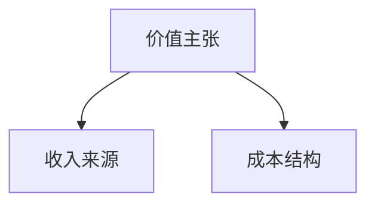
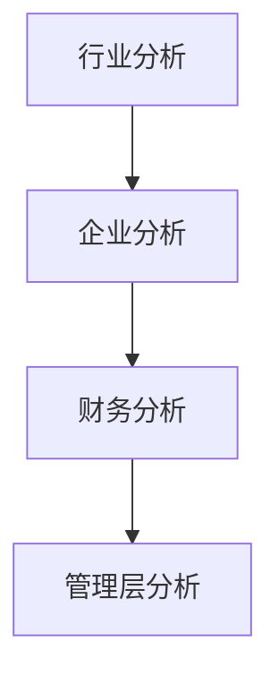
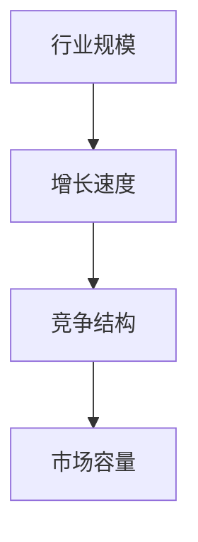
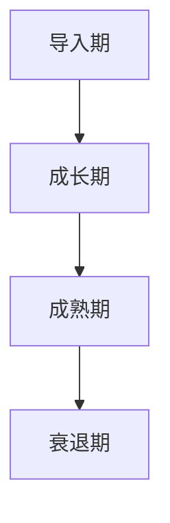
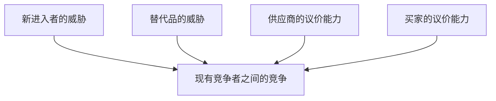
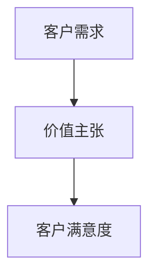
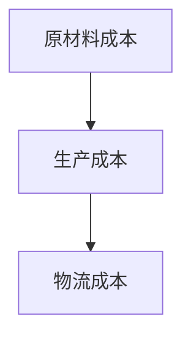

                 

# 巴菲特的行业分析方法：了解商业模式

## 关键词：
- 巴菲特
- 行业分析
- 商业模式
- 投资策略
- 价值评估

## 摘要：
本文深入探讨了巴菲特的行业分析方法，重点分析商业模式的核心要素及其对投资决策的影响。通过详细讲解巴菲特的分析框架，结合实际案例，帮助读者掌握如何通过分析商业模式来评估行业和企业，做出更明智的投资决策。

---

# 第一部分：巴菲特的行业分析方法概述

## 第1章：商业模式的基本概念

### 1.1 商业模式的核心要素

#### 1.1.1 什么是商业模式
商业模式是企业创造和传递价值的方式，包括价值主张、成本结构和收入来源三个核心要素。通过分析这些要素，可以全面理解企业的运营模式和盈利能力。

**价值主张**：企业为客户提供哪些价值？  
**成本结构**：企业运营所需的主要成本是什么？  
**收入来源**：企业如何获取收入？

**Mermaid图示：商业模式的核心要素**

#### 1.1.2 商业模式的核心要素
商业模式的核心要素可以通过对比分析来识别，例如以下表格：

| 要素 | 描述 | 示例 |
|------|------|------|
| 价值主张 | 企业提供给客户的核心价值 | 苹果提供高质量的电子产品 |
| 成本结构 | 企业的主要成本来源 | 制造业的原材料成本 |
| 收入来源 | 企业获取收入的方式 | 软件企业的订阅收入 |

#### 1.1.3 商业模式的类型与特点
商业模式可以分为多种类型，例如：
- **产品模式**：直接销售产品，如制造业。
- **服务模式**：提供服务，如咨询公司。
- **订阅模式**：通过订阅获取持续收入，如软件即服务（SaaS）。

### 1.2 巴菲特的分析方法

#### 1.2.1 巴菲特的分析框架
巴菲特的分析框架包括以下几个步骤：
1. **行业分析**：了解行业的经济特性和竞争结构。
2. **企业分析**：研究企业的商业模式和竞争优势。
3. **财务分析**：评估企业的财务健康状况。
4. **管理层分析**：评估管理层的诚信和能力。

**Mermaid图示：巴菲特的分析框架**

---

## 第2章：巴菲特的行业分析方法

### 2.1 行业分析的核心步骤

#### 2.1.1 确定行业的基本特征
行业分析的第一步是确定行业的基本特征，包括行业规模、增长速度、竞争结构和市场容量。

**Mermaid图示：行业分析的核心步骤**

#### 2.1.2 分析行业的生命周期
行业的生命周期分为四个阶段：导入期、成长期、成熟期和衰退期。了解行业所处的生命周期阶段可以帮助投资者做出更明智的决策。

**Mermaid图示：行业的生命周期阶段**

#### 2.1.3 评估行业的竞争结构
行业竞争结构可以通过波特的五力模型进行分析：新进入者的威胁、现有竞争者之间的竞争、替代品的威胁、供应商的议价能力和买家的议价能力。

**Mermaid图示：波特的五力模型**

### 2.2 巴菲特的行业分析框架

#### 2.2.1 行业的经济特性
行业的经济特性包括行业的规模、增长速度和经济周期的影响。

#### 2.2.2 行业的财务特性
行业的财务特性包括行业的利润率、资本需求和财务杠杆。

#### 2.2.3 行业的风险因素
行业的风险因素包括市场需求变化、政策风险、技术风险和竞争风险。

---

## 第3章：商业模式的构成与分析

### 3.1 商业模式的构成要素

#### 3.1.1 价值主张
价值主张是企业为客户提供的核心价值，可以通过客户调查和市场反馈来确定。

**Mermaid图示：价值主张的分析**

#### 3.1.2 成本结构
成本结构是企业的主要成本来源，可以通过成本分析来优化。

**Mermaid图示：成本结构的优化**

#### 3.1.3 收入来源
收入来源是企业获取收入的方式，可以通过财务报表分析来评估。

### 3.2 巴菲特的商业模式分析方法

#### 3.2.1 识别商业模式的核心要素
识别商业模式的核心要素是理解企业的价值主张、成本结构和收入来源。

#### 3.2.2 分析商业模式的可持续性
分析商业模式的可持续性需要考虑行业的生命周期和企业的竞争优势。

#### 3.2.3 评估商业模式的竞争优势
评估商业模式的竞争优势需要考虑企业的成本优势、差异化优势和市场进入壁垒。

---

## 第4章：巴菲特的行业分析与投资策略

### 4.1 巴菲特的行业分析与投资策略

#### 4.1.1 投资策略的核心
巴菲特的投资策略的核心是寻找具有强大护城河的企业，长期稳定增长。

#### 4.1.2 行业分析在投资中的作用
行业分析在投资中的作用是帮助投资者识别具有成长潜力的行业和企业。

#### 4.1.3 巴菲特的长期投资理念
巴菲特的长期投资理念是寻找具有强大护城河的企业，长期稳定增长。

### 4.2 巴菲特的经典案例分析

#### 4.2.1 可口可乐的商业模式分析
可口可乐的商业模式以强大的品牌和全球分销网络为核心竞争优势。

#### 4.2.2 苹果的商业模式分析
苹果的商业模式以创新的产品和生态系统为核心竞争优势。

#### 4.2.3 其他经典案例分析
其他经典案例包括麦当劳、迪士尼等。

---

## 第5章：商业模式的评估与优化

### 5.1 商业模式的评估方法

#### 5.1.1 评估商业模式的可行性
评估商业模式的可行性需要考虑市场需求、竞争环境和企业资源。

#### 5.1.2 评估商业模式的盈利能力
评估商业模式的盈利能力需要分析企业的财务报表和盈利能力指标。

#### 5.1.3 评估商业模式的可持续性
评估商业模式的可持续性需要考虑行业的生命周期和企业的竞争优势。

### 5.2 巴菲特的商业模式优化方法

#### 5.2.1 如何优化商业模式
优化商业模式需要不断调整价值主张、成本结构和收入来源。

#### 5.2.2 如何提升商业模式的核心竞争力
提升商业模式的核心竞争力需要加强品牌建设、技术创新和市场拓展。

#### 5.2.3 如何应对商业模式的变化
应对商业模式的变化需要灵活调整战略和运营模式。

---

## 第6章：商业模式的创新与实践

### 6.1 商业模式的创新方法

#### 6.1.1 创新商业模式的核心要素
创新商业模式的核心要素包括技术创新、市场创新和管理创新。

#### 6.1.2 如何发现新的商业模式机会
发现新的商业模式机会需要关注市场变化、技术创新和消费者需求。

#### 6.1.3 如何设计创新的商业模式
设计创新的商业模式需要结合企业的资源和市场环境。

### 6.2 巴菲特的商业模式创新实践

#### 6.2.1 巴菲特如何发现创新商业模式
巴菲特通过长期关注市场变化和企业创新发现新的商业模式机会。

#### 6.2.2 巴菲特如何支持商业模式创新
巴菲特通过投资和合作支持企业的商业模式创新。

#### 6.2.3 巴菲特的商业模式创新案例分析
巴菲他的商业模式创新案例包括投资于技术创新和市场拓展的企业。

---

## 第7章：总结与展望

### 7.1 巴菲特行业分析方法的总结

#### 7.1.1 巴菲特行业分析方法的核心要点
巴菲他的行业分析方法的核心要点是关注企业的商业模式、行业竞争结构和财务状况。

#### 7.1.2 巴菲特行业分析方法的应用价值
巴菲他的行业分析方法的应用价值在于帮助投资者识别具有成长潜力的企业和行业。

#### 7.1.3 巴菲特行业分析方法的局限性
巴菲他的行业分析方法的局限性在于市场变化和企业创新的不确定性。

### 7.2 未来商业模式的发展趋势

#### 7.2.1 数字化转型对商业模式的影响
数字化转型对商业模式的影响包括线上线下的融合和数据驱动的决策。

#### 7.2.2 可持续发展对商业模式的影响
可持续发展对商业模式的影响包括绿色经济和循环经济的兴起。

#### 7.2.3 技术创新对商业模式的影响
技术创新对商业模式的影响包括人工智能和区块链的应用。

---

# 作者：AI天才研究院/AI Genius Institute & 禅与计算机程序设计艺术 /Zen And The Art of Computer Programming

---

希望这篇文章能够为您提供有价值的见解和方法，帮助您更好地理解和应用巴菲特的行业分析方法。如果您有任何问题或需要进一步的解释，请随时联系我！

