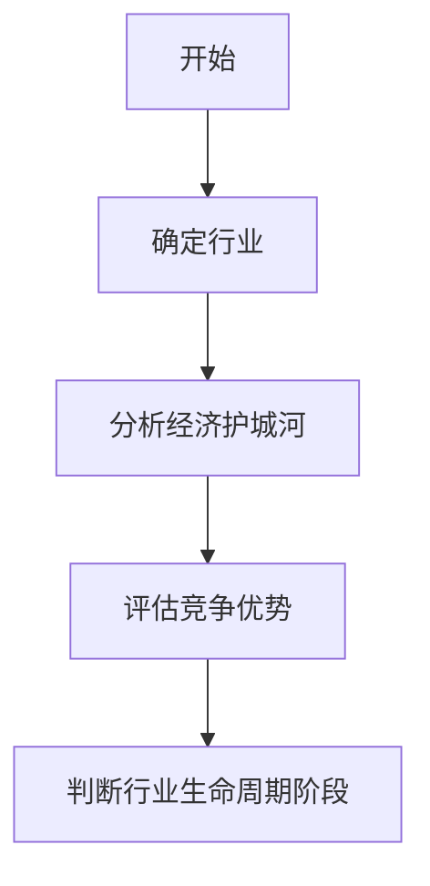
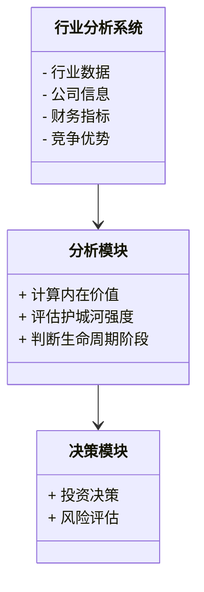

                 


# 巴菲特的行业分析方法：了解商业模式的重要性

> 关键词：巴菲特，行业分析，商业模式，投资策略，经济护城河

> 摘要：本文详细探讨了巴菲特的行业分析方法，重点分析其商业模式的重要性。通过逻辑推理，结合技术语言，分析巴菲特的经济护城河、行业生命周期和竞争优势等核心概念。文章详细阐述了巴菲特的分析框架、数学模型和实际应用案例，帮助读者理解其投资策略。

---

## 第一部分：巴菲特的行业分析方法概述

## 第1章：巴菲特投资理念与行业分析基础

### 1.1 巴菲特投资理念概述

#### 1.1.1 价值投资的定义与核心思想
价值投资是一种投资策略，通过寻找市场价格低于其内在价值的公司进行投资。巴菲特的价值投资理念强调长期持有优质资产，注重公司基本面分析。

#### 1.1.2 巴菲特的投资策略与成功案例
巴菲特的成功源于其独特的投资策略，包括寻找具有强大经济护城河的公司，注重财务健康和管理团队稳定性。经典案例包括可口可乐和苹果公司。

#### 1.1.3 价值投资与行业分析的关系
行业分析是价值投资的重要组成部分，帮助投资者识别具有长期竞争优势的行业和公司。

---

### 1.2 巴菲特行业分析的核心原则

#### 1.2.1 经济护城河的定义与分类
经济护城河是公司竞争优势的来源，分为成本优势、网络效应、技术壁垒和品牌优势等类型。

#### 1.2.2 行业生命周期与竞争优势分析
行业生命周期分为导入期、成长期、成熟期和衰退期，不同阶段的行业分析策略不同。

#### 1.2.3 财务指标在行业分析中的应用
关键财务指标包括ROE（净资产收益率）、ROA（资产收益率）和毛利率，用于评估公司盈利能力。

---

## 第2章：巴菲特行业分析的核心概念与联系

### 2.1 巴菲特行业分析的核心概念

#### 2.1.1 经济护城河的数学模型
经济护城河强度计算公式：$$护城河强度 = \frac{市场份额}{竞争壁垒}$$

#### 2.1.2 行业生命周期的阶段划分
行业生命周期分为四个阶段，通过收入增长率和利润率判断所处阶段。

#### 2.1.3 商业模式的ER实体关系图
通过ER图展示公司、行业、竞争优势等实体之间的关系。

---

### 2.2 核心概念的对比分析

#### 2.2.1 不同商业模式的特征对比表格
| 商业模式 | 成本驱动 | 网络效应 | 技术壁垒 | 品牌优势 |
|---------|---------|----------|----------|----------|
| 公司A   | 高      | 低       | 中        | 高       |

#### 2.2.2 经济护城河与竞争优势的联系与区别
经济护城河是竞争优势的外部表现，竞争优势是内部核心能力。

---

## 第3章：巴菲特行业分析的算法原理

### 3.1 巴菲特行业分析的数学模型

#### 3.1.1 内在价值计算公式
$$内在价值 = \sum_{t=1}^{n} \frac{CF_t}{(1 + r)^t}$$
其中，CF_t为第t年的现金流，r为折现率。

#### 3.1.2 经济护城河强度评估公式
$$护城河强度 = \frac{市场份额}{竞争壁垒}$$

#### 3.1.3 行业生命周期阶段判定算法
通过收入增长率和利润率判断行业所处阶段。

---

### 3.2 算法原理的mermaid流程图



---

## 第4章：系统分析与架构设计

### 4.1 系统功能设计（领域模型）



---

## 第5章：项目实战

### 5.1 环境安装

安装Python和相关库：
```bash
pip install numpy pandas matplotlib
```

---

### 5.2 系统核心实现源代码

```python
import numpy as np
import pandas as pd

def calculate_intrinsic_value(cash_flows, discount_rate):
    return np.npv(discount_rate, cash_flows)

def calculate_economic_moor(theorem):
    pass

# 示例数据
cf = [100, 200, 300]
r = 0.05
iv = calculate_intrinsic_value(cf, r)
print(f"内在价值：{iv}")
```

---

## 第6章：最佳实践与小结

### 6.1 最佳实践 tips
- 定期更新行业数据，保持分析模型的准确性。
- 结合宏观经济环境，动态调整分析策略。

### 6.2 小结
巴菲特的行业分析方法以经济护城河为核心，通过深入分析商业模式和行业生命周期，帮助投资者识别优质投资标的。

---

## 作者：AI天才研究院 & 禅与计算机程序设计艺术

