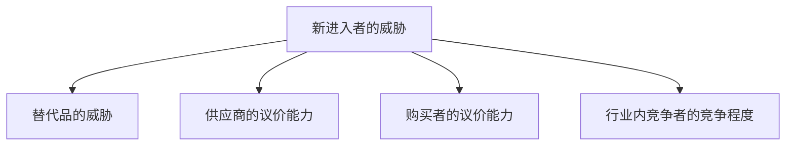

                 

# 巴菲特的行业分析方法：如何识别具有持久竞争优势的行业

## 关键词：巴菲特，行业分析，竞争优势，护城河，投资策略，可持续盈利能力

## 摘要：本文深入探讨巴菲特的行业分析方法，揭示如何识别具有持久竞争优势的行业。通过分析巴菲特的核心投资原则，包括护城河、管理层质量、财务健康状况等，结合实际案例和系统化的分析框架，为投资者提供实用的策略和工具，帮助他们在投资决策中找到具有长期竞争优势的行业和公司。

---

## 第一部分：引言

### 1.1 巴菲特的投资理念概述

#### 1.1.1 巴菲特的生平与投资哲学

沃伦·巴菲特是世界上最著名的投资者之一，他的投资哲学以价值投资为核心，强调寻找具有持久竞争优势的企业。他通过长期持有优质股票，获得了超越市场平均水平的投资回报。巴菲特的投资理念不仅适用于个人投资者，也为机构投资者提供了重要的指导。

#### 1.1.2 为什么行业分析是投资的关键

行业分析是巴菲特投资策略中的重要组成部分。他相信，选择一个具有强大竞争优势的行业，能够使企业在长期的市场波动中保持稳定的表现。行业分析帮助投资者识别行业的增长潜力、竞争结构和潜在风险，从而做出更明智的投资决策。

#### 1.1.3 本书的目的与读者对象

本书旨在为投资者提供一套系统化的行业分析方法，基于巴菲特的核心投资原则，帮助读者识别具有持久竞争优势的行业和公司。无论你是新手还是经验丰富的投资者，都可以通过本书掌握如何运用巴菲特的行业分析方法，提升自己的投资能力。

---

## 第二部分：巴菲特的核心投资原则

### 2.1 投资的四项基本原则

#### 2.1.1 高额的股东权益回报率（ROE）

股东权益回报率（ROE）是衡量企业盈利能力的重要指标。巴菲特认为，ROE应至少保持在15%以上，才能证明企业的盈利能力是可持续的。以下是ROE的计算公式：

$$ROE = \frac{\text{净利润}}{\text{股东权益}}$$

#### 2.1.2 可持续的盈利能力

企业的盈利能力必须是可持续的，这意味着企业在不同经济周期中都能保持稳定的盈利水平。巴菲特特别关注企业的毛利率和净利率，这两个指标可以帮助投资者评估企业的盈利能力和成本控制能力。

#### 2.1.3 强大的竞争优势（护城河）

护城河是巴菲特分析企业竞争优势的核心概念。一个企业的护城河可以是成本优势、品牌优势、网络效应或技术壁垒。以下是护城河的四种类型：

1. **成本优势**：企业能够以更低的成本生产产品或服务。
2. **品牌优势**：强大的品牌认知度和客户忠诚度。
3. **网络效应**：产品或服务的价值随着用户数量的增加而增加。
4. **技术壁垒**：企业拥有的专利或独特的技术，使得竞争对手难以复制。

#### 2.1.4 质朴的管理层

管理层的质量和决策能力对企业的长期成功至关重要。巴菲特倾向于选择那些诚实、谨慎且具有优秀决策记录的管理层。以下是评估管理层的关键指标：

1. **管理层的诚信**：管理层是否诚实可靠。
2. **管理层的决策历史**：管理层在过去是否做出了明智的决策。
3. **管理层的资本分配能力**：管理层是否能够有效地分配资本，避免过度扩张或无效投资。

### 2.2 企业的护城河分析

#### 2.2.1 什么是护城河

护城河是指企业能够长期保持竞争优势的结构性特征。这些特征使得企业在面对竞争对手时能够保持定价权，并在行业波动中保持稳定的盈利能力。

#### 2.2.2 护城河的四种类型

以下是护城河的四种类型及其优缺点：

| 类型         | 优点                           | 缺点                           |
|--------------|--------------------------------|--------------------------------|
| 成本优势     | 可以通过低成本生产获得更高的利润率 | 可能受到技术进步或竞争者的模仿影响 |
| 品牌优势     | 高品牌忠诚度，客户愿意支付溢价 | 品牌形象可能受到公关危机的影响 |
| 网络效应     | 用户越多，产品价值越高          | 网络效应的建立需要时间和资源       |
| 技术壁垒     | 高难度的技术使得竞争对手难以复制 | 技术可能过时，需要持续研发和创新    |

---

## 第三部分：行业分析的框架与工具

### 3.1 行业分析的基本步骤

#### 3.1.1 确定行业的生命周期阶段

行业的生命周期分为四个阶段：导入期、成长期、成熟期和衰退期。投资者应选择处于成长期或成熟期的行业，因为这些阶段的行业具有较高的增长潜力和稳定的盈利能力。

#### 3.1.2 分析行业结构：波特的五力模型

波特的五力模型是分析行业竞争结构的重要工具。以下是五力模型的组成部分：

1. **新进入者的威胁**：行业进入壁垒的高低。
2. **替代品的威胁**：替代品的可替代性。
3. **供应商的议价能力**：供应商的集中度和替代品的可获得性。
4. **购买者的议价能力**：购买者的集中度和购买量。
5. **行业内竞争者的竞争程度**：行业内竞争者的数量和市场份额分布。

以下是五力模型的mermaid图示：

#### 3.1.3 评估行业的财务健康状况

行业的财务健康状况可以通过以下指标进行评估：

1. **行业平均ROE**：行业的平均股东权益回报率。
2. **行业平均毛利率**：行业的平均毛利率。
3. **行业平均资产负债率**：行业的平均资产负债率。

---

## 第四部分：巴菲特的行业分析方法

### 4.1 从护城河角度分析行业

#### 4.1.1 可口可乐的案例分析

可口可乐是一家具有强大护城河的企业。它的品牌优势和全球分销网络使其在全球饮料行业中占据了领先地位。以下是可口可乐的竞争优势分析：

1. **品牌优势**：可口可乐是全球最著名的品牌之一，具有强大的品牌忠诚度。
2. **分销网络**：可口可乐拥有全球最大的饮料分销网络，使其能够快速将产品送达消费者手中。
3. **成本优势**：通过规模化生产，可口可乐能够以较低的成本生产饮料。

#### 4.1.2 喜诗糖果的案例分析

喜诗糖果是一家具有强大护城河的企业。它的成本优势和品牌优势使其在糖果行业中占据了领先地位。以下是喜诗糖果的竞争优势分析：

1. **成本优势**：喜诗糖果通过规模化生产，降低了单位产品的成本。
2. **品牌优势**：喜诗糖果在北美市场具有强大的品牌认知度和客户忠诚度。
3. **分销网络**：喜诗糖果拥有广泛的分销网络，能够将产品快速送达消费者手中。

#### 4.1.3 其他经典案例分析

除了可口可乐和喜诗糖果，其他具有强大护城河的行业还包括：

1. **烟草行业**：烟草企业具有强大的品牌优势和高客户忠诚度。
2. **能源行业**：能源企业具有强大的资源壁垒和规模经济。

### 4.2 从管理层角度分析行业

#### 4.2.1 管理层的诚信与能力

管理层的诚信和能力是企业成功的关键。投资者应选择那些具有优秀管理能力和良好诚信记录的管理层。以下是评估管理层的关键指标：

1. **管理层的诚信**：管理层是否诚实可靠。
2. **管理层的决策历史**：管理层在过去是否做出了明智的决策。
3. **管理层的资本分配能力**：管理层是否能够有效地分配资本，避免过度扩张或无效投资。

#### 4.2.2 管理层的决策历史

管理层的决策历史是评估管理层能力的重要指标。投资者应选择那些在过去做出了明智决策的管理层。以下是评估管理层决策历史的关键指标：

1. **资本支出**：管理层是否进行了过多的资本支出。
2. **收购活动**：管理层是否进行了过多的收购活动。
3. **股利政策**：管理层是否进行了合理的股利分配。

#### 4.2.3 管理层的资本分配能力

管理层的资本分配能力是评估管理层能力的重要指标。以下是评估管理层资本分配能力的关键指标：

1. **资本分配决策**：管理层是否做出了明智的资本分配决策。
2. **资本分配效果**：资本分配决策是否带来了良好的投资回报。

### 4.3 从财务健康状况分析行业

#### 4.3.1 净利润增长率

净利润增长率是衡量企业盈利能力的重要指标。以下是净利润增长率的计算公式：

$$\text{净利润增长率} = \frac{\text{本年净利润} - \text{上年净利润}}{\text{上年净利润}} \times 100\%$$

#### 4.3.2 营业利润率

营业利润率是衡量企业盈利能力的重要指标。以下是营业利润率的计算公式：

$$\text{营业利润率} = \frac{\text{营业利润}}{\text{营业收入}} \times 100\%$$

#### 4.3.3 资产负债率

资产负债率是衡量企业财务健康状况的重要指标。以下是资产负债率的计算公式：

$$\text{资产负债率} = \frac{\text{总负债}}{\text{总资产}} \times 100\%$$

---

## 第五部分：实战指南

### 5.1 如何应用巴菲特的行业分析方法

#### 5.1.1 确定投资目标

投资者应首先确定自己的投资目标和风险承受能力。以下是确定投资目标的关键步骤：

1. **投资目标**：明确自己的投资目标，例如长期资本增值、股利收入等。
2. **风险承受能力**：评估自己的风险承受能力，选择适合自己的投资策略。

#### 5.1.2 进行行业分析

投资者应选择具有强大竞争优势的行业。以下是进行行业分析的关键步骤：

1. **选择行业**：选择具有强大竞争优势的行业，例如具有强大品牌优势、成本优势或网络效应的行业。
2. **分析行业结构**：使用波特的五力模型分析行业的竞争结构。
3. **评估行业财务状况**：评估行业的财务健康状况，包括ROE、毛利率和资产负债率等指标。

#### 5.1.3 选择企业

投资者应选择具有强大竞争优势的企业。以下是选择企业的关键步骤：

1. **选择企业**：选择具有强大竞争优势的企业，例如具有强大品牌优势、成本优势或网络效应的企业。
2. **分析企业的竞争优势**：分析企业的竞争优势，包括护城河、管理层质量和财务状况等。
3. **评估企业的财务状况**：评估企业的财务状况，包括ROE、毛利率和资产负债率等指标。

### 5.2 投资组合管理

#### 5.2.1 构建投资组合

投资者应根据自己的投资目标和风险承受能力，构建适合自己的投资组合。以下是构建投资组合的关键步骤：

1. **确定投资策略**：根据自己的投资目标和风险承受能力，确定投资策略，例如集中投资、分散投资等。
2. **选择投资标的**：根据行业分析和企业分析，选择适合自己的投资标的。
3. **分配投资比例**：根据自己的投资策略，分配投资比例，例如集中投资于少数具有强大竞争优势的企业，或分散投资于多个具有强大竞争优势的企业。

#### 5.2.2 持续跟踪与评估

投资者应持续跟踪和评估自己的投资组合。以下是持续跟踪与评估的关键步骤：

1. **持续跟踪**：定期跟踪投资组合的市场表现，评估投资组合的收益和风险。
2. **定期评估**：定期评估投资组合的收益和风险，根据市场变化和个人投资目标的变化，调整投资组合。

---

## 第六部分：结论

### 6.1 总结全文

本文深入探讨了巴菲特的行业分析方法，揭示了如何识别具有持久竞争优势的行业。通过分析巴菲特的核心投资原则，包括护城河、管理层质量、财务健康状况等，结合实际案例和系统化的分析框架，为投资者提供了一套实用的行业分析方法。

### 6.2 进一步学习与实践

投资者应不断学习和实践，提升自己的行业分析能力。以下是进一步学习与实践的关键步骤：

1. **学习巴菲特的投资理念**：深入学习巴菲特的投资理念，理解其核心思想和投资原则。
2. **阅读经典投资书籍**：阅读经典投资书籍，例如《聪明的投资者》、《投资最重要的少数法则》等。
3. **实践行业分析**：通过实践行业分析，提升自己的行业分析能力，识别具有持久竞争优势的行业和企业。

### 6.3 经典语录

- **巴菲特**：“时间是伟大企业的朋友，平庸企业的敌人。”
- **巴菲特**：“投资的秘诀在于寻找那些具有强大竞争优势的企业。”

---

## 作者：AI天才研究院/AI Genius Institute & 禅与计算机程序设计艺术/Zen And The Art of Computer Programming

