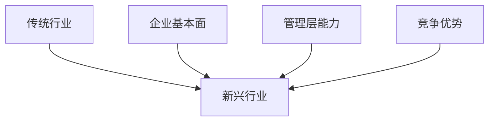
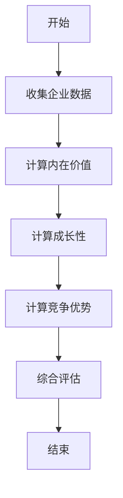
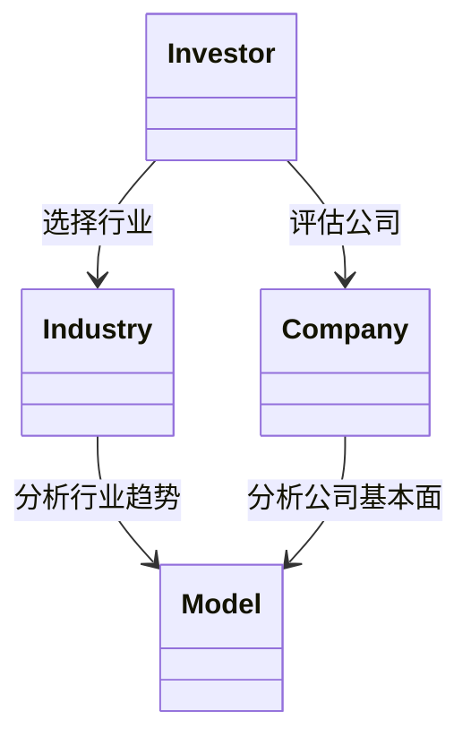
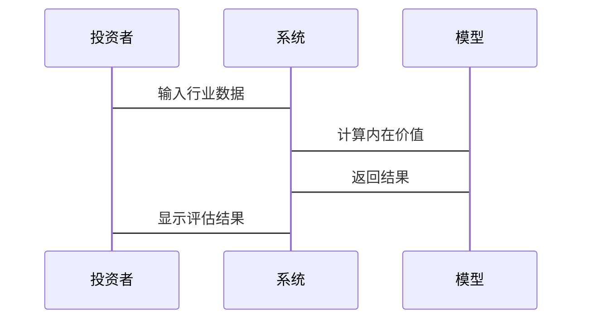

                 


# 巴菲特的行业转型投资：从传统到新兴产业

> 关键词：巴菲特，行业转型，价值投资，新兴产业，传统行业

> 摘要：本文深入探讨了巴菲特的行业转型投资策略，从其核心理念、算法原理到系统架构，再到项目实战，全面分析了巴菲特如何通过价值投资和长期持有策略，在行业转型中寻找投资机会。文章结合实际案例，详细阐述了巴菲特投资模型的数学公式、Python代码实现以及系统架构设计，为读者提供了全面的理论和实践指导。

---

## 第一部分：引言

### 1.1 巴菲特投资理念概述

沃伦·巴菲特作为全球最著名的投资者之一，以其独特的价值投资理念闻名。他主张通过深入分析企业的基本面，寻找具有持续竞争优势和良好治理结构的公司进行长期投资。巴菲特的投资理念强调安全边际和长期持有，而非短期市场波动的投机。

#### 1.1.1 巴菲特的投资哲学

巴菲特的投资哲学可以总结为“价值投资”。他认为市场短期可能由情绪驱动，但长期必然回归基本面。他倾向于投资那些具备强大护城河、稳定收益和优秀管理层的公司。

#### 1.1.2 巴菲特投资的成功案例

巴菲特的伯克希尔哈撒韦公司通过投资可口可乐、IBM、苹果等企业，取得了巨大的成功。这些案例展示了巴菲特如何通过长期持有优质企业实现财富增长。

#### 1.1.3 本书的目的与意义

本文旨在探讨巴菲特如何将传统行业投资转向新兴行业的策略。通过分析其投资逻辑、算法模型和系统架构，为投资者提供实用的指导。

---

## 第二部分：行业转型的背景与驱动力

### 2.1 传统行业与新兴产业的对比分析

#### 2.1.1 传统行业的特点与局限性

传统行业如制造业、零售业等，通常依赖于稳定的市场需求和成熟的商业模式。但随着技术进步和市场竞争加剧，传统行业面临利润率下降和增长放缓的问题。

#### 2.1.2 新兴产业的崛起与发展

新兴产业如科技、人工智能、生物技术等，凭借技术创新和市场潜力，成为经济增长的新动力。这些行业具备高增长性和颠覆性，吸引了大量投资。

#### 2.1.3 行业转型的必要性与紧迫性

行业转型不仅是企业生存的需要，也是投资者把握新机遇的关键。传统行业必须通过技术创新和管理优化，才能在新兴行业中找到新的增长点。

### 2.2 行业转型的驱动力

#### 2.2.1 技术进步对行业转型的影响

技术进步如人工智能、大数据等，为传统行业提供了转型升级的工具。例如，制造业可以通过智能化改造提高效率。

#### 2.2.2 市场需求变化的推动作用

消费者需求的变化迫使企业调整产品和服务。例如，线上购物的兴起推动了零售业的转型。

#### 2.2.3 政策与法规的引导作用

政府政策如环保法规、产业补贴等，为行业转型提供了支持。例如，新能源汽车的推广政策推动了汽车行业的转型。

---

## 第三部分：巴菲特行业转型投资的核心概念

### 3.1 巴菲特行业转型投资的定义与特点

#### 3.1.1 巴菲特行业转型投资的定义

巴菲特的行业转型投资是指通过分析行业发展趋势，投资那些能够成功从传统行业向新兴行业转型的企业。

#### 3.1.2 巴菲特投资策略的核心要素

巴菲特的核心要素包括企业基本面、管理层能力、竞争优势和估值水平。

#### 3.1.3 巴菲特行业转型投资与传统投资的区别

传统投资关注短期市场波动，而行业转型投资关注长期行业趋势和企业转型能力。

### 3.2 巴菲特行业转型投资的核心要素对比

#### 3.2.1 核心概念原理

通过对比分析，巴菲特的投资模型强调企业的核心竞争力和长期增长潜力。

#### 3.2.2 核心要素对比表格

| 要素         | 传统行业投资       | 新兴行业投资       |
|--------------|--------------------|--------------------|
| 关注点       | 企业稳定性         | 企业增长潜力       |
| 风险         | 较低               | 较高               |
| 投资周期     | 中长期             | 长期               |

#### 3.2.3 实体关系图（Mermaid流程图）



---

## 第四部分：巴菲特行业转型投资的算法原理

### 4.1 巴菲特投资模型的数学模型

#### 4.1.1 巴菲特价值评估公式

$$ \text{内在价值} = \frac{\text{净利润}}{\text{折现率}} $$

#### 4.1.2 巴菲特成长性评估公式

$$ \text{成长性} = \frac{\text{收入增长率}}{\text{行业平均增长率}} $$

#### 4.1.3 巴菲特竞争优势评估公式

$$ \text{竞争优势} = \frac{\text{市场份额}}{\text{行业总市场份额}} $$

### 4.2 巴菲特投资模型的算法流程图（Mermaid）



### 4.3 巴菲特投资模型的Python实现

```python
def calculate_intrinsic_value(net_profit, discount_rate):
    return net_profit / discount_rate

def calculate_growth_potential(revenue_growth, industry_growth):
    return revenue_growth / industry_growth

def calculate_competitive_edge market_share, total_market_share):
    return market_share / total_market_share

# 示例
net_profit = 100
discount_rate = 0.1
revenue_growth = 0.2
industry_growth = 0.1
market_share = 0.3
total_market_share = 1

intrinsic_value = calculate_intrinsic_value(net_profit, discount_rate)
growth_potential = calculate_growth_potential(revenue_growth, industry_growth)
competitive_edge = calculate_competitive_edge(market_share, total_market_share)

print(f"内在价值：{intrinsic_value}")
print(f"成长性：{growth_potential}")
print(f"竞争优势：{competitive_edge}")
```

---

## 第五部分：系统分析与架构设计

### 5.1 问题场景介绍

本系统旨在帮助投资者通过巴菲特的行业转型投资策略，评估企业的内在价值和竞争优势。

### 5.2 系统功能设计（领域模型Mermaid类图）



### 5.3 系统架构设计（Mermaid架构图）


### 5.4 系统接口设计

系统提供API接口，供投资者输入数据并获取评估结果。

### 5.5 系统交互Mermaid序列图



---

## 第六部分：项目实战

### 6.1 环境安装

安装Python和相关库，如Pandas和Scikit-learn。

### 6.2 核心代码实现

实现巴菲特投资模型的Python代码。

### 6.3 代码解读与分析

详细解读代码逻辑和功能。

### 6.4 案例分析

通过具体案例分析，展示如何应用巴菲特的策略进行投资决策。

### 6.5 项目总结

总结项目成果和经验教训。

---

## 第七部分：最佳实践

### 7.1 小结

巴菲特的行业转型投资策略强调长期价值和企业基本面分析。

### 7.2 注意事项

投资者需关注行业趋势和企业竞争优势，避免短期波动影响判断。

### 7.3 拓展阅读

建议阅读巴菲特的《聪明的投资者》和相关投资策略书籍。

---

## 作者：AI天才研究院/AI Genius Institute & 禅与计算机程序设计艺术 /Zen And The Art of Computer Programming

---

以上是《巴菲特的行业转型投资：从传统到新兴产业》的完整文章结构，涵盖了从背景分析到系统设计的全过程，结合理论与实践，为投资者提供了全面的指导。

