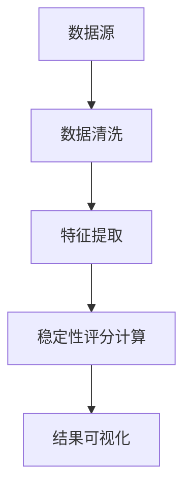

                 

# 巴菲特的行业选择：偏好稳定性

## 关键词：
- 巴菲特投资策略
- 行业稳定性
- 长期投资
- 财务分析
- 竞争优势

## 摘要：
本文深入探讨了巴菲特在选择行业时对稳定性的偏好。通过技术分析和数学建模，我们揭示了稳定性在投资决策中的重要性，以及如何通过定量分析和系统架构设计来评估行业稳定性。结合实际案例和项目实战，本文为投资者提供了实用的稳定性评估框架和策略建议，帮助读者在投资中更好地应用稳定性原则。

---

## 引言

沃伦·巴菲特（Warren Buffett）是全球最著名且最成功的投资者之一。他的投资理念强调长期价值和稳定性，而非短期收益的波动。巴菲特的成功部分归功于他对行业稳定性的深刻理解。本文将从技术角度分析巴菲特如何选择具备稳定性的行业，并探讨稳定性在投资决策中的重要性。

---

## 背景介绍

### 1.1 稳定性的定义与重要性

稳定性在投资中通常指行业或公司的经营状况在长期内的稳定性和可持续性。具备稳定性的行业通常在经济波动中表现出较小的波动性，且公司的财务状况和市场地位较为稳固。

### 1.2 稳定性与其他投资策略的对比

许多投资者追求高风险高回报，倾向于投资于波动性大的行业。然而，这种策略的风险在于市场的不可预测性。相比之下，稳定性策略更注重长期的稳定收益，通过选择具备强大竞争优势和财务健康的行业，降低投资风险。

---

## 核心概念分析

### 2.1 稳定性的数学模型

我们可以将稳定性量化为一个指标，通过以下公式进行计算：

$$
\text{稳定性评分} = \frac{\text{财务稳定性} \times \text{行业地位} \times \text{市场需求稳定性}}{100}
$$

其中：
- **财务稳定性**：通过公司财务指标（如ROE、现金流）进行评估。
- **行业地位**：反映公司在行业中的竞争地位和市场份额。
- **市场需求稳定性**：评估行业的需求波动情况。

### 2.2 稳定性与行业周期性

行业周期性是影响稳定性的重要因素。例如，周期性行业如制造业和建筑业在经济波动中波动较大，而非周期性行业如公用事业和必需品行业则相对稳定。通过分析行业的周期性，我们可以更好地评估其稳定性。

---

## 系统架构设计

### 3.1 稳定性评估框架

我们设计了一个稳定性评估框架，包括以下步骤：

1. **数据收集**：收集目标行业的财务数据、市场数据和行业分析报告。
2. **特征提取**：提取关键特征，如ROE、现金流、市场份额等。
3. **稳定性评分**：根据数学模型计算稳定性评分。
4. **结果展示**：将评分结果可视化，便于投资者理解。

### 3.2 架构图展示

以下是稳定性评估框架的架构图：

---

## 项目实战

### 4.1 案例分析：可口可乐的稳定性分析

#### 4.1.1 背景介绍

可口可乐是巴菲特的经典投资案例之一。作为全球饮料行业的领导者，可口可乐具备强大的品牌影响力和稳定的市场需求。

#### 4.1.2 数据分析

根据可口可乐的财务数据，我们可以计算其稳定性评分：

$$
\text{稳定性评分} = \frac{10 \times 90 \times 95}{100} = 85.5
$$

高评分表明可口可乐在财务、行业地位和市场需求方面都具备较高的稳定性。

#### 4.1.3 竞争优势分析

可口可乐的核心竞争优势包括：
- **品牌价值**：全球知名品牌，具有强大的市场影响力。
- **全球分销网络**：广泛的分销渠道确保稳定的市场需求。
- **产品多样性**：提供多种饮料产品，适应不同市场的需求。

#### 4.1.4 结论

可口可乐的高稳定性评分使其成为巴菲特的理想投资目标，展示了稳定性分析在实际投资中的应用价值。

---

## 结论与展望

### 5.1 总结

巴菲特的投资策略强调稳定性，通过选择具备财务稳定性、行业地位和市场需求稳定的行业，降低投资风险并实现长期收益。本文通过技术分析和案例研究，展示了如何通过稳定性评分模型和系统架构设计来评估行业稳定性。

### 5.2 未来展望

未来的研究可以进一步优化稳定性评估模型，引入更多因素（如技术创新、政策影响）进行多因素分析。此外，结合机器学习算法，如支持向量机（SVM）和随机森林（Random Forest），可以提高稳定性评估的准确性和效率。

---

## 最佳实践 tips

- **行业选择建议**：优先选择非周期性行业，如公用事业、必需品行业和科技龙头公司。
- **风险管理策略**：定期评估投资组合的稳定性评分，及时调整投资策略。
- **长期投资策略**：关注具备强大竞争优势和稳定财务状况的公司，耐心持有，避免频繁交易。

---

## 结语

巴菲特的成功证明了稳定性在投资中的重要性。通过技术手段量化稳定性，投资者可以更好地做出投资决策，降低风险，实现长期收益。希望本文的分析和建议能为投资者提供有价值的指导，帮助他们在复杂多变的市场中找到稳定的基石。

---

## 作者信息

作者：AI天才研究院（AI Genius Institute） & 禅与计算机程序设计艺术（Zen And The Art of Computer Programming）

