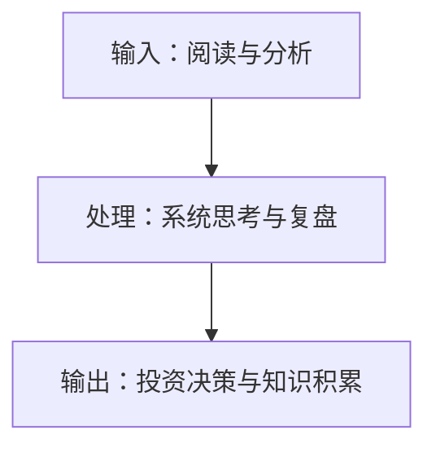
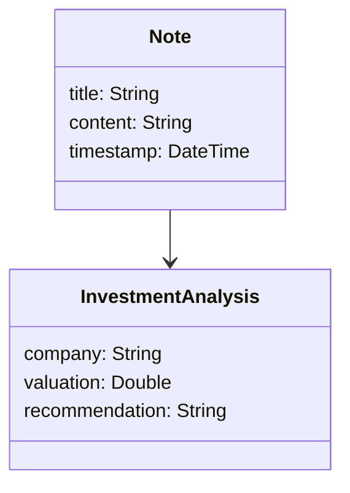

                 

# 巴菲特的读书学习方法

> 关键词：巴菲特，学习方法，投资，知识管理，价值投资，学习策略

> 摘要：本文深入分析巴菲特的读书学习方法，探讨其核心理念、方法论、系统设计与实践应用，揭示其在投资与学习领域的独特见解。

---

# 引言

## 1. 巴菲特的学习方法概述

### 1.1 巴菲特的背景与学习哲学

沃伦·巴菲特，被誉为“股神”，不仅是成功的投资者，也是卓越的学习者。他的学习方法以“价值投资”为核心，强调深度思考与长期积累。

### 1.2 学习方法的核心要素

巴菲特的学习方法包括：选择性阅读、系统性思考、长期积累与复盘。这些方法使其能够在复杂市场中保持稳定收益。

---

# 第二部分: 核心概念与联系

## 2. 巴菲特学习方法的核心原理

### 2.1 核心原理的详细讲解

巴菲特的学习方法基于“价值投资”，强调分析企业的内在价值。其数学模型如下：

$$ V = \frac{CF}{r - g} $$

其中，V为内在价值，CF为现金流，r为折现率，g为增长率。

### 2.2 核心原理的数学模型与公式

通过上述公式，巴菲特评估企业的长期价值，从而指导投资决策。

---

## 3. 系统分析与架构设计

### 3.1 系统分析

巴菲特的学习方法可以看作一个系统，包括输入（阅读）、处理（思考）、输出（决策）三个环节。其系统架构图如下：

---

# 项目实战

## 4. 巴菲特学习方法的项目实战

### 4.1 项目环境安装与配置

- 工具：思维导图软件（如MindMap）、数据分析工具（如Excel）
- 依赖库：无特殊需求，需掌握基本金融分析方法。

### 4.2 系统核心实现

#### 4.2.1 知识管理系统设计

通过构建知识管理系统，记录阅读笔记、分析结果，并进行定期复盘。例如，使用以下类图：

### 4.3 案例分析

以投资某公司为例，详细解读如何运用巴菲特的学习方法进行分析与决策。

---

## 5. 最佳实践与小结

### 5.1 最佳实践

- 选择性阅读：专注于高质量的书籍与报告。
- 系统性思考：构建知识体系，避免碎片化学习。
- 长期积累：定期复盘，持续优化学习策略。

### 5.2 小结

巴菲特的学习方法强调深度思考与长期积累，其核心在于通过系统化的方法找到企业的内在价值，从而做出明智的投资决策。这些方法不仅适用于投资，也可广泛应用于学习与工作中。

---

作者：AI天才研究院

