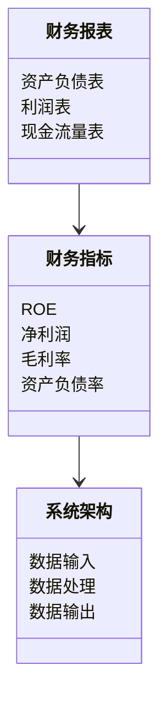

                 


```markdown
# 巴菲特的财务分析技巧：解读财报的关键指标

> 关键词：巴菲特，财务分析，财务报表，关键指标，投资技巧，净利润率，ROE

> 摘要：本文深入探讨巴菲特的财务分析技巧，解读如何通过关键财务指标来评估企业财务状况和投资价值。从基础知识到高级分析方法，结合实际案例，帮助读者掌握巴菲特的投资智慧，做出明智的投资决策。

---

## 引言

### 1.1 巴菲特的投资理念概述

沃伦·巴菲特作为全球最著名的投资者之一，他的成功离不开对财务报表的深刻理解和对关键指标的精准分析。本文将介绍巴菲特的核心投资理念，以及他如何通过财务报表的关键指标来评估企业的内在价值。

---

## 第一部分：财务报表基础知识

### 1.2 财务报表基础

#### 1.2.1 财务报表的三张表概述

财务报表是企业财务状况的晴雨表，主要包括资产负债表、利润表和现金流量表。

- **资产负债表**：反映企业在某一特定时点的资产、负债和所有者权益的状况。
- **利润表**：展示企业在一定会计期间内的收入、费用和利润情况。
- **现金流量表**：记录企业在一定会计期间内现金和现金等价物的流入和流出情况。

#### 1.2.2 收入、利润和现金流的基本概念

- **收入**：企业在销售商品或提供服务过程中获得的总收入。
- **利润**：收入减去费用后的净收益，是企业盈利能力的直接体现。
- **现金流**：企业现金的流入和流出，反映企业的流动性状况。

#### 1.2.3 财务指标的基本分类与作用

财务指标可以分为盈利能力、偿债能力、运营能力和增长能力四类，每类指标都有其独特的意义和作用。

---

## 第二部分：核心财务指标分析

### 2.1 股东权益收益率（ROE）

#### 2.1.1 ROE的定义与计算公式

ROE = 净利润 / 平均股东权益 × 100%

ROE衡量的是企业使用股东资金的效率，ROE越高，说明企业的盈利能力越强。

#### 2.1.2 ROE在企业评估中的意义

- 高ROE意味着企业能够高效利用股东资金。
- 低ROE可能意味着企业存在管理问题或行业竞争激烈。

#### 2.1.3 影响ROE的主要因素

- 净利润
- 平均股东权益
- 资本结构

---

### 2.2 净利润与每股收益（EPS）

#### 2.2.1 净利润的计算与分析

净利润 = 收入 - 费用

净利润是衡量企业整体盈利能力的核心指标。

#### 2.2.2 EPS的定义与投资者关注点

EPS = 净利润 / 平均 outstanding shares

EPS是投资者关注的重要指标，高EPS意味着每股盈利能力强。

#### 2.2.3 EPS与股价的关系

- 高EPS通常意味着高股价，但需结合市盈率等指标综合分析。

---

### 2.3 毛利率与净利率

#### 2.3.1 毛利率的计算与行业对比

毛利率 = (收入 - 成本) / 收入 × 100%

毛利率高意味着企业有较强的定价能力和成本控制能力。

#### 2.3.2 净利率的分析与企业盈利能力

净利率 = 净利润 / 收入 × 100%

净利率高意味着企业有较强的盈利能力。

#### 2.3.3 毛利率与净利率的关系

毛利率高并不一定意味着净利率高，需结合期间费用分析。

---

## 第三部分：资产负债表分析

### 3.1 资产负债表的核心要素

#### 3.1.1 资产、负债与所有者权益的构成

- **资产**：企业拥有的资源，包括流动资产和非流动资产。
- **负债**：企业欠款，包括流动负债和长期负债。
- **所有者权益**：企业资产减去负债后的剩余部分。

#### 3.1.2 流动资产与非流动资产的区别

- **流动资产**：可在一年内变现的资产，如现金、应收账款。
- **非流动资产**：长期使用的资产，如固定资产、无形资产。

#### 3.1.3 流动负债与长期负债的分析

- **流动负债**：短期债务，如应付账款、短期借款。
- **长期负债**：长期债务，如长期借款。

---

### 3.2 资产负债率与偿债能力

#### 3.2.1 资产负债率的计算与解读

资产负债率 = 负债总额 / 资产总额 × 100%

资产负债率高意味着企业依赖债务融资，风险较大。

#### 3.2.2 偿债能力的关键指标（如速动比率）

速动比率 = 速动资产 / 流动负债

速动比率高意味着企业有较强的短期偿债能力。

#### 3.2.3 巴菲特对负债的关注点

巴菲特倾向于选择负债较低的企业，因为高负债意味着较高的财务风险。

---

## 第四部分：现金流分析

### 4.1 现金流的三部分构成

#### 4.1.1 经营活动现金流

经营活动现金流是企业日常经营活动中产生的现金流，是企业最重要的现金流来源。

#### 4.1.2 投资活动现金流

投资活动现金流是企业投资于长期资产或出售长期资产所产生的现金流。

#### 4.1.3 筹资活动现金流

筹资活动现金流是企业通过发行股票或借款等活动获得的现金流。

---

### 4.2 现金流与企业健康度

#### 4.2.1 现金流充裕性的判断标准

企业应保持正的经营活动现金流，以维持正常的经营运作。

#### 4.2.2 现金流与企业扩张能力的关系

充足的现金流是企业扩张和发展的基础。

#### 4.2.3 巴菲特对现金流的重视

巴菲特认为现金流是企业健康的核心指标，没有足够的现金流，企业难以长期发展。

---

## 第五部分：进阶财务分析技巧

### 5.1 杜邦分析法

#### 5.1.1 杜邦分析法的定义与作用

杜邦分析法是一种将ROE分解为多个因素的方法，用于评估企业的财务状况。

#### 5.1.2 杜邦分析法的公式与分解

ROE = 净利润 / 平均股东权益 = (净利润 / 营业收入) × (营业收入 / 平均总资产) × (平均总资产 / 平均股东权益)

#### 5.1.3 如何通过杜邦分析优化企业财务状况

通过分析杜邦分解后的各项指标，找出企业财务状况的瓶颈，进行优化。

---

### 5.2 财务指标的行业对比

#### 5.2.1 行业平均值的重要性

了解行业平均值有助于判断企业的财务指标是否合理。

#### 5.2.2 如何进行行业对比

选择与企业同一行业的可比公司，对比各项财务指标，评估企业的竞争力。

---

## 第六部分：系统分析与架构设计

### 6.1 财务分析框架

#### 6.1.1 问题场景介绍

通过构建财务分析框架，帮助投资者系统地分析企业的财务状况。

#### 6.1.2 领域模型mermaid类图



#### 6.1.3 系统架构设计mermaid架构图


---

## 第七部分：项目实战

### 7.1 环境安装

#### 7.1.1 安装Python和必要的库

安装Python和pandas、numpy等库，用于数据处理和分析。

### 7.2 系统核心实现源代码

#### 7.2.1 计算ROE的Python代码

```python
import pandas as pd

# 假设df是包含财务数据的DataFrame
df['ROE'] = (df['净利润'] / df['平均股东权益']) * 100
```

#### 7.2.2 杜邦分析的Python代码

```python
df['净利润/营业收入'] = df['净利润'] / df['营业收入']
df['营业收入/平均总资产'] = df['营业收入'] / df['平均总资产']
df['平均总资产/平均股东权益'] = df['平均总资产'] / df['平均股东权益']
df['ROE_DuPont'] = df['净利润/营业收入'] * df['营业收入/平均总资产'] * df['平均总资产/平均股东权益']
```

---

### 7.3 实际案例分析

#### 7.3.1 苹果公司的财务分析

以苹果公司为例，分析其ROE、净利润率、毛利率等指标，评估其财务状况和投资价值。

---

## 总结

通过本文的详细讲解，读者可以掌握巴菲特的财务分析技巧，学会如何通过关键财务指标来评估企业的财务状况和投资价值。结合实际案例和系统架构设计，帮助读者在投资实践中灵活运用这些技巧，做出明智的投资决策。

---

作者：AI天才研究院/AI Genius Institute & 禅与计算机程序设计艺术 /Zen And The Art of Computer Programming
```

