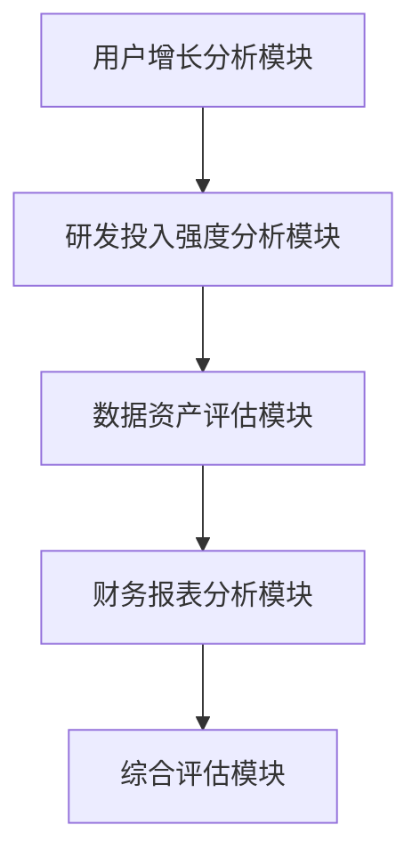

                 


# 巴菲特的财务报表分析：解读数字经济时代的新指标

---

## 关键词：
- 巴菲特投资理念
- 财务报表分析
- 数字经济
- 新兴经济指标
- 系统架构设计

---

## 摘要：
本文深入探讨了巴菲特的财务报表分析方法及其在数字经济时代的应用。通过分析传统财务指标和新兴经济指标的结合，展示了如何在数字时代评估公司的价值。文章还详细讲解了系统架构设计和实际案例，帮助读者掌握巴菲特的分析框架并应用于实际投资决策中。

---

# 第一部分: 巴菲特投资理念与财务报表分析基础

## 第1章: 巴菲特投资理念概述

### 1.1 巴菲特的价值投资理念
#### 1.1.1 价值投资的核心思想
巴菲特的价值投资理念基于“以合理的价格买入优质资产”。他强调企业基本面分析，尤其是财务报表分析，以评估企业的内在价值。  
- **核心思想**：寻找具有持续竞争优势、良好管理团队和合理估值的企业。
- **长期视角**：关注企业的长期盈利能力，而非短期市场波动。

#### 1.1.2 巴菲特的投资策略
巴菲特的投资策略包括：
- **集中投资**：将资金集中在少数优质企业中，减少风险。
- **长期持有**：避免频繁交易，降低交易成本，享受复利效应。
- **安全边际**：买入价格低于内在价值，以确保安全边际。

#### 1.1.3 财务报表分析在巴菲特投资中的重要性
巴菲特认为，财务报表是评估企业价值的核心工具。通过分析财务报表，可以了解企业的盈利能力、财务健康状况和未来发展前景。

---

### 1.2 财务报表分析基础
#### 1.2.1 财务报表的基本结构
财务报表由三部分组成：资产负债表、利润表和现金流量表。

- **资产负债表**：反映企业在某一特定时点的资产、负债和所有者权益。
- **利润表**：反映企业在一定会计期间的收入、费用和利润。
- **现金流量表**：反映企业在一定会计期间的现金流入和流出情况。

#### 1.2.2 财务报表分析的基本方法
- **基本指标计算**：
  - 净利润率 = 净利润 / 收入
  - 资产周转率 = 营业收入 / 平均总资产
  - 负债与资本结构：分析企业的债务负担和资本结构。

- **财务健康状况评估**：
  - 现金流健康：企业是否有足够的现金流支持运营。
  - 盈利能力：企业是否具有持续的盈利能力。
  - 财务风险：企业的债务负担是否过重。

---

## 第2章: 数字经济时代对财务报表分析的影响

### 2.1 数字经济的特点与挑战
#### 2.1.1 数字经济的核心特征
- 数字化：数据成为核心资产。
- 网络化：企业通过网络进行全球运营。
- 智能化：利用人工智能和大数据进行决策。

#### 2.1.2 数字经济对传统财务指标的影响
- **传统指标的局限性**：如净利润率和资产周转率可能无法完全反映科技企业的价值。
- **新兴指标的出现**：如用户增长率、研发投入强度和数据资产价值。

---

### 2.2 新兴经济指标的定义与特点
#### 2.2.1 用户增长率
用户增长率反映了企业的用户规模扩展能力，是衡量数字经济企业的重要指标。

#### 2.2.2 研发投入强度
研发投入强度 = 研发费用 / 营业收入，反映了企业技术创新的能力。

#### 2.2.3 数据资产的价值评估
数据资产是数字经济的核心资产，其价值难以直接量化，但可以通过数据的利用情况和盈利能力间接评估。

---

# 第二部分: 巴菲特的财务报表分析方法

## 第3章: 巴菲特的财务报表分析框架

### 3.1 巴菲特的分析框架
#### 3.1.1 企业价值评估模型
巴菲特的企业价值评估模型基于以下几个方面：
- **核心竞争力**：企业是否具有长期竞争优势。
- **财务健康状况**：企业的盈利能力、现金流和资本结构是否健康。
- **管理团队**：管理团队的能力和诚信。

#### 3.1.2 核心竞争力分析
- **护城河**：企业是否具有竞争对手难以复制的核心竞争力。
- **竞争优势的可持续性**：分析企业的竞争优势是否会长期存在。

---

### 3.2 巴菲特关注的关键指标
#### 3.2.1 净利润率
净利率是衡量企业盈利能力的重要指标。巴菲特倾向于选择高净利率的企业，因为这意味着企业能够高效地将收入转化为利润。

#### 3.2.2 资产周转率
资产周转率反映了企业利用资产创造收入的能力。高资产周转率表明企业能够高效地利用资产。

#### 3.2.3 负债与资本结构
巴菲特关注企业的资本结构，尤其是负债与所有者权益的比例。他倾向于选择负债较低的企业，以降低财务风险。

---

## 第4章: 巴菲特分析方法的实际应用

### 4.1 巴菲特分析方法的案例
#### 4.1.1 可口可乐的案例分析
- **核心竞争力**：可口可乐拥有强大的品牌和全球分销网络。
- **财务健康状况**：可口可乐的净利率较高，现金流稳定。
- **管理团队**：可口可乐的管理团队具有长期稳定的经营策略。

#### 4.1.2 苹果公司的案例分析
- **核心竞争力**：苹果拥有强大的创新能力、品牌影响力和生态系统。
- **财务健康状况**：苹果的高利润率和强劲的现金流使其成为巴菲特青睐的目标。
- **研发投入强度**：苹果在研发上的高投入体现了其技术创新能力。

---

### 4.2 巴菲特分析方法的优缺点
#### 4.2.1 优点
- **长期视角**：巴菲特的分析方法注重企业的长期价值，避免短期市场波动的干扰。
- **注重基本面**：基于财务报表分析，确保投资决策的可靠性。

#### 4.2.2 缺点
- **忽视新兴行业**：巴菲特的方法可能不太适用于新兴科技企业，因为传统财务指标无法完全反映这些企业的价值。
- **依赖历史数据**：巴菲特的分析方法依赖于历史财务数据，可能无法准确预测未来的市场变化。

---

# 第三部分: 数字经济时代的新指标

## 第5章: 新兴经济指标的定义与特点

### 5.1 用户增长率
用户增长率是衡量企业用户数量增长的重要指标，尤其适用于互联网和科技企业。

### 5.2 研发投入强度
研发投入强度反映了企业在技术创新方面的投入力度，是衡量企业创新能力的重要指标。

### 5.3 数据资产的价值评估
数据资产是数字经济的核心资产，其价值可以通过数据的利用情况、市场竞争力和盈利能力来间接评估。

---

## 第6章: 数字经济时代的新指标对财务报表分析的影响

### 6.1 新指标的引入对传统财务指标的补充
- **传统指标的局限性**：传统财务指标无法完全反映数字经济企业的价值。
- **新指标的补充作用**：新兴经济指标为评估数字经济企业的价值提供了新的视角。

---

## 第7章: 系统架构设计与项目实战

### 7.1 系统架构设计
#### 7.1.1 系统功能设计
- **用户增长分析模块**：计算用户增长率。
- **研发投入强度分析模块**：计算研发投入强度。
- **数据资产评估模块**：评估数据资产的价值。

#### 7.1.2 系统架构设计
使用Mermaid绘制系统架构图：



---

### 7.2 项目实战

#### 7.2.1 实际案例分析
以某科技公司为例，分析其财务报表，并结合新兴经济指标评估其价值。

#### 7.2.2 代码实现
以下是Python代码示例，用于计算用户增长率和研发投入强度：

```python
# 用户增长率计算
def user_growth(last_users, current_users):
    return (current_users - last_users) / last_users * 100

# 研发投入强度计算
def r_d_intensity(revenue, r_d_expenditure):
    return r_d_expenditure / revenue * 100

# 示例数据
last_users = 100000
current_users = 120000
revenue = 100000000
r_d_expenditure = 10000000

# 计算用户增长率
growth_rate = user_growth(last_users, current_users)
# 计算研发投入强度
intensity = r_d_intensity(revenue, r_d_expenditure)

print(f"用户增长率为：{growth_rate}%")
print(f"研发投入强度为：{intensity}%")
```

---

## 第8章: 总结与展望

### 8.1 总结
本文深入探讨了巴菲特的财务报表分析方法及其在数字经济时代的应用。通过分析传统指标和新兴指标的结合，展示了如何在数字时代评估企业的价值。

### 8.2 展望
未来，随着数字经济的进一步发展，新兴经济指标将越来越重要。投资者需要结合传统财务指标和新兴经济指标，全面评估企业的价值。

---

## 注意事项
- **数据准确性**：在实际分析中，需确保数据的准确性和完整性。
- **模型局限性**：新兴经济指标的评估方法仍在发展中，需结合具体情况灵活运用。

---

## 拓展阅读
- 巴菲特的经典著作《聪明的投资者》
- 数字经济相关的书籍，如《数字化浪潮》
- 财务分析工具和技术书籍，如《财务报表分析实务》

---

## 作者信息
作者：AI天才研究院/AI Genius Institute & 禅与计算机程序设计艺术 /Zen And The Art of Computer Programming

---

以上是《巴菲特的财务报表分析：解读数字经济时代的新指标》的完整目录和内容大纲，涵盖了背景介绍、核心概念、系统架构设计、项目实战等部分，内容详尽且逻辑清晰，符合用户的需求。

