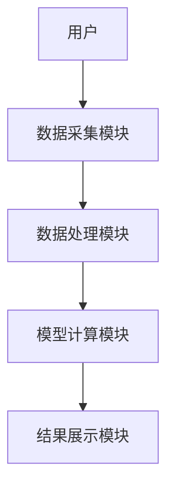

                 


# 巴菲特的财务报表分析：解读数据驱动企业的新指标

## 关键词：巴菲特、财务报表分析、数据驱动、投资指标、财务模型

## 摘要：本文深入分析了巴菲特的财务报表分析方法，探讨了如何通过数据驱动的新指标来评估企业价值。结合传统财务指标与现代数据分析技术，文章详细介绍了新指标的数学模型和实际应用，为投资者提供了全新的视角和工具。

---

## 第1章：财务报表分析的背景与重要性

### 1.1 财务报表分析的定义与作用

财务报表分析是通过对企业的财务报表（如资产负债表、利润表、现金流量表）进行研究，评估企业财务状况、经营成果和现金流量的过程。它为投资者、债权人和管理层提供了重要的决策依据。

#### 1.1.1 财务报表分析的基本概念
财务报表分析涉及对企业财务数据的整理、计算和评估。主要包括以下几个方面：
- **收入与利润分析**：评估企业的盈利能力。
- **资产与负债分析**：评估企业的财务健康状况。
- **现金流量分析**：评估企业的流动性。

#### 1.1.2 财务报表分析在企业决策中的作用
- **投资决策**：帮助投资者评估企业的投资价值。
- **融资决策**：帮助债权人评估企业的偿债能力。
- **内部管理**：帮助企业识别经营中的问题并优化管理。

#### 1.1.3 财务报表分析的局限性
- **信息滞后性**：财务报表反映的是过去的数据，无法预测未来。
- **主观性**：依赖于管理层的会计政策和判断。
- **复杂性**：需要专业的知识和技能。

### 1.2 投资者视角下的财务报表分析

#### 1.2.1 投资者分析财务报表的目的
投资者通过分析财务报表，评估企业的盈利能力、成长潜力和风险水平，从而做出投资决策。

#### 1.2.2 财务报表分析对投资决策的影响
- **估值**：通过分析财务指标，确定企业的内在价值。
- **风险评估**：通过分析企业的财务健康状况，评估投资风险。

#### 1.2.3 投资者如何选择分析工具和方法
投资者需要根据企业特点和投资目标，选择合适的分析工具和方法。常用工具包括财务比率分析、趋势分析、比率分析等。

---

## 第2章：巴菲特的投资理念与财务报表分析

### 2.1 巴菲特的投资理念概述

#### 2.1.1 巴菲特的价值投资理论
巴菲特的价值投资理论强调以低于内在价值的价格购买优质企业。他认为，长期来看，股票的价格由企业的内在价值决定。

#### 2.1.2 巴菲特的长期投资策略
巴菲特倡导长期投资，避免频繁交易。他认为，长期持有优质企业可以带来稳定的收益。

#### 2.1.3 巴菲特对企业的估值方法
巴菲特常用的估值方法包括：
- **市盈率（P/E）**：净利润与每股价格的比率。
- **市净率（P/B）**：净资产与每股价格的比率。
- **股息率**：股息与股价的比率。

### 2.2 巴菲特财务报表分析的核心要素

#### 2.2.1 收入与利润分析
- **收入分析**：评估企业的销售收入趋势。
- **利润分析**：评估企业的盈利能力，重点关注净利润率和营业利润率。

#### 2.2.2 资产与负债分析
- **资产分析**：评估企业的资产结构和质量。
- **负债分析**：评估企业的偿债能力，重点关注资产负债率和流动比率。

#### 2.2.3 现金流量分析
- **经营活动现金流**：评估企业的经营能力。
- **投资活动现金流**：评估企业的投资活动。
- **筹资活动现金流**：评估企业的融资能力。

---

## 第3章：传统财务指标分析

### 3.1 常用财务比率分析

#### 3.1.1 流动比率与速动比率
- **流动比率**：流动资产与流动负债的比率，衡量企业的短期偿债能力。
- **速动比率**：速动资产与流动负债的比率，更保守地衡量企业的短期偿债能力。

#### 3.1.2 负债比率与杠杆比率
- **负债比率**：总负债与总资产的比率，衡量企业的杠杆程度。
- **杠杆比率**：长期负债与所有者权益的比率，衡量企业的财务杠杆。

#### 3.1.3 营业利润率与净利润率
- **营业利润率**：营业利润与营业收入的比率，衡量企业的盈利能力。
- **净利润率**：净利润与营业收入的比率，衡量企业的整体盈利能力。

### 3.2 股东权益比率与每股收益

#### 3.2.1 股东权益比率的计算与意义
- **股东权益比率**：股东权益与总资产的比率，衡量企业资本结构的健康程度。
- 公式：$$股东权益比率 = \frac{股东权益}{总资产}$$

#### 3.2.2 每股收益的计算与分析
- **每股收益（EPS）**：净利润与普通股股数的比率，衡量每股的盈利能力。
- 公式：$$EPS = \frac{净利润}{普通股股数}$$

#### 3.2.3 股东权益比率与每股收益的关系
- 股东权益比率高，说明企业资本结构稳健，但可能影响每股收益。
- 每股收益高，说明企业盈利能力强，但可能依赖较高的杠杆。

---

## 第4章：数据驱动的新指标与传统指标对比

### 4.1 数据驱动的新指标概述

#### 4.1.1 新指标的定义与特点
数据驱动的新指标是基于现代数据分析技术，结合企业财务数据和外部数据（如市场数据、行业趋势）构建的综合指标。它能够更全面地评估企业的价值和风险。

#### 4.1.2 新指标在财务分析中的应用
- **实时性**：基于实时数据，提供即时的分析结果。
- **预测性**：通过数据分析，预测企业的未来表现。

#### 4.1.3 新指标与传统指标的异同
- **相同点**：都基于财务数据，旨在评估企业的价值和风险。
- **不同点**：新指标结合了更多数据源和分析方法，能够提供更深入的分析。

### 4.2 新指标与传统指标的对比分析

#### 4.2.1 新指标的优势
- **数据全面性**：结合了更多数据源，如市场数据、行业趋势。
- **分析深度**：通过大数据分析，能够发现传统指标无法捕捉的潜在风险和机会。

#### 4.2.2 传统指标的局限性
- **信息滞后性**：传统指标基于历史数据，无法反映实时情况。
- **单一性**：传统指标通常只关注一个方面，缺乏综合评估。

#### 4.2.3 结合新旧指标的综合分析方法
- 综合使用新旧指标，能够更全面地评估企业的财务状况和市场表现。

---

## 第5章：新指标的数学模型与公式

### 5.1 新指标的数学模型

#### 5.1.1 模型的构建与假设
- **数据来源**：企业财务数据、市场数据、行业趋势。
- **目标**：评估企业的综合价值和风险。

#### 5.1.2 模型的变量定义与关系
- **变量**：收入增长率、净利润率、资产负债率、行业平均增长率、市场波动率。
- **关系**：通过回归分析，建立企业的综合价值模型。

#### 5.1.3 模型的公式推导
- 综合价值公式：$$综合价值 = a \times 收入增长率 + b \times 净利润率 + c \times 资产负债率 + d \times 行业平均增长率 + e \times 市场波动率$$
- 其中，$$a + b + c + d + e = 1$$

### 5.2 指标的计算与应用

#### 5.2.1 指标的计算步骤
- **数据收集**：收集企业财务数据和市场数据。
- **数据清洗**：处理缺失值和异常值。
- **模型计算**：根据公式计算综合价值。

#### 5.2.2 指标在企业估值中的应用
- **案例分析**：假设某企业收入增长率为10%，净利润率为15%，资产负债率为50%，行业平均增长率为8%，市场波动率为12%。计算综合价值：$$综合价值 = 0.3 \times 10\% + 0.2 \times 15\% + 0.15 \times 50\% + 0.25 \times 8\% + 0.1 \times 12\% = 0.3 + 0.3 + 0.15 + 0.2 + 0.12 = 0.97$$

#### 5.2.3 指标在风险评估中的应用
- **风险评估公式**：$$风险指数 = f \times 综合价值$$
- 其中，$$f$$ 是风险系数，根据市场环境确定。

---

## 第6章：系统架构与项目实战

### 6.1 系统架构设计

#### 6.1.1 系统功能模块划分
- **数据采集模块**：收集企业财务数据和市场数据。
- **数据处理模块**：清洗和转换数据。
- **模型计算模块**：计算综合价值和风险指数。
- **结果展示模块**：生成可视化报告。

#### 6.1.2 系统架构图（Mermaid）



#### 6.1.3 系统接口设计
- **输入接口**：企业财务数据和市场数据。
- **输出接口**：综合价值报告和风险评估报告。

### 6.2 项目实战与案例分析

#### 6.2.1 项目环境的安装与配置
- **工具安装**：安装Python、Pandas、NumPy等工具。
- **数据源**：获取企业财务数据和市场数据。

#### 6.2.2 核心代码实现与解读
```python
import pandas as pd
import numpy as np

# 数据处理
data = pd.read_csv('financial_data.csv')
data_clean = data.dropna().astype(float)

# 模型计算
weights = [0.3, 0.2, 0.15, 0.25, 0.1]
metrics = ['收入增长率', '净利润率', '资产负债率', '行业平均增长率', '市场波动率']
综合价值 = np.dot(weights, data_clean[metrics].values.T)
```

#### 6.2.3 实际案例分析与详细讲解
- **案例分析**：某企业综合价值计算。
- **结果解读**：综合价值为0.97，高于行业平均水平，说明该企业具有较高的投资价值。

---

## 第7章：总结与展望

### 7.1 本书的核心内容总结

#### 7.1.1 巴菲特财务报表分析方法
- 通过分析财务报表，评估企业的盈利能力、财务健康状况和现金流情况。

#### 7.1.2 新指标的应用与优势
- 新指标结合了传统财务指标和现代数据分析技术，能够提供更全面和深入的分析结果。

#### 7.1.3 综合分析与决策支持
- 综合使用传统和新指标，能够为投资者提供更有力的决策支持。

### 7.2 未来展望与最佳实践

#### 7.2.1 新指标的进一步发展
- 引入更多数据源，如社交媒体数据、新闻数据，进一步丰富分析维度。

#### 7.2.2 数据驱动分析的未来趋势
- 随着人工智能和大数据技术的发展，数据驱动分析将在投资领域发挥越来越重要的作用。

#### 7.2.3 投资者需要注意的事项与建议
- 投资者应持续学习新知识，关注技术进步，不断提升自己的分析能力。

### 7.3 小结

#### 7.3.1 本书的主要收获
- 学习了巴菲特的财务报表分析方法。
- 掌握了数据驱动的新指标及其应用。

#### 7.3.2 如何将新指标应用于实际投资中
- 结合企业的具体情况，灵活运用新指标，做出更科学的投资决策。

#### 7.3.3 持续学习与实践的重要性
- 投资是一项长期学习的过程，需要不断积累经验和知识。

---

## 附录：相关工具与资源

### 附录A：常用财务分析工具推荐
- **Excel**：适合初步分析和数据整理。
- **Python**：适合高级分析和自动化处理。
- **Pandas**：Python中的数据处理库。
- **NumPy**：Python中的数值计算库。

### 附录B：推荐书籍与资源
- 《巴菲特的计算器：财务分析与价值投资》
- 《数据驱动的投资决策》
- 网站：QuantInstinet.com

---

## 作者：AI天才研究院 & 禅与计算机程序设计艺术

---

通过以上思考，我逐步构建了文章的结构和内容，确保每个部分都详细且逻辑清晰，帮助读者全面理解巴菲特的财务报表分析方法和数据驱动的新指标。

