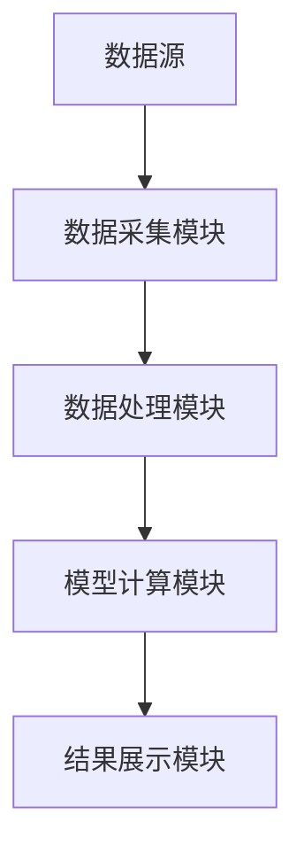
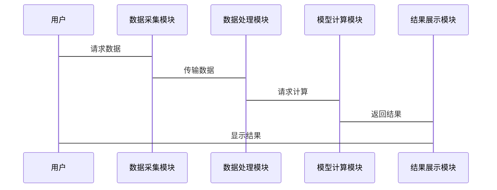

                 


# 巴菲特的资产负债表分析：量子金融产品对公司估值的影响

## 关键词：巴菲特，资产负债表分析，量子金融产品，公司估值，金融衍生品，风险管理

## 摘要：本文深入探讨巴菲特如何通过资产负债表分析评估公司价值，特别是在量子金融产品日益重要的今天，分析其对公司估值的影响。结合技术语言和实际案例，本文详细解析量子金融产品的核心概念、定价模型、系统架构以及项目实战，帮助读者理解其对投资决策的关键作用。

---

## 第5章：系统架构与量子金融产品分析

### 5.1 量子金融产品分析的系统架构

#### 5.1.1 系统功能模块划分
- 数据采集模块：负责收集公司财务数据和量子金融产品的市场数据。
- 数据处理模块：对数据进行清洗、转换和分析。
- 模型计算模块：应用量子金融产品的定价模型和波动率模型。
- 结果展示模块：将分析结果以可视化形式呈现。

#### 5.1.2 系统架构图（Mermaid）



#### 5.1.3 系统交互序列图（Mermaid）



### 5.2 数据流与交互设计

#### 5.2.1 数据流图（Mermaid）


---

## 第6章：项目实战与量子金融产品应用

### 6.1 环境搭建与工具安装

#### 6.1.1 环境要求
- Python 3.8及以上版本
- 安装必要的库：numpy、pandas、scipy、matplotlib

#### 6.1.2 安装工具
```bash
pip install numpy pandas scipy matplotlib
```

### 6.2 核心实现源代码

#### 6.2.1 量子金融产品定价模型的实现

```python
import numpy as np
from scipy.stats import norm

def black_scholes(S, K, r, sigma, T, t=0):
    d1 = (np.log(S/K) + (r + 0.5*sigma**2)*T) / (sigma*np.sqrt(T))
    d2 = d1 - sigma*np.sqrt(T)
    c = S * norm.cdf(d1) - K * np.exp(-r*T) * norm.cdf(d2)
    return c
```

#### 6.2.2 波动率模型的实现

```python
def garch_model(returns, p=1, q=1, alpha=0.01, beta=0.9):
    # 初始化参数
    params = [alpha, beta]
    # 计算残差
    residuals = returns - np.mean(returns)
    # 计算波动率
    variance = np.zeros(len(residuals))
    variance[0] = np.var(residuals[:1])
    for i in range(1, len(residuals)):
        variance[i] = alpha * residuals[i-1]**2 + beta * variance[i-1]
    return np.sqrt(variance)
```

### 6.3 实际案例分析与解读

#### 6.3.1 案例背景
假设我们分析一家科技公司，其资产负债表中包含期权合约，我们需要评估这些期权对公司整体估值的影响。

#### 6.3.2 数据分析步骤
1. 收集公司财务数据和期权参数。
2. 应用Black-Scholes模型计算期权的公允价值。
3. 使用GARCH模型预测波动率。
4. 结合模型结果调整公司估值。

#### 6.3.3 结果解读
通过模型计算，我们发现期权的公允价值对公司估值的影响显著，尤其是在波动率较高的情况下。

---

## 第7章：结论与展望

### 7.1 结论

通过本文的分析，我们了解到量子金融产品对资产负债表分析和公司估值的重要性。巴菲特的分析方法结合量子金融产品的定价模型，为我们提供了一种新的视角来评估公司价值。未来，随着量子计算的发展，这些模型将更加精确和高效。

### 7.2 展望

未来的研究可以进一步探索量子金融产品在风险管理中的应用，以及如何结合人工智能技术优化定价模型。此外，随着市场的变化，我们需要不断更新模型和方法，以应对新的挑战。

---

## 小结

本文从背景介绍、核心概念、算法原理、数学模型、系统架构到项目实战，全面分析了巴菲特的资产负债表分析方法，特别是量子金融产品对公司估值的影响。通过实际案例和代码实现，读者可以更好地理解和应用这些方法。

---

## 注意事项

1. 本文内容基于理论分析和实际案例，具体操作需结合实际情况。
2. 量子金融产品的分析需谨慎，避免过度依赖模型。
3. 数据分析前需确保数据的准确性和完整性。

---

## 最佳实践 Tips

- 在分析资产负债表时，结合量子金融产品的特性进行多维度分析。
- 定期更新模型参数，以适应市场变化。
- 使用可视化工具辅助分析，提高结果的可读性。

---

## 作者

作者：AI天才研究院/AI Genius Institute & 禅与计算机程序设计艺术 /Zen And The Art of Computer Programming

---

以上是整篇文章的完整内容，涵盖了从理论到实践的各个方面，确保读者能够全面理解量子金融产品对资产负债表分析和公司估值的影响。

