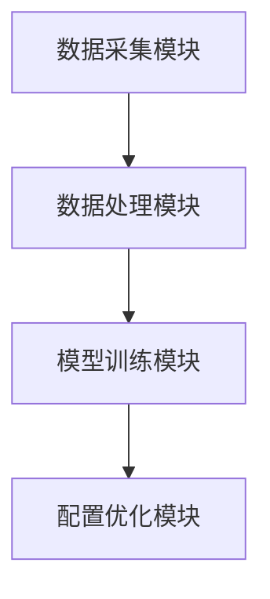

                 


# 巴菲特的资本配置艺术：人工智能辅助的投资组合优化

## 关键词：巴菲特，资本配置，人工智能，投资组合优化，机器学习，金融分析

## 摘要：  
本文深入探讨了巴菲特的资本配置艺术，并结合人工智能技术，提出了一种优化投资组合的新方法。通过分析巴菲特的投资哲学、资本配置决策模型以及投资组合优化的数学模型，结合机器学习和大数据技术，构建了一个基于AI的资本配置优化系统。本文详细介绍了系统架构、算法实现、案例分析以及实际应用，为投资者提供了一种全新的视角和工具，以实现更高效、更精准的投资决策。

---

## 第一部分：巴菲特的资本配置艺术

### 第1章：巴菲特的资本配置艺术概述

#### 1.1 投资哲学与资本配置
##### 1.1.1 巴菲特的投资哲学
巴菲特的投资哲学以“价值投资”为核心，强调长期投资、安全边际和企业基本面分析。他注重企业的内在价值，而非市场的短期波动。他的投资策略可以总结为以下几点：
1. **长期投资**：巴菲特认为投资是长期的游戏，短期波动不应影响长期决策。
2. **安全边际**：他强调购买价格应低于企业的内在价值，以确保投资的安全性。
3. **企业基本面**：他关注企业的盈利能力、竞争优势和管理层质量。

##### 1.1.2 资本配置的基本概念
资本配置是指将资金分配到不同的资产或项目中，以实现最大化的投资回报。资本配置的核心在于如何在不同的资产之间分配资金，以平衡风险和收益。

##### 1.1.3 资本配置的三大原则
1. **集中投资**：巴菲特认为集中投资可以降低风险，因为将资金分配到少数优质资产中，可以更有效地跟踪和管理。
2. **分散风险**：虽然集中投资是巴菲特的风格，但他在资产类别上保持一定的分散性，以避免单一资产的大幅波动对整体投资组合的影响。
3. **长期持有**：巴菲特强调长期持有优质资产，避免频繁交易带来的成本和风险。

#### 1.2 资本配置的决策模型
##### 1.2.1 资本配置的三要素
1. **资产类别**：包括股票、债券、房地产等不同类型的资产。
2. **资产权重**：每种资产在投资组合中的比例。
3. **风险偏好**：投资者对风险的承受能力，影响资产配置的决策。

##### 1.2.2 资本配置的五项标准
1. **竞争优势**：企业是否具有可持续的竞争优势。
2. **管理层质量**：企业的管理层是否具备诚信和能力。
3. **财务状况**：企业的财务健康状况，包括负债率、盈利能力等。
4. **估值水平**：企业的市场价格是否低于其内在价值。
5. **宏观经济环境**：宏观经济环境对资产价格的影响。

##### 1.2.3 资本配置的决策框架
1. **确定投资目标**：明确投资目的、收益目标和风险承受能力。
2. **分析宏观经济环境**：了解当前的经济形势，判断不同资产的表现。
3. **评估资产类别**：分析不同资产类别的风险和收益特征。
4. **制定配置方案**：根据上述分析，制定具体的资产配置方案。
5. **动态调整**：定期审视和调整配置方案，以应对市场变化。

#### 1.3 资本配置的分析框架
##### 1.3.1 资本配置的三步法
1. **确定投资目标**：明确投资的目的是追求长期资本增值还是稳定收益。
2. **分析资产类别**：评估不同资产类别的风险和收益特征。
3. **制定配置方案**：根据目标和分析结果，分配资金到不同的资产类别中。

##### 1.3.2 资本配置的五项分析
1. **行业分析**：分析不同行业的增长潜力和风险。
2. **企业分析**：评估企业的财务状况、竞争优势和管理层质量。
3. **市场分析**：判断市场的整体走势和估值水平。
4. **风险评估**：量化不同资产类别的风险，并评估整体组合的风险水平。
5. **收益预测**：预测不同资产类别的未来收益。

##### 1.3.3 资本配置的动态调整
1. **定期审查**：定期审视投资组合的表现，确保与投资目标一致。
2. **市场变化**：根据市场变化调整资产配置，以应对新的风险和机会。
3. **业绩评估**：评估投资组合的收益和风险，决定是否需要调整配置。

---

## 第二部分：人工智能在金融中的应用

### 第2章：人工智能在金融中的应用

#### 2.1 人工智能的基本概念
人工智能（AI）是指计算机系统模拟人类智能的能力，包括学习、推理、问题解决和自然语言处理等。在金融领域，AI主要应用于数据分析、预测和决策支持。

#### 2.2 机器学习在金融中的应用
机器学习是一种人工智能技术，通过数据训练模型，使其能够自动学习和改进。在金融中，机器学习被广泛应用于股票预测、风险评估、信用评分和交易策略开发。

##### 2.2.1 机器学习模型
1. **监督学习**：用于分类和回归问题，如股票价格预测。
2. **无监督学习**：用于聚类分析，如客户分群。
3. **强化学习**：用于策略优化，如交易策略开发。

##### 2.2.2 机器学习在金融中的应用
1. **股票预测**：通过历史数据训练模型，预测未来股票价格。
2. **风险评估**：利用机器学习模型评估投资组合的风险。
3. **信用评分**：通过机器学习模型评估客户的信用风险。
4. **交易策略**：开发自动化的交易策略，提高交易效率。

#### 2.3 人工智能在金融数据处理中的应用
##### 2.3.1 数据清洗与预处理
1. **数据清洗**：去除噪声数据，确保数据质量。
2. **数据标准化**：将数据标准化，以便模型处理。

##### 2.3.2 数据特征提取
1. **特征选择**：选择对预测结果影响较大的特征。
2. **特征工程**：通过数据变换和组合，生成更有意义的特征。

##### 2.3.3 数据建模与预测
1. **模型训练**：使用训练数据训练模型。
2. **模型评估**：通过测试数据评估模型的性能。
3. **模型优化**：调整模型参数，提高预测精度。

---

## 第三部分：人工智能辅助的资本配置优化

### 第3章：人工智能优化资本配置的数学模型

#### 3.1 投资组合优化的数学模型
投资组合优化的目标是在给定的风险水平下，最大化投资回报，或者在给定的收益目标下，最小化投资风险。数学模型通常包括以下部分：
1. **目标函数**：最大化收益或最小化风险。
2. **约束条件**：包括权重限制、风险限制等。

##### 3.1.1 投资组合优化的目标函数
1. **收益最大化**：$$\max \sum_{i=1}^{n} w_i r_i$$
2. **风险最小化**：$$\min \sum_{i=1}^{n} \sum_{j=1}^{n} w_i w_j \sigma_{ij}$$

##### 3.1.2 投资组合优化的约束条件
1. **权重约束**：$$\sum_{i=1}^{n} w_i = 1$$
2. **风险约束**：$$\sum_{i=1}^{n} \sum_{j=1}^{n} w_i w_j \sigma_{ij} \leq \text{风险目标}$$

#### 3.2 人工智能优化资本配置的算法
##### 3.2.1 遗传算法
1. **初始化**：随机生成初始种群。
2. **适应度评估**：计算每个种群的适应度。
3. **选择**：选择适应度高的个体进行繁殖。
4. **交叉**：生成新的个体。
5. **变异**：随机改变个体的某些特征。
6. **迭代**：重复上述步骤，直到满足终止条件。

##### 3.2.2 群优化算法
1. **初始化**：随机生成初始群体。
2. **评估**：计算每个个体的适应度。
3. **更新**：根据适应度，更新个体的位置。
4. **迭代**：重复上述步骤，直到满足终止条件。

#### 3.3 基于机器学习的资本配置模型
##### 3.3.1 基于回归的资本配置
1. **数据准备**：收集历史数据，包括资产收益、风险指标等。
2. **模型训练**：使用回归模型预测资产的收益和风险。
3. **配置优化**：根据模型预测结果，优化资产配置。

##### 3.3.2 基于聚类的资本配置
1. **数据准备**：收集历史数据，包括资产收益、风险指标等。
2. **模型训练**：使用聚类算法将资产分为不同的类别。
3. **配置优化**：根据聚类结果，优化资产配置。

---

## 第四部分：系统架构与实现

### 第4章：人工智能辅助资本配置的系统架构

#### 4.1 系统架构设计
##### 4.1.1 系统功能模块
1. **数据采集模块**：收集市场数据、企业基本面数据等。
2. **数据处理模块**：清洗、预处理和特征提取。
3. **模型训练模块**：训练机器学习模型，生成预测结果。
4. **配置优化模块**：根据模型预测结果，优化资本配置。

##### 4.1.2 系统架构图


#### 4.2 系统实现
##### 4.2.1 数据采集
1. **数据来源**：包括股票价格、财务报表、宏观经济指标等。
2. **数据接口**：使用API获取实时数据。

##### 4.2.2 数据处理
1. **数据清洗**：去除噪声数据，处理缺失值。
2. **数据标准化**：将数据标准化，以便模型处理。

##### 4.2.3 模型训练
1. **选择模型**：根据需求选择合适的机器学习模型。
2. **训练模型**：使用训练数据训练模型。
3. **评估模型**：通过测试数据评估模型的性能。

##### 4.2.4 配置优化
1. **生成配置方案**：根据模型预测结果，生成资本配置方案。
2. **动态调整**：根据市场变化，动态调整配置方案。

---

## 第五部分：案例分析与实际应用

### 第5章：人工智能优化资本配置的案例分析

#### 5.1 实际案例分析
##### 5.1.1 案例背景
假设我们有一个包含10只股票的投资组合，目标是通过AI优化资本配置，提高投资收益。

##### 5.1.2 数据准备
收集过去5年的股票价格数据，包括开盘价、收盘价、最高价、最低价、成交量等。

##### 5.1.3 模型训练
使用随机森林回归模型预测每只股票的未来收益和风险。

##### 5.1.4 配置优化
根据模型预测结果，优化资本配置，使投资组合的风险最小化，同时最大化收益。

#### 5.2 最佳实践
##### 5.2.1 最佳实践
1. **数据质量**：确保数据的准确性和完整性。
2. **模型选择**：根据需求选择合适的机器学习模型。
3. **动态调整**：定期审视和调整配置方案，以应对市场变化。

##### 5.2.2 注意事项
1. **模型局限性**：机器学习模型无法预测所有市场变化，需结合人工判断。
2. **数据依赖性**：模型的预测结果依赖于历史数据，需谨慎处理。

##### 5.2.3 未来趋势
1. **多模态学习**：结合文本、图像等多种数据源，提高预测精度。
2. **强化学习**：开发更复杂的交易策略，提高投资收益。

---

## 第六部分：总结

### 第6章：总结与展望

#### 6.1 总结
本文结合巴菲特的资本配置艺术和人工智能技术，提出了一种优化投资组合的新方法。通过分析巴菲特的投资哲学和资本配置决策模型，结合机器学习和大数据技术，构建了一个基于AI的资本配置优化系统。本文详细介绍了系统架构、算法实现、案例分析以及实际应用，为投资者提供了一种全新的视角和工具，以实现更高效、更精准的投资决策。

#### 6.2 展望
未来，随着人工智能技术的不断发展，资本配置优化将更加智能化和自动化。投资者可以利用AI技术，更好地应对市场变化，提高投资收益。同时，随着深度学习和强化学习技术的进步，资本配置优化的模型和算法将更加复杂和高效，为投资者提供更优质的决策支持。

---

## 附录

### 附录A：进一步阅读的资源

1. 巴菲特的书籍：
   - 《巴菲特致股东的信》
   - 《巴菲特投资准则》

2. 人工智能与金融的书籍：
   - 《机器学习实战》
   - 《Python机器学习》

### 附录B：工具与库

1. 数据处理工具：
   - Pandas
   - NumPy

2. 机器学习库：
   - Scikit-learn
   - TensorFlow

### 附录C：代码示例

```python
import pandas as pd
import numpy as np
from sklearn.ensemble import RandomForestRegressor
from sklearn.metrics import mean_squared_error

# 数据准备
data = pd.read_csv('stock_data.csv')
X = data.drop('target', axis=1)
y = data['target']

# 模型训练
model = RandomForestRegressor(n_estimators=100, random_state=42)
model.fit(X, y)

# 模型评估
y_pred = model.predict(X)
print(mean_squared_error(y, y_pred))
```

---

## 作者信息

作者：AI天才研究院/AI Genius Institute & 禅与计算机程序设计艺术/Zen And The Art of Computer Programming

---

以上是《巴菲特的资本配置艺术：人工智能辅助的投资组合优化》的技术博客文章的完整大纲和内容。

