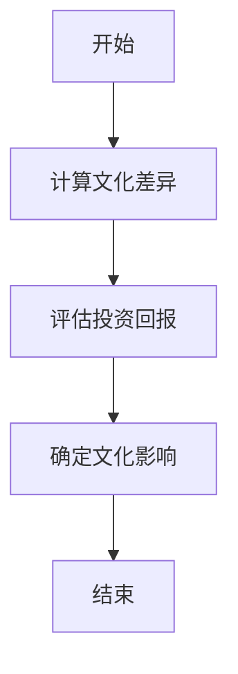
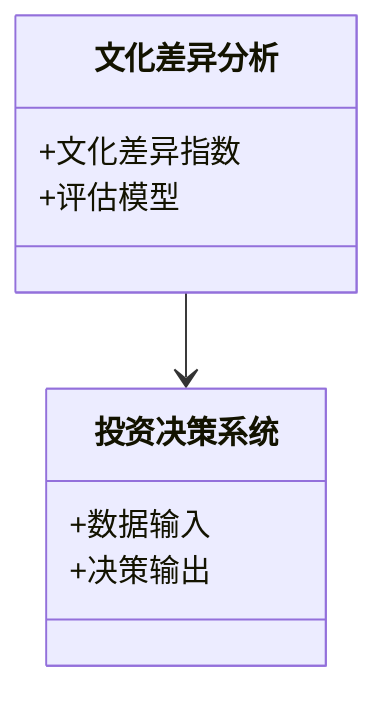

                 


# 巴菲特的跨境投资经验：文化差异的影响

> 关键词：巴菲特，跨境投资，文化差异，投资决策，文化适应

> 摘要：本文探讨巴菲特在不同文化背景下进行跨境投资的经验，分析文化差异如何影响其投资决策，并提出相应的策略和建议。

---

## 第一部分：引言

### 1. 巴菲特的投资理念与跨境投资背景

#### 1.1 巴菲特的投资哲学
巴菲特以价值投资闻名，注重企业基本面分析，寻找具有持续竞争优势的企业。他的投资理念强调长期稳健，而非短期收益。

#### 1.2 跨境投资的兴起
随着全球经济一体化，投资者寻求多元化机会，跨境投资成为趋势。文化差异在其中扮演重要角色，影响着投资决策和企业表现。

#### 1.3 文化差异的重要性
文化差异影响企业运营、消费者行为和市场反应。忽视这些差异可能导致投资失败，因此在跨境投资中必须考虑文化因素。

---

## 第二部分：文化差异的核心概念

### 2.1 文化差异的定义与维度

#### 2.1.1 多维度分析
文化差异包括语言、价值观、商业习惯、法律体系和消费行为等方面。例如，西方注重个人主义，而东方更注重集体主义。

#### 2.1.2 商业习惯对比
不同国家的企业管理方式、谈判风格和决策过程差异显著。例如，日本企业更注重长期关系，而西方企业更注重短期效益。

#### 2.1.3 影响机制
文化差异通过影响企业战略、消费者偏好和市场反应，间接影响投资回报。例如，某些产品在西方市场成功，但在东方市场可能失败。

#### 2.1.4 对比表格
| 文化维度 | 西方国家 | 东方国家 |
|----------|----------|----------|
| 价值观   | 个人主义 | 集体主义 |
| 商业习惯 | 短期利润 | 长期关系 |

### 2.2 巴菲特投资中的文化差异案例

#### 2.2.1 美国市场的成功经验
巴菲特在美国投资的成功部分归功于他对美国企业的熟悉和对管理层的信任。例如，他投资可口可乐时，考虑了美国的消费习惯和品牌价值。

#### 2.2.2 跨国投资中的文化冲突
在非英语国家，文化差异可能导致投资决策失误。例如，巴菲特在投资喜诗糖果时，需要考虑美国的糖果市场和消费者偏好。

---

## 第三部分：文化差异对投资决策的算法影响

### 3.1 文化差异的量化分析

#### 3.1.1 指标体系构建
建立文化差异指标，如文化距离指数，用于量化不同文化之间的差异。该指数基于多个维度，如语言、价值观和法律。

#### 3.1.2 数据分析评估
通过统计分析，评估文化差异对投资回报的影响。例如，使用回归分析确定文化差异对股票收益的贡献。

### 3.2 文化差异的算法模型

#### 3.2.1 数学模型
$$ R = \beta_0 + \beta_1 C + \epsilon $$
其中，R为投资回报，C为文化差异指数，β系数衡量文化差异的影响。

#### 3.2.2 mermaid流程图


#### 3.2.3 Python代码示例
```python
import numpy as np
from sklearn.linear_model import LinearRegression

# 假设C是文化差异指数，R是投资回报
X = np.array(C).reshape(-1, 1)
Y = np.array(R)
model = LinearRegression().fit(X, Y)
print(model.coef_)
```

---

## 第四部分：系统分析与架构设计

### 4.1 投资决策系统的功能设计

#### 4.1.1 功能模块
系统包括数据采集、文化分析、投资决策和结果评估模块。

#### 4.1.2 领域模型


### 4.2 系统架构设计

#### 4.2.1 架构图


#### 4.2.2 接口设计
系统通过API接口获取文化数据，如GDP、消费习惯等。

#### 4.2.3 交互设计
用户输入投资目标，系统输出文化分析和投资建议。

---

## 第五部分：项目实战与案例分析

### 5.1 跨境投资项目的环境安装与配置

#### 5.1.1 开发环境
安装Python、Pandas、Scikit-learn等工具，配置数据源。

#### 5.1.2 系统核心实现
```python
import pandas as pd
from sklearn.metrics import mean_squared_error

# 加载数据
data = pd.read_csv('cultural_data.csv')
# 训练模型
model.fit(data[['C']], data['R'])
# 评估模型
print(mean_squared_error(data['R'], model.predict(data[['C']]))
```

### 5.2 案例分析

#### 5.2.1 投资环境分析
分析目标市场的文化差异，如语言、价值观和法律体系。

#### 5.2.2 投资组合优化
根据文化差异调整投资组合，分散风险。

#### 5.2.3 投资监控与调整
定期评估文化差异变化，及时调整投资策略。

---

## 第六部分：最佳实践与小结

### 6.1 投资中的注意事项

#### 6.1.1 考虑文化差异
在进行跨境投资时，充分了解目标市场的文化差异，避免决策失误。

#### 6.1.2 结合定量分析
使用数学模型量化文化差异，辅助投资决策。

### 6.2 小结
文化差异对跨境投资影响深远，投资者需综合考虑文化、经济和政治因素，制定合理策略。

---

## 结论

文化差异是影响巴菲特跨境投资的关键因素。通过深入分析文化差异，投资者可以优化投资策略，提高成功率。

---

## 作者

作者：AI天才研究院 & 禅与计算机程序设计艺术

---

这篇文章系统地分析了文化差异对巴菲特跨境投资的影响，从概念、算法、系统设计到实战案例，全面探讨了文化差异的多维度影响，并提供了实际的操作建议。

