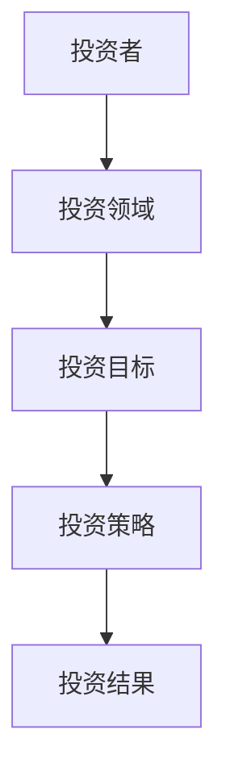
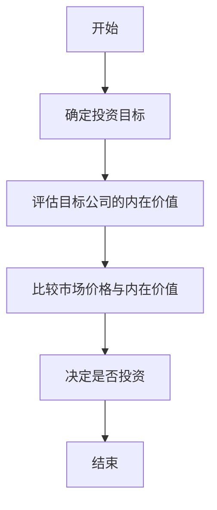
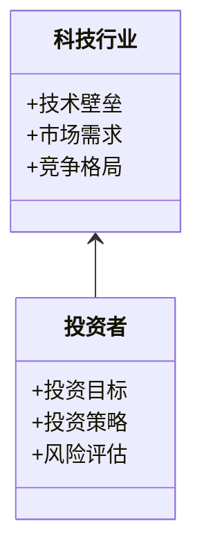
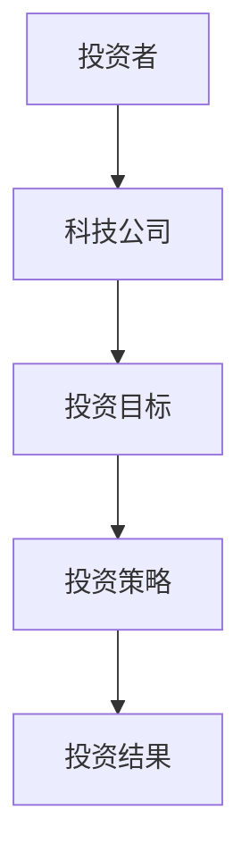

                 


# 巴菲特的跨界投资策略：从纺织到科技

> 关键词：巴菲特，投资策略，跨界，纺织，科技，价值投资，投资模型

> 摘要：本文深入分析巴菲特的跨界投资策略，从其传统的纺织业投资转向科技领域的过程，探讨其投资哲学、数学模型、算法原理和系统架构，结合实际案例，总结其在科技行业的投资策略和成功经验。

---

# 第一部分: 巴菲特的跨界投资策略概述

## 第1章: 巴菲特投资哲学与背景介绍

### 1.1 巴菲特的生平与投资理念

#### 1.1.1 巴菲特的早年经历与投资启蒙
- 巴菲特的早年生活：出生于 Omaha，美国
- 投资启蒙：12岁时开始研究投资，阅读格雷厄姆的《 Intelligent Investor》
- 初次投资：12岁时购买了一笔股票，赚取了人生第一桶金

#### 1.1.2 巴菲特的价值投资理论
- 核心理念：寻找具有持续竞争优势的企业，长期持有
- 投资目标：寻找具有强大护城河的企业，关注企业的内在价值
- 投资策略：买入并持有，避免频繁交易

#### 1.1.3 巴菲特投资哲学的核心要素
- 质量优先：选择具有强大盈利能力和良好管理的公司
- 风险控制：通过安全边际降低投资风险
- 长期视角：关注企业的长期价值，而非短期波动

### 1.2 巴菲特的多元化投资策略

#### 1.2.1 巴菲特的投资领域扩展
- 早期投资：集中于纺织业和制造业
- 跨界投资：逐步扩展到科技、金融、能源等领域
- 投资理念：从单一行业到多元化布局，寻找具有成长性的企业

#### 1.2.2 巴菲特从纺织到科技的转型背景
- 纺织业的局限性：利润率低，竞争激烈
- 科技行业的崛起：信息技术革命推动科技行业快速发展
- 投资动因：寻找新的增长点，分散投资风险

#### 1.2.3 巴菲特投资策略的演变
- 从单一行业到多元化：从纺织到科技的转变
- 投资策略的调整：从关注企业规模到关注企业创新
- 投资哲学的延续：始终坚持价值投资

---

## 第2章: 跨界投资的核心概念与联系

### 2.1 跨界投资的定义与特征

#### 2.1.1 跨界投资的定义
- 跨界投资：指投资者将资金投向多个不同行业或领域的投资行为
- 核心特征：跨行业、跨领域、跨市场的投资策略

#### 2.1.2 跨界投资的核心特征对比
| 特征 | 纺织业投资 | 科技投资 |
|------|------------|----------|
| 行业属性 | 传统行业，竞争激烈 | 高科技行业，创新性强 |
| 投资风险 | 风险相对较低，但回报有限 | 风险较高，但潜在回报巨大 |
| 投资周期 | 长期稳定，波动较小 | 周期较短，波动较大 |

#### 2.1.3 跨界投资的ER实体关系图



### 2.2 巴菲特投资模型的数学公式

#### 2.2.1 巴菲特投资模型的核心公式
$$ \text{内在价值} = \frac{\text{现金流}}{\text{折现率}} $$

#### 2.2.2 巴菲特投资模型的扩展公式
$$ \text{投资价值} = \text{内在价值} \times \text{安全边际} $$

---

## 第3章: 跨界投资的算法原理与数学模型

### 3.1 跨界投资的算法原理

#### 3.1.1 跨界投资的算法流程



### 3.2 跨界投资的数学模型

#### 3.2.1 贝塔系数与投资风险
$$ \beta = \frac{\text{资产波动性}}{\text{市场波动性}} $$

#### 3.2.2 资本资产定价模型（CAPM）
$$ R_i = R_f + \beta_i (R_m - R_f) $$

---

## 第4章: 科技行业的投资分析与架构设计

### 4.1 科技行业的系统分析

#### 4.1.1 科技行业的核心领域
- 软件开发：操作系统、应用软件等
- 硬件制造：芯片、计算机、服务器等
- 信息技术服务：数据分析、云计算等

#### 4.1.2 科技行业的投资风险与机会
- 技术风险：技术更新换代快，投资风险高
- 市场风险：竞争激烈，市场波动大
- 机会：技术创新带来高增长

#### 4.1.3 科技行业的系统功能设计



### 4.2 科技行业的架构设计

#### 4.2.1 系统架构图



---

## 第5章: 项目实战：巴菲特的科技投资策略分析

### 5.1 项目环境与目标

#### 5.1.1 项目目标
- 分析巴菲特的科技投资策略
- 总结巴菲特在科技行业的投资经验

#### 5.1.2 项目环境
- 美国科技行业的发展现状
- 巴菲特的投资组合分析

### 5.2 核心实现

#### 5.2.1 投资目标的选择
- 技术壁垒高：选择具有强大技术优势的企业
- 市场需求大：选择具有广泛市场需求的企业
- 竞争格局清晰：选择具有竞争优势的企业

#### 5.2.2 投资策略的实施
- 长期持有：选择具有长期增长潜力的企业
- 安全边际：确保投资标的具有足够的安全边际
- 价值评估：通过内在价值评估确定投资价格

### 5.3 系统实现与代码

#### 5.3.1 投资评估系统核心代码

```python
def calculate_intrinsic_value(enterprise, market_value):
    intrinsic_value = enterprise / market_value
    return intrinsic_value

def calculate_margin_of_safety(intrinsic_value, market_price):
    margin_of_safety = intrinsic_value - market_price
    return margin_of_safety
```

### 5.4 实际案例分析

#### 5.4.1 巴菲特投资苹果公司的分析
- 投资背景：苹果公司的技术创新和市场领导地位
- 投资策略：长期持有，看好苹果公司的未来增长
- 投资结果：获得丰厚的回报

#### 5.4.2 巴菲特投资IBM公司的分析
- 投资背景：IBM在信息技术服务领域的领导地位
- 投资策略：选择具有强大技术实力和市场影响力的公司
- 投资结果：IBM股价表现稳定，回报良好

### 5.5 项目小结

#### 5.5.1 项目总结
- 巴菲特在科技行业的投资策略具有独特的优势
- 通过长期持有和价值评估确保投资的安全性和稳定性
- 科技行业的投资需要结合技术壁垒和市场需求

#### 5.5.2 项目经验
- 科技行业的投资需要关注技术创新和市场趋势
- 投资者需要具备一定的技术背景和行业知识
- 价值投资在科技行业同样适用

---

## 第6章: 总结与最佳实践

### 6.1 总结

#### 6.1.1 核心内容回顾
- 巴菲特的投资哲学：价值投资，长期持有
- 科技行业的特点：高风险，高回报
- 投资策略的实施：选择具有技术壁垒和市场需求的企业

### 6.2 最佳实践

#### 6.2.1 小结
- 巴菲特的跨界投资策略成功的关键在于其深厚的投资哲学和对科技行业的深刻理解
- 价值投资在科技行业同样适用，但需要结合行业特点进行调整

#### 6.2.2 注意事项
- 投资者需要具备一定的技术背景和行业知识
- 风险控制是科技投资的重要环节
- 投资者需要保持对市场变化的敏感性

#### 6.2.3 拓展阅读
- 《巴菲特的智慧》
- 《科技行业的投资分析》

---

# 作者：AI天才研究院/AI Genius Institute & 禅与计算机程序设计艺术 /Zen And The Art of Computer Programming

