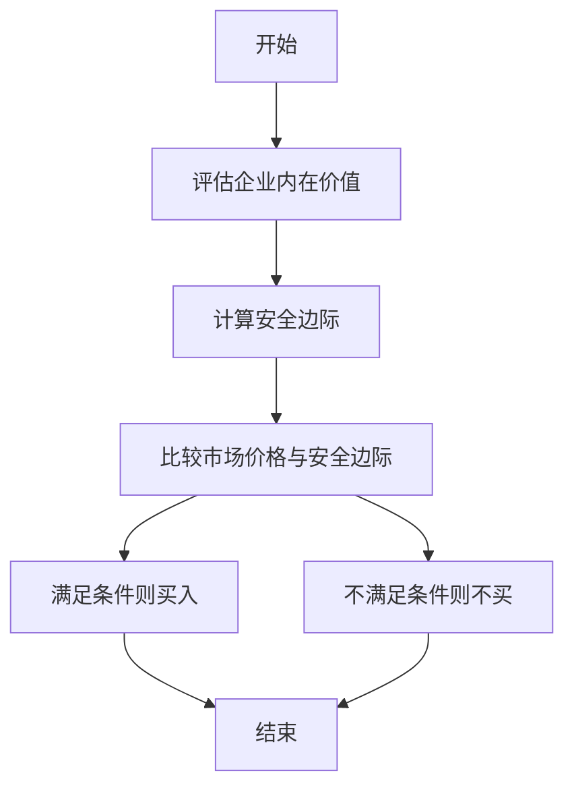
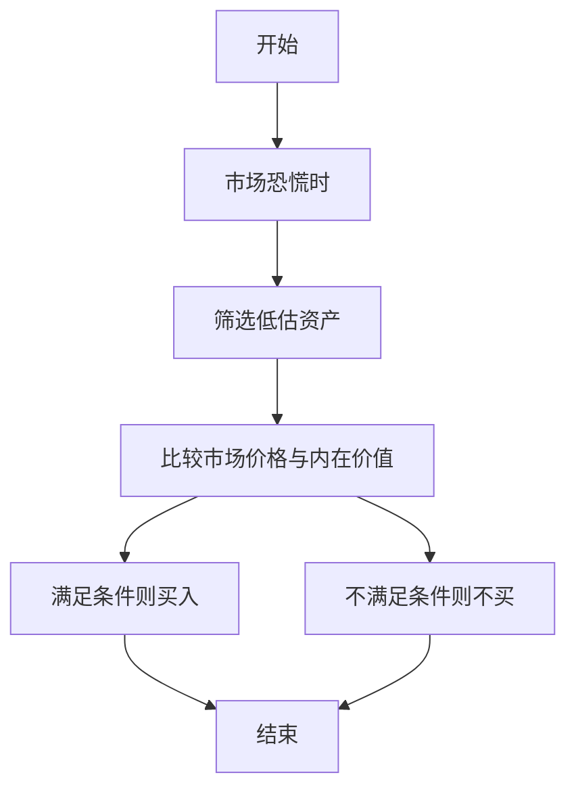
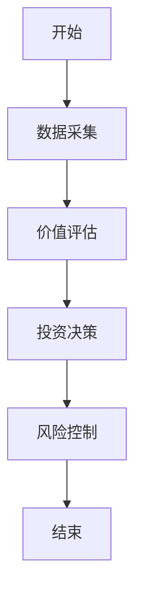
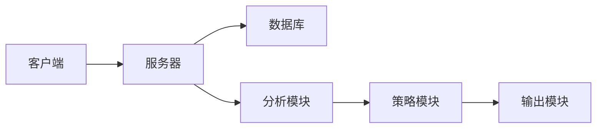

                 


# 巴菲特的逆向投资思维

> 关键词：巴菲特，逆向投资，价值投资，安全边际，投资策略

> 摘要：本文详细探讨了巴菲特的逆向投资思维，从其投资理念、数学模型、系统架构到实际项目应用，全面解析逆向投资的理论基础和实践方法。文章通过具体案例分析，展示了如何将逆向思维应用于投资决策，并提供了最佳实践建议。

---

# 第一部分: 巴菲特的逆向投资思维概述

## 第1章: 投资的演变与巴菲特的逆向思维

### 1.1 投资的演变历程

#### 1.1.1 从传统投资到现代投资的演变

现代投资理论起源于20世纪初，经历了从“基本面分析”到“现代资产组合理论”的演变。传统投资方法注重市场趋势和技术分析，而现代投资更强调分散化和风险控制。巴菲特的出现，为投资领域带来了新的理念。

#### 1.1.2 价值投资的兴起与发展

价值投资的核心在于寻找市场低估的股票，注重企业的内在价值。这一理念由本杰明·格雷厄姆提出，并被巴菲特发扬光大。价值投资强调安全边际，即购买价格低于内在价值，从而降低风险。

#### 1.1.3 逆向思维的定义与特点

逆向思维是指在市场恐慌时寻找机会，逆市场情绪进行投资。巴菲特的逆向思维不仅体现在买入被市场抛弃的股票，还体现在坚持长期投资和价值发现。

### 1.2 巴菲特的投资理念

#### 1.2.1 巴菲特的投资哲学

巴菲特的投资哲学包括以下几点：
1. 长期投资：关注企业的长期价值。
2. 安全边际：买入价格低于内在价值。
3. 集中投资：将资金集中在少数优质企业上。

#### 1.2.2 价值投资的核心原则

价值投资的核心原则包括：
1. 企业内在价值：通过财务分析评估企业的价值。
2. 安全边际：买入价格低于内在价值。
3. 长期持有：避免短期市场波动的影响。

#### 1.2.3 逆向思维在巴菲特投资策略中的地位

逆向思维是巴菲特策略的重要组成部分。他认为市场先生（市场情绪）是投资机会的来源。在市场恐慌时，逆向买入低估资产，可以获得超额收益。

### 1.3 逆向投资思维的核心要素

#### 1.3.1 逆向思维的定义

逆向思维是指在市场情绪与实际价值相悖时，采取反向行动。当市场恐慌时买入，当市场疯狂时卖出。

#### 1.3.2 逆向思维与传统投资的对比

| 对比维度 | 传统投资 | 逆向投资 |
|----------|----------|----------|
| 投资时机 | 随市场波动 | 在市场低点投资 |
| 风险控制 | 依赖分散化 | 依赖安全边际 |
| 投资策略 | 追踪市场趋势 | 寻找市场错估 |

#### 1.3.3 逆向思维的实践应用

逆向思维的应用包括：
1. 在市场低谷时投资优质企业。
2. 避免跟随市场情绪。
3. 独立思考，寻找市场错估的机会。

---

## 第2章: 逆向投资思维的数学模型与算法原理

### 2.1 投资决策的数学模型

#### 2.1.1 投资回报的计算公式

投资回报率（ROI）计算公式为：
$$ ROI = \frac{投资收益}{投资成本} \times 100\% $$

其中，投资收益 = 终值 - 初始投资。

#### 2.1.2 风险与收益的数学关系

风险与收益的关系可以用CAPM模型表示：
$$ E(r_i) = r_f + \beta_i (E(r_m) - r_f) $$

其中，\( \beta_i \) 是股票的贝塔系数，衡量其相对于市场的波动性。

#### 2.1.3 价值评估的公式推导

内在价值（V）的计算公式：
$$ V = \frac{预期现金流}{贴现率} $$

巴菲特的逆向思维通过寻找市场价格低于内在价值的股票，实现安全边际。

### 2.2 逆向思维的算法实现

#### 2.2.1 投资决策树的构建



#### 2.2.2 基于逆向思维的筛选算法



#### 2.2.3 投资组合优化的数学模型

投资组合优化的目标是最大化收益，同时最小化风险。可以通过以下步骤实现：

1. 确定投资目标和风险承受能力。
2. 选择优质资产，计算其预期收益和风险。
3. 使用优化算法（如均值-方差优化）构建最优组合。

优化模型可以用数学公式表示为：
$$ \min_w \sigma^2(w) $$
$$ \text{s.t.} \quad w^T \mu \geq \text{目标收益} $$
$$ \sum_{i=1}^n w_i = 1 $$

其中，\( \sigma^2(w) \) 是组合的方差，\( \mu \) 是组合的预期收益。

---

## 第3章: 逆向投资思维的系统架构设计

### 3.1 投资决策系统的功能设计

#### 3.1.1 系统功能模块划分

系统功能模块包括：
1. 数据采集模块：获取市场数据和公司财务数据。
2. 价值评估模块：计算内在价值和安全边际。
3. 投资决策模块：基于逆向思维生成投资建议。
4. 风险控制模块：监控投资组合的风险。

#### 3.1.2 系统功能流程图



#### 3.1.3 系统功能的实现方式

系统功能的实现需要结合数据源、算法模型和用户界面。例如，数据采集可以通过API接口获取实时数据，价值评估模块使用Python编写评估算法，用户界面则使用Web框架实现。

### 3.2 系统架构设计

#### 3.2.1 系统架构图



#### 3.2.2 系统组件的交互关系

系统组件包括客户端、服务器、数据库、分析模块、策略模块和输出模块。客户端发送请求，服务器处理并调用分析模块，分析模块生成结果，策略模块优化投资组合，最后输出结果。

#### 3.2.3 系统接口设计

系统接口设计包括：
1. 数据接口：获取市场数据。
2. 计算接口：计算内在价值和安全边际。
3. 决策接口：生成投资建议。

### 3.3 系统交互序列图

```mermaid
graph TD
    Client --> Server: 请求投资建议
    Server --> Database: 获取市场数据
    Server --> Analyze: 计算内在价值
    Analyze --> Strategy: 生成投资策略
    Strategy --> Output: 输出结果
    Server --> Client: 返回投资建议
```

---

## 第4章: 逆向投资思维的项目实战

### 4.1 项目环境与工具安装

#### 4.1.1 开发环境的搭建

开发环境包括操作系统（Windows/Mac/Linux）、Python编程语言、相关库（Pandas、NumPy、Matplotlib）和数据源（Yahoo Finance API）。

#### 4.1.2 数据源的获取与处理

数据获取步骤：
1. 使用API获取股票数据。
2. 数据清洗：处理缺失值和异常值。
3. 数据存储：将数据存储到数据库中。

#### 4.1.3 巴菲特投资模型的代码实现

代码实现步骤：
1. 导入必要的库。
2. 获取股票数据。
3. 计算内在价值和安全边际。
4. 生成投资建议。

### 4.2 投资模型的代码实现

#### 4.2.1 价值评估函数的编写

以下是价值评估函数的Python代码：

```python
def calculate_intrinsic_value(financial_data):
    # 简单的示例：基于市盈率计算
    pe_ratio = financial_data['市盈率']
    industry_pe = financial_data['行业市盈率']
    return financial_data['每股收益'] * (pe_ratio < industry_pe) * 2
```

#### 4.2.2 投资组合优化算法的实现

以下是投资组合优化的Python代码：

```python
import numpy as np
from scipy.optimize import minimize

def portfolio_optimization(returns, weights):
    n = len(returns)
    # 目标函数：最小化方差
    def objective(w):
        return np.dot(w.T, np.dot(returns, w))
    # 约束条件：权重之和为1
    constraints = [{'type': 'eq', 'fun': lambda w: sum(w) - 1}]
    # 初始猜测：均分权重
    w0 = np.array([1/n] * n)
    # 使用SLSQP方法求解
    result = minimize(objective, w0, method='SLSQP', constraints=constraints)
    return result.x
```

#### 4.2.3 系统交互界面的设计

系统交互界面设计包括用户输入参数、显示投资建议和风险提示。例如，用户输入资金规模和风险承受能力，系统输出投资组合和预期收益。

### 4.3 项目实战的小结

通过实际项目，我们可以看到逆向投资思维在代码实现中的应用。价值评估函数和投资组合优化算法是关键部分，结合系统架构设计，能够实现高效的决策支持。

---

## 第5章: 逆向投资思维的最佳实践

### 5.1 投资策略的优化与调整

#### 5.1.1 安全边际的计算与应用

安全边际的计算公式为：
$$ \text{安全边际} = \text{内在价值} - \text{市场价格} $$

当安全边际为正时，买入股票。

#### 5.1.2 风险控制的策略与方法

风险控制策略包括：
1. 分散投资：避免过度集中。
2. 定期复盘：评估投资组合的表现。
3. 严格止损：设定止损点以限制损失。

#### 5.1.3 投资组合的动态调整

投资组合应定期评估和调整，确保与投资目标一致。动态调整包括：
1. 重新评估股票价值。
2. 优化权重以降低风险。
3. 调整持仓以应对市场变化。

### 5.2 逆向思维的注意事项

#### 5.2.1 投资中的常见误区

常见误区包括：
1. 过度依赖技术分析。
2. 忽视企业的基本面。
3. 追逐市场热点。

#### 5.2.2 如何避免情绪化决策

避免情绪化决策的方法：
1. 坚持长期投资。
2. 遵循投资原则。
3. 保持独立思考。

#### 5.2.3 逆向思维的局限性与改进方向

逆向思维的局限性包括：
1. 市场波动难以预测。
2. 低估资产可能长期不被发现。
3. 需要大量时间和资源进行研究。

改进方向：
1. 结合技术分析和基本面分析。
2. 利用大数据和机器学习优化决策。
3. 提高研究效率和准确性。

---

## 第6章: 逆向投资思维的案例分析

### 6.1 经典案例分析

#### 6.1.1 巴菲特的经典投资案例

1. **可口可乐**：巴菲长期持有可口可乐，因为其强大的竞争优势和稳定的现金流。
2. **华盛顿邮报**：巴菲逆市买入，因为其低估价值。

#### 6.1.2 逆向思维在实际投资中的应用

2008年金融危机期间，巴菲特大量买入高盛和摩根士丹利的股票，因为市场恐慌导致价格大幅低于内在价值。

#### 6.1.3 投资失败的教训与反思

巴菲曾投资于一些表现不佳的公司，教训在于企业竞争力不足，而非价格因素。

### 6.2 案例分析的总结与启示

逆向思维的成功需要对企业的深入了解和市场情绪的准确判断。巴菲的案例表明，逆向思维可以在市场低谷时创造巨大价值。

---

# 结语

巴菲特的逆向投资思维是一种独特而有效的投资策略。通过价值投资、安全边际和长期持有，投资者可以在市场波动中抓住机会。本文详细探讨了逆向思维的理论基础、算法模型和系统架构，并通过实际案例展示了其应用。希望读者能够从中学到宝贵的经验，并在投资实践中取得成功。

---

**作者：AI天才研究院/AI Genius Institute & 禅与计算机程序设计艺术 /Zen And The Art of Computer Programming**

