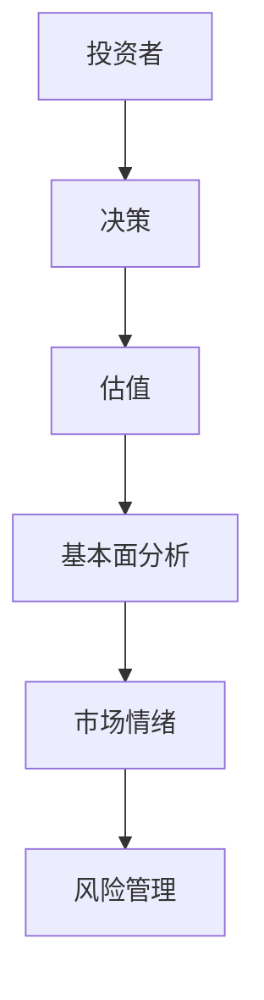
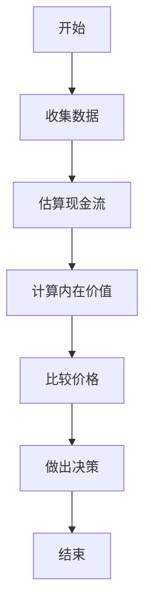
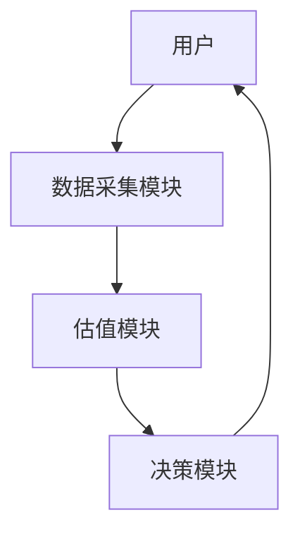
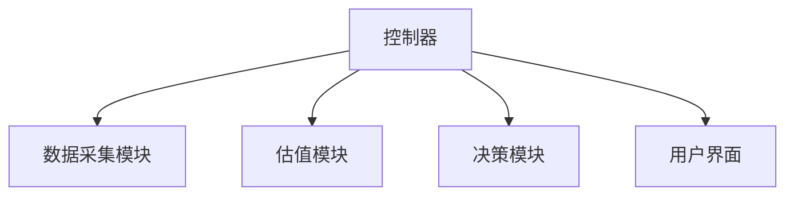

                 


# 巴菲特的逆向投资思维

## 关键词：逆向思维, 巴菲特, 投资策略, 价值评估, 风险管理

## 摘要：  
本文深入探讨了巴菲特的逆向投资思维，从其核心概念、算法实现到系统架构进行了全面分析。通过对比传统投资思维，展示了逆向思维在投资决策中的独特优势，并通过具体案例展示了其实际应用。文章结构清晰，内容详实，适合投资领域的专业人士和对巴菲特投资理念感兴趣的读者。

---

# 第1章: 逆向投资思维的背景与意义

## 1.1 逆向思维的定义与特点

### 1.1.1 逆向思维的定义  
逆向思维是一种不同于常规思维方式的策略，它通过反向思考问题，寻找解决问题的新方法。在投资领域，逆向思维意味着在市场低迷时寻找机会，而非在市场繁荣时盲目跟风。

### 1.1.2 逆向思维的核心特点  
- **反向思考**：关注市场中的非共识观点。  
- **逆周期操作**：在市场低谷时买入，在市场高点时卖出。  
- **长期视角**：注重企业的内在价值，而非短期市场波动。  

### 1.1.3 逆向思维在投资中的重要性  
逆向思维帮助投资者避免盲目跟风，降低投资风险，同时捕捉市场低估的机会。  

## 1.2 巴菲特的投资理念  

### 1.2.1 巴菲特的投资哲学  
巴菲特的投资哲学以“价值投资”为核心，强调购买低于内在价值的资产，长期持有，等待市场回归理性。  

### 1.2.2 巴菲特的价值投资理论  
- **内在价值**：企业未来现金流的现值。  
- **安全边际**：买入价格低于内在价值，以降低风险。  
- **长期持有**：避免频繁交易，减少成本，抓住价值回归的机会。  

### 1.2.3 巴菲特的成功案例分析  
以可口可乐和苹果公司为例，巴菲特通过长期持有，分享了企业成长的红利。  

## 1.3 逆向思维与巴菲特投资理念的结合  

### 1.3.1 逆向思维在巴菲特投资中的应用  
巴菲特在市场低迷时大量买入优质资产，例如2008年金融危机期间投资高盛和通用电气。  

### 1.3.2 逆向思维与传统投资思维的对比  
| 概念 | 传统投资思维 | 逆向思维 |  
|------|--------------|----------|  
| 决策依据 | 市场趋势 | 估值与基本面 |  
| 投资策略 | 追涨杀跌 | 低位买入，高位卖出 |  
| 风险管理 | 事后止损 | 事前控制 |  

### 1.3.3 逆向思维在市场波动中的优势  
逆向思维能够在市场恐慌时找到低估资产，在市场狂热时保持冷静，从而获得超额收益。  

---

# 第2章: 逆向思维的核心原理  

## 2.1 逆向思维的核心概念  

### 2.1.1 逆向思维的逻辑结构  
- **输入**：市场数据、企业基本面信息。  
- **处理**：分析市场情绪，识别低估资产。  
- **输出**：投资决策。  

### 2.1.2 逆向思维的决策模型  
$$ 决策 = \begin{cases}  
买入 & \text{如果价格 < 内在价值} \\
卖出 & \text{如果价格 > 内在价值} \\
持有 & \text{其他情况}  
\end{cases} $$  

### 2.1.3 逆向思维的数学模型  
$$ 内在价值 = \sum_{t=1}^{\infty} \frac{CF_t}{(1 + r)^t} $$  
其中，$CF_t$ 是第 $t$ 年的现金流，$r$ 是折现率。  

## 2.2 逆向思维与巴菲特投资理念的联系  

### 2.2.1 逆向思维在巴菲特投资决策中的应用  
巴菲特通过分析企业的内在价值，选择在市场低估时买入，市场高估时卖出。  

### 2.2.2 逆向思维与价值评估的关系  
逆向思维强调以低于内在价值的价格买入资产，确保安全边际。  

### 2.2.3 逆向思维与风险管理的结合  
通过逆向思维，巴菲特能够在市场波动中保持稳健，避免重大损失。  

## 2.3 核心概念对比表格  
| 概念 | 传统投资思维 | 逆向思维 |  
|------|--------------|----------|  
| 决策依据 | 市场趋势 | 估值与基本面 |  
| 投资策略 | 追涨杀跌 | 低位买入，高位卖出 |  
| 风险管理 | 事后止损 | 事前控制 |  

## 2.4 逆向思维的ER实体关系图  



---

# 第3章: 逆向思维的算法实现  

## 3.1 逆向思维的算法原理  

### 3.1.1 逆向思维的数学模型  
$$ 内在价值 = \sum_{t=1}^{\infty} \frac{CF_t}{(1 + r)^t} $$  
其中，$CF_t$ 是第 $t$ 年的现金流，$r$ 是折现率。  

### 3.1.2 逆向思维的实现步骤  
1. 收集目标企业的财务数据。  
2. 估算企业的未来现金流。  
3. 计算企业的内在价值。  
4. 对比当前价格与内在价值，做出投资决策。  

### 3.1.3 逆向思维的Python代码实现  

```python
def calculate_intrinsic_value(cash_flows, discount_rate):
    intrinsic_value = 0
    for t in range(len(cash_flows)):
        cf = cash_flows[t]
        intrinsic_value += cf / (1 + discount_rate) ** t
    return intrinsic_value

# 示例数据
cash_flows = [100, 120, 150, 180]  # 每年的现金流
discount_rate = 0.08  # 折现率

iv = calculate_intrinsic_value(cash_flows, discount_rate)
print(f"内在价值为: {iv:.2f}")
```

## 3.2 算法流程图  



---

# 第4章: 系统分析与架构设计  

## 4.1 系统分析  

### 4.1.1 项目介绍  
设计一个基于逆向思维的投资决策系统，帮助投资者识别低估资产。  

### 4.1.2 系统功能设计  
- 数据采集模块：收集市场数据和企业基本面信息。  
- 估值模块：计算企业的内在价值。  
- 决策模块：根据价格与内在价值的对比，生成投资建议。  

### 4.1.3 系统交互图  



## 4.2 系统架构设计  

### 4.2.1 系统架构图  



---

# 第5章: 项目实战  

## 5.1 环境安装  
安装Python和相关库（如pandas、numpy）。  

## 5.2 核心实现  

```python
import pandas as pd
import numpy as np

def calculate_intrinsic_value(cash_flows, discount_rate):
    iv = 0
    for t in range(len(cash_flows)):
        iv += cash_flows[t] / (1 + discount_rate) ** t
    return iv

# 示例数据
data = {
    '现金流': [100, 120, 150, 180],
    '折现率': [0.08]
}

df = pd.DataFrame(data)
cf = df['现金流'][0]
r = df['折现率'][0]
iv = calculate_intrinsic_value(cf, r)
print(f"内在价值为: {iv:.2f}")
```

## 5.3 案例分析  
以某公司为例，计算其内在价值，与当前股价对比，给出投资建议。  

---

# 第6章: 总结与展望  

## 6.1 总结  
逆向思维是巴菲特投资成功的核心理念之一，通过反向思考，投资者能够在市场中找到低估资产，实现长期稳健收益。  

## 6.2 展望  
未来，逆向思维将与人工智能、大数据分析等技术结合，进一步提升投资决策的效率和准确性。  

---

# 作者：AI天才研究院/AI Genius Institute & 禅与计算机程序设计艺术 /Zen And The Art of Computer Programming  

---

以上是《巴菲特的逆向投资思维》的完整文章，希望对您有所帮助。

