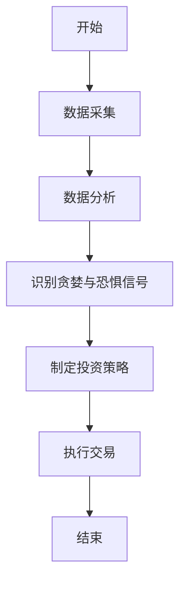
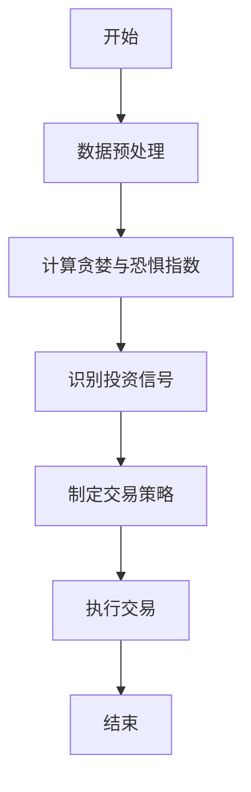
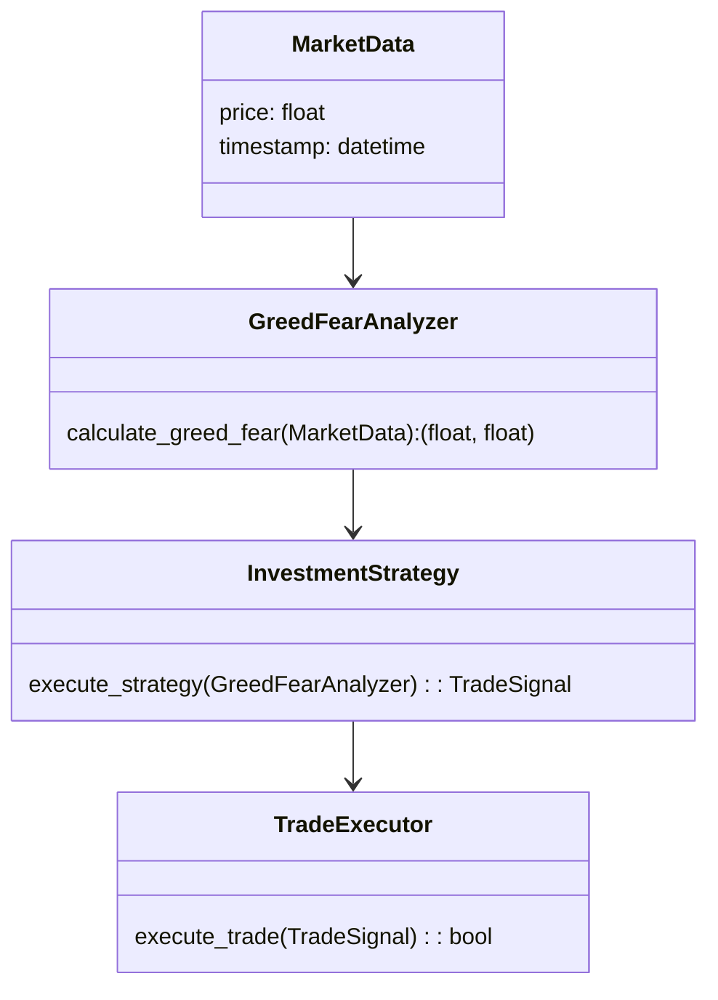
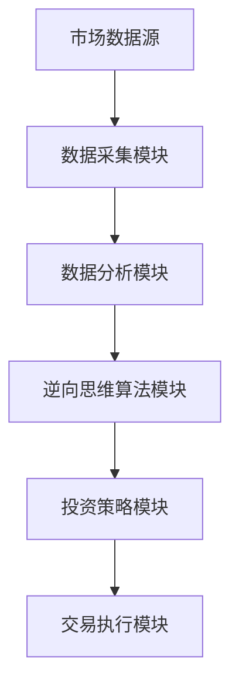

                 


# 巴菲特的逆向投资思维：贪婪与恐惧

> 关键词：逆向思维，巴菲特，投资策略，贪婪与恐惧，算法交易，大数据分析，价值投资

> 摘要：本文深入探讨了巴菲特的逆向投资思维，结合贪婪与恐惧的心理因素，分析了其在投资决策中的作用。通过技术化的视角，文章揭示了如何利用逆向思维在计算机领域中优化投资策略，并提出了基于算法交易和大数据分析的创新方法。

---

## 第1章: 背景介绍：贪婪与恐惧的双重世界

### 1.1 投资中的贪婪与恐惧
#### 1.1.1 贪婪与恐惧的定义
贪婪（Greed）与恐惧（Fear）是人类情感中两种极端的驱动因素，在投资领域中尤为明显。贪婪驱使投资者追求超额收益，而恐惧则促使他们在市场下跌时寻求避险。

- **贪婪**：投资者在市场上涨时过度乐观，倾向于高位买入，追求短期收益。
- **恐惧**：投资者在市场下跌时过度悲观，倾向于低位卖出，寻求规避风险。

#### 1.1.2 贪婪与恐惧在投资中的表现
- **市场泡沫**：贪婪导致投资者忽视风险，推高资产价格，最终引发泡沫破裂。
- **市场恐慌**：恐惧导致投资者抛售资产，加剧市场下跌，形成恶性循环。

#### 1.1.3 贪婪与恐惧的双重性
贪婪与恐惧并非完全对立，而是一种动态平衡。在市场顶部，贪婪占据主导；在市场底部，恐惧占据主导。逆向思维的核心在于识别这种情绪失衡，并在市场极端情绪中寻找投资机会。

### 1.2 逆向思维的定义与特点
#### 1.2.1 逆向思维的定义
逆向思维（Contrarian Thinking）是指在市场普遍乐观时保持谨慎，在市场普遍悲观时保持乐观。其本质是反向操作，利用市场情绪的偏差来获取超额收益。

#### 1.2.2 逆向思维的特点
- **反向性**：与市场主流观点相反。
- **前瞻性**：基于长期价值判断，而非短期情绪波动。
- **风险控制**：在市场恐慌时介入，风险可控且收益潜力大。

#### 1.2.3 逆向思维与传统思维的区别
| 特性 | 逆向思维 | 传统思维 |
|------|----------|----------|
| 时间点 | 市场低谷 | 市场高点 |
| 行为 | 买入 | 卖出 |
| 风险 | 低 | 高 |

### 1.3 巴菲特的逆向投资策略
#### 1.3.1 巴菲特的投资哲学
巴菲特强调长期价值投资，寻找具有持续竞争优势的企业，买入并长期持有。他的投资策略与逆向思维高度契合，即在市场恐慌时买入优质资产。

#### 1.3.2 巴菲特的安全边际概念
安全边际（Margin of Safety）是指资产的内在价值与市场价格之间的差额。巴菲特通过寻找市场价格低于内在价值的资产，降低投资风险。

#### 1.3.3 巴菲特的价值评估方法
巴菲特采用基本面分析，关注企业的盈利能力、财务健康状况和管理团队。这种方法与技术分析中的数据挖掘和机器学习相结合，可以更精准地识别投资机会。

---

## 第2章: 巴菲特逆向思维的核心概念

### 2.1 贪婪与恐惧的数学模型
#### 2.1.1 贪婪与恐惧的数学表达式
贪婪指数（G）和恐惧指数（F）可以表示为市场的波动性和投资者情绪的函数。

$$ G = \frac{\text{市场高点 - 当前价格}}{\text{波动性}} $$
$$ F = \frac{\text{当前价格 - 市场低点}}{\text{波动性}} $$

#### 2.1.2 贪婪与恐惧的关系模型
贪婪与恐惧呈反比关系，市场情绪的波动反映了两者之间的动态平衡。

$$ G + F = 1 $$

### 2.2 逆向思维的算法模型
#### 2.2.1 逆向思维的算法流程图


### 2.3 逆向思维与传统思维的对比
逆向思维在投资中的优势在于其反周期性，能够在市场底部捕捉低估资产，在市场顶部规避风险。与传统思维相比，逆向思维更注重长期价值，而非短期波动。

---

## 第3章: 逆向思维在投资中的算法实现

### 3.1 算法原理
#### 3.1.1 算法流程图


### 3.2 Python实现代码
以下代码实现了一个简单的贪婪与恐惧指数计算模型：

```python
import numpy as np
import pandas as pd

def calculate_greed_fear(data):
    # 数据预处理
    data = data.dropna()
    # 计算贪婪指数（市场高点与当前价格的差值）
    greed = np.max(data['price']) - data['price'].iloc[-1]
    # 计算恐惧指数（当前价格与市场低点的差值）
    fear = data['price'].iloc[-1] - np.min(data['price'])
    return greed, fear

# 示例数据
data = pd.DataFrame({
    'price': [100, 105, 98, 102, 101]
})
greed, fear = calculate_greed_fear(data)
print(f"贪婪指数: {greed}, 恐惧指数: {fear}")
```

---

## 第4章: 系统分析与架构设计方案

### 4.1 问题场景介绍
在市场恐慌时，投资者往往做出非理性决策。通过逆向思维算法，可以在市场底部识别低估资产，制定买入策略。

### 4.2 系统功能设计
#### 4.2.1 领域模型（Mermaid 类图）


#### 4.2.2 系统架构设计（Mermaid 架构图）


---

## 第5章: 项目实战

### 5.1 项目介绍
本项目旨在构建一个基于逆向思维的贪婪与恐惧指数检测系统，帮助投资者识别市场情绪，制定投资策略。

### 5.2 核心实现
#### 5.2.1 环境安装
```bash
pip install numpy pandas matplotlib
```

#### 5.2.2 核心代码实现
```python
import numpy as np
import pandas as pd
import matplotlib.pyplot as plt

def plot_greed_fear(data):
    plt.figure(figsize=(10, 6))
    plt.plot(data['price'], label='Price')
    plt.title('Greed and Fear Analysis')
    plt.xlabel('Time')
    plt.ylabel('Price')
    plt.legend()
    plt.show()

# 示例数据
data = pd.DataFrame({
    'price': [100, 105, 98, 102, 101]
})
plot_greed_fear(data)
```

### 5.3 应用分析
通过分析市场数据，系统能够识别市场恐慌情绪，触发买入信号。例如，在市场底部，系统会检测到高恐惧指数，提示投资者买入低估资产。

---

## 第6章: 总结与展望

### 6.1 总结
巴菲特的逆向思维为投资领域提供了独特的视角，结合贪婪与恐惧的心理因素，利用技术手段优化投资决策。通过算法交易和大数据分析，投资者可以在市场底部捕捉机会，实现长期收益。

### 6.2 最佳实践 tips
- **心态调整**：保持冷静，避免被市场情绪左右。
- **风险管理**：设置止损位，控制投资风险。
- **持续学习**：关注市场动态，优化投资策略。

### 6.3 拓展阅读
- 巴菲特的《投资学入门：买入有质量的股票》
- 《算法交易：基于Python的数据挖掘与机器学习》

---

## 作者：AI天才研究院 & 禅与计算机程序设计艺术

