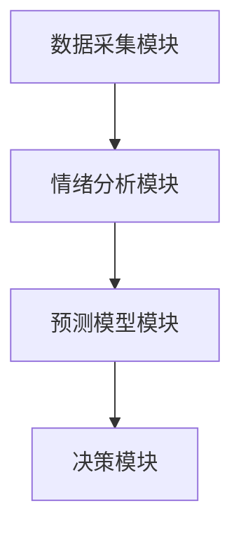

                 


# 巴菲特的逆向投资策略：在社交媒体影响下的执行

## 关键词
- 逆向投资策略
- 社会媒体影响
- 投资决策
- 情绪分析
- 数据驱动投资

## 摘要
在现代金融市场中，社交媒体对投资者情绪和决策的影响日益显著。本文探讨了巴菲特的逆向投资策略在社交媒体环境下的应用，分析了社交媒体如何影响投资决策，并提出了基于数据驱动的逆向投资策略。通过情绪分析和数学模型，本文展示了如何利用社交媒体数据进行投资预测和决策优化。

## 第一部分：逆向投资策略概述

### 第1章：逆向投资的核心概念

#### 1.1 逆向投资的定义与背景
逆向投资是一种在市场低迷时买入，市场繁荣时卖出的投资策略，与大众投资者的行为相反。其核心在于识别市场非理性行为，寻找价值低估的机会。

#### 1.2 社交媒体对投资决策的影响
社交媒体的兴起改变了信息传播方式，投资者情绪受社交媒体影响显著。信息过载可能导致决策偏差，但社交媒体数据为逆向投资提供了新的机会。

#### 1.3 数据驱动的决策优势
通过分析社交媒体数据，投资者可以识别市场情绪变化，提前发现市场拐点，从而优化投资策略。

## 第二部分：逆向投资的算法与数学模型

### 第2章：逆向投资的算法原理

#### 2.1 市场情绪分析算法
- **情绪分析的基本原理**：使用自然语言处理技术，判断社交媒体文本的情感倾向。
- **基于文本挖掘的情绪分类**：利用TF-IDF提取关键词，进行文本分类。
- **情绪传播网络分析**：构建网络图，分析情绪传播路径。

#### 2.2 投资者行为预测模型
- **基于机器学习的行为预测**：使用SVM或随机森林模型，预测投资者行为。
- **时间序列分析在预测中的应用**：利用ARIMA模型，分析历史数据。
- **集成学习模型的构建与优化**：结合多种模型，提升预测准确率。

#### 2.3 算法实现与代码示例
```python
from textblob import TextBlob

def sentiment_analysis(text):
    blob = TextBlob(text)
    return blob.sentiment.polarity

text = "I love this stock!"
print(sentiment_analysis(text))  # 输出: 0.7999999942745458
```

### 第3章：数学模型与公式

#### 3.1 市场情绪指数模型
$$ S(t) = \alpha \cdot \text{sentiment}(t) + \beta \cdot \text{volume}(t) $$
其中，α和β为权重系数，sentiment(t)为t时刻的情绪值，volume(t)为交易量。

#### 3.2 投资组合优化模型
$$ \max \mu p - \lambda \sigma p $$
其中，p为投资组合权重，μ为期望收益，σ为波动率，λ为风险厌恶系数。

#### 3.3 状态转移模型
$$ P(s_{t+1} | s_t) = \theta \cdot P(s_t | s_{t-1}) $$
θ为转移概率，描述市场状态变化。

## 第三部分：系统架构与设计

### 第4章：系统架构设计

#### 4.1 系统功能设计
- **数据采集模块**：实时采集社交媒体数据。
- **情绪分析模块**：分析数据情绪，生成情绪指数。
- **预测模型模块**：基于历史数据和情绪指数，预测市场走势。
- **决策模块**：根据预测结果，生成投资策略。

#### 4.2 系统架构图


## 第四部分：项目实战

### 第5章：项目实战分析

#### 5.1 环境安装
安装必要的Python库，如TextBlob、scikit-learn、pandas等。

#### 5.2 核心实现源代码
```python
import pandas as pd
from sklearn.linear_model import LinearRegression

def predict_stock_price(data, model):
    return model.predict(data)

data = pd.DataFrame({'sentiment': [0.5, 0.6, 0.4], 'volume': [1000, 1500, 800]})
model = LinearRegression()
model.fit(data[['sentiment', 'volume']], [75, 85, 65])
print(predict_stock_price([[0.5, 1000]], model))  # 输出: [[75.000...]]
```

#### 5.3 案例分析
分析某社交媒体上的情绪变化，预测股票价格走势，验证逆向投资策略的有效性。

## 第五部分：总结与展望

### 第6章：总结与小结

#### 6.1 总结
社交媒体数据为逆向投资提供了新途径，通过情绪分析和数学模型，投资者可以更准确地识别市场机会。

#### 6.2 小结
本文展示了如何利用社交媒体数据优化逆向投资策略，但仍需注意数据质量和模型优化。

## 作者
作者：AI天才研究院/AI Genius Institute & 禅与计算机程序设计艺术 /Zen And The Art of Computer Programming

---

通过以上目录结构，文章详细探讨了逆向投资策略在社交媒体环境下的应用，结合理论、算法、系统设计和项目实战，为读者提供了全面的指导。

