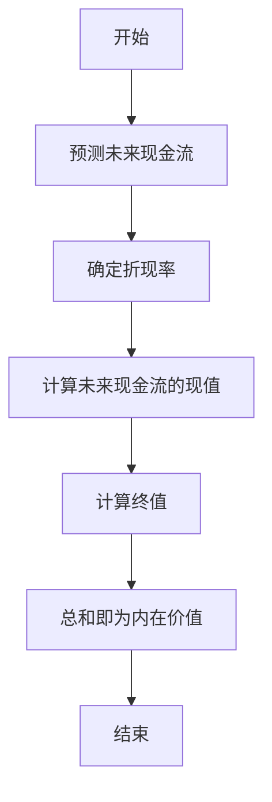
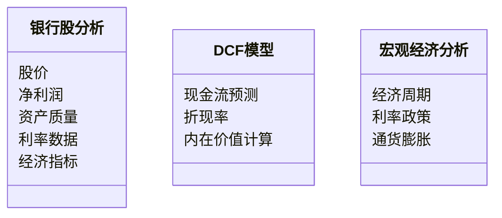
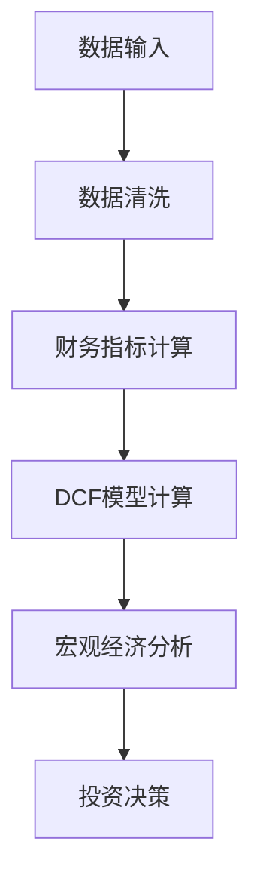

                 


```markdown
# 巴菲特的银行股投资逻辑：经济的晴雨表

> 关键词：巴菲特，银行股，价值投资，经济晴雨表，DCF模型，ROE，股息率

> 摘要：本文深入分析了巴菲特投资银行股的逻辑，探讨了银行股作为经济晴雨表的作用。通过详细讲解银行股的基本分析、估值方法、宏观经济影响以及风险管理策略，结合实际案例和数学模型，帮助读者理解如何运用巴菲特的投资理念进行银行股投资。

---

## 第1章：背景介绍

### 1.1 巴菲特的投资理念概述

巴菲特是价值投资的代表人物，他强调以合理的价格买入具有优秀基本面的公司。他的投资策略注重长期价值，而非短期市场波动。银行股因其特殊的行业属性，成为巴菲特投资组合中的重要组成部分。

#### 1.1.1 价值投资的定义与特点

- **定义**：价值投资是一种投资策略，旨在以低于内在价值的价格买入优质资产。
- **特点**：
  - 长期持有
  - 重视基本面分析
  - 寻找具有安全边际的投资标的

#### 1.1.2 巴菲特的价值投资方法论

- **主要原则**：
  - 投资于具有强大竞争优势的公司。
  - 重视管理层的诚信与能力。
  - 保持投资的分散化，降低风险。

#### 1.1.3 银行股在巴菲特投资组合中的地位

- 银行股因其稳定的收益和较高的分红率，成为巴菲特长期投资的重要选择。
- 银行股的行业特性使其能够反映宏观经济的变化，成为经济的晴雨表。

---

## 第2章：银行股的核心概念与分析

### 2.1 银行股的基本分析

#### 2.1.1 银行股的核心概念

银行股是指那些代表银行企业所有权的股票。由于银行是重要的金融中介，其经营状况与经济发展密切相关。银行股的价值不仅取决于自身的盈利能力，还受到宏观经济环境的影响。

#### 2.1.2 银行股的行业属性

- 银行是典型的资本密集型行业，具有较高的市场准入门槛。
- 银行的盈利主要依赖于净息差和手续费收入。
- 银行股的波动性较低，具有防御性特征。

#### 2.1.3 银行股的财务指标分析

- 净利润增长率
- 资产质量（不良贷款率）
- 资本充足率
- 利润率（净息差）

### 2.2 银行股的估值方法

#### 2.2.1 常用估值指标

- 市盈率（P/E）：市盈率 = 股价 / 每股净利润
- 市净率（P/B）：市净率 = 股价 / 每股净资产
- 股息率：股息率 = 每股股息 / 股价

#### 2.2.2 内在价值计算

内在价值是股票的合理价格，可以通过现金流折现模型（DCF模型）计算。以下是DCF模型的mermaid流程图：



#### 2.2.3 股息率分析

股息率是衡量股票收益能力的重要指标，特别是在银行股投资中，高股息率通常意味着较高的分红回报。

---

## 第3章：巴菲特的银行股投资策略

### 3.1 长期投资与复利效应

巴菲特强调长期投资，通过复利效应实现财富的稳步增长。以下是复利计算的Python代码示例：

```python
def compound_interest(principal, rate, time):
    return principal * (1 + rate) ** time

# 示例：本金10000元，年利率5%，投资10年
print(compound_interest(10000, 0.05, 10))  # 输出：16288.89
```

### 3.2 银行股的行业周期分析

银行股的投资需要考虑行业周期，通常在经济衰退期，银行股的防御性特征使其成为较好的投资标的。

### 3.3 风险管理策略

- 分散投资：通过投资不同银行股降低风险。
- 设置止损点：当股价跌破预设价格时及时卖出。
- 宏观经济分析：关注利率政策、经济周期对银行股的影响。

---

## 第4章：银行股的宏观经济分析

### 4.1 宏观经济对银行股的影响

#### 4.1.1 利率政策

- 利率上升通常会压缩银行的净息差，降低盈利能力。
- 利率下降则会增加贷款需求，提升银行的收益。

#### 4.1.2 经济周期

- 经济繁荣期：银行贷款需求增加，收益上升。
- 经济衰退期：银行资产质量下降，不良贷款率上升。

#### 4.1.3 通货膨胀

- 通货膨胀会增加银行的贷款需求，但也会导致贷款违约风险上升。

### 4.2 银行股的行业趋势分析

#### 4.2.1 行业整合

近年来，银行行业整合趋势明显，大型银行通过并购扩张市场份额。

#### 4.2.2 数字化转型

金融科技的发展促使银行进行数字化转型，提升服务效率和客户体验。

#### 4.2.3 金融科技的机遇与挑战

金融科技的发展为银行股带来了新的增长点，但也带来了技术风险和竞争压力。

---

## 第5章：项目实战

### 5.1 环境安装与数据准备

#### 5.1.1 环境安装

- 安装Python和相关库（如pandas、numpy、matplotlib）。
- 数据来源：选取几家银行的财务数据，如工商银行、建设银行等。

#### 5.1.2 数据准备

- 下载银行股的历史股价数据。
- 获取宏观经济指标（如GDP增长率、利率数据）。

### 5.2 系统分析与架构设计

#### 5.2.1 领域模型

银行股分析的领域模型如下：



#### 5.2.2 系统架构

银行股分析系统的架构设计如下：



### 5.3 代码实现与案例分析

#### 5.3.1 DCF模型实现

```python
import pandas as pd
import numpy as np

def calculate_intrinsic_value(fcf, discount_rate, growth_rate, perpetuity_rate):
    # 计算未来现金流
    cash_flows = []
    for i in range(10):
        cash_flows.append(fcf * (1 + growth_rate) ** i)
    # 计算终值
    terminal_value = cash_flows[-1] / (1 + perpetuity_rate)
    # 计算现值
    present_value = sum([cf / (1 + discount_rate) ** (i+1) for i, cf in enumerate(cash_flows)])
    # 总和即为内在价值
    return present_value + terminal_value

# 示例数据
fcf = 100
discount_rate = 0.08
growth_rate = 0.05
perpetuity_rate = 0.02

iv = calculate_intrinsic_value(fcf, discount_rate, growth_rate, perpetuity_rate)
print(f"内在价值：{iv:.2f}")
```

#### 5.3.2 案例分析

以工商银行为例，分析其DCF模型的内在价值：

```python
import pandas as pd
import numpy as np

# 假设财务数据
data = {
    '现金流': [100, 110, 121, 133.1, 146.41],
    '折现因子': [1/(1+0.08), 1/(1+0.08)^2, 1/(1+0.08)^3, 1/(1+0.08)^4, 1/(1+0.08)^5]
}

df = pd.DataFrame(data)
df['现值'] = df['现金流'] * df['折现因子']
print(df)
```

---

## 第6章：总结与展望

### 6.1 总结

巴菲特的银行股投资逻辑以价值投资为核心，注重基本面分析和长期持有。银行股作为经济的晴雨表，其投资价值不仅取决于公司自身的表现，还与宏观经济环境密切相关。

### 6.2 展望

随着金融科技的发展，银行股的投资策略也需要不断创新。未来，投资者需要更加关注数字化转型和行业整合带来的机遇与挑战。

---

## 作者信息

作者：AI天才研究院/AI Genius Institute & 禅与计算机程序设计艺术 /Zen And The Art of Computer Programming
```

