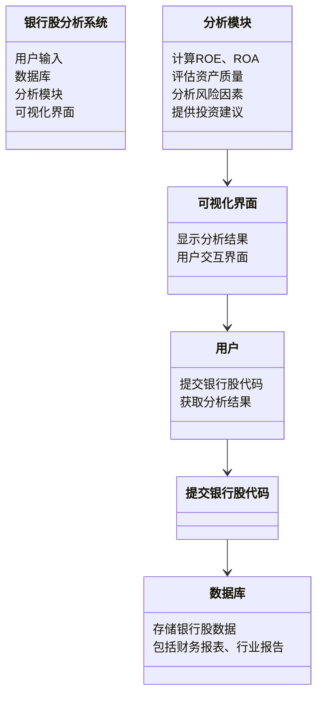
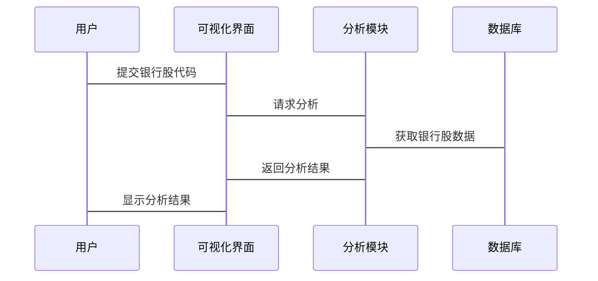

                 


# 巴菲特的银行股投资逻辑：金融行业的吸引力

## 关键词：巴菲特, 银行股, 投资逻辑, 金融行业, 价值投资, 风险管理, 银行股分析

## 摘要：本文深入分析了巴菲特的银行股投资逻辑，探讨了金融行业的吸引力，结合实际案例和系统架构，详细讲解了巴菲特的投资策略、风险管理方法及银行股的财务指标评估。通过系统分析与实战案例，本文为读者提供了全面的视角，帮助理解巴菲特的投资哲学和银行股的价值投资策略。

---

## 第一部分: 巴菲特的银行股投资逻辑

### 第1章: 巴菲特的投资理念与银行股分析框架

#### 1.1 巴菲特的投资哲学

##### 1.1.1 价值投资的核心理念
- 价值投资的核心在于寻找市场低估的股票，长期持有优质企业，获取超额收益。
- 银行股因其稳定的收益和高ROE（净资产收益率）成为巴菲特青睐的目标。

##### 1.1.2 银行股在巴菲特投资组合中的地位
- 银行股作为防御性资产，具有较高的分红率和稳定的收益，是巴菲特长期投资的重要组成部分。

##### 1.1.3 长期价值投资的策略与目标
- 巴菲特坚持长期投资，避免短期市场波动的干扰，关注企业的内在价值和持续盈利能力。

#### 1.2 银行股的吸引力与风险特征

##### 1.2.1 银行行业的基本特征
- 银行作为金融中介，通过存贷款业务获取收益，具有较高的市场地位和客户粘性。

##### 1.2.2 银行股的收益来源与风险因素
- 收益来源：净息差、手续费收入、投资收益。
- 风险因素：利率风险、信用风险、流动性风险。

##### 1.2.3 银行股的估值方法与关键指标
- 常用估值指标：市盈率（P/E）、市净率（P/B）、股息率、ROE、ROA。

#### 1.3 巴菲特的银行股投资逻辑
- 关注银行的资本结构、资产质量、盈利能力。
- 选择具有竞争优势和长期增长潜力的银行股。

---

### 第2章: 银行股的财务指标与风险评估

#### 2.1 银行的财务报表分析

##### 2.1.1 资产负债表的关键指标
- 资产总额、负债总额、所有者权益。
- 关注资产质量：不良贷款率、拨备覆盖率。

##### 2.1.2 利润表的核心指标
- 营业收入、净利润、利息支出、手续费收入。
- 关注盈利能力：净息差、ROE、ROA。

##### 2.1.3 现金流量表的重要性
- 经营活动现金流、投资活动现金流、筹资活动现金流。
- 关注流动性管理：短期负债和长期负债的结构。

#### 2.2 银行的风险管理与资本充足率

##### 2.2.1 银行的主要风险类型
- 信用风险：借款人违约风险。
- 利率风险：利率波动影响银行收益。
- 流动性风险：无法及时满足资金需求。

##### 2.2.2 资本充足率的计算与评估
- 资本充足率 = （核心资本 + 其他一级资本 + 二级资本）/ 风险加权资产。
- 巴菲特要求银行资本充足率高，以抵御风险。

##### 2.2.3 资产质量与贷款损失准备金
- 贷款损失准备金 = 坏账准备金 + 重组贷款准备金。
- 关注不良贷款率和拨备覆盖率，评估银行的资产质量。

---

### 第3章: 巴菲特的银行股投资策略

#### 3.1 银行股的投资策略与筛选标准

##### 3.1.1 银行股的长期价值评估
- 关注银行的ROE和ROA，选择高ROE、稳定的银行股。
- 选择具有竞争优势和长期增长潜力的银行股。

##### 3.1.2 银行股的roe与roa分析
- ROE = 净利润 / 所有者权益。
- ROA = 净利润 / 总资产。
- 高ROE和高ROA是选择银行股的重要指标。

##### 3.1.3 银行股的市场地位与竞争优势
- 市场地位：大型银行具有更强的定价能力和成本优势。
- 竞争优势：品牌、客户基础、创新能力。

#### 3.2 巴菲特的集中投资与风险管理

##### 3.2.1 集中投资的优缺点
- 优点：集中投资于优质企业，获得更高收益。
- 缺点：风险较高，市场波动可能影响收益。

##### 3.2.2 风险管理的三大原则
- 分散投资：避免过度集中，降低风险。
- 严格选股：选择优质银行股，确保投资质量。
- 长期持有：避免短期波动，获取长期收益。

##### 3.2.3 银行股投资的分散与组合
- 分散投资于不同银行股，降低行业风险。
- 组合投资：结合银行股和其他资产，平衡风险与收益。

---

### 第4章: 银行股投资的实战案例分析

#### 4.1 巴菲特的经典投资案例

##### 4.1.1 投资美国银行的背景与决策
- 美国银行在2008年金融危机后估值被低估。
- 巴菲特通过分析财务报表和估值指标，选择投资美国银行。

##### 4.1.2 投资富国银行的逻辑与结果
- 富国银行的高ROE和稳定的收益。
- 巴菲特通过长期持有，获得丰厚的回报。

##### 4.1.3 银行股投资的长期回报分析
- 长期持有银行股的回报高于短期交易。
- 通过复利效应，实现财富的长期增长。

#### 4.2 银行股投资的常见误区

##### 4.2.1 过度关注短期收益
- 短期收益波动大，难以预测。
- 长期投资者应关注企业的长期价值。

##### 4.2.2 忽视风险管理
- 银行股投资需关注行业风险和个股风险。
- 分散投资和严格选股是降低风险的关键。

##### 4.2.3 过度依赖技术分析
- 技术分析难以预测长期趋势。
- 基本面分析是投资银行股的核心方法。

---

## 第二部分: 系统分析与架构设计方案

### 第5章: 银行股分析系统的构建

#### 5.1 问题场景介绍
- 投资者需要一个系统化的工具，帮助分析银行股的财务指标和风险因素。
- 通过系统分析，投资者可以更科学地选择银行股。

#### 5.2 项目介绍
- 项目目标：构建一个银行股分析系统，帮助投资者进行财务分析和风险管理。
- 项目范围：涵盖银行股的财务指标分析、风险评估和投资策略。

#### 5.3 系统功能设计（领域模型mermaid类图）



#### 5.4 系统架构设计（mermaid架构图）


#### 5.5 系统接口设计
- 用户输入接口：提交银行股代码。
- 数据库接口：存储和检索银行股数据。
- 分析模块接口：计算财务指标和风险评估。
- 可视化界面接口：展示分析结果。

#### 5.6 系统交互（mermaid序列图）



---

### 第6章: 项目实战

#### 6.1 环境配置

```bash
# 安装Python和必要的库
pip install numpy pandas matplotlib
```

#### 6.2 数据获取与处理

```python
import pandas as pd
import numpy as np

# 获取银行股数据
bank_data = pd.read_csv('bank_data.csv')

# 数据清洗
bank_data = bank_data.dropna()
bank_data = bank_data[bank_data['ROE'] > 0]
```

#### 6.3 算法实现

```python
def calculate_roe(net_profit, equity):
    return net_profit / equity

# 计算ROE
bank_data['ROE'] = calculate_roe(bank_data['净利润'], bank_data['股东权益'])
```

#### 6.4 可视化展示

```python
import matplotlib.pyplot as plt

# 绘制ROE分布图
plt.hist(bank_data['ROE'], bins=10)
plt.title('银行股ROE分布')
plt.xlabel('ROE')
plt.ylabel('银行数量')
plt.show()
```

#### 6.5 实际案例分析

```python
# 分析富国银行
wfc_data = bank_data[bank_data['银行代码'] == 'WFC']
print("富国银行的ROE为：", wfc_data['ROE'].values[0])
```

#### 6.6 项目小结
- 通过系统分析，投资者可以更科学地选择银行股。
- 系统化的工具能够帮助投资者进行风险评估和投资决策。

---

## 第三部分: 最佳实践与投资建议

### 第7章: 最佳实践 tips

#### 7.1 投资建议
- 长期持有优质银行股，避免短期波动。
- 选择ROE高、资产质量好的银行股。
- 分散投资，降低行业风险。

#### 7.2 小结
- 巴菲特的银行股投资逻辑以价值投资为核心，注重长期价值和风险管理。
- 投资者应结合基本面分析和系统工具，做出科学的投资决策。

#### 7.3 注意事项
- 银行股投资需关注行业风险和个股风险。
- 分散投资是降低风险的有效方法。

#### 7.4 拓展阅读
- 《巴菲特的财务管理智慧》
- 《价值投资实战策略》

---

## 结论

巴菲特的银行股投资逻辑以价值投资为核心，注重长期价值和风险管理。通过系统的财务分析和风险管理，投资者可以更好地选择银行股，实现长期收益。本文通过实际案例和系统设计，为读者提供了全面的视角，帮助理解巴菲特的投资哲学和银行股的价值投资策略。

---

## 作者

作者：AI天才研究院/AI Genius Institute & 禅与计算机程序设计艺术 /Zen And The Art of Computer Programming

