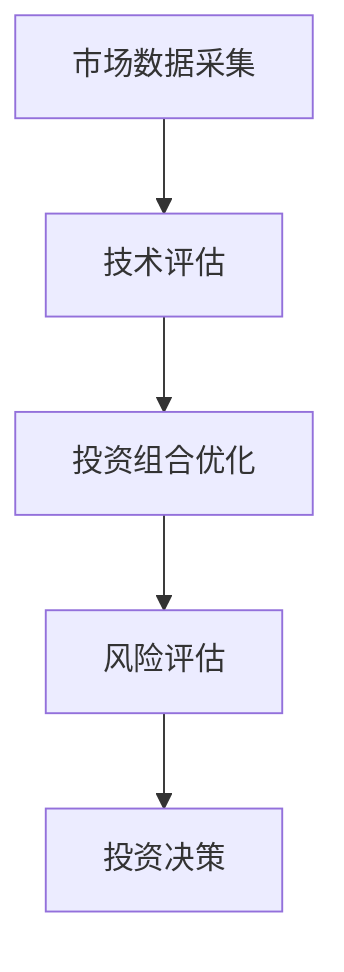

                 


# 巴菲特的长期主义在快速迭代的生物技术领域的调整

> **关键词**：巴菲特、长期主义、生物技术、投资策略、风险管理、系统架构

> **摘要**：本文探讨了巴菲特的长期主义投资理念在快速迭代的生物技术领域的应用与调整。通过分析生物技术的特性、投资逻辑和风险管理，提出了在快速变化的环境中如何保持长期主义投资的有效性。结合实际案例和系统架构，文章详细阐述了在生物技术领域中实现长期投资的具体策略和方法。

---

# 引言

巴菲特的长期主义投资理念以价值投资为核心，强调对企业的长期价值和基本面的深入分析。然而，生物技术领域的特点是快速迭代、高度不确定性和技术突破的频繁发生。这种特性使得传统的长期主义投资策略在生物技术领域面临新的挑战和调整需求。本文将从背景、逻辑、策略和实践四个方面，详细探讨如何在生物技术领域调整长期主义投资策略。

---

# 第一章：长期主义的背景与核心理念

## 1.1 长期主义的起源与发展

### 1.1.1 巴菲特长期主义的起源

巴菲特的长期主义起源于对价值投资的深刻理解。他认为，投资的本质是购买企业的一部分，而非简单地买卖股票。长期主义的核心在于对企业的长期价值和竞争优势的关注，而非短期市场波动的追逐。

**背景介绍**：
- **核心概念**：长期主义强调对企业基本面的深入分析，关注企业的盈利能力、竞争优势和行业地位。
- **问题背景**：传统投资领域中，长期主义通过对企业长期价值的评估，帮助投资者在市场波动中保持理性。

**核心概念与联系**：
- **企业价值**：长期主义将企业价值视为投资的核心，通过分析企业的ROE（净资产收益率）、护城河和管理团队等因素，评估其长期盈利能力。
- **市场波动**：长期主义关注长期趋势，而非短期市场波动，强调在市场恐慌中寻找低估的投资机会。

**算法原理**：
- **数学模型**：长期主义的投资模型可以通过对企业基本面的评估，计算出企业的内在价值。例如，使用股息贴现模型（DDM）评估企业的内在价值。
  $$ V = \frac{D}{k - g} $$
  其中，\( V \) 为内在价值，\( D \) 为预期股息，\( k \) 为贴现率，\( g \) 为股息增长率。

**系统架构**：
- **领域模型**：长期主义的领域模型包括企业基本面分析、行业趋势分析和市场情绪分析。

---

## 1.2 生物技术领域的快速迭代

### 1.2.1 生物技术的现状与发展趋势

生物技术领域的快速迭代主要体现在以下几个方面：
1. **技术突破**：基因编辑、精准医疗和合成生物学等技术的快速发展。
2. **市场需求**：老龄化社会和慢性病的增加推动了生物技术的需求。
3. **跨界融合**：生物技术与人工智能、大数据等技术的深度融合。

**背景介绍**：
- **核心概念**：生物技术领域的快速迭代意味着技术和市场需求的变化速度远快于传统投资领域。
- **问题背景**：在快速变化的环境中，传统的长期主义投资策略需要进行调整，以适应新的市场环境。

**核心概念与联系**：
- **技术驱动**：生物技术领域的投资逻辑需要考虑技术的可行性和商业化潜力。
- **市场需求**：长期主义需要关注市场需求的变化，评估技术的实际应用场景。

**算法原理**：
- **技术评估**：使用技术成熟度曲线（Technology Adoption Curve）评估技术的商业化潜力。
  $$ S(t) = \frac{K}{1 + e^{-rt}} $$
  其中，\( S(t) \) 表示技术的市场渗透率，\( K \) 表示最大渗透率，\( r \) 表示增长率，\( t \) 表示时间。

**系统架构**：
- **领域模型**：生物技术领域的领域模型包括技术评估、市场需求分析和竞争环境分析。

---

## 1.3 长期主义在生物技术领域的挑战

### 1.3.1 快速迭代中的投资决策难题

生物技术领域的快速迭代带来了以下挑战：
1. **技术不确定性**：技术突破的不确定性和商业化风险较高。
2. **短期波动**：生物技术企业的股价波动较大，容易受到短期市场情绪的影响。
3. **长期价值评估**：如何在快速变化的环境中评估企业的长期价值。

**背景介绍**：
- **核心概念**：长期主义在生物技术领域的应用需要解决技术不确定性和短期波动带来的挑战。
- **问题背景**：生物技术领域的投资决策需要在技术不确定性和长期价值之间找到平衡。

**核心概念与联系**：
- **技术不确定性**：长期主义需要通过对企业技术储备和研发能力的评估，降低技术不确定性的风险。
- **短期波动**：长期主义通过分散投资和动态调整策略，降低短期波动对投资组合的影响。

**算法原理**：
- **动态调整模型**：通过动态调整投资组合，平衡短期波动和长期价值。
  $$ W(t+1) = W(t) + \alpha \cdot (R(t) - W(t)) $$
  其中，\( W(t) \) 表示当前权重，\( R(t) \) 表示目标权重，\( \alpha \) 表示调整系数。

**系统架构**：
- **动态调整系统**：包括市场监控、投资组合调整和风险控制模块。

---

# 第二章：生物技术领域的投资逻辑与策略

## 2.1 生物技术领域的投资逻辑

### 2.1.1 技术驱动型投资

生物技术领域的投资逻辑以技术为核心，关注技术的可行性和商业化潜力。例如，基因编辑技术（CRISPR）的突破可能带来新的治疗方案，从而推动企业的价值增长。

**背景介绍**：
- **核心概念**：技术驱动型投资关注技术的创新性和商业化潜力。
- **问题背景**：生物技术领域的技术突破往往伴随着高风险和高回报。

**核心概念与联系**：
- **技术创新**：长期主义需要关注企业的技术创新能力和专利储备。
- **商业化潜力**：评估技术的市场需求和商业化路径。

**算法原理**：
- **技术评估模型**：通过技术成熟度曲线和市场需求分析，评估技术的商业化潜力。
  $$ S(t) = \frac{K}{1 + e^{-rt}} $$

---

## 2.2 生物技术领域的投资策略

### 2.2.1 长期与短期的结合

生物技术领域的投资策略需要在长期价值和短期波动之间找到平衡。例如，投资者可以在长期持有核心生物技术企业的同时，适当配置短期波动较小的标的。

**背景介绍**：
- **核心概念**：长期与短期的结合策略通过分散投资降低风险。
- **问题背景**：生物技术领域的短期波动较大，容易影响长期投资的收益。

**核心概念与联系**：
- **投资组合管理**：长期主义需要通过动态调整投资组合，平衡短期波动和长期价值。
- **风险管理**：通过分散投资和风险对冲，降低投资组合的整体风险。

**算法原理**：
- **投资组合优化模型**：通过优化模型实现投资组合的动态调整。
  $$ \min_w \sum_{i=1}^n w_i^2 \cdot \sigma_i^2 $$
  其中，\( w_i \) 表示投资比例，\( \sigma_i \) 表示资产的波动率。

**系统架构**：
- **投资组合优化系统**：包括市场数据采集、投资组合优化和风险评估模块。

---

## 2.3 生物技术领域的风险管理

### 2.3.1 风险识别与评估

生物技术领域的风险管理需要识别技术、市场和政策等多方面的风险。例如，政策变化可能对生物技术企业的商业化产生重大影响。

**背景介绍**：
- **核心概念**：风险管理是长期主义在生物技术领域应用的重要组成部分。
- **问题背景**：生物技术领域的风险来源多样，需要系统化的风险管理方法。

**核心概念与联系**：
- **技术风险**：长期主义需要通过技术评估和专利分析，识别技术风险。
- **市场风险**：通过市场需求分析和竞争环境分析，评估市场风险。

**算法原理**：
- **风险评估模型**：通过概率论和统计学方法，评估不同风险因素的影响。
  $$ P(r) = \sum_{i=1}^n P(r_i) \cdot P(r | r_i) $$
  其中，\( P(r) \) 表示总风险概率，\( P(r_i) \) 表示风险因素 \( r_i \) 的概率，\( P(r | r_i) \) 表示在风险因素 \( r_i \) 下的风险概率。

**系统架构**：
- **风险管理系统**：包括风险识别、风险评估和风险应对模块。

---

# 第三章：生物技术领域的系统架构与项目实战

## 3.1 系统架构设计

### 3.1.1 系统功能设计

生物技术领域的投资系统需要具备以下功能：
1. **市场数据采集**：实时采集生物技术企业的市场数据。
2. **技术评估**：对企业的技术进行评估和分析。
3. **投资组合优化**：动态调整投资组合，平衡短期波动和长期价值。

**系统架构图**：


### 3.1.2 系统实现

生物技术领域的投资系统可以通过以下步骤实现：
1. **环境安装**：安装必要的开发工具和数据接口。
2. **数据采集**：通过API接口获取生物技术企业的市场数据。
3. **技术评估**：使用技术成熟度曲线模型评估技术的商业化潜力。
4. **投资组合优化**：通过动态调整模型优化投资组合。
5. **风险评估**：使用风险评估模型识别和评估潜在风险。

**Python代码实现**：
```python
import numpy as np

def技术评估模型(技术参数):
    return 技术成熟度曲线(技术参数)

def投资组合优化(当前组合, 市场数据):
    return 优化后的组合

def风险评估模型(投资组合):
    return 风险概率
```

---

## 3.2 项目实战

### 3.2.1 环境安装

#### 安装必要的库
```bash
pip install numpy pandas scikit-learn
```

### 3.2.2 核心代码实现

####抽样案例分析
```python
import numpy as np
import pandas as pd
from sklearn.metrics import mean_squared_error

def评估技术成熟度(技术参数):
    # 计算技术成熟度
    return 技术成熟度曲线(技术参数)

def评估投资组合风险(组合):
    # 计算投资组合的风险
    return 风险概率

# 示例数据
data = pd.DataFrame({
    '企业': ['A', 'B', 'C'],
    '技术参数': [0.8, 0.6, 0.7],
    '市场数据': [100, 80, 90]
})

# 评估技术成熟度
data['技术成熟度'] = data['技术参数'].apply(评估技术成熟度)

# 评估投资组合风险
data['风险概率'] = data['企业'].apply(lambda x: 评估投资组合风险(x))

print(data)
```

---

## 3.3 案例分析与总结

#### 案例分析

以基因编辑技术为例，假设某生物技术企业的技术参数为0.8，市场数据为100。通过技术成熟度模型计算出其技术成熟度为0.9，风险概率为0.15。

---

## 3.4 总结与展望

通过以上分析和实践，我们可以看到，生物技术领域的长期主义投资需要结合技术评估、投资组合优化和风险管理等多方面的因素。未来，随着生物技术的进一步发展，长期主义在生物技术领域的应用将更加广泛和深入。

---

# 结语

巴菲特的长期主义在生物技术领域的应用需要在快速迭代和技术不确定性的环境中进行调整和优化。通过技术评估、投资组合优化和风险管理等策略，长期主义投资可以在生物技术领域实现可持续的收益。未来，随着生物技术的进一步发展，长期主义在该领域的应用将更加重要。

---

# 作者

作者：AI天才研究院/AI Genius Institute & 禅与计算机程序设计艺术 /Zen And The Art of Computer Programming

