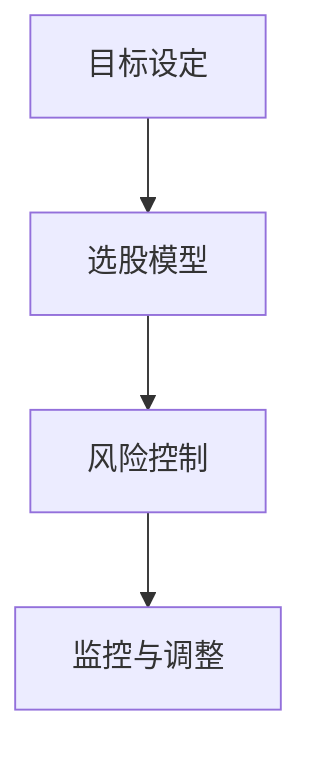
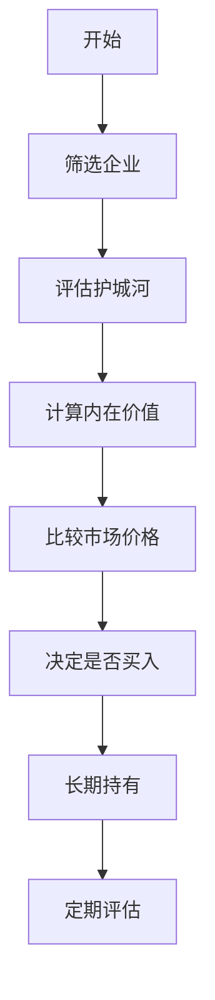

                 

# 巴菲特的长期持股策略

> 关键词：巴菲特，长期持股，价值投资，护城河，安全边际

> 摘要：本文深入分析了巴菲特的长期持股策略，探讨了其背后的哲学、选股标准、策略优势以及风险管理。通过技术化的分析和案例研究，揭示了长期持股的核心逻辑和成功关键。

---

## 第一部分：巴菲特的长期投资哲学

### 1.1 巴菲特的投资哲学

#### 1.1.1 价值投资的定义与核心理念

价值投资是一种以内在价值为导向的投资方法。巴菲特的哲学基于这一理念，强调买入低于其内在价值的股票，并长期持有。其核心是寻找那些具有强大竞争优势、稳定财务状况和优秀管理层的企业。

#### 1.1.2 长期持股的背景与意义

长期持股的策略源于巴菲特对市场短期波动的忽视。他认为，市场先生（市场）是疯狂的，而企业的真实价值是通过长期经营表现出来的。长期持股能够避免短期波动的干扰，捕捉企业成长的复利效应。

#### 1.1.3 投资的三个关键因素

- **时间**：长期持有才能让复利发挥作用。
- **企业质量**：选择具有强大护城河的企业。
- **价格**：以合理甚至低估的价格买入。

---

### 1.2 护城河的概念与分类

#### 1.2.1 护城河的定义

护城河是指企业在行业中形成的竞争优势，能够抵御竞争对手的侵蚀。护城河可以分为以下几类：

- **成本优势**：如制造业中的规模效应。
- **品牌优势**：如可口可乐的品牌价值。
- **网络效应**：如社交平台的用户黏性。
- **技术壁垒**：如专利技术。

#### 1.2.2 护城河的重要性

护城河是长期持股的核心要素。拥有强大护城河的企业能够在竞争中保持领先地位，并持续为股东创造价值。

---

## 第二部分：选股标准与企业分析方法

### 2.1 选股的核心标准

#### 2.1.1 财务指标分析

巴菲特非常注重企业的财务健康状况。以下是关键财务指标：

- **ROE（净资产收益率）**：衡量企业盈利能力的重要指标。
- **债务与股权比例**：低债务企业更安全。
- **现金流**：健康的现金流是企业长期发展的基石。

#### 2.1.2 企业成长性分析

成长性是长期投资的重要因素。巴菲特倾向于选择那些能够持续增长的企业，而非仅仅依赖周期性波动的企业。

#### 2.1.3 管理层质量

管理层是企业价值的核心驱动力。巴菲特强调选择那些诚实、有能力且以股东利益为重的管理层。

---

### 2.2 企业分析方法

#### 2.2.1 企业生命周期分析

企业生命周期分为初创期、成长期、成熟期和衰退期。巴菲特倾向于投资处于成熟期的企业，因为这些企业具有稳定的现金流和明确的护城河。

#### 2.2.2 竞争环境分析

分析企业的竞争环境，包括行业集中度、市场进入壁垒等。强大的护城河能够确保企业在竞争中占据优势。

---

## 第三部分：长期持股策略的系统架构

### 3.1 系统设计与功能模块

长期持股策略可以看作一个系统，包含以下几个模块：

- **目标设定**：明确投资目标和风险承受能力。
- **选股模型**：基于巴菲特的选股标准筛选企业。
- **风险控制**：设定止损点和资产分配策略。
- **监控与调整**：定期评估投资组合并进行必要调整。

### 3.2 系统架构图

---

### 3.3 算法流程图

以下是长期持股策略的算法流程图：

---

## 第四部分：风险管理与心理建设

### 4.1 风险管理策略

#### 4.1.1 分散投资

不要把所有资金投入到少数几只股票中。分散投资可以降低风险。

#### 4.1.2 设定止损点

虽然巴菲特不常使用止损，但在实际操作中，设定止损点可以避免重大损失。

#### 4.1.3 资产配置

根据市场环境和个人风险偏好，合理配置股票和其他资产。

---

### 4.2 投资者心理建设

#### 4.2.1 避免情绪化决策

市场波动容易引发恐慌或贪婪，投资者需要保持冷静。

#### 4.2.2 坚持长期思维

短期波动是市场的常态，长期思维能够帮助投资者坚持策略。

---

## 第五部分：实际案例与经验总结

### 5.1 巴菲特的经典案例

#### 5.1.1 可口可乐投资

可口可乐拥有强大的品牌优势和全球分销网络，是巴菲特长期持有的典范。

#### 5.1.2 苹果投资

苹果的创新能力和生态系统是其强大的护城河，吸引了巴菲特的关注。

---

### 5.2 经验总结

- 长期持股需要耐心和信心。
- 选择优秀的企业是关键。
- 风险管理是长期投资的重要保障。

---

## 第六部分：系统优化与未来展望

### 6.1 系统优化建议

- 引入大数据和人工智能技术，优化选股模型。
- 定期回顾和调整投资策略。

### 6.2 未来展望

随着市场环境的变化，长期持股策略需要不断进化。但巴菲特的核心理念——选择优秀企业长期持有——依然适用。

---

## 作者：AI天才研究院

感谢您的阅读！如果您对巴菲特的投资策略或长期持股感兴趣，欢迎留言讨论。

