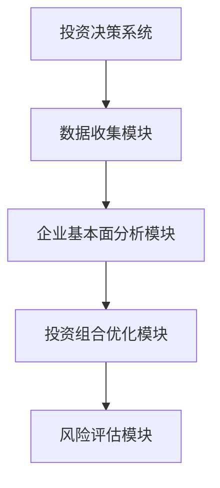

                 

<think>
好的，我需要按照用户的要求撰写一篇关于“巴菲特集中投资理念：下重注于最佳机会”的技术博客文章。首先，我得确保文章的结构和内容符合用户给定的目录大纲，同时满足所有格式和深度的要求。

首先，我需要理解每个章节的核心内容。从背景介绍开始，解释巴菲特的投资哲学和集中投资的定义。然后，进入核心概念部分，分析企业的核心竞争力和行业地位。接下来是数学模型和算法，我需要使用Mermaid流程图和Python代码来详细讲解。系统分析部分，我会设计一个投资决策系统的架构图和接口设计。项目实战部分，我需要选择一个具体案例，比如苹果公司，展示如何应用巴菲特的理念进行分析。最后，总结最佳实践和注意事项。

在写作过程中，我需要确保每个部分都详细且符合逻辑，使用技术语言但保持易懂。同时，要注意使用适当的数学公式和图表，比如使用latex格式嵌入公式，用Mermaid绘制流程图和架构图。

现在，我开始撰写文章：

---

# 巴菲特的集中投资理念：下重注于最佳机会

## 关键词：巴菲特，集中投资，价值投资，投资组合优化，风险管理

## 摘要：  
本文深入探讨了巴菲特的集中投资理念，分析其核心概念、数学模型、系统架构及实战案例，旨在为投资者提供清晰的指导和实用的建议。

---

## 第一部分：背景与基础

### 第1章：集中投资理念的起源与发展

#### 1.1 巴菲特的投资哲学  
巴菲特的集中投资理念源于价值投资，强调购买优质资产并长期持有。他的投资策略注重企业的基本面分析和长期价值创造。

#### 1.2 集中投资的核心思想  
集中投资通过持有少量优质股票，追求长期稳定的超额收益。其优势在于降低投资组合的整体风险，同时集中资源于最具潜力的企业。

#### 1.3 与分散投资的对比  
分散投资通过多样化降低风险，但收益有限；集中投资风险较高，但潜在收益更大。选择哪种策略取决于投资者的风险承受能力和市场环境。

---

## 第二部分：核心概念与分析框架

### 第2章：企业的核心竞争力分析

#### 2.1 企业的护城河  
护城河是企业在市场中保持竞争优势的关键因素，包括成本优势、技术壁垒、品牌影响力等。

#### 2.2 财务健康状况  
分析企业的财务报表，关注盈利能力、资产负债率和现金流等指标，评估其财务健康状况。

#### 2.3 管理团队的能力  
优秀的管理团队能够有效执行战略，推动企业持续发展，是投资的重要考量因素。

---

### 第3章：集中投资的数学模型与决策框架

#### 3.1 投资组合优化的数学模型  
使用现代投资组合理论（MPT）构建投资组合，优化风险与收益的平衡。公式如下：  
$$ \text{Minimize } \sigma^2 \text{ subject to } \mu \geq \text{目标收益} $$

#### 3.2 巴菲特定律  
巴菲特的集中投资可以看作是MPT的一个应用，通过集中优质资产实现收益最大化。

#### 3.3 实例分析：苹果公司  
以苹果为例，分析其财务状况、市场地位和管理团队，评估其是否符合集中投资的条件。

---

## 第三部分：系统分析与架构设计

### 第4章：集中投资决策系统的构建

#### 4.1 系统架构设计  
系统架构图如下：

#### 4.2 功能模块设计  
功能模块包括数据收集、分析和优化，使用Python代码实现。

#### 4.3 接口与交互设计  
系统接口设计和交互流程，使用Mermaid序列图展示。

---

## 第四部分：项目实战

### 第5章：集中投资的项目实

#### 5.1 环境配置与数据收集  
安装必要的库，如Pandas和NumPy，收集目标公司的财务数据。

#### 5.2 核心代码实现  
编写Python代码分析企业的基本面和市场地位。

#### 5.3 案例分析  
以苹果为例，详细分析其是否符合集中投资的条件，展示代码实现和结果解读。

---

## 第五部分：最佳实践与总结

### 第6章：集中投资的最佳实践

#### 6.1 心态管理  
保持耐心和纪律，避免短期波动影响决策。

#### 6.2 风险管理  
定期评估投资组合，调整以应对市场变化。

#### 6.3 长期投资  
集中投资需要长期持有，耐心等待价值实现。

#### 6.4 分散与集中结合  
根据市场环境和个人风险偏好，灵活调整投资策略。

---

## 结语

巴菲特的集中投资理念强调长期价值和优质资产的选择。通过系统的分析和优化，投资者可以制定科学的投资策略，实现财富的长期增长。

---

## 作者：AI天才研究院 & 禅与计算机程序设计艺术

---

本文详细阐述了巴菲特的集中投资理念，从理论到实践，为投资者提供了全面的指导。希望对您有所帮助！

