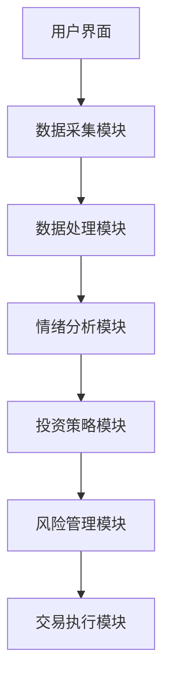
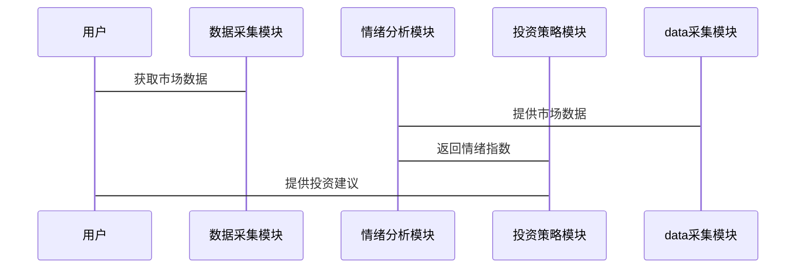

                 


# 市场先生的情绪：价值投资者如何利用市场波动

## 关键词：市场波动、投资者情绪、价值投资、市场情绪指数、投资策略、算法分析、系统架构

## 摘要：本文深入探讨了市场波动与投资者情绪的关系，揭示了如何通过分析市场情绪指数来优化投资策略。文章从市场波动的基本概念出发，逐步分析了市场情绪的定义、分类及其与市场波动的关联。接着，详细讲解了市场情绪指数的构建方法、数学模型及其在投资决策中的应用。通过算法实现、系统架构设计和项目实战，本文展示了如何利用市场情绪数据优化投资策略，并为价值投资者提供了实用的建议和注意事项。

---

# 第一部分：市场波动与投资者情绪的背景介绍

## 第1章：市场波动与投资者情绪概述

### 1.1 市场波动的基本概念

#### 1.1.1 市场波动的定义
市场波动是指市场价格在短时间内发生显著变化的现象，通常由市场参与者的买卖行为、信息传播和情绪变化引起。波动性是市场的重要特征之一，可以用价格的波动幅度和频率来衡量。

#### 1.1.2 市场波动的来源
市场波动的来源主要包括以下几个方面：
1. **市场参与者的买卖行为**：投资者的买卖决策受到情绪、预期和市场信息的影响。
2. **信息传播**：新闻、财报发布、政策变化等信息会迅速影响市场参与者的情绪和行为。
3. **市场结构**：交易机制、市场深度和流动性也会影响价格波动。

#### 1.1.3 市场波动与价值投资的关系
价值投资强调以低于内在价值的价格买入优质资产。市场波动为价值投资者提供了在市场恐慌时买入优质资产的机会，同时也可能因为市场的过度波动导致短期亏损。

---

### 1.2 投资者情绪的影响

#### 1.2.1 投资者情绪的定义
投资者情绪是指投资者在市场中的心理状态，通常表现为乐观、悲观、贪婪或恐惧。情绪会影响投资者的决策，从而对市场价格产生影响。

#### 1.2.2 情绪对市场波动的推动作用
1. **情绪推动价格变化**：投资者情绪的波动会导致买卖行为的变化，进而影响市场价格。
2. **情绪周期与市场周期**：市场情绪通常呈现周期性变化，从乐观到悲观再到乐观，形成市场周期。

#### 1.2.3 情绪周期与市场周期的关联
市场情绪周期与市场周期密切相关。在市场顶部，情绪通常过于乐观；在市场底部，情绪通常过于悲观。投资者可以通过分析情绪周期来判断市场的阶段，并做出相应的投资决策。

---

### 1.3 市场波动与价值投资的核心联系

#### 1.3.1 价值投资的基本原理
价值投资的核心是寻找市场价格低于内在价值的资产。市场价格受市场波动影响，因此市场波动为价值投资者提供了机会。

#### 1.3.2 市场波动为价值投资者带来的机会
1. **恐慌性抛售**：当市场恐慌时，优质资产的价格可能被低估，为价值投资者提供了买入机会。
2. **过度波动后的回归**：市场价格通常会回归其内在价值，波动为价值投资者提供了长期盈利的机会。

#### 1.3.3 如何利用市场波动实现长期收益
价值投资者应关注市场的长期趋势，避免被短期波动干扰。通过分析市场波动和情绪变化，投资者可以更好地把握投资机会。

---

## 第2章：市场情绪指数的构建与分析

### 2.1 市场情绪指数的定义与分类

#### 2.1.1 情绪指数的定义
市场情绪指数是衡量市场参与者情绪的指标，通常通过价格、交易量和投资者行为等数据计算得出。

#### 2.1.2 常见的情绪指数类型
1. **恐慌指数（VIX指数）**：反映市场波动性的指标，被称为“恐慌指数”。
2. **投资者情绪指数（IWM）**：通过投资者行为数据计算得出的市场情绪指标。

#### 2.1.3 情绪指数的计算方法
市场情绪指数的计算方法通常包括以下步骤：
1. **数据采集**：收集价格、交易量、投资者 sentiment 等数据。
2. **数据处理**：对数据进行标准化和归一化处理。
3. **指数计算**：根据公式计算情绪指数。

---

### 2.2 市场情绪指数的数学模型

#### 2.2.1 情绪指数的计算公式
$$ 情绪指数 = \frac{\sum_{i=1}^{n} w_i \cdot s_i}{\sum_{i=1}^{n} w_i} $$
其中，\( w_i \) 是第 \( i \) 项情绪指标的权重，\( s_i \) 是第 \( i \) 项情绪指标的值。

#### 2.2.2 情绪指数的属性特征对比
| 属性 | 情绪指数 | 市场波动 |
|------|----------|----------|
| 定义 | 衡量市场参与者情绪的指标 | 衡量市场价格波动的幅度和频率 |
| 计算方法 | 基于情绪指标的加权平均 | 基于价格波动的统计分析 |
| 应用 | 投资者情绪分析 | 投资决策和风险管理 |

---

### 2.3 市场情绪指数与市场波动的关系

#### 2.3.1 情绪指数与市场波动的正相关性
当市场情绪高涨时，市场波动通常较大；当市场情绪低迷时，市场波动通常较小。

#### 2.3.2 情绪指数的周期性分析
市场情绪指数通常呈现周期性变化，与市场周期密切相关。投资者可以通过分析情绪指数的周期性来判断市场的阶段。

#### 2.3.3 情绪指数的预警作用
市场情绪指数可以作为市场风险的预警指标。当情绪指数达到极端值时，可能预示着市场的转折点。

---

## 第3章：市场情绪与投资策略的算法实现

### 3.1 市场情绪分析的算法实现

#### 3.1.1 基于文本的情绪分析
1. **数据采集**：收集新闻、社交媒体和投资者评论等文本数据。
2. **文本处理**：进行分词、去停用词和情感分析。
3. **情绪分类**：通过机器学习算法对文本进行情绪分类。

#### 3.1.2 基于价格波动的情绪分析
1. **数据采集**：收集市场价格和交易量数据。
2. **指标计算**：计算波动率、交易量变化率等指标。
3. **情绪分类**：根据指标变化判断市场情绪。

#### 3.1.3 基于交易量的情绪分析
1. **交易量分析**：通过分析交易量的变化判断市场情绪。
2. **成交量与价格关系**：结合价格和交易量判断市场的强弱。

---

### 3.2 市场情绪分析的数学模型

#### 3.2.1 情绪强度的计算公式
$$ 情绪强度 = \frac{V_i}{V_{\text{avg}}} $$
其中，\( V_i \) 是某一时点的交易量，\( V_{\text{avg}} \) 是平均交易量。

#### 3.2.2 情绪周期的识别算法
$$ 周期长度 = \frac{\text{时间窗口长度}}{\text{周期数}} $$

---

### 3.3 市场情绪分析的算法流程

#### 3.3.1 数据采集与预处理
1. **数据来源**：收集价格、交易量、新闻和社交媒体数据。
2. **数据清洗**：去除噪声数据和异常值。
3. **数据标准化**：对数据进行标准化处理。

#### 3.3.2 情绪指标的计算
1. **计算波动率**：使用标准差公式计算价格波动率。
2. **计算交易量变化率**：分析交易量的变化趋势。
3. **综合情绪指数**：结合多个指标计算综合情绪指数。

#### 3.3.3 投资决策
1. **情绪指数与投资策略**：根据情绪指数调整投资策略。
2. **风险管理**：通过情绪指数进行风险管理。

---

## 第4章：系统架构与实现

### 4.1 系统功能设计

#### 4.1.1 数据采集模块
1. **数据来源**：接口API、数据库。
2. **数据类型**：价格、交易量、新闻、社交媒体。

#### 4.1.2 情绪分析模块
1. **算法选择**：基于文本的情绪分析和基于价格的情绪分析。
2. **功能实现**：计算情绪指数。

#### 4.1.3 投资策略模块
1. **策略制定**：根据情绪指数调整投资策略。
2. **策略执行**：生成买卖信号。

#### 4.1.4 风险管理模块
1. **风险评估**：根据情绪指数评估市场风险。
2. **风险管理策略**：动态调整仓位和止损点。

---

### 4.2 系统架构设计



---

### 4.3 系统接口设计

#### 4.3.1 数据接口
1. **数据获取接口**：从API获取实时数据。
2. **数据存储接口**：将数据存储到数据库。

#### 4.3.2 情绪分析接口
1. **情绪指数计算接口**：返回综合情绪指数。
2. **情绪周期识别接口**：返回情绪周期信息。

---

### 4.4 系统交互设计



---

## 第5章：项目实战与优化

### 5.1 环境安装与配置

#### 5.1.1 环境安装
1. **安装Python**：下载并安装Python。
2. **安装依赖库**：安装pandas、numpy、scikit-learn、requests等库。

#### 5.1.2 数据源配置
1. **API接口**：配置金融数据API。
2. **数据库**：配置本地数据库。

---

### 5.2 核心实现代码

#### 5.2.1 情绪指数计算代码
```python
import pandas as pd
import numpy as np

def calculate_emotion_index(prices, volumes):
    # 计算波动率
    volatility = np.std(prices)
    # 计算交易量变化率
    volume_change = volumes.pct_change().mean()
    # 计算情绪指数
    emotion_index = (volatility + volume_change) / 2
    return emotion_index

# 示例数据
prices = pd.Series([100, 105, 98, 102, 101])
volumes = pd.Series([1000, 1200, 900, 1500, 1100])
emotion_index = calculate_emotion_index(prices, volumes)
print(f"情绪指数为：{emotion_index}")
```

#### 5.2.2 交易信号生成代码
```python
def generate_signals(emotion_index, threshold):
    signals = []
    for idx, value in enumerate(emotion_index):
        if value > threshold:
            signals.append(1)
        else:
            signals.append(0)
    return signals

# 示例
emotion_index = [0.6, 0.7, 0.5, 0.8, 0.4]
threshold = 0.6
signals = generate_signals(emotion_index, threshold)
print(f"生成的交易信号为：{signals}")
```

---

### 5.3 优化与改进

#### 5.3.1 数据源优化
1. **多数据源融合**：结合价格、新闻和社交媒体数据。
2. **数据频率优化**：调整数据采集频率，提高计算效率。

#### 5.3.2 算法优化
1. **模型优化**：使用更复杂的机器学习模型，如LSTM。
2. **参数优化**：调整算法参数，提高情绪指数的准确性。

---

## 第6章：总结与展望

### 6.1 总结

通过本文的分析，我们了解了市场波动与投资者情绪的关系，学习了市场情绪指数的构建方法，并探讨了如何利用市场情绪数据优化投资策略。市场情绪指数是价值投资者的重要工具，可以帮助投资者更好地把握市场机会。

---

### 6.2 展望

未来，随着人工智能和大数据技术的发展，市场情绪分析将更加精准和高效。投资者可以通过更复杂的情绪分析算法和实时数据源，进一步优化投资策略，提高投资收益。

---

## 作者：AI天才研究院/AI Genius Institute & 禅与计算机程序设计艺术 /Zen And The Art of Computer Programming

