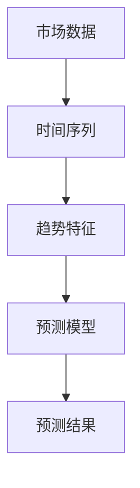
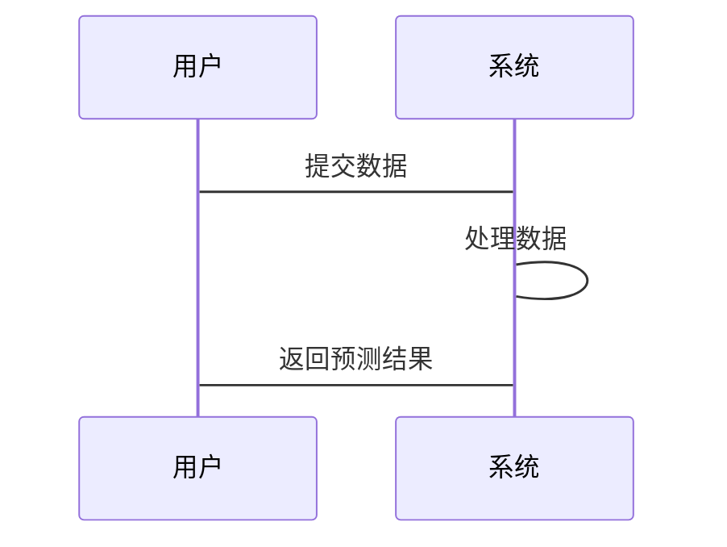

                 


# 市场趋势预测模型

## 关键词：
市场趋势预测，机器学习，时间序列分析，算法原理，系统架构

## 摘要：
市场趋势预测是数据分析和人工智能领域的重要应用之一，通过对历史数据的分析和建模，可以有效地预测未来的市场走向。本文将详细介绍市场趋势预测模型的核心概念、算法原理、系统架构设计以及实际项目中的应用，帮助读者全面理解并掌握市场趋势预测的方法和技术。

---

## 第一部分: 市场趋势预测模型概述

### 第1章: 市场趋势预测模型的背景与概念

#### 1.1 市场趋势预测的背景与重要性
- 市场趋势预测的定义与核心概念
  - 市场趋势：市场的变化方向和强度，包括价格、需求、竞争格局等。
  - 预测模型：基于历史数据和算法，预测未来市场走向的工具。
- 市场趋势预测的必要性与应用场景
  - 企业战略规划：帮助企业在复杂市场环境中制定科学决策。
  - 投资决策：投资者通过预测模型优化资产配置。
  - 市场风险控制：提前识别潜在风险，降低损失。
- 市场趋势预测的边界与外延
  - 数据范围：时间序列数据、市场指标、行业数据等。
  - 预测范围：短期预测、中期预测和长期预测。
  - 外部因素：政策变化、经济周期、技术进步等。

#### 1.2 市场趋势预测模型的基本原理
- 数据驱动与模型构建的关系
  - 数据是模型的基础，模型是数据规律的总结。
- 市场趋势预测模型的核心要素与组成
  - 数据源：市场数据、行业数据、宏观经济指标。
  - 特征提取：将原始数据转化为模型的输入特征。
  - 模型训练：基于历史数据训练模型。
  - 预测输出：模型对未来市场的预测结果。
- 模型的输入、输出与目标函数
  - 输入：市场数据、时间序列特征。
  - 输出：未来市场的预测值或趋势。
  - 目标函数：最小化预测误差，最大化模型准确率。

### 第2章: 市场趋势预测的核心概念与联系

#### 2.1 数据与市场的关系
- 数据的来源与分类
  - 历史数据：过去市场的价格、交易量等。
  - 实时数据：当前市场的动态数据。
  - 行为数据：用户行为、交易记录等。
- 数据特征与市场趋势的关系
  - 时间依赖性：市场具有时间序列特性。
  - 趋势性：市场数据呈现长期趋势。
  - 周期性：市场受季节性或周期性因素影响。
- 数据驱动的市场分析方法
  - 统计分析：描述性分析、回归分析。
  - 数据可视化：通过图表展示市场趋势。

#### 2.2 市场趋势预测的核心概念模型
- 核心概念模型的ER实体关系图


#### 2.3 市场趋势预测的核心算法原理
- 时间序列分析的基本原理
  - 时间序列数据的特点：趋势、周期、随机性。
  - 时间序列分析的目标：提取趋势和周期成分，预测未来值。

---

## 第二部分: 市场趋势预测模型的算法原理

### 第3章: 时间序列分析算法

#### 3.1 ARIMA模型的原理与实现
- ARIMA模型的定义
  - ARIMA（自回归积分滑动平均模型）。
- ARIMA模型的三个参数
  - p：自回归阶数。
  - d：差分阶数。
  - q：滑动平均阶数。
- ARIMA模型的实现步骤
  1. 数据平稳化。
  2. 参数估计。
  3. 模型预测。

#### 3.2 LSTM模型的原理与实现
- LSTM（长短期记忆网络）。
- LSTM的优势
  - 能够捕捉长期依赖关系。
- LSTM的结构
  - 输入门、遗忘门、输出门。
- LSTM模型的实现步骤
  1. 数据预处理。
  2. 模型构建。
  3. 模型训练。
  4. 模型预测。

#### 3.3 Prophet模型的原理与实现
- Prophet模型的定义
  - 基于时间序列的 prophet 模型。
- Prophet模型的优势
  - 易用性强，适合非统计背景的用户。
- Prophet模型的实现步骤
  1. 数据准备。
  2. 模型训练。
  3. 模型预测。

### 第4章: 机器学习模型在市场趋势预测中的应用

#### 4.1 线性回归模型的原理与实现
- 线性回归模型的定义
  - 线性回归用于预测连续型变量。
- 线性回归模型的实现步骤
  1. 数据收集。
  2. 数据预处理。
  3. 模型训练。
  4. 模型评估。

#### 4.2 支持向量机（SVM）的原理与实现
- SVM模型的定义
  - 支持向量机用于分类和回归问题。
- SVM模型的实现步骤
  1. 数据收集。
  2. 数据预处理。
  3. 模型训练。
  4. 模型评估。

#### 4.3 随机森林模型的原理与实现
- 随机森林模型的定义
  - 集成学习方法，基于决策树的投票结果进行预测。
- 随机森林模型的实现步骤
  1. 数据收集。
  2. 数据预处理。
  3. 模型训练。
  4. 模型评估。

### 第5章: 集成学习与模型优化

#### 5.1 集成学习的基本原理
- 集成学习的定义
  - 将多个弱模型集成，形成强模型。
- 集成学习的方法
  - 并行集成：多个模型并行预测。
  - 串行集成：基于前一个模型结果的后处理。

#### 5.2 模型调优与优化方法
- 参数优化
  - 使用网格搜索或随机搜索进行参数优化。
- 模型优化
  - 增加数据量、调整模型结构、优化训练策略。

#### 5.3 超参数优化与网格搜索
- 超参数的定义
  - 模型的超参数，如学习率、树的深度等。
- 网格搜索的实现
  - 通过遍历所有可能的超参数组合，找到最优参数。

---

## 第三部分: 市场趋势预测模型的系统架构设计

### 第6章: 系统功能设计

#### 6.1 系统功能模块
- 数据输入模块
  - 负责接收市场数据。
- 数据处理模块
  - 数据清洗、特征提取。
- 模型训练模块
  - 模型训练、参数优化。
- 预测输出模块
  - 输出预测结果。

#### 6.2 系统架构设计
- 分层架构
  - 数据层、业务逻辑层、表现层。
- 微服务架构
  - 数据服务、模型服务、预测服务。

### 第7章: 系统接口设计

#### 7.1 数据接口
- 数据输入接口
  - REST API 接收市场数据。
- 数据输出接口
  - 返回处理后的特征数据。

#### 7.2 模型接口
- 模型训练接口
  - REST API 启动模型训练。
- 模型预测接口
  - REST API 获取预测结果。

### 第8章: 系统交互设计

#### 8.1 用户交互流程
- 用户输入数据。
- 系统处理数据并训练模型。
- 系统返回预测结果。

#### 8.2 系统交互图


---

## 第四部分: 项目实战

### 第9章: 项目实战

#### 9.1 数据收集与预处理
- 数据来源
  - 例如，使用股票价格数据。
- 数据清洗
  - 处理缺失值、异常值。
- 特征工程
  - 提取时间特征、技术指标。

#### 9.2 模型实现
- 选择模型
  - 例如，选择LSTM模型。
- 模型实现
  ```python
  import numpy as np
  import pandas as pd
  from keras.models import Sequential
  from keras.layers import LSTM, Dense
  # 数据预处理
  data = pd.read_csv('market_data.csv')
  # 划分训练集和测试集
  train_data = data.iloc[:700]
  test_data = data.iloc[700:]
  # 构建数据集
  x_train = train_data.drop('target', axis=1).values
  y_train = train_data['target'].values
  x_test = test_data.drop('target', axis=1).values
  y_test = test_data['target'].values
  # 模型构建
  model = Sequential()
  model.add(LSTM(50, input_shape=(x_train.shape[1], 1)))
  model.add(Dense(1))
  model.compile(optimizer='adam', loss='mean_squared_error')
  # 模型训练
  model.fit(x_train, y_train, epochs=50, batch_size=32)
  # 模型预测
  predictions = model.predict(x_test)
  ```

#### 9.3 模型评估与优化
- 评估指标
  - �均方误差（MSE）、平均绝对误差（MAE）、R平方值。
- 模型优化
  - 调整模型参数、优化训练策略。

### 第10章: 总结与展望

#### 10.1 总结
- 本文详细介绍了市场趋势预测模型的核心概念、算法原理和系统架构设计。
- 通过实际案例展示了模型的应用和实现过程。

#### 10.2 展望
- 随着人工智能技术的发展，市场趋势预测模型将更加智能化和精准化。
- 结合更多的数据源和算法，预测模型将具有更广泛的应用场景。

---

## 作者：AI天才研究院 & 禅与计算机程序设计艺术

---

本文通过系统地分析市场趋势预测模型的各个方面，帮助读者全面理解并掌握市场趋势预测的方法和技术。从理论到实践，从算法到系统设计，本文为读者提供了丰富的知识和实用的代码示例。希望本文能为市场趋势预测领域的研究和应用提供有价值的参考。

