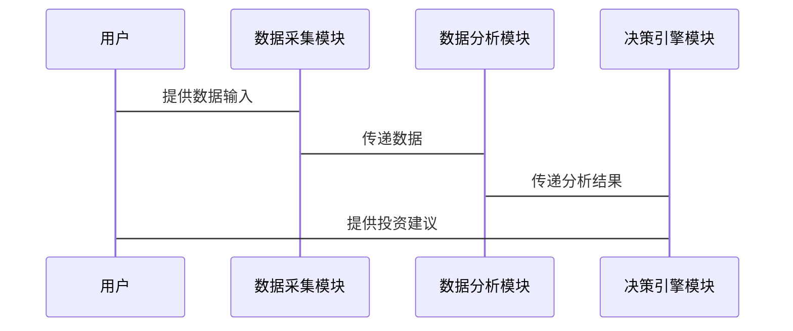

                 


# 布鲁斯·伯克维茨的集中型价值投资：深度研究的重要性

## 关键词：
布鲁斯·伯克维茨、集中型价值投资、深度研究、投资策略、价值评估、投资组合管理

## 摘要：
集中型价值投资是一种以深度研究为基础，通过集中投资于少数优质企业来实现长期超额收益的投资策略。本文将从集中型价值投资的核心概念、数学模型、系统分析、项目实战等多个方面，详细阐述深度研究在集中型价值投资中的重要性，并通过具体案例分析，帮助读者更好地理解这一投资策略的应用和实践。

---

# 第一部分: 集中型价值投资的背景与核心概念

## 第1章: 价值投资的概述与集中投资的意义

### 1.1 价值投资的基本概念

#### 1.1.1 投资的定义与分类
投资是指将资金投入到某一资产或项目中，以期在未来获得收益或资本增值的行为。根据投资对象的不同，可以将投资分为股票投资、债券投资、房地产投资等。

#### 1.1.2 价值投资的核心理念
价值投资是一种以基本面分析为基础的投资策略，强调以低于内在价值的价格买入优质资产。其核心理念是通过深入研究企业的财务状况、行业地位和未来前景，找到被市场低估的投资标的。

#### 1.1.3 集中投资的定义与特点
集中投资是指将大部分资金投入到少数几只股票或资产中，以期获得更高的收益。其特点是投资标的少、集中度高、风险与收益并存。

### 1.2 集中型投资的背景与意义

#### 1.2.1 集中投资的历史发展
集中投资的理念可以追溯到20世纪30年代，本杰明·格雷厄姆和戴维·多德首次系统地提出了价值投资理论。布鲁斯·伯克维茨在这一理论的基础上，进一步发展了集中型价值投资策略。

#### 1.2.2 集中投资在现代投资中的地位
在现代投资实践中，集中投资逐渐成为一种重要的策略，尤其是在市场波动加剧和优质资产稀缺的情况下，集中投资能够帮助投资者更精准地捕捉到具有长期竞争优势的企业。

#### 1.2.3 集中投资的优势与风险
- **优势**：集中投资能够减少决策的复杂性，降低交易成本，同时更容易聚焦于少数优质企业。
- **风险**：集中投资的风险在于市场的波动性和单一投资标的的不确定性。

### 1.3 深度研究的重要性

#### 1.3.1 深度研究的定义与目标
深度研究是指对投资标的的财务状况、行业地位、竞争优势和未来前景进行全面、细致的分析，以发现其内在价值和投资机会。

#### 1.3.2 深度研究在价值投资中的作用
深度研究是集中型价值投资的核心，它能够帮助投资者准确评估企业的内在价值，识别市场低估的机会，并制定合理的投资策略。

#### 1.3.3 深度研究的方法与工具
- **方法**：包括基本面分析、行业分析和竞争对手分析。
- **工具**：如财务报表分析、估值模型和行业研究报告。

## 1.4 本章小结
集中型价值投资是一种以深度研究为基础的投资策略，其核心在于通过集中投资于少数优质企业，实现长期的超额收益。深度研究是确保投资成功的关键，它能够帮助投资者准确评估企业的内在价值，识别市场低估的机会。

---

## 第2章: 集中型价值投资的核心概念与原理

### 2.1 投资决策的核心要素

#### 2.1.1 企业的内在价值
企业的内在价值是指其未来现金流的现值，是衡量企业价值的核心指标。计算公式为：
$$内在价值 = \frac{未来现金流的现值}{增长率}$$

#### 2.1.2 市场价格的波动性
市场价格是投资者实际购买或出售资产的价格，它受到市场情绪、市场流动性等多种因素的影响。

#### 2.1.3 安全边际的概念
安全边际是指内在价值与市场价格之间的差额，即：
$$安全边际 = 内在价值 - 市场价格$$
安全边际越大，投资的风险越小。

### 2.2 集中投资的数学模型与公式

#### 2.2.1 内在价值的计算公式
$$内在价值 = \frac{自由现金流}{加权平均资本成本}$$

#### 2.2.2 安全边际的计算方法
$$安全边际 = 内在价值 - 市场价格$$

#### 2.2.3 集中度的衡量指标
$$集中度 = \frac{前几只股票的权重之和}{总权重}$$

### 2.3 集中投资与分散投资的对比分析

| 投资策略 | 优点 | 缺点 |
|----------|------|------|
| 集中投资 | 高收益潜力 | 高风险 |
| 分散投资 | 低风险 | 收益潜力有限 |

### 2.4 本章小结
集中型价值投资的核心在于通过深度研究，准确评估企业的内在价值，并利用安全边际的概念，选择具有长期竞争优势的企业进行投资。其数学模型和公式为投资决策提供了科学依据。

---

## 第3章: 深度研究的方法与实践

### 3.1 深度研究的基本步骤

#### 3.1.1 确定研究目标
明确研究的目标和范围，例如选择哪些行业或企业作为研究对象。

#### 3.1.2 数据收集与整理
收集企业的财务报表、行业报告、竞争对手信息等数据，并进行整理和分析。

#### 3.1.3 数据分析与评估
通过财务指标分析、估值模型和行业趋势分析，评估企业的内在价值和投资潜力。

### 3.2 财务指标分析与企业估值

#### 3.2.1 主要财务指标的计算公式
- 市盈率：
$$市盈率 = \frac{股价}{每股收益}$$
- 市净率：
$$市净率 = \frac{股价}{每股净资产}$$

#### 3.2.2 企业估值模型的构建
$$DCF模型 = \frac{未来现金流的现值}{折现率}$$

### 3.3 行业分析与竞争优势评估

#### 3.3.1 行业生命周期分析
分析行业所处的生命周期阶段，例如成熟期或衰退期，以评估行业的增长潜力。

#### 3.3.2 企业竞争优势的评估
评估企业在行业中的竞争优势，例如成本优势、技术优势或品牌优势。

#### 3.3.3 行业趋势对投资决策的影响
行业趋势是影响企业价值的重要因素，例如政策变化、技术进步等。

### 3.4 案例分析: 苹果公司的深度研究

#### 3.4.1 研究背景
苹果公司是全球最具价值的企业之一，其产品和技术优势使其成为集中投资的理想标的。

#### 3.4.2 数据收集与分析
收集苹果公司的财务报表、产品销量、研发投入等数据，并进行详细分析。

#### 3.4.3 投资决策
通过深度研究，发现苹果公司的内在价值被市场低估，决定集中投资于该公司。

### 3.5 本章小结
深度研究是集中型价值投资的关键，它通过对企业财务状况、行业地位和竞争优势的全面分析，帮助投资者找到具有长期投资价值的企业。

---

## 第4章: 集中型价值投资的系统分析与架构设计

### 4.1 系统功能设计

#### 4.1.1 数据采集模块
负责收集企业的财务数据、行业报告等信息。

#### 4.1.2 数据分析模块
对收集到的数据进行清洗、分析和建模，计算企业的内在价值和安全边际。

#### 4.1.3 决策引擎模块
根据分析结果，生成投资建议，如买入、卖出或持有。

### 4.2 系统架构设计


### 4.3 系统接口设计
系统接口包括数据输入接口和投资决策输出接口。

### 4.4 系统交互设计



### 4.5 本章小结
集中型价值投资的系统架构设计为投资者提供了一个高效的投资决策支持系统，通过数据采集、分析和决策生成，帮助投资者实现集中投资的目标。

---

## 第5章: 项目实战——集中型价值投资的实践

### 5.1 环境配置
安装必要的数据分析工具和编程语言，例如Python、Pandas、Matplotlib等。

### 5.2 核心实现

#### 5.2.1 数据处理
```python
import pandas as pd
df = pd.read_csv('data.csv')
print(df.head())
```

#### 5.2.2 模型实现
```python
def calculate_intrinsic_value(FCF, WACC):
    return FCF / WACC
```

#### 5.2.3 数据可视化
```python
import matplotlib.pyplot as plt
plt.plot(data)
plt.show()
```

### 5.3 案例分析
以苹果公司为例，分析其财务数据和行业地位，计算其内在价值和安全边际。

### 5.4 本章小结
通过项目实战，投资者可以将集中型价值投资的理论应用于实际操作中，掌握数据分析和投资决策的核心技能。

---

## 第6章: 最佳实践与总结

### 6.1 本章小结
集中型价值投资是一种以深度研究为基础的投资策略，其核心在于通过集中投资于少数优质企业，实现长期的超额收益。

### 6.2 注意事项
- 集中投资需要谨慎选择投资标的，避免过度集中。
- 深度研究是投资决策的关键，必须注重数据的准确性和分析的全面性。

### 6.3 拓展阅读
推荐阅读布鲁斯·伯克维茨的经典著作，深入理解集中型价值投资的理论与实践。

### 6.4 本章小结
通过本文的系统讲解和案例分析，读者可以全面理解集中型价值投资的核心理念和实践方法。

---

## 作者：AI天才研究院/AI Genius Institute & 禅与计算机程序设计艺术 /Zen And The Art of Computer Programming

---

通过以上结构，文章系统地介绍了集中型价值投资的背景、核心概念、数学模型、系统分析和项目实战，帮助读者全面理解这一投资策略的深度研究的重要性。

