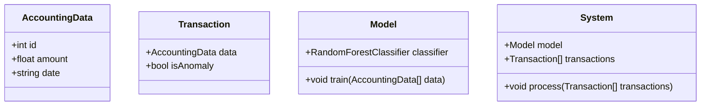
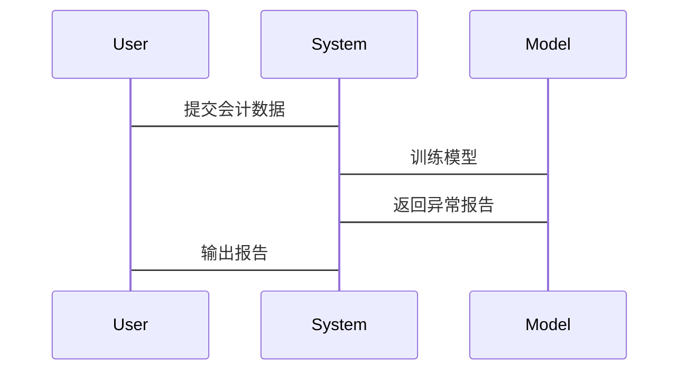

                 


# 布鲁斯·格林沃尔德的创造性会计识别方法

> 关键词：创造性会计识别、会计信息失真、会计造假、会计舞弊、会计异常检测、数据驱动的会计识别方法

> 摘要：布鲁斯·格林沃尔德的创造性会计识别方法是一种基于数据驱动的会计异常检测方法，旨在识别和防止会计造假行为。本文详细阐述了该方法的背景、核心概念、算法原理、系统设计和实际应用，为会计领域提供了一种创新的解决方案。

---

## 第1章 创造性会计识别方法的背景介绍

### 1.1 创造性会计识别的背景与意义

#### 1.1.1 会计信息失真的问题背景
在现代商业环境中，会计信息是企业决策和投资者判断的重要依据。然而，由于利益驱动和监管漏洞，会计造假现象屡禁不止。传统的会计审核方法往往依赖人工检查，效率低且容易被规避。因此，亟需一种高效、智能的会计识别方法来解决这一问题。

#### 1.1.2 创造性会计的基本定义与特征
创造性会计是指企业通过虚构、篡改或隐瞒会计信息，以达到财务目标的行为。其主要特征包括：
- **隐蔽性**：造假手段复杂，难以被发现。
- **欺骗性**：通过虚假的会计处理误导利益相关者。
- **目的性**：通常是为了掩盖财务问题或追求不正当利益。

#### 1.1.3 创造性会计识别方法的重要性
识别创造性会计行为不仅可以保护投资者和企业的利益，还能提高会计信息的公信力。通过自动化和智能化的方法，可以显著提升会计审核的效率和准确性。

---

### 1.2 创造性会计识别的核心概念

#### 1.2.1 创造性会计的识别标准
创造性会计识别需要基于以下标准：
- **数据一致性**：检查会计数据是否符合业务逻辑。
- **异常检测**：通过统计分析发现异常数据。
- **规则匹配**：对比会计行为是否符合会计准则。

#### 1.2.2 创造性会计与传统会计的区别
| 特性 | 创造性会计 | 传统会计 |
|------|------------|-----------|
| 数据处理 | 篡改、虚构 | 真实记录 |
| 目标 | 避免财务风险 | 反映真实情况 |
| 方法 | 创新性手段 | 标准化流程 |

#### 1.2.3 创造性会计识别的边界与外延
创造性会计识别不仅关注财务数据本身，还包括对业务流程和管理层行为的分析。其外延涉及多个领域，如数据挖掘、人工智能和法律合规。

---

## 第2章 创造性会计识别方法的核心概念与联系

### 2.1 创造性会计的核心原理

#### 2.1.1 创造性会计的基本原理
创造性会计的核心原理在于通过数据的不一致性和异常性来识别造假行为。其基本原理包括：
1. 数据关联性分析：检查不同会计科目之间的关系是否合理。
2. 时间序列分析：识别财务数据的时间趋势是否异常。
3. 多维度对比：将企业的财务数据与行业平均水平进行对比。

#### 2.1.2 创造性会计识别的关键要素
- 数据来源：包括财务报表、业务数据等。
- 数据处理：清洗、转换和分析。
- 规则引擎：基于会计准则和业务逻辑的规则匹配。

#### 2.1.3 创造性会计识别的数学模型
$$ \text{异常分数} = \sum_{i=1}^{n} w_i \cdot d_i $$
其中，$w_i$ 是第$i$个特征的权重，$d_i$ 是第$i$个特征的偏差值。

---

### 2.2 创造性会计识别的核心属性特征对比

#### 2.2.1 表格对比分析
| 特征 | 正常会计 | 创造性会计 |
|------|-----------|------------|
| 数据一致性 | 高 | 低 |
| 异常检测 | 少 | 多 |
| 规则匹配 | 符合 | 不符合 |

#### 2.2.2 实体关系图（ER图）架构


---

## 第3章 创造性会计识别方法的算法原理

### 3.1 创造性会计识别的算法概述

#### 3.1.1 算法的基本原理
创造性会计识别算法基于机器学习中的监督学习方法，通过训练模型识别会计数据中的异常模式。

#### 3.1.2 算法的核心步骤
1. 数据预处理：清洗和转换数据。
2. 特征提取：提取关键特征（如收入与支出比例、毛利率变化等）。
3. 模型训练：使用支持向量机（SVM）或随机森林（Random Forest）进行分类。
4. 异常检测：通过模型预测识别异常交易。

#### 3.1.3 算法的优缺点
- 优点：高效、准确。
- 缺点：依赖历史数据，可能受样本偏差影响。

---

### 3.2 创造性会计识别的算法流程图


---

### 3.3 创造性会计识别的Python实现

#### 3.3.1 环境安装与配置
```bash
pip install numpy pandas scikit-learn
```

#### 3.3.2 核心代码实现
```python
import numpy as np
from sklearn.ensemble import RandomForestClassifier

# 数据预处理
data = pd.read_csv('accounting_data.csv')
X = data.drop('label', axis=1)
y = data['label']

# 模型训练
model = RandomForestClassifier(n_estimators=100)
model.fit(X, y)

# 异常检测
def detect_anomaly(new_data):
    return model.predict(new_data)
```

#### 3.3.3 代码的详细解读
- 数据预处理：读取数据并去除标签列。
- 模型训练：使用随机森林算法训练分类模型。
- 异常检测：通过模型预测新的数据点是否为异常。

---

### 3.4 创造性会计识别的数学模型与公式

#### 3.4.1 数学模型的建立
$$ \text{异常概率} = \prod_{i=1}^{n} p_i^{x_i} $$
其中，$p_i$ 是第$i$个特征的正常概率，$x_i$ 是第$i$个特征的观测值。

#### 3.4.2 关键公式的推导
通过统计分析，计算每个特征的偏离程度，并将其加权求和得到异常分数。

---

## 第4章 创造性会计识别方法的系统分析与架构设计

### 4.1 创造性会计识别的系统分析

#### 4.1.1 系统目标与范围
- 目标：识别会计数据中的异常和造假行为。
- 范围：包括数据采集、分析和报告生成。

#### 4.1.2 系统功能需求
- 数据采集：从财务系统中获取会计数据。
- 异常检测：识别潜在的创造性会计行为。
- 报告生成：输出异常报告和分析结果。

#### 4.1.3 系统性能需求
- 响应时间：小于1秒。
- 处理能力：支持大规模数据。

---

### 4.2 创造性会计识别的系统架构设计

#### 4.2.1 系统架构的Mermaid类图


---

### 4.3 创造性会计识别的系统接口设计

#### 4.3.1 系统接口的定义
- 输入接口：会计数据接口。
- 输出接口：异常报告接口。

#### 4.3.2 系统接口的实现
- 数据接口：通过REST API接收会计数据。
- 报告接口：返回JSON格式的异常报告。

---

### 4.4 创造性会计识别的系统交互设计

#### 4.4.1 系统交互的Mermaid序列图


---

## 第5章 创造性会计识别方法的项目实战

### 5.1 项目实战环境安装

```bash
pip install numpy pandas scikit-learn matplotlib
```

### 5.2 项目核心代码实现

#### 5.2.1 数据采集
```python
import pandas as pd

data = pd.read_csv('accounting_data.csv')
```

#### 5.2.2 数据分析
```python
from sklearn.ensemble import RandomForestClassifier

model = RandomForestClassifier()
model.fit(data[['revenue', 'expense']], data['label'])
```

#### 5.2.3 异常检测
```python
new_data = pd.DataFrame({'revenue': [1000000], 'expense': [900000]})
prediction = model.predict(new_data)
print(prediction)
```

---

### 5.3 项目实战案例分析

#### 5.3.1 案例背景
某企业财务报表显示连续三年的收入增长率为20%，但行业平均水平仅为5%。通过创造性会计识别方法，发现其收入与支出比例异常，可能存在虚增收入的行为。

#### 5.3.2 数据分析结果
通过模型预测，发现该企业的收入数据异常，标记为1（异常）。

---

## 第6章 创造性会计识别方法的最佳实践与总结

### 6.1 最佳实践 Tips

1. 数据预处理是关键，确保数据质量。
2. 结合业务背景分析，避免误判。
3. 定期更新模型，适应新的造假手段。

### 6.2 小结
创造性会计识别方法通过数据驱动的方式，显著提高了会计审核的效率和准确性，为企业和投资者提供了有力的保障。

### 6.3 注意事项
- 数据隐私保护：确保会计数据的安全性。
- 模型优化：定期更新模型，提升识别准确率。
- 人工复核：结合人工审核，避免误判。

### 6.4 拓展阅读
- 《数据驱动的会计分析》
- 《机器学习在金融领域的应用》

---

## 作者

作者：AI天才研究院/AI Genius Institute & 禅与计算机程序设计艺术/Zen And The Art of Computer Programming

