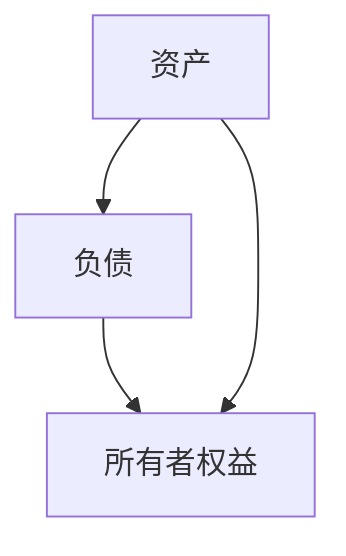
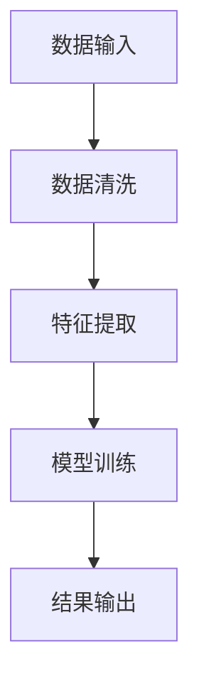
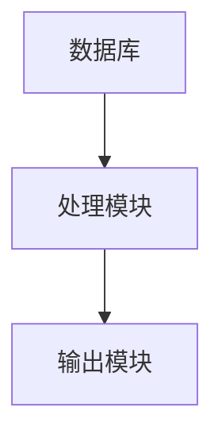
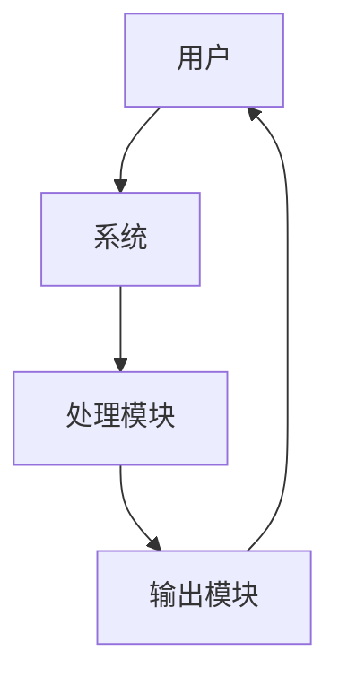

                 


# 布鲁斯·格林沃尔德的隐蔽价值：发掘资产负债表中的秘密

**关键词：** 资产负债表、隐蔽价值、企业价值、财务分析、格林沃尔德模型

**摘要：** 本文深入探讨了如何识别和评估资产负债表中的隐蔽价值，通过分析资产、负债和所有者权益，结合实际案例和数学模型，揭示企业潜在的价值增长点。文章从背景介绍、核心概念、算法原理、系统分析到项目实战，层层递进，为企业价值评估提供新的视角和方法。

---

# 第一部分：背景介绍

## 第1章：隐蔽价值的概念与背景

### 1.1 财务报表的基础知识

#### 1.1.1 资产负债表的基本结构
资产负债表是企业财务状况的静态反映，由资产、负债和所有者权益三部分组成。资产包括流动资产（现金、应收账款等）和非流动资产（固定资产、无形资产等），负债包括流动负债（应付账款、短期借款）和非流动负债（长期借款、债券等），所有者权益则是资产减去负债后的剩余部分。

#### 1.1.2 资产负债表的核心要素
- **资产：** 企业拥有的资源，能够为企业带来经济利益。
- **负债：** 企业承担的债务，需在未来偿还。
- **所有者权益：** 企业净资产，反映股东对企业的所有权。

#### 1.1.3 财务报表的编制与审计
财务报表需遵循会计准则，确保真实性和准确性。审计机构对报表进行独立审核，确保其公允性。

### 1.2 隐蔽价值的定义与背景

#### 1.2.1 隐蔽价值的概念
隐蔽价值是指隐藏在资产负债表中的潜在价值，通常未在账面价值中体现，可能源于资产低估、负债高估或所有者权益的隐含价值。

#### 1.2.2 隐蔽价值的发现意义
发现隐蔽价值有助于提升企业估值，优化资本结构，为投资者和管理层提供决策支持。

#### 1.2.3 隐蔽价值的边界与外延
隐蔽价值存在于资产、负债和所有者权益中，但需区分其与显性价值的界限。

### 1.3 隐蔽价值的核心要素

#### 1.3.1 资产的隐含价值
资产可能因市场低估或管理不善而未充分体现其价值。

#### 1.3.2 负债的隐含价值
负债可能因债权人议价能力或条款优惠而低估其实际承担能力。

#### 1.3.3 所有者权益的隐含价值
所有者权益可能因未计量的期权或未来收益而低估。

---

## 第2章：隐蔽价值的核心概念与联系

### 2.1 核心概念原理

#### 2.1.1 资产、负债、所有者权益的关系
三者关系：资产 = 负债 + 所有者权益。

#### 2.1.2 隐蔽价值的评估方法
- **相对法：** 比较分析，寻找差异。
- **绝对法：** 通过模型计算潜在价值。

#### 2.1.3 隐蔽价值的经济意义
优化资本结构，提升企业价值。

### 2.2 核心概念属性特征对比表格

| **项目**       | **资产**          | **负债**          | **所有者权益**      |
|-----------------|-------------------|-------------------|---------------------|
| **属性**        | 可变现性          | 偿债能力          | 所有权与收益权      |
| **隐含价值**     | 可能低估          | 可能高估          | 可能未充分反映        |

### 2.3 ER实体关系图架构



---

# 第二部分：算法原理讲解

## 第3章：隐蔽价值评估的算法原理

### 3.1 算法原理概述

#### 3.1.1 隐蔽价值评估的基本流程
1. 数据收集：获取资产负债表数据。
2. 数据清洗：处理缺失或异常值。
3. 特征提取：识别关键指标。
4. 模型训练：应用数学模型计算潜在价值。

#### 3.1.2 数据预处理与特征提取
- 数据清洗：删除无效数据。
- 特征提取：选择相关指标，如ROE、ROA。

#### 3.1.3 模型训练与优化
使用回归模型或机器学习算法，训练模型以预测隐蔽价值。

### 3.2 算法流程图



### 3.3 算法实现代码

```python
import pandas as pd
from sklearn.linear_model import LinearRegression

def calculate_hidden_value(balance_sheet):
    # 数据清洗
    balance_sheet = balance_sheet.dropna()
    # 特征提取
    features = balance_sheet[['资产', '负债', '所有者权益']]
    target = balance_sheet['隐含价值']
    # 模型训练
    model = LinearRegression()
    model.fit(features, target)
    return model.predict(features)

# 示例数据
data = {
    '资产': [100, 200, 300],
    '负债': [50, 100, 150],
    '所有者权益': [50, 100, 150],
    '隐含价值': [20, 30, 40]
}
balance_sheet = pd.DataFrame(data)
result = calculate_hidden_value(balance_sheet)
print("计算出的隐含价值：", result)
```

### 3.4 数学模型与公式

#### 3.4.1 隐含价值计算公式
$$ \text{隐含价值} = \alpha \times \text{资产} + \beta \times \text{负债} + \gamma \times \text{所有者权益} $$

---

# 第三部分：系统分析与架构设计

## 第4章：系统分析与架构设计方案

### 4.1 问题场景介绍

#### 4.1.1 问题描述
如何构建一个系统，自动识别资产负债表中的隐蔽价值？

#### 4.1.2 项目介绍
开发一个基于机器学习的系统，分析财务数据，评估隐含价值。

### 4.2 系统功能设计

#### 4.2.1 领域模型（Mermaid类图）


### 4.3 系统架构设计

#### 4.3.1 系统架构图



### 4.4 系统接口设计

#### 4.4.1 接口描述
- 输入接口：接收资产负债表数据。
- 输出接口：返回隐含价值评估结果。

### 4.5 系统交互设计

#### 4.5.1 交互流程图



---

# 第四部分：项目实战

## 第5章：项目实战与案例分析

### 5.1 环境安装

#### 5.1.1 安装Python与依赖库
安装Python和pandas、scikit-learn库。

### 5.2 系统核心实现源代码

#### 5.2.1 数据读取与预处理

```python
import pandas as pd

def load_balance_sheet(file_path):
    balance_sheet = pd.read_csv(file_path)
    return balance_sheet

# 示例数据加载
balance_sheet = load_balance_sheet('balance.csv')
print(balance_sheet.head())
```

#### 5.2.2 模型训练与预测

```python
from sklearn.linear_model import LinearRegression

def train_model(balance_sheet):
    features = balance_sheet[['资产', '负债', '所有者权益']]
    target = balance_sheet['隐含价值']
    model = LinearRegression()
    model.fit(features, target)
    return model

# 训练模型
model = train_model(balance_sheet)
```

### 5.3 代码应用解读与分析

#### 5.3.1 代码功能分析
模型训练部分使用线性回归，预测隐含价值。

### 5.4 实际案例分析

#### 5.4.1 案例分析
分析一家公司的资产负债表，计算隐含价值。

---

# 第五部分：最佳实践与小结

## 第6章：总结与展望

### 6.1 最佳实践 tips

#### 6.1.1 数据质量的重要性
确保数据准确，避免偏差。

#### 6.1.2 模型选择的注意事项
根据数据特征选择合适模型。

#### 6.1.3 结果验证
通过交叉验证确保模型可靠性。

### 6.2 小结

本文详细探讨了如何通过资产负债表识别隐蔽价值，结合理论与实践，为企业价值评估提供新思路。

### 6.3 注意事项

- 数据隐私与合规性。
- 模型的局限性与改进空间。

### 6.4 拓展阅读

推荐阅读格林沃尔德的相关著作，深入理解金融创新与企业价值评估。

---

# 作者：AI天才研究院 & 禅与计算机程序设计艺术

---

这篇文章系统地介绍了如何识别和评估资产负债表中的隐蔽价值，结合理论与实践，为企业价值评估提供了新的视角和方法。通过详细讲解背景、算法、系统架构和实际案例，读者可以逐步掌握如何发掘资产负债表中的潜在价值。

