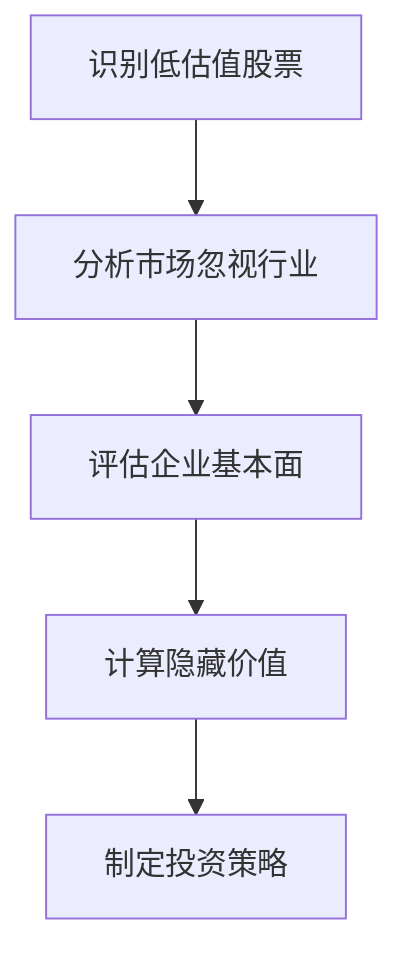

                 

# 布鲁斯·格林沃尔德的隐藏价值投资法

> 关键词：隐藏价值、投资法、格林沃尔德、价值投资、市场分析、投资策略、投资模型

> 摘要：本文详细介绍了布鲁斯·格林沃尔德的隐藏价值投资法，从其定义、核心概念、算法原理、系统架构设计到项目实战，深入剖析了隐藏价值投资法的理论基础、实践方法及其在现代投资中的应用价值。通过本文，读者将能够理解如何通过识别市场中的隐藏价值来制定有效的投资策略，提升投资回报。

---

## 第一部分: 隐藏价值投资法的背景与核心概念

### 第1章: 隐藏价值投资法的定义与背景

#### 1.1 隐藏价值投资法的定义
##### 1.1.1 投资法的基本概念
隐藏价值投资法是一种基于市场非有效性的投资策略，旨在通过识别市场中被低估的资产或机会，从而在长期实现超额收益。这种方法的核心在于发现市场中的“隐藏价值”，即那些尚未被广泛认知或被市场低估的价值。

##### 1.1.2 隐藏价值的定义与特征
隐藏价值是指那些在市场中未被充分反映或被低估的资产价值。其主要特征包括：
1. **低估值**：资产的市场价格低于其内在价值。
2. **市场忽视**：资产或行业未被市场充分关注或研究。
3. **潜在增长**：资产具备未被市场充分认知的增长潜力。

##### 1.1.3 隐藏价值投资法的起源与发展
隐藏价值投资法的起源可以追溯到价值投资的鼻祖本杰明·格雷厄姆，而布鲁斯·格林沃尔德则是这一理论的现代发展者之一。格林沃尔德通过深入研究市场非有效性，提出了隐藏价值投资法，强调在市场中寻找那些被忽视或低估的投资机会。

---

#### 1.2 隐藏价值投资法的理论基础
##### 1.2.1 价值投资的基本原理
价值投资的核心理念是购买那些市场价格低于其内在价值的资产。隐藏价值投资法继承了这一理念，并进一步强调了市场非有效性的因素。

##### 1.2.2 隐藏价值的经济学解释
从经济学的角度来看，市场的非有效性是隐藏价值存在的主要原因。市场参与者的信息不对称、认知偏差以及情绪波动等因素，可能导致某些资产的价格偏离其真实价值。

##### 1.2.3 市场非有效性的理论支持
市场非有效性理论认为，市场并不总是能够正确反映资产的真实价值。这种非有效性为隐藏价值投资法提供了理论基础，即通过识别市场中的非有效定价，投资者可以实现超额收益。

---

#### 1.3 隐藏价值投资法的核心要素
##### 1.3.1 市场结构分析
隐藏价值投资法强调对市场结构的深入分析，包括市场参与者的行为、信息传播机制以及市场流动性等因素。

##### 1.3.2 企业基本面评估
投资者需要对企业基本面进行详细评估，包括财务指标（如市盈率、市净率、自由现金流等）和管理团队的能力。

##### 1.3.3 市场情绪与行为偏差
市场情绪和行为偏差是隐藏价值存在的关键因素。投资者需要识别市场中的过度乐观或悲观情绪，并利用这些情绪偏差来寻找被低估的资产。

---

### 第2章: 隐藏价值投资法的核心概念与联系

#### 2.1 隐藏价值的识别方法
##### 2.1.1 低估值股票的识别标准
低估值股票的识别标准包括：
- **市盈率低于行业平均水平**。
- **市净率低于行业平均水平**。
- **自由现金流与市场价格的比值较高**。

##### 2.1.2 市场忽视行业的识别策略
市场忽视行业的识别策略包括：
- **行业关注度低**。
- **行业研究报告少**。
- **行业龙头公司股价表现不佳**。

##### 2.1.3 企业财务指标分析
企业财务指标分析包括：
- **盈利能力**：如净利润率、ROE（净资产收益率）。
- **成长能力**：如营收增长率、净利润增长率。
- **财务健康性**：如资产负债率、流动比率。

---

#### 2.2 隐藏价值评估模型
##### 2.2.1 市盈率模型
市盈率模型用于评估股票的内在价值，公式为：
$$ P = \frac{E}{P/E} $$
其中，$E$ 表示企业净利润，$P/E$ 表示市盈率。

##### 2.2.2 市净率模型
市净率模型用于评估股票的内在价值，公式为：
$$ P = \frac{B}{P/B} $$
其中，$B$ 表示企业净资产，$P/B$ 表示市净率。

##### 2.2.3 自由现金流模型
自由现金流模型用于评估企业的内在价值，公式为：
$$ V = \frac{FCF}{WACC} $$
其中，$FCF$ 表示自由现金流，$WACC$ 表示加权平均资本成本。

---

#### 2.3 隐藏价值与市场周期的关系
##### 2.3.1 经济周期对隐藏价值的影响
经济周期对隐藏价值的影响主要体现在市场波动和资产价格变化上。在经济衰退期间，市场非有效性增强，隐藏价值更容易被识别。

##### 2.3.2 市场情绪周期对投资策略的影响
市场情绪周期对投资策略的影响体现在投资者行为偏差上。在市场乐观时，容易出现高估；在市场悲观时，容易出现低估。

##### 2.3.3 行业周期与隐藏价值的关联
行业周期与隐藏价值的关联体现在行业生命周期的不同阶段。在行业成熟期，竞争加剧，隐藏价值可能较低；而在行业衰退期，某些公司可能因市场忽视而具备隐藏价值。

---

### 第3章: 隐藏价值投资法的算法原理

#### 3.1 隐藏价值识别的多因子模型
##### 3.1.1 多因子模型的构建
多因子模型通过多个因子（如市盈率、市净率、营收增长率等）来评估资产的内在价值。模型构建步骤如下：
1. **因子筛选**：选择与隐藏价值相关的因子。
2. **因子权重确定**：根据因子的重要性分配权重。
3. **模型验证**：通过历史数据验证模型的有效性。

##### 3.1.2 因子权重的确定
因子权重的确定可以通过回归分析或专家判断来实现。例如，市盈率和市净率可能比营收增长率更重要，因此权重较高。

##### 3.1.3 模型的验证与优化
模型的验证与优化包括：
- **回测分析**：通过历史数据验证模型的预测能力。
- **参数调整**：根据回测结果优化模型参数。

---

#### 3.2 隐藏价值评估的量化方法
##### 3.2.1 数据收集与清洗
数据收集与清洗包括：
- **数据来源**：从股票数据库、财经网站等获取数据。
- **数据清洗**：去除缺失值、异常值等。

##### 3.2.2 数据分析与建模
数据分析与建模包括：
- **统计分析**：计算均值、方差等统计指标。
- **机器学习**：使用回归、分类等算法进行建模。

##### 3.2.3 模型的评估与验证
模型的评估与验证包括：
- **交叉验证**：通过交叉验证评估模型的泛化能力。
- **性能指标**：如准确率、召回率等。

---

#### 3.3 隐藏价值投资法的数学模型
##### 3.3.1 基于市盈率的估值模型
基于市盈率的估值模型公式为：
$$ P = \frac{E}{P/E} $$
其中，$E$ 表示企业净利润，$P/E$ 表示市盈率。

##### 3.3.2 市净率模型
市净率模型公式为：
$$ P = \frac{B}{P/B} $$
其中，$B$ 表示企业净资产，$P/B$ 表示市净率。

##### 3.3.3 自由现金流模型
自由现金流模型公式为：
$$ V = \frac{FCF}{WACC} $$
其中，$FCF$ 表示自由现金流，$WACC$ 表示加权平均资本成本。

---

## 图1: 隐藏价值识别流程图

---

### 第4章: 隐藏价值投资法的系统分析与架构设计

#### 4.1 系统分析
##### 4.1.1 投资决策流程
投资决策流程包括：
1. **数据收集**：收集目标资产的市场数据。
2. **数据处理**：清洗和转换数据。
3. **模型构建**：基于多因子模型构建评估系统。
4. **策略制定**：根据评估结果制定投资策略。

##### 4.1.2 数据收集与处理
数据收集与处理包括：
- **数据来源**：股票数据库、财经网站。
- **数据清洗**：去除缺失值、异常值。
- **数据转换**：标准化、归一化处理。

##### 4.1.3 模型构建与应用
模型构建与应用包括：
- **模型训练**：使用历史数据训练模型。
- **模型应用**：将模型应用于当前数据，评估隐藏价值。

---

#### 4.2 系统架构设计
##### 4.2.1 数据层架构
数据层架构包括：
- **数据源**：数据库、API接口。
- **数据存储**：本地数据库、云存储。

##### 4.2.2 计算层架构
计算层架构包括：
- **数据处理**：数据清洗、转换。
- **模型计算**：多因子模型计算。

##### 4.2.3 展示层架构
展示层架构包括：
- **结果展示**：隐藏价值评估结果。
- **交互界面**：用户友好的操作界面。

---

#### 4.3 系统接口设计
##### 4.3.1 数据接口
数据接口包括：
- **数据输入接口**：接收外部数据。
- **数据输出接口**：输出处理后的数据。

##### 4.3.2 用户接口
用户接口包括：
- **输入界面**：用户输入查询条件。
- **输出界面**：显示评估结果。

##### 4.3.3 输出接口
输出接口包括：
- **评估结果输出**：隐藏价值评分。
- **投资建议输出**：基于评估结果的投资建议。

---

## 第5章: 隐藏价值投资法的项目实战

### 5.1 项目背景与目标
#### 5.1.1 项目背景
本项目旨在通过隐藏价值投资法，识别市场中被低估的股票，制定投资策略，实现超额收益。

#### 5.1.2 项目目标
项目目标包括：
- **数据收集与处理**：收集目标股票的市场数据。
- **模型构建**：基于多因子模型构建评估系统。
- **投资策略制定**：根据评估结果制定投资策略。

---

### 5.2 项目实施
#### 5.2.1 数据收集与清洗
数据收集与清洗包括：
- **数据来源**：从股票数据库获取目标股票的市场数据。
- **数据清洗**：去除缺失值、异常值。

#### 5.2.2 模型构建与验证
模型构建与验证包括：
- **模型训练**：使用历史数据训练多因子模型。
- **模型验证**：通过回测验证模型的有效性。

#### 5.2.3 投资策略制定
投资策略制定包括：
- **评估结果分析**：根据模型评估结果，识别被低估的股票。
- **投资组合优化**：根据评估结果制定投资组合。

---

### 5.3 实战案例分析
#### 5.3.1 案例背景
假设我们选择某行业中的若干股票作为目标，通过隐藏价值投资法进行评估。

#### 5.3.2 数据分析
数据分析包括：
- **市盈率分析**：计算目标股票的市盈率。
- **市净率分析**：计算目标股票的市净率。
- **自由现金流分析**：计算目标股票的自由现金流。

#### 5.3.3 投资策略实施
投资策略实施包括：
- **购买被低估的股票**：根据评估结果，购买被低估的股票。
- **持有与监控**：定期监控股票表现，根据市场变化调整投资策略。

#### 5.3.4 实战结果与反思
实战结果与反思包括：
- **投资回报**：计算投资回报率。
- **策略调整**：根据市场变化调整投资策略。

---

### 第6章: 隐藏价值投资法的最佳实践与小结

#### 6.1 最佳实践 tips
##### 6.1.1 数据收集的注意事项
- 数据来源要可靠。
- 数据清洗要彻底。

##### 6.1.2 模型构建的常见问题
- 模型参数要合理。
- 模型验证要充分。

##### 6.1.3 投资策略的调整与优化
- 定期监控市场变化。
- 根据市场变化调整投资策略。

---

#### 6.2 小结
隐藏价值投资法是一种基于市场非有效性的投资策略，通过识别市场中的被低估资产，实现超额收益。本文从理论基础、算法原理到系统架构设计，再到项目实战，全面介绍了隐藏价值投资法的应用。通过本文的学习，读者可以掌握隐藏价值投资法的核心思想，并在实际投资中加以应用。

---

**作者：AI天才研究院/AI Genius Institute & 禅与计算机程序设计艺术 /Zen And The Art of Computer Programming**

