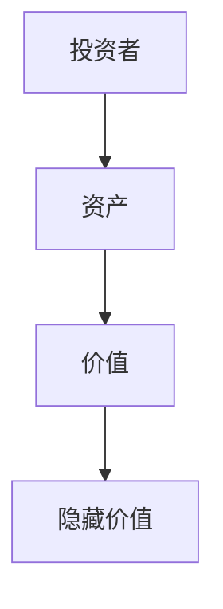
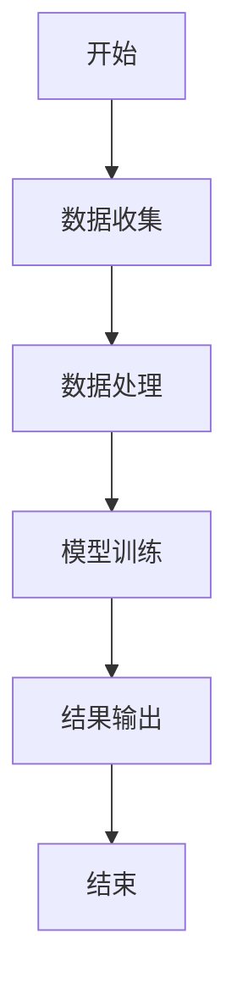
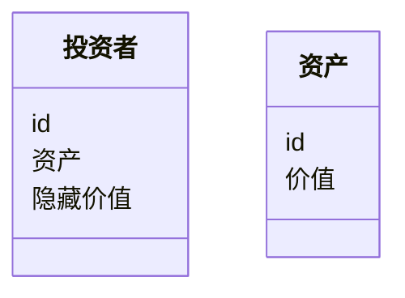
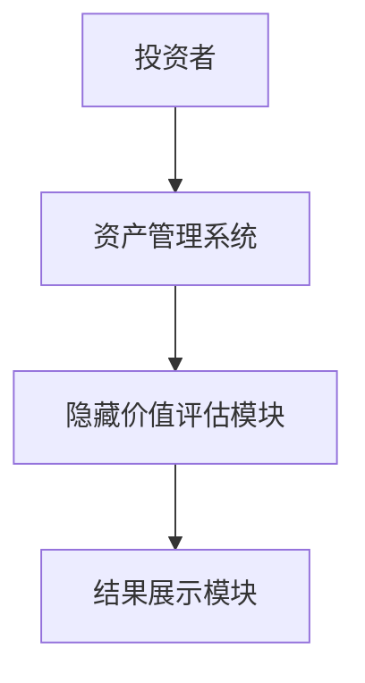

                 


# 隐藏价值投资策略：布鲁斯·格林沃尔德的策略解析

> 关键词：隐藏价值投资、布鲁斯·格林沃尔德、投资策略、金融分析、算法原理

> 摘要：本文深入解析了布鲁斯·格林沃尔德的隐藏价值投资策略，从核心概念、算法原理、系统架构到项目实战，全面剖析了隐藏价值投资的理论与实践。文章通过详细的逻辑推理和实际案例，展示了隐藏价值投资的独特优势和应用价值。

---

## 第1章: 隐藏价值投资策略的背景与概念

### 1.1 隐藏价值投资的基本概念

#### 1.1.1 投资的定义与分类
投资是指将资金投入某种资产或项目，期望在未来获得收益或资本增值的行为。投资可以分为股票、债券、房地产等多种类型，每种类型都有其独特的风险和收益特征。

#### 1.1.2 隐藏价值的定义
隐藏价值是指存在于资产或项目中，但尚未被市场充分认知或反映在其市场价格中的潜在价值。这种价值可能源于资产的未充分利用、市场信息的不对称性或潜在的增长机会。

#### 1.1.3 隐藏价值投资的核心要素
- 资产的潜在价值：通过深入分析资产的内在价值，发现其未被市场充分认知的部分。
- 信息不对称：利用信息优势，识别市场中未被充分挖掘的价值点。
- 风险控制：在寻找隐藏价值的过程中，同时注重风险的评估和管理。

### 1.2 隐藏价值投资的背景与重要性

#### 1.2.1 当前金融市场的现状
当前金融市场中，传统投资策略的竞争日益激烈，许多投资者转向寻找隐藏价值以获取超额收益。隐藏价值投资作为一种新兴策略，逐渐受到关注。

#### 1.2.2 隐藏价值投资的兴起
随着金融市场的发展，信息的透明化和对称化程度不断提高，隐藏价值的存在空间逐步缩小。然而，通过技术分析和深度研究，隐藏价值仍然存在挖掘的机会。

#### 1.2.3 隐藏价值投资的重要性
隐藏价值投资为投资者提供了在竞争激烈的市场中获取超额收益的可能性。通过识别市场中的隐藏价值，投资者可以在资产价格低估时介入，实现长期稳定的收益。

---

## 第2章: 隐藏价值投资的核心概念与联系

### 2.1 核心概念原理

#### 2.1.1 隐藏价值的识别方法
- **基本面分析**：通过分析资产的财务数据、行业地位和竞争优势，识别其潜在价值。
- **技术分析**：利用价格走势、成交量等技术指标，发现资产价格偏离其内在价值的情况。
- **市场情绪分析**：通过分析市场参与者的情绪和行为，判断资产价格是否被高估或低估。

#### 2.1.2 隐藏价值的评估模型
- **DCF模型**：通过现金流折现法评估资产的内在价值。
- **相对估值法**：通过比较同类资产的估值水平，判断资产是否被低估。
- **情景分析法**：通过模拟不同市场情景，评估资产在不同情况下的表现。

#### 2.1.3 隐藏价值的实现路径
- **资产配置**：根据隐藏价值的评估结果，优化资产配置。
- **风险管理**：通过分散投资和对冲策略，降低隐藏价值投资的风险。
- **持续监控**：定期评估隐藏价值的变化，调整投资策略。

### 2.2 概念属性特征对比表格

| 投资策略 | 核心目标 | 风险特征 | 信息依赖 | 适用场景 |
|----------|----------|----------|----------|----------|
| 隐藏价值投资 | 发现市场未反映的潜在价值 | 较高（需承担信息不对称风险） | 高（依赖深度研究） | 适用于新兴市场或未被充分研究的资产 |
| 市场趋势投资 | 跟随市场趋势 | 中等 | 中等 | 适用于成熟市场 |
| 价值投资 | 投资被低估的资产 | 中等 | 高 | 适用于成熟市场 |

### 2.3 ER实体关系图



---

## 第3章: 隐藏价值投资的算法原理

### 3.1 算法原理概述

#### 3.1.1 隐藏价值识别算法
隐藏价值识别算法通过分析资产的历史价格、成交量、财务数据等信息，识别出潜在的隐藏价值。

#### 3.1.2 隐藏价值评估算法
隐藏价值评估算法利用数学模型对资产的潜在价值进行量化评估，判断其是否低于市场价格。

#### 3.1.3 隐藏价值实现算法
隐藏价值实现算法通过优化投资组合，最大化隐藏价值带来的超额收益。

### 3.2 算法流程图



### 3.3 算法实现代码

```python
def hidden_value_algorithm(data):
    # 数据预处理
    processed_data = preprocess(data)
    # 模型训练
    model = train_model(processed_data)
    # 结果预测
    result = predict(model, data)
    return result
```

### 3.4 数学模型与公式

#### 3.4.1 隐藏价值评估公式
$$ HV = \sum_{i=1}^{n} w_i x_i $$
其中，\( w_i \) 是第 \( i \) 个因素的权重，\( x_i \) 是第 \( i \) 个因素的值。

#### 3.4.2 隐藏价值实现公式
$$ IHV = \sum_{j=1}^{m} w_j y_j $$
其中，\( w_j \) 是第 \( j \) 个因素的权重，\( y_j \) 是第 \( j \) 个因素的值。

---

## 第4章: 系统分析与架构设计

### 4.1 问题场景介绍

#### 4.1.1 隐藏价值投资的应用场景
- **新兴市场**：新兴市场中资产价格尚未被充分研究，隐藏价值存在的可能性较高。
- **未被关注的资产**：某些资产由于市场关注度低，其潜在价值未被充分挖掘。

### 4.2 系统功能设计

#### 4.2.1 领域模型



### 4.3 系统架构设计



---

## 第5章: 项目实战

### 5.1 环境安装

#### 5.1.1 开发环境配置
- 安装Python和相关库（如Pandas、NumPy、Scikit-learn）。
- 安装Jupyter Notebook用于数据分析和可视化。

---

## 第6章: 最佳实践与总结

### 6.1 最佳实践

- **持续学习**：金融市场变化迅速，投资者需要不断更新知识和技能。
- **风险管理**：隐藏价值投资风险较高，需严格控制投资组合的风险。
- **技术与基本面结合**：结合技术分析和基本面分析，提高投资决策的准确性。

### 6.2 小结

本文详细解析了布鲁斯·格林沃尔德的隐藏价值投资策略，从核心概念、算法原理到系统架构，全面剖析了隐藏价值投资的理论与实践。通过实际案例分析，展示了隐藏价值投资的独特优势和应用价值。

### 6.3 注意事项

- 隐藏价值投资存在较高的风险，投资者需谨慎决策。
- 投资者应具备扎实的金融知识和数据分析能力。
- 隐藏价值投资需结合市场环境和资产特性，灵活调整策略。

### 6.4 拓展阅读

- 格林沃尔德的其他投资策略。
- 隐藏价值投资在不同市场环境下的应用。
- 其他隐藏价值评估方法的研究与实践。

---

作者：AI天才研究院/AI Genius Institute & 禅与计算机程序设计艺术 /Zen And The Art of Computer Programming

