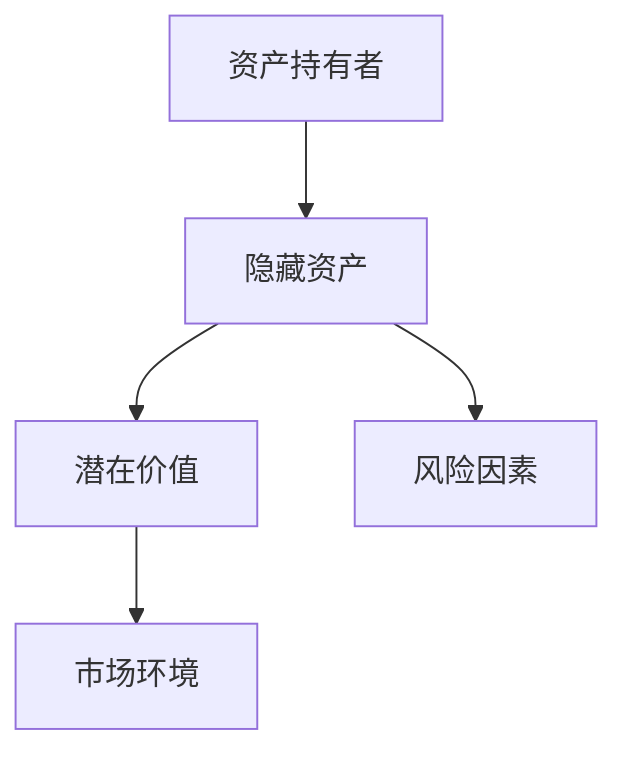
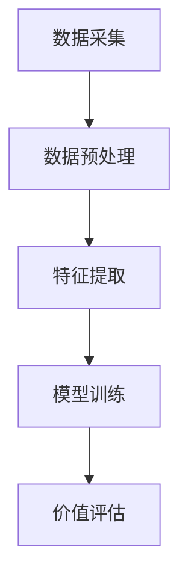
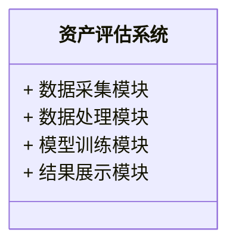
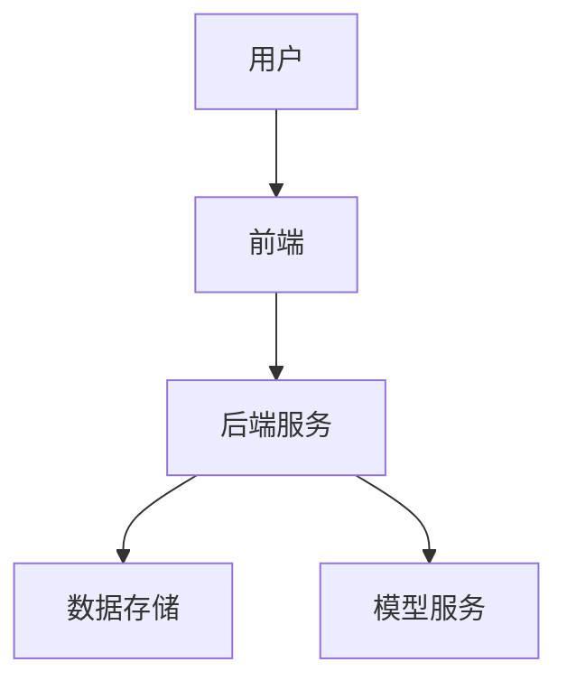

                 


# 布鲁斯·贝克威斯的隐藏资产价值发掘

> **关键词**：隐藏资产，价值发掘，资产评估，数据分析，机器学习，风险管理  
> **摘要**：本文系统地探讨了隐藏资产价值发掘的重要性和方法论，结合实际案例和算法实现，深入分析了隐藏资产的属性、评估模型的构建以及系统架构设计。通过数据驱动的方法，我们展示了如何利用机器学习技术发现和评估隐藏资产，为企业价值提升和风险管理提供新的视角。

---

## 第一部分: 隐藏资产价值发掘的背景与核心概念

### 第1章: 隐藏资产价值发掘的背景与问题定义

#### 1.1 隐藏资产的基本概念

##### 1.1.1 资产的定义与分类

资产是指企业或个人拥有的具有经济价值的资源，通常可分为有形资产（如房地产、设备）和无形资产（如品牌、专利）。隐藏资产是那些未被充分识别或评估的资产，可能存在于企业的运营、数据或潜在关系中。

##### 1.1.2 隐藏资产的定义与特征

隐藏资产具有以下特征：
1. **数据驱动性**：依赖于数据分析和挖掘。
2. **隐含性**：不易被直接观察或测量。
3. **动态性**：价值会随着市场变化而波动。

##### 1.1.3 隐藏资产与传统资产的对比

| 特性 | 传统资产 | 隐藏资产 |
|------|----------|----------|
| 形态 | 实物或明确权利 | 数据或潜在价值 |
| 可见性 | 明确可见 | 隐含且不易察觉 |
| 评估复杂度 | 较低 | 较高 |

#### 1.2 隐藏资产价值发掘的重要性

##### 1.2.1 资产贬值与价值重估的背景

经济波动和市场变化可能导致传统资产贬值，而隐藏资产的价值可能被低估。通过重新评估隐藏资产，企业可以发现新的价值来源。

##### 1.2.2 隐藏资产在企业价值提升中的作用

隐藏资产可能存在于企业内部数据、客户关系或创新潜力中，挖掘这些资产可以为企业创造新的价值。

##### 1.2.3 数字化时代下隐藏资产的发现与利用

在数字化转型中，企业积累了大量数据，这些数据可能隐藏着巨大的价值，通过数据分析和机器学习技术可以发现这些隐藏资产。

#### 1.3 隐藏资产价值发掘的核心问题

##### 1.3.1 资产识别与分类的挑战

隐藏资产的识别需要结合数据分析和业务理解，分类过程可能涉及复杂的模型和算法。

##### 1.3.2 资产价值评估的复杂性

隐藏资产的价值受多种因素影响，如市场环境、企业战略和技术创新，评估过程需要考虑这些动态因素。

##### 1.3.3 隐藏资产的动态变化与风险管理

隐藏资产的价值可能随时间变化，企业需要建立动态评估机制，并通过风险管理策略应对潜在风险。

---

## 第二部分: 隐藏资产价值发掘的核心概念与联系

### 第2章: 隐藏资产的核心属性与特征分析

#### 2.1 隐藏资产的属性特征

##### 2.1.1 数据驱动性

隐藏资产的价值通常依赖于数据分析，通过数据挖掘和机器学习技术进行评估。

##### 2.1.2 隐含性

隐藏资产的价值可能隐藏在数据或业务关系中，需要深入挖掘才能发现。

##### 2.1.3 动态性

隐藏资产的价值会随着市场环境和企业战略的变化而变化，需要动态评估。

#### 2.2 隐藏资产与相关概念的对比

##### 2.2.1 隐藏资产与无形资产的对比

| 特性 | 隐藏资产 | 无形资产 |
|------|----------|----------|
| 定义 | 隐含且未被充分识别的资产 | 无物理形态的资产 |
| 例子 | 数据驱动的潜在价值 | 品牌、专利 |

##### 2.2.2 隐藏资产与潜在资产的对比

| 特性 | 隐藏资产 | 潜在资产 |
|------|----------|----------|
| 定义 | 隐含且未被识别的资产 | 尚未实现的未来资产 |
| 例子 | 数据中的价值 | 未来项目的潜力 |

##### 2.2.3 隐藏资产与虚拟资产的对比

| 特性 | 隐藏资产 | 虚拟资产 |
|------|----------|----------|
| 定义 | 隐含且未被识别的资产 | 存在于数字空间的资产 |
| 例子 | 数据驱动的潜力 | 加密货币、数字版权 |

#### 2.3 隐藏资产的实体关系图



---

## 第三部分: 隐藏资产价值发掘的算法原理与实现

### 第3章: 隐藏资产价值评估的算法原理

#### 3.1 隐藏资产价值评估的基本流程

##### 3.1.1 数据采集与预处理

数据预处理包括清洗、标准化和特征提取。例如，使用Python的`pandas`库进行数据清洗：

```python
import pandas as pd

# 加载数据
df = pd.read_csv('hidden_assets.csv')

# 清洗数据
df.dropna(inplace=True)
df = df[ df['value'] > 0 ]
```

##### 3.1.2 特征提取与选择

特征提取可以通过主成分分析（PCA）实现：

$$
\text{主成分} = \text{PCA}(X)
$$

##### 3.1.3 模型训练与评估

使用随机森林回归模型进行价值评估：

```python
from sklearn.ensemble import RandomForestRegressor

# 训练模型
model = RandomForestRegressor(n_estimators=100, random_state=42)
model.fit(X_train, y_train)

# 预测价值
y_pred = model.predict(X_test)
```

#### 3.2 隐藏资产价值评估的数学模型

随机森林回归模型的数学公式可以表示为：

$$
y = \sum_{i=1}^{n} \theta_i \cdot x_i
$$

其中，$\theta_i$是模型中每个特征的权重。

#### 3.3 算法流程图



---

## 第四部分: 隐藏资产价值发掘的系统分析与架构设计

### 第4章: 隐藏资产价值评估系统设计

#### 4.1 系统功能设计

系统功能包括数据采集、价值评估和结果展示：



#### 4.2 系统架构设计

系统架构采用微服务架构：



---

## 第五部分: 隐藏资产价值发掘的项目实战

### 第5章: 项目实战与案例分析

#### 5.1 项目环境安装

安装所需的Python库：

```bash
pip install numpy pandas scikit-learn
```

#### 5.2 系统核心实现

核心代码实现：

```python
import numpy as np
import pandas as pd
from sklearn.ensemble import RandomForestRegressor

# 加载数据
data = pd.read_csv('assets.csv')

# 特征工程
features = data[['feature1', 'feature2', 'feature3']]
target = data['value']

# 训练模型
model = RandomForestRegressor()
model.fit(features, target)

# 预测价值
new_assets = pd.DataFrame({
    'feature1': [1],
    'feature2': [2],
    'feature3': [3]
})
predicted_value = model.predict(new_assets)
print(predicted_value)
```

---

## 第六部分: 隐藏资产价值发掘的最佳实践

### 第6章: 最佳实践与注意事项

#### 6.1 实用技巧

- 数据质量是关键，确保数据的完整性和准确性。
- 使用交叉验证优化模型性能。

#### 6.2 注意事项

- 定期更新模型以适应市场变化。
- 注意数据隐私和合规性。

#### 6.3 拓展阅读

- 《机器学习实战》
- 《数据分析的的艺术》

---

## 结语

通过本文的系统分析和实际案例，我们展示了如何利用数据分析和机器学习技术发现和评估隐藏资产。未来，随着技术的进步，隐藏资产的价值发掘将变得更加重要和复杂，需要更多的创新和实践。

---

**作者：AI天才研究院 & 禅与计算机程序设计艺术**

