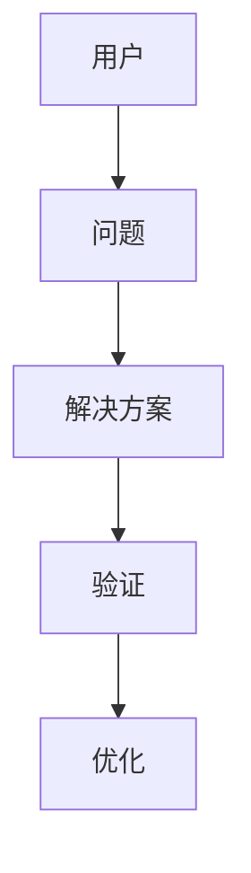

                 


# 常见挑战与解决方案

> 关键词：技术挑战、解决方案、算法优化、系统架构、项目管理

> 摘要：本文将系统地探讨在计算机技术领域中常见的挑战，并提供切实可行的解决方案。内容涵盖算法优化、系统架构设计、项目管理等多个方面，结合实际案例和深入的技术分析，帮助读者全面理解问题本质并掌握解决问题的方法。

---

## 第一部分: 引言

### 第1章: 常见挑战概述

#### 1.1 问题背景与重要性
- **技术发展的挑战**  
  随着技术的飞速发展，我们在软件开发、系统设计等领域面临越来越多的复杂问题。这些问题不仅需要深厚的技术积累，还需要创新的解决方案。
- **问题描述与现状**  
  当前的技术挑战主要集中在算法优化、系统架构设计、项目管理等方面。这些问题往往具有高度的复杂性和不确定性。
- **解决方案的核心价值**  
  通过系统性地分析和解决这些挑战，我们可以提高开发效率、降低系统故障率，并推动项目的顺利落地。

#### 1.2 常见挑战的分类
- **技术挑战**  
  包括算法优化、数据结构设计等。
- **系统架构挑战**  
  包括高可用性、扩展性设计等。
- **项目管理挑战**  
  包括团队协作、进度控制等。

#### 1.3 解决策略与方法论
- **系统性思维的建立**  
  将问题分解为多个部分，逐一解决。
- **分解问题的技巧**  
  通过绘制思维导图等方式，清晰地梳理问题。
- **解决方案的验证与优化**  
  建立验证机制，持续优化解决方案。

---

## 第二部分: 核心概念与联系

### 第2章: 核心概念原理

#### 2.1 常见挑战的核心要素
- **技术复杂性**  
  涉及多领域知识的综合应用。
- **系统交互性**  
  系统各模块之间的协同工作。
- **业务需求多样性**  
  需要满足不同用户的需求。

#### 2.2 解决方案的属性特征对比
| 属性 | 可扩展性 | 可维护性 | 性能优化 |
|------|----------|----------|----------|
| 特征 | 支持新增功能 | 便于修改和更新 | 提高运行效率 |

#### 2.3 ER实体关系图架构


---

## 第三部分: 算法原理讲解

### 第3章: 算法挑战与解决方案

#### 3.1 算法原理概述
- **算法的基本概念**  
  一组定义明确的规则，用于解决问题。
- **算法复杂度分析**  
  包括时间复杂度和空间复杂度。
- **算法优化策略**  
  通过减少计算量、优化数据结构等方式提高效率。

#### 3.2 常见算法挑战
- **排序算法的挑战**  
  如冒泡排序、快速排序等。
- **搜索算法的挑战**  
  如深度优先搜索、广度优先搜索等。
- **动态规划的挑战**  
  如最长子序列问题。

#### 3.3 算法实现与优化
- **排序算法实现**  
  Python代码示例：
  ```python
  def bubble_sort(arr):
      n = len(arr)
      for i in range(n):
          for j in range(0, n-i-1):
              if arr[j] > arr[j+1]:
                  arr[j], arr[j+1] = arr[j+1], arr[j]
      return arr
  ```
- **搜索算法优化**  
  示例代码：
  ```python
  def depth_first_search(graph, start):
      visited = set()
      stack = [start]
      while stack:
          node = stack.pop()
          if node not in visited:
              visited.add(node)
              stack.extend(graph[node])
      return visited
  ```
- **动态规划案例**  
  数学模型：
  $$f(n) = f(n-1) + f(n-2)$$
  其中，$f(0) = 0$，$f(1) = 1$。

---

## 第四部分: 系统分析与架构设计方案

### 第4章: 系统设计挑战与解决方案

#### 4.1 问题场景介绍
- **问题场景**  
  如设计一个高可用性的Web应用。
- **项目介绍**  
  如在线教育平台。

#### 4.2 系统功能设计
- **领域模型设计**  
  ```mermaid
  classDiagram
      class 用户 {
          id: int
          username: str
          password: str
      }
      class 课程 {
          id: int
          title: str
          description: str
      }
      用户 --> 课程
  ```

#### 4.3 系统架构设计
- **系统架构图**  
  ```mermaid
  graph LR
      A[前端] --> B[后端]
      B --> C[数据库]
      B --> D[缓存]
  ```

#### 4.4 系统接口设计
- **API设计**  
  如RESTful API。

#### 4.5 系统交互设计
- **交互流程图**  
  ```mermaid
  sequenceDiagram
      用户 ->> 后端: 请求课程列表
      后端 ->> 数据库: 查询课程数据
      数据库 --> 后端: 返回课程数据
      后端 ->> 用户: 返回课程列表
  ```

---

## 第五部分: 项目实战

### 第5章: 项目实战与解决方案

#### 5.1 环境安装
- **安装Python**  
  使用Anaconda或Pyenv。
- **安装依赖库**  
  如Django框架。

#### 5.2 系统核心实现
- **核心代码实现**  
  如用户认证模块：
  ```python
  from django.contrib.auth.models import User
  def authenticate(username, password):
      user = User.objects.filter(username=username, password=password)
      return user.first() if user.exists() else None
  ```

#### 5.3 代码应用解读与分析
- **代码解读**  
  如上代码实现用户认证功能。
- **案例分析**  
  如解决用户认证问题。

#### 5.4 实际案例分析
- **案例总结**  
  如在线教育平台的用户认证和课程管理。

---

## 第六部分: 总结与展望

### 第6章: 总结与展望

#### 6.1 最佳实践 tips
- **代码规范**  
  遵循PEP 8规范。
- **测试驱动开发**  
  使用单元测试框架。
- **持续集成**  
  使用Jenkins或GitHub Actions。

#### 6.2 小结
- **核心内容回顾**  
  通过系统性地分析和解决技术挑战，我们可以提高开发效率和系统性能。
- **注意事项**  
  注重代码质量和系统设计的合理性。

#### 6.3 未来展望
- **技术趋势**  
  如人工智能、区块链等领域的挑战。
- **研究方向**  
  如高效算法设计、系统架构优化等。

---

## 作者：AI天才研究院 & 禅与计算机程序设计艺术

