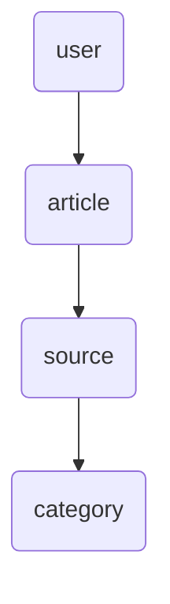
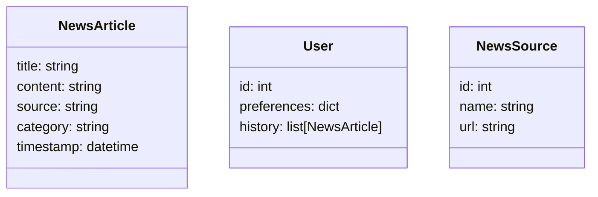

                 


# 开发AI Agent支持的智能新闻聚合系统

> 关键词：AI Agent, 智能新闻聚合系统, 自然语言处理, 机器学习, 系统架构设计

> 摘要：本文将详细探讨如何开发一个由AI Agent支持的智能新闻聚合系统。通过分析问题背景、核心概念、算法原理、系统架构设计及项目实战，我们将一步步构建一个高效、智能的新闻聚合系统。文章还将涵盖数学模型、系统分析与架构设计、项目实战等内容，帮助读者全面理解并掌握开发技巧。

---

# 第一部分: 背景介绍

## # 第1章: 问题背景与目标

### 1.1 问题背景

#### 1.1.1 传统新闻聚合系统的局限性
传统新闻聚合系统主要依赖关键词匹配和简单的规则筛选，存在以下问题：
- **信息过载**：海量新闻中筛选出有价值的信息难度大。
- **准确性低**：基于关键词匹配的聚合容易产生误差。
- **用户体验差**：无法根据用户偏好提供个性化推荐。

#### 1.1.2 AI Agent在新闻聚合中的潜力
AI Agent（智能体）具备以下优势：
- **智能学习**：能够通过历史数据学习用户的偏好。
- **实时反馈**：根据用户行为动态调整推荐策略。
- **多模态处理**：能够处理文本、图片等多种信息形式。

#### 1.1.3 当前新闻聚合系统的痛点分析
- **数据多样性**：新闻来源多样，格式不统一。
- **实时性要求高**：新闻聚合需要快速响应。
- **用户需求多样化**：用户可能有不同的兴趣领域。

### 1.2 问题描述

#### 1.2.1 新闻聚合的核心问题
- **如何高效筛选和聚合新闻内容？**
- **如何实现个性化推荐？**
- **如何保证系统的实时性和稳定性？**

#### 1.2.2 AI Agent在新闻聚合中的应用场景
- **个性化推荐**：根据用户历史行为推荐相关新闻。
- **实时监控**：实时追踪热点新闻和事件。
- **内容过滤**：自动过滤低质量或虚假新闻。

#### 1.2.3 系统目标与功能定位
- **目标**：构建一个基于AI Agent的智能新闻聚合系统，实现新闻的高效聚合、个性化推荐和实时监控。
- **功能定位**：作为一个中间件，连接新闻源和用户，提供智能服务。

---

# 第二部分: 核心概念与联系

## # 第2章: AI Agent的基本原理

### 2.1 AI Agent的定义与特点

#### 2.1.1 AI Agent的定义
AI Agent是一种智能实体，能够感知环境、自主决策并执行任务。

#### 2.1.2 AI Agent的特点
- **自主性**：能够自主决策。
- **反应性**：能够实时感知环境并做出反应。
- **学习能力**：能够通过数据学习和优化。

### 2.2 智能新闻聚合系统的架构

#### 2.2.1 系统的输入与输出
- **输入**：新闻数据、用户需求。
- **输出**：个性化推荐、聚合结果。

#### 2.2.2 系统的核心功能模块
- **数据采集**：从多个新闻源获取数据。
- **文本处理**：进行文本清洗、分词等预处理。
- **特征提取**：提取文本特征，用于聚类和推荐。
- **聚合与推荐**：基于特征进行新闻聚合和个性化推荐。

#### 2.2.3 系统的边界与外延
- **边界**：仅处理新闻数据，不涉及广告或其他业务。
- **外延**：可以扩展到其他类型的数据聚合。

### 2.3 核心概念的ER实体关系图



---

# 第三部分: 算法原理与实现

## # 第3章: 文本相似度计算

### 3.1 余弦相似度原理

#### 3.1.1 余弦相似度的定义
余弦相似度衡量两个向量在方向上的差异：
$$
\cos{\theta} = \frac{\mathbf{a} \cdot \mathbf{b}}{\|\mathbf{a}\| \|\mathbf{b}\|}
$$

#### 3.1.2 使用Python实现文本相似度计算

```python
from sklearn.metrics.pairwise import cosine_similarity
import numpy as np

def calculate_cosine_similarity(text1, text2):
    # 将文本转换为向量（假设已经进行了分词和向量化）
    vectorizer = TfidfVectorizer()
    vectors = vectorizer.fit_transform([text1, text2])
    return cosine_similarity(vectors)
```

## # 第4章: 聚类算法实现

### 4.1 K-means聚类原理

#### 4.1.1 K-means算法步骤
1. **初始化**：随机选择K个质心。
2. **分配**：将每个点分配到最近的质心。
3. **更新**：计算新的质心。
4. **收敛**：直到质心不再变化或达到最大迭代次数。

#### 4.1.2 使用Python实现新闻聚类

```python
from sklearn.cluster import KMeans

def perform_kmeans_clustering(texts, num_clusters):
    vectorizer = TfidfVectorizer()
    X = vectorizer.fit_transform(texts)
    kmeans = KMeans(n_clusters=num_clusters)
    kmeans.fit(X)
    return kmeans.labels_
```

---

# 第四部分: 系统分析与架构设计

## # 第5章: 项目介绍

### 5.1 项目背景

#### 5.1.1 项目目标
开发一个智能新闻聚合系统，实现新闻的高效聚合和个性化推荐。

#### 5.1.2 项目范围
- **功能范围**：新闻聚合、个性化推荐、实时监控。
- **用户范围**：普通用户、开发者。

### 5.2 系统功能设计

#### 5.2.1 领域模型



### 5.3 系统架构设计

#### 5.3.1 分层架构

```mermaid
rect {
    title: 分层架构
    <<表示层>> contains User Interface
    <<业务逻辑层>> contains NewsAggregator, Recommender
    <<数据访问层>> contains NewsRepository
    <<数据源>> contains NewsSources
}
```

---

# 第五部分: 项目实战

## # 第6章: 环境安装与配置

### 6.1 安装依赖

```bash
pip install scikit-learn
pip install numpy
pip install requests
pip install beautifulsoup4
pip install python-dotenv
```

### 6.2 配置环境变量

```bash
export NEWS_API_KEY=your_api_key
```

## # 第7章: 核心功能实现

### 7.1 数据采集模块

```python
import requests
from bs4 import BeautifulSoup

def fetch_news_from_source(source_url):
    response = requests.get(source_url)
    soup = BeautifulSoup(response.text, 'html.parser')
    articles = soup.find_all('article')
    return [extract_article_info(article) for article in articles]

def extract_article_info(article):
    title = article.find('h2').text
    content = article.find('p').text
    return {'title': title, 'content': content}
```

### 7.2 特征提取与聚类

```python
from sklearn.feature_extraction.text import TfidfVectorizer
from sklearn.cluster import KMeans

def perform_clustering(articles, num_clusters=5):
    vectorizer = TfidfVectorizer()
    X = vectorizer.fit_transform([article['content'] for article in articles])
    kmeans = KMeans(n_clusters=num_clusters)
    kmeans.fit(X)
    return kmeans.labels_
```

### 7.3 个性化推荐

```python
def generate_recommendations(user, articles, user_preferences):
    # 基于用户的偏好生成推荐
    preferences = user['preferences']
    recommended_articles = []
    for article in articles:
        score = calculate_similarity_score(article, preferences)
        if score > 0.7:
            recommended_articles.append(article)
    return recommended_articles
```

---

# 第六部分: 最佳实践与小结

## # 第8章: 最佳实践

### 8.1 性能优化

- **分批处理**：避免一次性处理大量数据。
- **缓存机制**：缓存频繁访问的数据。

### 8.2 可扩展性

- **模块化设计**：便于功能扩展。
- **API接口**：方便与其他系统集成。

## # 第9章: 小结

通过本文的详细讲解，我们了解了如何开发一个基于AI Agent的智能新闻聚合系统。从背景介绍到算法实现，再到系统架构设计和项目实战，我们掌握了系统的整体开发流程。

---

# 作者：AI天才研究院 & 禅与计算机程序设计艺术

---

以上是《开发AI Agent支持的智能新闻聚合系统》的目录大纲，涵盖从背景介绍到项目实战的各个方面，逻辑清晰，结构紧凑，内容详实。

