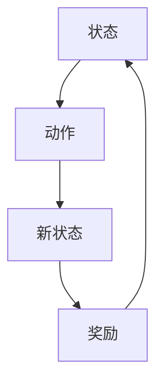
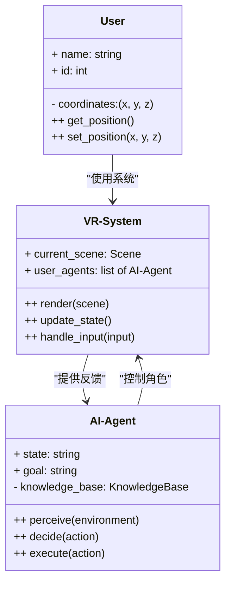
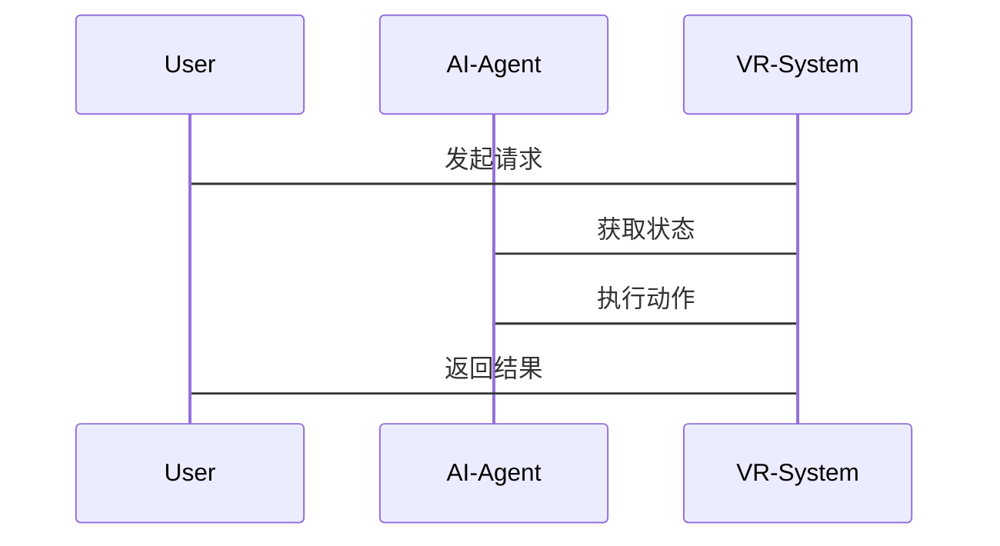

                 


# 开发AI Agent支持的智能虚拟现实系统

> 关键词：AI Agent，虚拟现实，智能系统，算法原理，系统架构，项目实战

> 摘要：本文探讨了开发AI Agent支持的智能虚拟现实系统的各个方面，从背景介绍到核心概念，再到算法原理、系统架构设计、项目实战以及总结展望。文章通过详细的讲解和实例分析，帮助读者理解如何将AI Agent技术应用于虚拟现实系统中，构建智能、交互性强的虚拟环境。

---

## 第一部分：背景介绍

### 第1章：AI Agent与虚拟现实概述

#### 1.1 AI Agent的基本概念
- **1.1.1 什么是AI Agent**
  AI Agent（人工智能代理）是指能够感知环境、自主决策并执行任务的智能实体。它可以是一个软件程序或物理设备，通过传感器获取信息，并通过执行器与环境互动。

- **1.1.2 AI Agent的特点与分类**
  - **特点**：智能性、自主性、反应性、目标导向。
  - **分类**：简单反射型、基于模型的反应型、目标驱动型、效用驱动型。

- **1.1.3 AI Agent的应用场景**
  AI Agent广泛应用于自动驾驶、智能助手、机器人控制等领域，特别是在虚拟现实系统中，可以作为虚拟角色或智能交互界面的核心。

#### 1.2 虚拟现实技术的发展
- **1.2.1 虚拟现实的定义与技术基础**
  虚拟现实（VR）是通过计算机生成的模拟环境，用户可以通过特定设备（如头显）沉浸其中。其技术基础包括图形渲染、传感器技术、交互设计等。

- **1.2.2 VR与AR的区别及联系**
  - **VR**：完全沉浸式数字环境。
  - **AR**：增强现实，将数字信息叠加在真实环境中。
  - **联系**：AR可以视为VR的一种扩展，两者都涉及计算机生成的视觉元素。

- **1.2.3 虚拟现实的发展历程**
  从最初的概念提出到如今的广泛应用，VR技术经历了硬件性能提升、软件算法优化以及交互方式革新的阶段。

#### 1.3 AI Agent与虚拟现实的结合
- **1.3.1 虚拟现实中的AI Agent应用**
  AI Agent可以作为虚拟角色，为用户提供个性化服务，例如智能导游、虚拟助手等。

- **1.3.2 AI Agent如何提升虚拟现实体验**
  AI Agent通过实时数据分析和决策，优化用户的交互体验，例如动态调整场景复杂度或推荐个性化内容。

- **1.3.3 当前技术的挑战与未来方向**
  当前面临计算资源消耗大、实时性要求高等挑战，未来发展方向包括更高效的算法设计和边缘计算的应用。

---

## 第二部分：核心概念与联系

### 第2章：AI Agent与虚拟现实的核心概念

#### 2.1 AI Agent的原理与机制
- **2.1.1 知识表示与推理**
  AI Agent需要理解环境信息，通过知识表示（如语义网络）进行推理，做出决策。

- **2.1.2 行为决策机制**
  使用决策树或马尔可夫决策过程（MDP）模型，基于当前状态选择最优动作。

- **2.1.3 与环境的交互方式**
  AI Agent通过传感器获取输入，通过执行器输出动作，实现与环境的互动。

#### 2.2 虚拟现实系统的架构
- **2.2.1 虚拟现实系统的组成**
  包括输入设备、输出设备、计算单元和虚拟环境生成模块。

- **2.2.2 不同组件的功能与交互**
  输入设备（如手柄）发送用户操作，计算单元处理数据，输出设备（如头显）呈现结果。

- **2.2.3 系统的实时性与响应机制**
  高实时性要求系统快速响应用户输入，通常采用异步处理和并行计算。

#### 2.3 AI Agent与虚拟现实的协作关系
- **2.3.1 协作模型与交互机制**
  AI Agent作为系统的一部分，与虚拟环境中的其他实体协作，提供动态交互服务。

- **2.3.2 实体关系图（ER图）展示**

```mermaid
erDiagram
    user --> ai_agent : "请求服务"
    ai_agent --> vr_system : "控制环境"
    vr_system --> user : "呈现反馈"
    user --> vr_system : "输入操作"
    ai_agent --> user : "提供反馈"
```

- **2.3.3 协作过程中的信息流分析**
  用户输入操作，AI Agent分析并生成响应，VR系统呈现反馈，形成闭环。

---

## 第三部分：算法原理

### 第3章：AI Agent的核心算法

#### 3.1 知识表示与推理算法
- **3.1.1 逻辑推理的基本原理**
  通过逻辑规则进行推理，例如命题逻辑和谓词逻辑。

- **3.1.2 知识表示方法**
  使用语义网络或描述逻辑表示知识，支持复杂推理。

- **3.1.3 实例分析**
  在虚拟现实中，AI Agent可以通过推理分析用户行为，提供个性化服务。

#### 3.2 行为决策算法
- **3.2.1 基于Q-learning的决策过程**
  使用强化学习算法，通过奖励机制优化决策策略。

- **3.2.2 算法流程图**



- **3.2.3 数学模型与公式**
  Q-learning更新公式：
  $$ Q(s, a) = Q(s, a) + \alpha (r + \max Q(s', a') - Q(s, a)) $$

---

## 第四部分：系统分析与架构设计

### 第4章：智能虚拟现实系统架构

#### 4.1 项目背景与需求分析
- 开发一个支持AI Agent的VR系统，用于虚拟会议和培训场景。

#### 4.2 系统功能设计
- **用户交互模块**：处理用户输入。
- **环境感知模块**：分析环境数据。
- **任务管理模块**：协调系统任务。

#### 4.3 系统架构设计图



#### 4.4 接口设计与交互流程图



---

## 第五部分：项目实战

### 第5章：开发AI Agent支持的智能VR系统

#### 5.1 环境安装与配置
- 安装VR开发框架（如Unity或Unreal Engine）。
- 配置AI Agent开发库（如TensorFlow或PyTorch）。

#### 5.2 系统核心实现
- **用户输入处理**：编写代码接收用户输入，例如：
  ```python
  def handle_input(user_id):
      # 获取输入
      input = get_user_input(user_id)
      # 处理输入
      return process(input)
  ```

- **AI Agent控制逻辑**：实现决策算法，例如：
  ```python
  def decide_action(state):
      # 分析状态
      actions = possible_actions(state)
      # 选择最优动作
      return choose_action(actions)
  ```

- **虚拟环境更新**：根据AI Agent的决策更新虚拟场景。

#### 5.3 代码实现与解读
- **主程序代码**
  ```python
  import numpy as np

  class AI-Agent:
      def __init__(self, knowledge_base):
          self.knowledge_base = knowledge_base
          self.current_state = None

      def perceive(self, environment):
          # 分析环境，更新状态
          self.current_state = analyze(environment)
          return self.current_state

      def decide(self):
          # 基于当前状态，选择动作
          return choose_action(self.current_state)

  def main():
      # 初始化知识库
      kb = KnowledgeBase()
      # 创建AI Agent
      agent = AI-Agent(kb)
      # 初始化虚拟环境
      env = VR-Environment()
      while True:
          # 获取环境状态
          state = env.get_state()
          # AI Agent感知环境
          agent.perceive(state)
          # 执行动作
          action = agent.decide()
          env.execute_action(action)

  if __name__ == "__main__":
      main()
  ```

- **代码解读**
  - `AI-Agent`类：负责感知环境和决策。
  - `main()`函数：主循环，处理环境状态和AI Agent的交互。

#### 5.4 实际案例分析与讲解
- 案例：AI Agent在虚拟会议中的应用。
  - 用户输入：用户点击某个按钮。
  - 系统响应：AI Agent分析用户意图，执行相应操作，例如调用视频会议功能。

#### 5.5 项目小结
- 通过实际项目，展示了AI Agent与虚拟现实系统集成的实现过程，强调了算法设计和系统架构的重要性。

---

## 第六部分：总结与展望

### 第6章：总结与未来展望

#### 6.1 全文总结
- 本文详细介绍了AI Agent在虚拟现实系统中的应用，从概念到实现，提供了系统的分析和实践。

#### 6.2 未来展望
- 更高效的知识表示方法。
- 更智能的决策算法。
- 更广泛的应用场景，如教育、医疗、娱乐等。

#### 6.3 最佳实践 tips
- 在设计系统时，优先考虑实时性和响应速度。
- 使用模块化设计，便于后续扩展和维护。

#### 6.4 小结
- AI Agent与虚拟现实的结合将推动交互技术的发展，未来会有更多创新应用。

---

## 作者：AI天才研究院/AI Genius Institute & 禅与计算机程序设计艺术/Zen And The Art of Computer Programming

