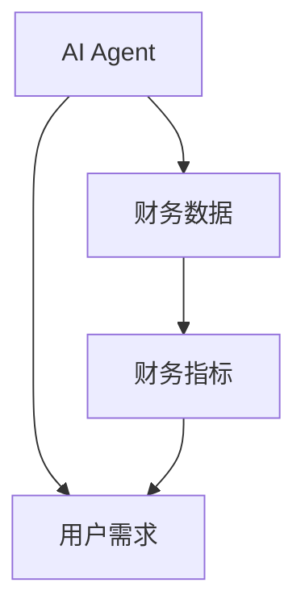
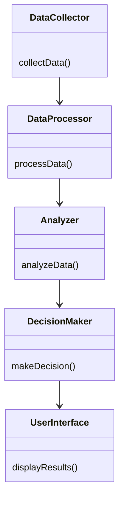
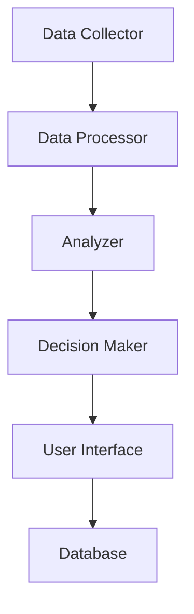
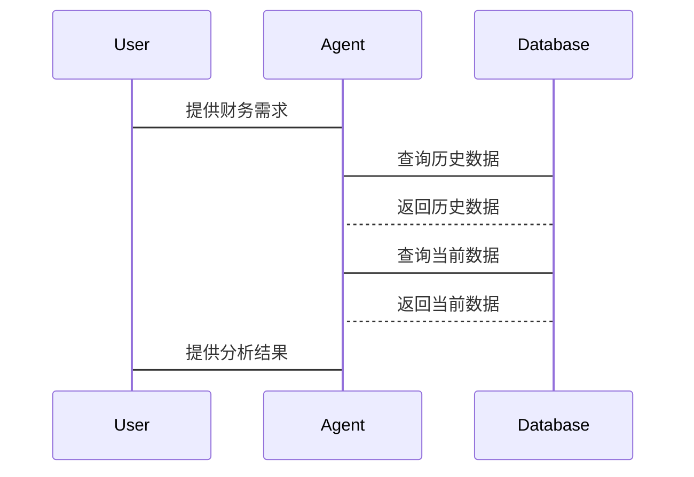

                 


# 开发AI Agent支持的智能财务分析系统

> 关键词：AI Agent, 智能财务分析, 机器学习, 自然语言处理, 系统架构

> 摘要：本文详细探讨了开发AI Agent支持的智能财务分析系统的各个方面，包括系统背景、核心概念、算法原理、系统架构设计、项目实战、最佳实践等。通过结合AI Agent与财务分析，我们展示了如何利用先进的技术手段提高财务分析的效率和准确性。

---

## 第一章: 背景介绍

### 1.1 问题背景与描述
财务分析是企业管理和决策中的重要环节，传统的财务分析系统依赖于人工操作，存在效率低下、主观性强、难以实时分析等问题。随着AI技术的快速发展，引入AI Agent（智能体）支持的财务分析系统成为可能，这将显著提升财务分析的效率和准确性。

#### 1.1.1 传统财务分析系统的挑战
1. 数据量大：企业财务数据日益庞大，人工分析耗时耗力。
2. 信息不全：传统系统难以处理非结构化数据，如财务报告和市场新闻。
3. 实时性差：传统系统难以实现实时监控和预测。

#### 1.1.2 AI Agent在财务分析中的潜力
AI Agent能够实时处理大量数据，通过自然语言处理（NLP）、机器学习（ML）等技术，从文本、表格、图像等多种数据源中提取信息，生成实时的财务分析结果。此外，AI Agent还可以根据历史数据和实时市场动态，提供智能预测和决策支持。

#### 1.1.3 当前问题与需求分析
目前，企业对财务分析的需求主要集中在以下几个方面：
1. **实时监控**：实时跟踪财务指标，及时发现异常。
2. **智能预测**：基于历史数据和市场动态，预测未来财务状况。
3. **自动化报告**：自动生成财务报告，减少人工干预。
4. **决策支持**：提供数据驱动的决策支持，优化企业运营。

---

## 第二章: 核心概念与联系

### 2.1 核心概念原理
AI Agent是一种能够感知环境并采取行动以实现目标的智能实体。在智能财务分析系统中，AI Agent的主要功能包括：
1. **数据采集**：从多种数据源（如财务报表、市场新闻、社交媒体）获取数据。
2. **数据处理**：对数据进行清洗、转换和分析。
3. **决策制定**：基于分析结果，提供财务建议或预测。
4. **用户交互**：通过自然语言交互与用户进行实时对话。

#### 2.1.1 智能财务分析系统的功能特点
智能财务分析系统具有以下特点：
- **智能化**：能够理解上下文，提供智能建议。
- **实时性**：支持实时数据处理和分析。
- **可扩展性**：能够处理不同类型和规模的数据。

### 2.2 概念对比分析
以下是AI Agent与传统财务分析工具的对比：

| **对比维度** | **AI Agent** | **传统财务分析工具** |
|--------------|--------------|-----------------------|
| **数据处理能力** | 多源、多模态 | 单一数据源、结构化 |
| **实时性**     | 实时处理     | 非实时               |
| **决策能力**   | 自主决策     | 依赖人工              |
| **可扩展性**   | 高           | 低                   |

#### 2.2.1 ER实体关系图
以下是AI Agent支持的智能财务分析系统的实体关系图：



---

## 第三章: 算法原理讲解

### 3.1 自然语言处理算法
自然语言处理（NLP）是AI Agent理解财务文本的核心技术。

#### 3.1.1 文本预处理流程
1. **分词**：将文本分割成词语或短语。
2. **词性标注**：对每个词语进行词性标注（如名词、动词）。
3. **实体识别**：识别文本中的关键实体（如公司名称、财务指标）。

#### 3.1.2 语义理解与生成
- 使用BERT等预训练模型进行语义理解。
- 通过生成对抗网络（GAN）生成自然语言文本。

#### 3.1.3 代码实现
以下是一个简单的NLP处理代码示例：
```python
import spacy

nlp = spacy.load("en_core_web_sm")
text = "The company's revenue increased by 10% last quarter."
doc = nlp(text)

for token in doc:
    print(token.text, token.pos_)
```

### 3.2 强化学习算法
强化学习（Reinforcement Learning）用于优化AI Agent的决策过程。

#### 3.2.1 状态空间定义
- 状态：当前的市场状况、财务指标。
- 行动：买入、卖出、持有。

#### 3.2.2 动作空间设计
- 动作：根据当前状态，选择最优动作。

#### 3.2.3 奖励机制实现
- 奖励：根据动作的结果，给予正向或负向奖励。

#### 3.2.4 代码实现
以下是一个简单的强化学习代码示例：
```python
import numpy as np

class Agent:
    def __init__(self, state_space, action_space):
        self.state_space = state_space
        self.action_space = action_space
        self.Q = {}  # Q-learning table

    def choose_action(self, state):
        if state in self.Q:
            return max(self.Q[state], key=lambda k: self.Q[state][k])
        else:
            return random.choice(self.action_space)

    def update_Q(self, state, action, reward, next_state):
        alpha = 0.1
        gamma = 0.9
        current_q = self.Q.get((state, action), 0)
        next_max_q = max(self.Q.get((next_state, a), 0) for a in self.action_space)
        self.Q[(state, action)] = current_q + alpha * (reward + gamma * next_max_q)
```

---

## 第四章: 系统分析与架构设计

### 4.1 问题场景介绍
智能财务分析系统需要处理以下问题场景：
1. **数据采集**：从多种数据源获取财务数据。
2. **数据处理**：清洗、转换和分析数据。
3. **决策制定**：基于分析结果，提供财务建议。

### 4.2 系统功能设计
以下是系统的功能模块设计：



### 4.3 系统架构设计
以下是系统的架构设计：



### 4.4 接口设计与交互
以下是系统的交互流程图：



---

## 第五章: 项目实战

### 5.1 环境安装
1. **安装Python**：确保安装了Python 3.8或更高版本。
2. **安装依赖库**：安装所需的依赖库，如`numpy`、`pandas`、`spacy`等。

### 5.2 系统核心实现
以下是系统的核心实现代码：

```python
import spacy
import pandas as pd

def collect_data():
    # 数据采集逻辑
    pass

def process_data(data):
    # 数据处理逻辑
    return data

def analyze_data(data):
    # 数据分析逻辑
    return result

def make_decision(result):
    # 决策逻辑
    return action

def display_result(action):
    # 结果展示逻辑
    pass
```

### 5.3 案例分析与解读
假设我们有一个财务数据集，包含以下字段：
- `revenue`：收入
- `profit`：利润
- `market_share`：市场份额

我们可以使用Python进行数据分析：

```python
data = pd.DataFrame({
    'revenue': [100, 200, 300],
    'profit': [20, 40, 60],
    'market_share': [0.1, 0.2, 0.3]
})

print(data.describe())
```

### 5.4 项目总结
通过本项目，我们展示了如何开发一个基于AI Agent的智能财务分析系统。该系统能够从多种数据源采集数据，进行数据分析和预测，并提供决策支持。

---

## 第六章: 最佳实践与小结

### 6.1 最佳实践
1. **数据质量**：确保数据的准确性和完整性。
2. **模型优化**：定期优化模型，提高预测精度。
3. **用户反馈**：根据用户反馈，不断改进系统功能。

### 6.2 小结
本文详细探讨了开发AI Agent支持的智能财务分析系统的各个方面，包括背景、核心概念、算法原理、系统架构设计、项目实战等。通过结合AI Agent与财务分析，我们能够显著提高财务分析的效率和准确性。

---

## 作者信息

作者：AI天才研究院/AI Genius Institute & 禅与计算机程序设计艺术 /Zen And The Art of Computer Programming

