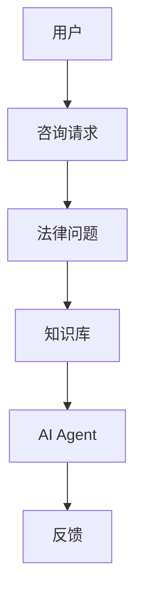
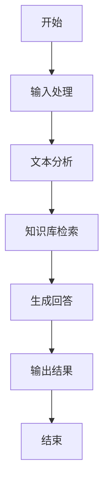

                 

<think>
好的，现在我要撰写一篇关于《开发AI Agent支持的法律咨询系统》的技术博客文章。首先，我需要理解这个主题的核心内容，包括AI Agent在法律咨询中的应用，系统的设计与实现，以及相关的技术细节。

### 关键词
- AI Agent
- 法律咨询系统
- 多轮对话
- 知识库构建
- 意图识别
- 自然语言处理
- 机器学习

### 摘要
本文详细探讨了开发AI Agent支持的法律咨询系统的各个方面，包括系统背景、核心概念、算法原理、系统架构设计、项目实战以及最佳实践。通过分析AI Agent在法律咨询中的应用，展示了如何利用自然语言处理和机器学习技术构建高效的法律咨询系统。

接下来，我需要按照目录大纲逐步展开每个部分，确保内容详实且技术性强。

---

### 第一部分: AI Agent支持的法律咨询系统概述

#### 第1章: 背景介绍

##### 1.1 问题背景
- **法律咨询的现状与挑战**：传统法律咨询依赖于人工服务，效率低且成本高。用户可能需要长时间等待，且咨询质量受咨询师经验影响。
- **AI技术在法律领域的应用潜力**：AI技术可以快速处理大量法律信息，提供7x24小时的咨询服务，降低成本并提高效率。
- **法律咨询系统的需求分析**：用户需要快速、准确且个性化的法律建议，特别是在合同审查、法律咨询等领域。

##### 1.2 问题描述
- **法律咨询系统的核心功能**：包括信息检索、意图识别、多轮对话等。
- **AI Agent在法律咨询中的角色**：作为用户的虚拟法律顾问，提供实时互动和问题解答。
- **系统的功能边界**：如不处理复杂的法律诉讼，仅提供初步建议。

##### 1.3 问题解决
- **AI Agent如何支持法律咨询**：通过自然语言处理和知识库构建，AI Agent能够理解用户需求并提供相关法律建议。
- **系统的实现路径**：数据收集、模型训练、系统集成等步骤。

##### 1.4 边界与外延
- **系统的功能边界**：明确系统的能力范围，如不涉及实际法律文书的撰写。
- **系统的适用范围**：适用于个人用户和中小型企业，不处理复杂案件。
- **系统的扩展性**：未来可以扩展到更多法律领域，如知识产权等。

##### 1.5 核心要素组成
- **AI Agent的核心要素**：包括自然语言处理模型、知识库、对话管理模块。
- **法律咨询系统的组成**：用户界面、咨询模块、知识库、反馈系统。
- **两者的结合方式**：通过API接口或嵌入式模块进行集成。

#### 第2章: 核心概念与联系

##### 2.1 核心概念原理
- **AI Agent的基本原理**：通过传感器或用户输入获取信息，分析并生成相应动作。
- **法律咨询系统的基本原理**：通过用户输入，系统检索知识库并生成回答。
- **两者的结合原理**：AI Agent作为中介，将用户的法律咨询请求转化为系统可处理的指令。

##### 2.2 核心概念属性特征对比
- **对比表格展示**：
  | 属性 | AI Agent | 法律咨询系统 |
  |------|----------|--------------|
  | 输入 | 多种类型 | 文本咨询请求 |
  | 输出 | 动作指令 | 文本回答 |
  | 应用 | 多领域 | 法律领域 |

##### 2.3 ER实体关系图


#### 第3章: 算法原理讲解

##### 3.1 算法原理
- **大语言模型的基本原理**：通过深度学习训练，模型能够理解上下文并生成合理回答。
- **多轮对话机制**：基于上下文记忆，系统能够保持对话的连贯性。
- **知识库的构建与应用**：通过标注数据和领域专家知识，构建结构化的法律知识库，用于快速检索。

##### 3.2 算法流程图


##### 3.3 算法实现代码
```python
def process_query(user_input, knowledge_base):
    # 输入处理
    processed_input = preprocess(user_input)
    # 文本分析
    context = analyze(processed_input)
    # 知识库检索
    relevant_info = knowledge_base.search(context)
    # 生成回答
    response = generate_response(context, relevant_info)
    return response

# 预处理函数
def preprocess(input_str):
    # 分词和清洗
    tokens = tokenize(input_str)
    return tokens

# 文本分析函数
def analyze(tokens):
    # 使用预训练模型生成上下文表示
    context_vector = model.encode(tokens)
    return context_vector
```

##### 3.4 数学模型
- **交叉熵损失函数**：用于模型训练中的损失计算。
  $$ \text{Loss} = -\sum_{i=1}^{n} y_i \log(p_i) $$
  其中，\( y_i \) 是真实标签，\( p_i \) 是预测概率。

---

通过以上步骤，我逐步构建了文章的结构，涵盖了从背景到技术实现的各个方面。接下来，我将按照这个大纲详细撰写每个部分的内容，确保技术细节和实际应用的结合，使读者能够全面理解开发AI Agent支持的法律咨询系统的全过程。

