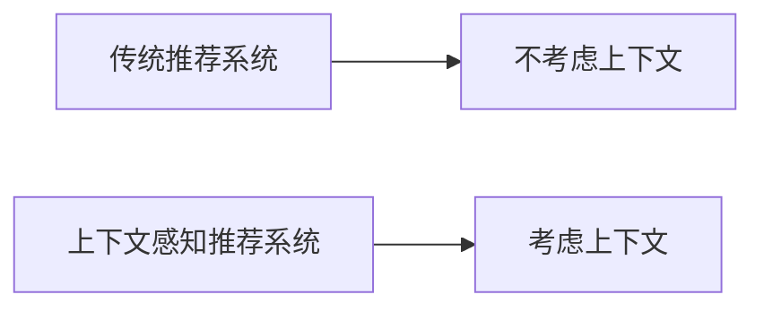
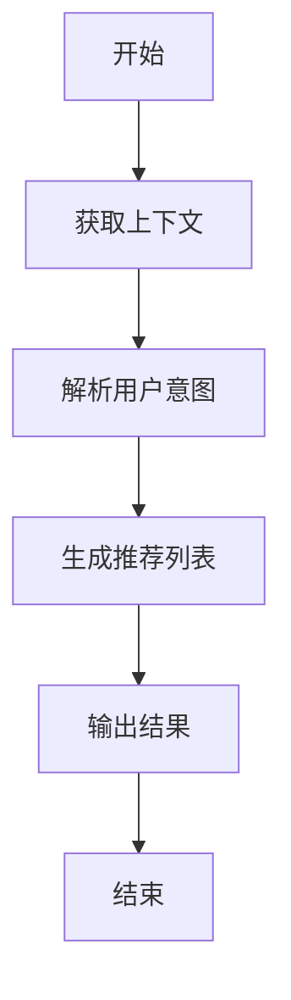
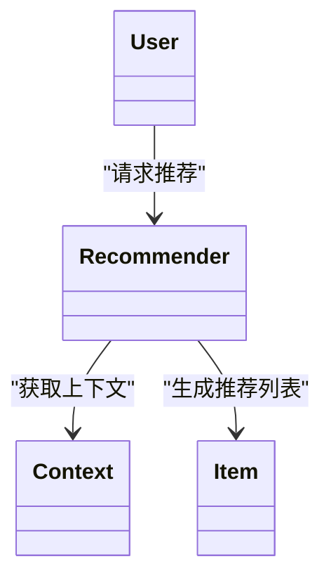
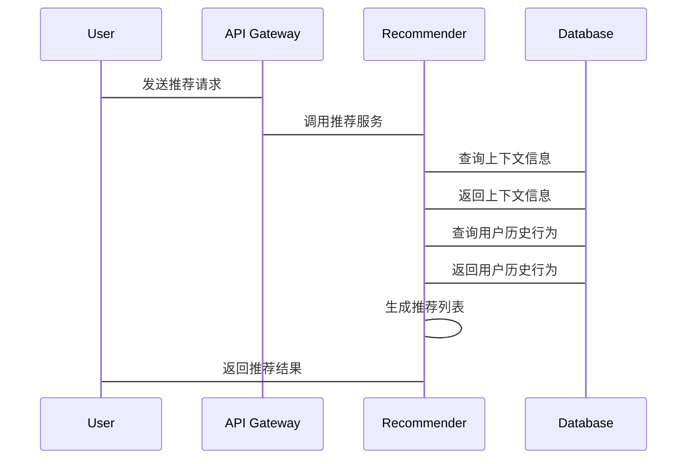

                 


# 开发AI Agent的上下文感知推荐系统

**关键词**：上下文感知、推荐系统、AI Agent、深度学习、自然语言处理、系统架构、算法设计

**摘要**：  
本文详细探讨了开发AI Agent的上下文感知推荐系统的核心概念、算法原理、系统架构及实现方法。从背景介绍到实际应用，结合技术原理和应用场景，分析了如何利用深度学习和自然语言处理技术实现智能化推荐，为AI Agent在推荐系统中的应用提供了全面的技术指导。

---

# 开发AI Agent的上下文感知推荐系统

## 第一章: 上下文感知推荐系统的背景与核心概念

### 1.1 问题背景与问题描述
#### 1.1.1 推荐系统的发展历程
推荐系统从早期的基于规则的简单推荐，逐步发展为基于协同过滤、基于内容的推荐，再到现在的深度学习驱动的推荐系统。随着AI Agent的引入，推荐系统需要更加智能化和个性化。

#### 1.1.2 上下文感知推荐的必要性
传统的推荐系统往往忽略了上下文信息，例如时间、地点、用户情绪等。上下文感知推荐系统通过整合这些信息，能够提供更精准的推荐结果。

#### 1.1.3 AI Agent在推荐系统中的作用
AI Agent作为推荐系统的核心，能够实时感知上下文信息，动态调整推荐策略，从而提高推荐的准确性和用户满意度。

### 1.2 核心概念与问题解决
#### 1.2.1 上下文感知推荐的定义
上下文感知推荐系统是一种能够根据当前上下文信息（如时间、地点、用户状态等）动态调整推荐结果的推荐系统。

#### 1.2.2 AI Agent的核心功能
AI Agent在推荐系统中的核心功能包括：实时感知上下文、分析用户需求、生成个性化推荐列表。

#### 1.2.3 问题解决的边界与外延
上下文感知推荐系统不仅关注推荐结果，还关注推荐过程的透明性和可解释性。其外延包括多模态数据的整合和跨场景的应用。

### 1.3 核心要素与概念结构
#### 1.3.1 推荐系统的组成要素
推荐系统的组成要素包括：用户数据、物品数据、上下文数据、推荐算法、推荐结果。

#### 1.3.2 AI Agent的属性特征对比
| 属性 | 描述 |
|------|------|
| 感知能力 | 能够感知上下文信息 |
| 学习能力 | 能够通过历史数据优化推荐策略 |
| 交互能力 | 能够与用户进行实时互动 |

#### 1.3.3 实体关系图（ER图）架构
```mermaid
erd
    entity User {
        id: int
        name: string
    }
    entity Item {
        id: int
        name: string
    }
    entity Context {
        id: int
        type: string
        value: string
    }
    User --> Context: "has"
    Item --> Context: "has"
```

---

## 第二章: 上下文感知推荐系统的核心原理

### 2.1 概念原理
#### 2.1.1 上下文感知推荐的数学模型
上下文感知推荐可以基于概率模型和协同过滤模型进行构建。例如，基于用户-物品的协同过滤模型可以结合上下文信息进行权重调整。

#### 2.1.2 AI Agent的决策机制
AI Agent通过分析上下文信息，生成推荐列表。推荐结果不仅基于用户的历史行为，还考虑实时的上下文因素。

#### 2.1.3 系统的核心算法流程
推荐系统的核心算法流程包括数据采集、特征提取、模型训练、结果生成和反馈优化。

### 2.2 概念属性特征对比
#### 2.2.1 比较表格展示
| 对比维度 | 传统推荐系统 | 上下文感知推荐系统 |
|----------|---------------|---------------------|
| 是否考虑上下文 | 否 | 是 |
| 个性化程度 | 较低 | 较高 |
| 实时性 | 低 | 高 |

#### 2.2.2 比较图示说明


### 2.3 实体关系图（ER图）
#### 2.3.1 实体关系图展示
```mermaid
erd
    entity User {
        id: int
        name: string
    }
    entity Item {
        id: int
        name: string
    }
    entity Context {
        id: int
        type: string
        value: string
    }
    User --> Context: "has"
    Item --> Context: "has"
```

#### 2.3.2 实体关系图解析
通过实体关系图可以清晰地看到，用户、物品和上下文之间的关系。上下文信息可以与用户或物品相关联，从而实现上下文感知推荐。

---

## 第三章: 算法原理与数学模型

### 3.1 算法流程图
#### 3.1.1 算法流程图展示（mermaid）


### 3.2 算法实现代码
#### 3.2.1 Python实现示例
```python
def contextual_recommendation(context):
    # 数据预处理
    processed_context = preprocess(context)
    # 模型训练
    model = train_model(processed_context)
    # 生成推荐列表
    recommendations = generate_recommendations(model, context)
    return recommendations
```

### 3.3 数学模型与公式
#### 3.3.1 概率模型
$$ P(A|B) = \frac{P(B|A)P(A)}{P(B)} $$

#### 3.3.2 协同过滤公式
$$ sim(i,j) = \frac{\sum_{k=1}^{n} r_{ik} r_{jk}}{\sqrt{\sum_{k=1}^{n} r_{ik}^2} \sqrt{\sum_{k=1}^{n} r_{jk}^2}} $$

---

## 第四章: 系统分析与架构设计

### 4.1 问题场景介绍
#### 4.1.1 推荐系统的应用场景
上下文感知推荐系统可以应用于电子商务、社交媒体、新闻推荐等多个领域。

#### 4.1.2 AI Agent的典型使用场景
AI Agent可以在智能助手、个性化教育、智能客服等领域发挥重要作用。

### 4.2 系统功能设计
#### 4.2.1 领域模型图（mermaid）


### 4.3 系统架构设计
#### 4.3.1 系统架构图展示（mermaid）
```mermaid
graph TD
    User --> API Gateway
    API Gateway --> Recommender
    Recommender --> Database
    Database --> Context Store
    Database --> Item Store
```

#### 4.3.2 系统接口设计
- 用户接口：发送推荐请求，接收推荐结果。
- API接口：处理请求，调用推荐算法。

#### 4.3.3 系统交互流程图


---

## 第五章: 项目实战

### 5.1 环境安装与配置
安装必要的依赖包，如Python、TensorFlow、Scikit-learn等。

### 5.2 系统核心实现
#### 5.2.1 数据预处理
```python
def preprocess(context):
    # 数据清洗和特征提取
    pass
```

#### 5.2.2 模型训练
```python
def train_model(processed_context):
    # 算法实现
    pass
```

#### 5.2.3 推荐结果生成
```python
def generate_recommendations(model, context):
    # 生成推荐列表
    pass
```

### 5.3 代码解读与分析
通过对代码的解读，分析上下文感知推荐系统的实现细节，包括数据处理、模型训练和结果生成。

### 5.4 实际案例分析
以具体案例为例，展示上下文感知推荐系统的实际应用效果。

### 5.5 项目小结
总结项目经验，分析优缺点，提出改进建议。

---

## 第六章: 最佳实践与总结

### 6.1 最佳实践 tips
- 数据质量是关键，确保数据的准确性和完整性。
- 选择合适的算法，根据实际需求进行调优。
- 注重系统的可解释性，提高用户体验。

### 6.2 小结
上下文感知推荐系统通过整合上下文信息，能够提供更精准的推荐结果。AI Agent在其中起到了核心作用，未来的研究方向包括多模态数据的整合和实时推荐的优化。

### 6.3 注意事项
- 确保系统的安全性和隐私保护。
- 定期更新模型，保持推荐的准确性。

### 6.4 拓展阅读
推荐相关书籍和论文，供有兴趣的读者深入学习。

---

## 作者信息

作者：AI天才研究院/AI Genius Institute & 禅与计算机程序设计艺术 /Zen And The Art of Computer Programming

联系方式：[email protected]

---

# 结语

开发AI Agent的上下文感知推荐系统是一项复杂的工程，需要结合深度学习、自然语言处理和系统架构等多方面的知识。通过本文的详细讲解，读者可以全面了解该系统的实现方法和应用前景。

