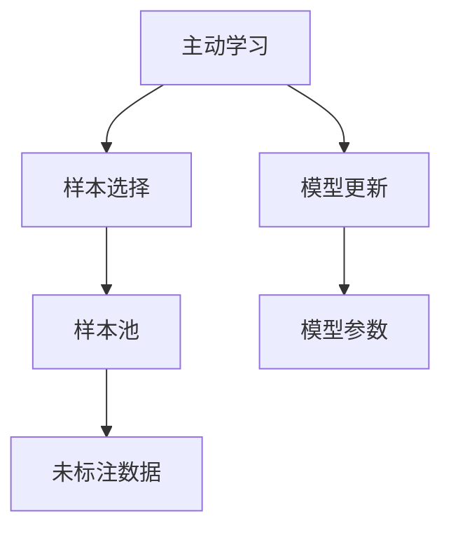
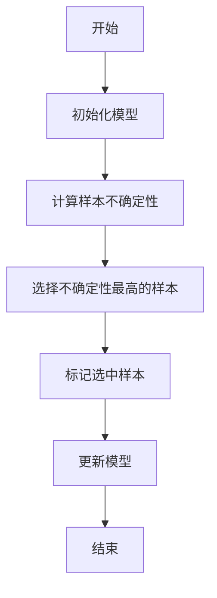
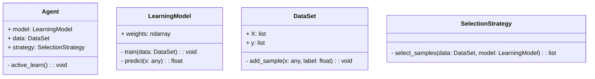
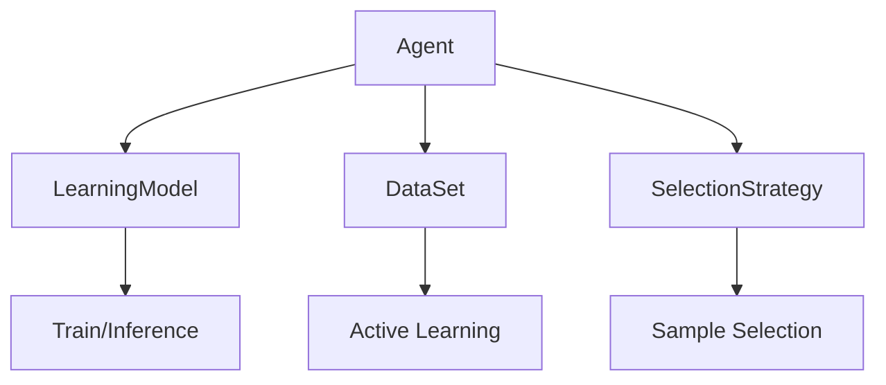
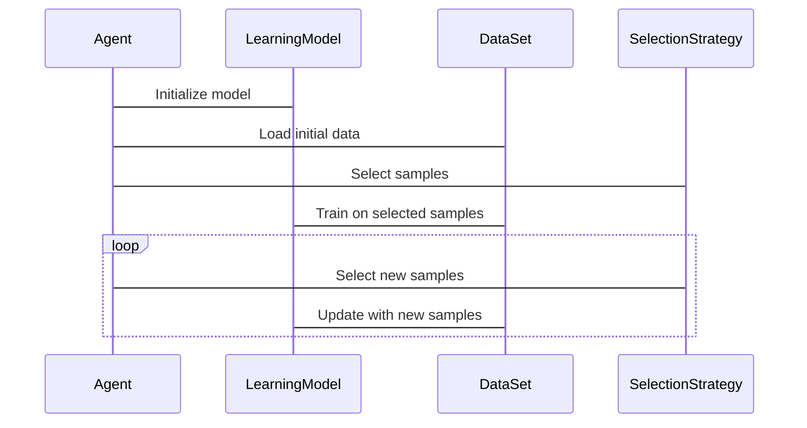

                 


# 开发AI Agent的主动学习能力：优化学习效率

**关键词**：主动学习，AI Agent，机器学习，不确定性采样，查询学习，系统架构设计

**摘要**：本文详细探讨了开发AI Agent的主动学习能力，从基本概念到算法原理，再到系统架构设计和项目实战，全面解析了如何优化AI Agent的学习效率。通过深入分析主动学习的核心原理、主流算法及其应用场景，结合实际案例，为读者提供了一套完整的主动学习开发框架。

---

# 第1章: 主动学习与AI Agent概述

## 1.1 主动学习的定义与核心概念

### 1.1.1 什么是主动学习

主动学习是一种机器学习范式，与传统的被动学习（如监督学习）不同，主动学习的核心在于算法能够主动选择对自身学习最有帮助的数据样本。这种选择性学习机制使得AI Agent能够在有限的标注数据下，以更高的效率和效果完成学习任务。

### 1.1.2 主动学习的核心要素

主动学习系统的核心要素包括：

1. **样本选择策略**：决定如何从未标注数据中选择最有价值的样本。
2. **模型更新机制**：根据新选择的样本更新模型参数。
3. **知识表示方法**：将已学习的知识表示为可复用的形式。

### 1.1.3 AI Agent与主动学习的关系

AI Agent通过主动学习能力，能够根据任务需求动态选择学习数据，从而实现自我优化和适应。主动学习是AI Agent实现自主学习和智能进化的关键能力之一。

## 1.2 主动学习的基本原理

### 1.2.1 主动学习的基本流程

主动学习的基本流程包括以下几个步骤：

1. 初始化：选择一个初始模型，并使用少量标注数据进行训练。
2. 样本选择：根据当前模型的预测结果，选择对模型改进最有帮助的未标注样本。
3. 标注与更新：对选中的样本进行标注，并将其加入训练数据，重新训练模型。
4. 迭代优化：重复样本选择和模型更新的过程，直到满足停止条件（如达到预设的性能目标或数据耗尽）。

### 1.2.2 主动学习的核心算法

主动学习的核心算法包括不确定性采样、查询学习等方法。这些算法通过不同的策略选择最有价值的样本，从而优化学习效率。

### 1.2.3 主动学习的优缺点

主动学习的优点包括：

- **数据效率高**：通过选择性学习，减少对大量标注数据的依赖。
- **模型性能好**：在有限数据下，能够获得更好的模型性能。

主动学习的缺点包括：

- **计算复杂度高**：选择样本的过程需要多次模型预测和计算。
- **依赖领域知识**：样本选择策略的有效性依赖于具体应用场景。

## 1.3 AI Agent主动学习的应用场景

### 1.3.1 机器学习中的主动学习

在机器学习中，主动学习常用于分类、回归等任务，特别是在数据标注成本较高的场景下。

### 1.3.2 自然语言处理中的主动学习

在自然语言处理中，主动学习可用于文本分类、情感分析等任务，帮助模型更快收敛。

### 1.3.3 计算机视觉中的主动学习

在计算机视觉中，主动学习可用于图像分类、目标检测等任务，提升模型的泛化能力。

## 1.4 本章小结

本章介绍了主动学习的基本概念、核心要素及其在AI Agent中的应用。通过对比主动学习与传统学习方法的差异，初步明确了主动学习在优化AI Agent学习效率中的重要作用。

---

# 第2章: 主动学习的核心概念与联系

## 2.1 主动学习的核心概念

### 2.1.1 样本选择策略

样本选择策略是主动学习的核心，常用的策略包括：

- **不确定性采样**：选择模型预测概率最低的样本。
- **多样性采样**：选择具有代表性的样本，避免模型过拟合局部区域。

### 2.1.2 模型更新机制

模型更新机制是指在选择新样本后，如何有效地更新模型参数以提升性能。

### 2.1.3 知识表示方法

知识表示方法是将已学习的知识以某种形式存储，以便后续复用。

## 2.2 主动学习与其它学习方式的对比

### 2.2.1 主动学习与监督学习的对比

| 对比维度 | 主动学习 | 监督学习 |
|----------|----------|----------|
| 数据需求 | 需要主动选择 | 需要全部标注 |
| 数据效率 | 高 | 低 |
| 模型性能 | 好 | 一般 |

### 2.2.2 主动学习与无监督学习的对比

| 对比维度 | 主动学习 | 无监督学习 |
|----------|----------|----------|
| 数据需求 | 需要少量标注 | 需要全部未标注 |
| 数据效率 | 中等 | 低 |
| 模型性能 | 好 | 一般 |

### 2.2.3 主动学习与强化学习的对比

| 对比维度 | 主动学习 | 强化学习 |
|----------|----------|----------|
| 数据需求 | 需要少量标注 | 需要大量交互 |
| 数据效率 | 高 | 高 |
| 模型性能 | 好 | 一般 |

## 2.3 主动学习的ER实体关系图



## 2.4 本章小结

本章详细分析了主动学习的核心概念及其与其它学习方式的差异，通过对比分析和实体关系图，进一步明确了主动学习的内在逻辑和应用场景。

---

# 第3章: 主动学习的算法原理

## 3.1 主动学习的主流算法

### 3.1.1 不确定性采样

不确定性采样是一种常用的主动学习策略，通过选择模型预测概率最低的样本，迫使模型学习更复杂的决策边界。

### 3.1.2 查询学习

查询学习是一种主动学习方法，通过模型主动向标注者提问，选择最有价值的样本进行标注。

### 3.1.3 样本加权方法

样本加权方法通过为每个样本分配权重，指导模型在训练过程中更关注某些样本。

## 3.2 不确定性采样算法流程



## 3.3 查询学习算法实现

```python
def query_learning(X, y, unlabeled_X, model):
    # 计算模型对未标注数据的预测概率
    prob = model.predict_proba(unlabeled_X)
    # 选择预测概率最小的样本
    selected_idx = np.argmin(prob, axis=1)
    # 标记选中样本
    selected_X = unlabeled_X[selected_idx]
    selected_y = y[selected_idx]
    # 更新模型
    model.fit(selected_X, selected_y)
    return model
```

## 3.4 算法的数学模型与公式

### 3.4.1 不确定性度量公式

不确定性度量公式为：

$$ 

P(y|x) = \frac{e^{y_i}}{\sum_j e^{y_j}}

$$ 

其中，$y_i$是模型对样本$x$的第$i$个类别的预测概率。

## 3.5 本章小结

本章通过详细分析主动学习的主流算法及其实现流程，为读者提供了一套完整的主动学习算法框架。

---

# 第4章: AI Agent主动学习的系统架构设计

## 4.1 系统功能设计

### 4.1.1 领域模型设计



### 4.1.2 系统架构设计



### 4.1.3 系统交互设计



## 4.2 系统接口设计

### 4.2.1 样本选择接口

```python
def select_samples(data_set, model):
    # 返回选中的样本索引
    return selected_indices
```

### 4.2.2 模型更新接口

```python
def update_model(data_set, model):
    # 更新模型参数
    model.fit(data_set.X, data_set.y)
    return model
```

## 4.3 本章小结

本章通过系统架构设计，展示了如何将主动学习能力集成到AI Agent中，为后续的项目实现奠定了基础。

---

# 第5章: 项目实战——基于主动学习的AI Agent开发

## 5.1 项目背景与目标

本项目旨在开发一个具备主动学习能力的AI Agent，使其能够在特定任务中通过主动选择数据样本，实现高效学习。

## 5.2 环境安装与配置

```bash
pip install numpy scikit-learn
```

## 5.3 核心代码实现

```python
class ActiveLearningAgent:
    def __init__(self, model, data_set):
        self.model = model
        self.data_set = data_set
        self.strategy = UncertaintySampling()

    def active_learn(self, iterations=10):
        for _ in range(iterations):
            # 选择样本
            selected_indices = self.strategy.select_samples(self.data_set, self.model)
            # 标记样本
            selected_X = self.data_set.X[selected_indices]
            selected_y = self.data_set.y[selected_indices]
            # 更新模型
            self.model.fit(selected_X, selected_y)
            # 更新数据集
            self.data_set.add_samples(selected_X, selected_y)
```

## 5.4 项目小结

本章通过具体实现一个基于主动学习的AI Agent，展示了如何将理论知识应用到实际项目中。

---

# 第6章: 开发AI Agent主动学习能力的注意事项与优化建议

## 6.1 注意事项

1. **数据稀疏性问题**：在某些领域中，数据可能非常稀疏，导致主动学习效果不佳。
2. **计算复杂度**：主动学习需要多次模型训练，计算复杂度较高。
3. **样本选择策略的有效性**：不同策略在不同场景下表现不同，需谨慎选择。

## 6.2 优化建议

1. **选择合适的算法**：根据具体任务选择合适的主动学习算法。
2. **优化模型选择**：选择适合主动学习的模型，如支持概率预测的模型。
3. **结合领域知识**：利用领域知识优化样本选择策略。

## 6.3 本章小结

本章总结了开发AI Agent主动学习能力的注意事项与优化建议，为读者提供了实践指导。

---

# 第7章: 总结与展望

## 7.1 本章总结

本文详细探讨了开发AI Agent主动学习能力的关键技术，从算法原理到系统架构设计，再到项目实战，全面解析了主动学习的核心原理和实现方法。

## 7.2 未来展望

随着AI技术的不断发展，主动学习将在更多领域得到应用。未来的研究方向包括更高效的样本选择策略、更智能的模型更新机制等。

## 7.3 本章小结

本文为读者提供了一套完整的主动学习开发框架，为AI Agent的智能化发展提供了重要参考。

---

# 作者：AI天才研究院/AI Genius Institute & 禅与计算机程序设计艺术 /Zen And The Art of Computer Programming

