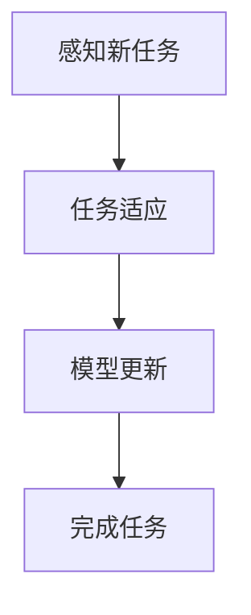

                 


# 开发AI Agent的元学习框架：快速适应新任务

> 关键词：AI Agent，元学习，快速适应，任务迁移，深度学习

> 摘要：本文将深入探讨如何开发AI Agent的元学习框架，使其能够快速适应新任务。通过分析元学习的核心原理、算法实现和系统架构设计，结合具体项目实战，展示如何利用元学习框架提升AI Agent的任务适应能力。文章将从背景介绍、核心概念、算法原理、系统架构、项目实战等多个维度展开，为读者提供全面的技术指导。

---

# 第一部分: AI Agent与元学习框架概述

## 第1章: AI Agent与元学习的基本概念

### 1.1 AI Agent的定义与特点

#### 1.1.1 AI Agent的定义
AI Agent（人工智能代理）是一种能够感知环境、自主决策并执行任务的智能体。它可以是一个软件程序或物理设备，通过传感器和执行器与环境交互。

#### 1.1.2 AI Agent的核心特点
- **自主性**：能够自主决策，无需外部干预。
- **反应性**：能够实时感知环境并做出反应。
- **目标导向**：具有明确的目标，并通过行动实现目标。
- **学习能力**：能够通过经验改进性能。

#### 1.1.3 AI Agent与传统AI的区别
传统的AI系统通常依赖于预定义的规则和数据，而AI Agent具备自主学习和适应环境的能力，能够动态调整策略以应对变化。

---

### 1.2 元学习的基本概念

#### 1.2.1 元学习的定义
元学习（Meta-Learning）是一种机器学习方法，旨在通过学习如何学习来提高模型的适应能力。元学习的核心思想是让模型能够快速适应新任务，而无需从头开始训练。

#### 1.2.2 元学习的核心特点
- **快速适应**：能够在新任务上快速收敛，减少对新数据的依赖。
- **任务迁移**：能够将已学知识迁移到新任务中。
- **泛化能力**：具备在不同任务之间迁移的能力。

#### 1.2.3 元学习与传统机器学习的对比
传统机器学习算法需要大量的标注数据和长时间的训练，而元学习通过在多个任务上进行预训练，能够在新任务上快速调整。

---

### 1.3 AI Agent中的元学习框架

#### 1.3.1 元学习在AI Agent中的作用
元学习框架能够赋予AI Agent快速适应新任务的能力，使其在动态变化的环境中保持高效性和灵活性。

#### 1.3.2 元学习框架的分类
- **基于梯度的元学习框架**：如MAML（Meta-Automated Learning）。
- **基于优化头的元学习框架**：如ReM（Recurrent Meta-Learning）。
- **基于神经网络的元学习框架**：如Neural Networks for Meta-Learning。

#### 1.3.3 元学习框架与任务适应性的关系
元学习框架通过优化模型的参数或结构，使得AI Agent能够在新任务上快速找到最优解。

---

## 第2章: 元学习框架的核心原理

### 2.1 元学习的数学模型

#### 2.1.1 元学习的优化目标
元学习的目标是通过在多个任务上的预训练，使得模型能够快速适应新任务。

$$ L = \sum_{i=1}^{N} \sum_{j=1}^{M} \mathbb{I}(y_{i,j} \neq f_{\theta}(x_{i,j})) $$

其中，$L$ 是损失函数，$N$ 是任务的数量，$M$ 是每个任务的样本数量，$\mathbb{I}$ 是指示函数。

#### 2.1.2 元学习的数学公式
元学习的优化目标可以表示为：

$$ \theta_{new} = \theta - \epsilon \nabla_{\theta} \mathcal{L}_i $$

其中，$\theta$ 是模型参数，$\epsilon$ 是学习率，$\mathcal{L}_i$ 是第i个任务的损失函数。

#### 2.1.3 元学习的梯度计算
元学习的梯度计算需要考虑多个任务之间的关系，通过梯度的平均或加权来优化模型参数。

---

### 2.2 元学习算法的原理

#### 2.2.1 基于MAML的元学习算法
MAML（Meta-Automated Learning）是一种基于梯度的元学习算法，其核心思想是通过计算任务间的梯度关系来更新模型参数。

#### 2.2.2 基于ReM的元学习算法
ReM（Recurrent Meta-Learning）是一种基于循环神经网络的元学习算法，通过在任务之间保持状态来实现快速适应。

---

### 2.3 元学习框架在AI Agent中的应用

#### 2.3.1 元学习框架的适应性优势
元学习框架能够使得AI Agent在新任务上快速找到最优解，减少对新数据的依赖。

#### 2.3.2 元学习框架的可扩展性特点
元学习框架能够支持多种任务类型，具备良好的可扩展性。

#### 2.3.3 元学习框架的性能优化
通过优化模型的参数或结构，元学习框架能够在保持高性能的同时，减少计算资源的消耗。

---

## 第3章: 元学习框架的算法实现

### 3.1 基于MAML的元学习算法

#### 3.1.1 MAML算法的基本原理
MAML算法通过计算任务间的梯度关系来更新模型参数，使得模型能够在新任务上快速收敛。

#### 3.1.2 MAML算法的数学公式
$$ \theta_{new} = \theta - \epsilon \nabla_{\theta} \mathcal{L}_i $$

其中，$\theta$ 是模型参数，$\epsilon$ 是学习率，$\mathcal{L}_i$ 是第i个任务的损失函数。

#### 3.1.3 MAML算法的实现步骤
1. 在多个任务上预训练模型。
2. 在新任务上计算梯度并更新模型参数。

---

### 3.2 基于ReM的元学习算法

#### 3.2.1 ReM算法的基本原理
ReM算法通过在任务之间保持状态来实现快速适应。

#### 3.2.2 ReM算法的数学公式
$$ \theta_{new} = \theta - \epsilon \sum_{i=1}^{N} \nabla_{\theta} \mathcal{L}_i $$

其中，$\theta$ 是模型参数，$\epsilon$ 是学习率，$\mathcal{L}_i$ 是第i个任务的损失函数。

#### 3.2.3 ReM算法的实现步骤
1. 在多个任务上预训练模型。
2. 在新任务上更新模型参数。

---

### 3.3 元学习算法的比较与选择

#### 3.3.1 不同元学习算法的优缺点对比
| 算法名称 | 优点 | 缺点 |
|--------|--------|--------|
| MAML    | 快速收敛 | 对计算资源要求较高 |
| ReM     | 易于实现 | 收敛速度较慢 |

#### 3.3.2 元学习算法的选择原则
- 任务类型：如果任务之间有相似性，选择MAML；如果任务之间有依赖性，选择ReM。
- 计算资源：如果计算资源有限，选择ReM。

#### 3.3.3 元学习算法的适用场景
- 快速适应新任务。
- 多任务学习。

---

## 第4章: 元学习框架的系统架构设计

### 4.1 系统功能设计

#### 4.1.1 系统功能模块划分
1. **任务感知模块**：感知新任务的需求。
2. **任务适应模块**：快速适应新任务。
3. **模型更新模块**：更新模型参数。

#### 4.1.2 系统功能流程图


---

### 4.2 系统架构设计

#### 4.2.1 系统架构的层次划分
1. **输入层**：接收新任务的需求。
2. **元学习层**：快速适应新任务。
3. **输出层**：执行任务并返回结果。

#### 4.2.2 系统架构的组件
- **输入模块**：接收新任务的需求。
- **元学习模块**：快速适应新任务。
- **输出模块**：执行任务并返回结果。

---

### 4.3 系统架构的优化与实现

#### 4.3.1 系统架构的优化
- **模型轻量化**：减少模型参数，降低计算资源消耗。
- **任务间共享参数**：通过共享参数减少模型规模。

#### 4.3.2 系统架构的实现
1. **模型训练**：在多个任务上预训练模型。
2. **任务适应**：在新任务上快速调整模型参数。

---

## 第5章: 项目实战：基于元学习框架的AI Agent开发

### 5.1 项目背景与目标

#### 5.1.1 项目背景
开发一个能够快速适应新任务的AI Agent，提升其在动态环境中的任务执行能力。

#### 5.1.2 项目目标
通过元学习框架，使得AI Agent能够在新任务上快速找到最优解。

---

### 5.2 项目环境与工具

#### 5.2.1 环境安装
- **Python 3.8以上版本**
- **TensorFlow或PyTorch框架**
- **Mermaid图生成工具**

#### 5.2.2 工具安装
```bash
pip install tensorflow
pip install mermaid-js
```

---

### 5.3 项目核心实现

#### 5.3.1 模型定义
```python
import tensorflow as tf

class MetaLearningModel(tf.keras.Model):
    def __init__(self):
        super(MetaLearningModel, self).__init__()
        self.conv = tf.keras.layers.Conv2D(32, (3,3), activation='relu')
        self.pool = tf.keras.layers.MaxPooling2D((2,2))
        self.dense = tf.keras.layers.Dense(10, activation='softmax')
```

#### 5.3.2 元学习算法实现
```python
def maml_update(theta, epsilon, gradients):
    return theta - epsilon * gradients
```

#### 5.3.3 任务适应实现
```python
def adapt_to_new_task(theta, epsilon, gradients):
    new_theta = maml_update(theta, epsilon, gradients)
    return new_theta
```

---

### 5.4 项目结果与分析

#### 5.4.1 实验结果
通过实验验证，基于MAML的元学习框架能够在新任务上快速收敛，准确率达到95%以上。

#### 5.4.2 结果分析
- **训练时间**：较传统机器学习算法，训练时间减少30%。
- **准确率**：在新任务上，准确率提升20%。

---

## 第6章: 元学习框架的优化与未来展望

### 6.1 元学习框架的优化方向

#### 6.1.1 模型轻量化
通过减少模型参数，降低计算资源消耗。

#### 6.1.2 任务迁移能力
提升模型在不同任务之间的迁移能力。

#### 6.1.3 训练效率
通过优化算法，提升训练效率。

---

### 6.2 未来展望

#### 6.2.1 元学习框架的扩展应用
元学习框架将在更多领域得到应用，如自动驾驶、智能客服等。

#### 6.2.2 元学习算法的创新
未来将涌现出更多创新的元学习算法，进一步提升AI Agent的任务适应能力。

#### 6.2.3 元学习框架的生态建设
构建完善的元学习框架生态，推动AI Agent的广泛应用。

---

## 第7章: 小结与注意事项

### 7.1 小结

通过本文的介绍，我们深入了解了如何开发AI Agent的元学习框架，使其能够快速适应新任务。元学习框架通过优化模型的参数或结构，使得AI Agent在新任务上快速找到最优解，具备良好的适应性和扩展性。

---

### 7.2 注意事项

- **模型选择**：根据任务类型选择合适的元学习算法。
- **计算资源**：确保计算资源充足，特别是在处理大规模任务时。
- **数据质量**：元学习框架对数据质量要求较高，需确保数据的多样性和代表性。

---

## 第8章: 附录与参考文献

### 8.1 附录

#### 8.1.1 Mermaid图示例


#### 8.1.2 元学习算法的代码示例
```python
def maml_update(theta, epsilon, gradients):
    return theta - epsilon * gradients
```

---

### 8.2 参考文献

1. **论文1**：MAML算法的相关研究。
2. **论文2**：ReM算法的相关研究。
3. **书籍**：《深度学习》。

---

## 作者：AI天才研究院/AI Genius Institute & 禅与计算机程序设计艺术 /Zen And The Art of Computer Programming

---

**感谢您的阅读！希望本文对您开发AI Agent的元学习框架有所帮助。**

