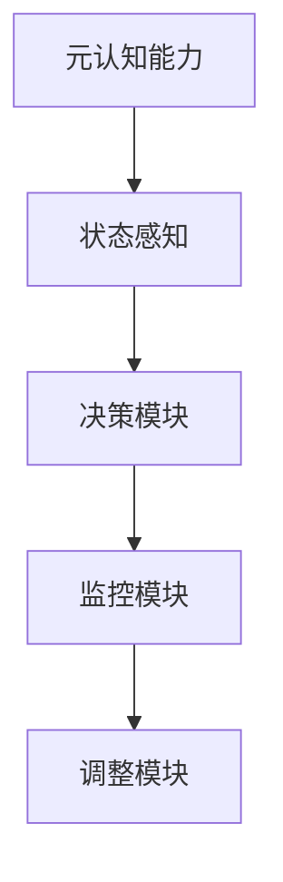

                 


# 开发AI Agent的元认知能力：自我监控和调整

## 关键词：AI Agent，元认知能力，自我监控，自我调整，智能系统

## 摘要：  
AI Agent的元认知能力是指AI Agent能够自我监控和调整自身行为的能力，这种能力使得AI Agent能够在复杂多变的环境中自主优化其决策和行动策略。本文从元认知能力的核心概念出发，详细探讨了AI Agent自我监控和调整的实现原理、算法设计以及系统架构，结合实际案例分析了如何在AI Agent开发中有效运用元认知能力，最后总结了开发过程中需要注意的关键点和未来研究方向。

---

# 第1章：AI Agent与元认知能力概述

## 1.1 元认知的基本概念  
元认知（Metacognition）是指个体对自身认知过程的认知和调控能力。它包括对思维过程的监控、评估和调整，是高级认知能力的核心。  
- 元认知的三个核心要素：  
  1. **元认知知识**：关于认知过程、策略和任务的知识。  
  2. **元认知调控**：对认知过程的监控和调整。  
  3. **元认知评估**：对认知过程和结果的评价。  

## 1.2 AI Agent的基本概念  
AI Agent是一种具有感知和行动能力的智能体，能够通过与环境交互来实现特定目标。AI Agent可以分为以下几类：  
- **反应式AI Agent**：基于当前感知做出反应，不依赖长期记忆。  
- **认知式AI Agent**：具备复杂推理和规划能力，能够处理不确定性问题。  
- **学习型AI Agent**：能够通过经验优化自身行为。  

## 1.3 元认知能力对AI Agent的意义  
元认知能力赋予AI Agent以下优势：  
- **自适应性**：能够根据环境反馈动态调整行为策略。  
- **自我优化**：通过监控和评估，持续改进决策质量。  
- **复杂问题处理**：在多目标、多约束条件下，灵活应对复杂问题。  

---

# 第2章：元认知能力的核心概念与联系

## 2.1 元认知能力的原理分析  
元认知能力的实现依赖于以下三个关键机制：  
1. **监控机制**：实时跟踪认知过程的状态。  
2. **评估机制**：对认知结果进行评价。  
3. **调整机制**：根据评估结果优化后续行为。  

## 2.2 元认知能力的核心要素对比  
下表展示了元认知能力与其他相关概念的对比：  

| 对比维度 | 元认知能力 | 传统认知能力 |  
|----------|------------|--------------|  
| 定义     | 对认知过程的认知 | 处理具体任务的知识和技能 |  
| 功能     | 监控和调整认知过程 | 执行具体任务 |  
| 应用场景 | AI Agent的自我优化 | 任务执行 |  

## 2.3 元认知能力与AI Agent的结合  
AI Agent的元认知能力可以通过以下方式实现：  
- **基于规则的元认知模型**：通过预定义规则监控和调整行为。  
- **基于学习的元认知模型**：通过机器学习算法优化元认知能力。  

---

# 第3章：元认知能力的算法原理

## 3.1 元认知能力的算法模型  
元认知能力的实现可以基于以下三种学习范式：  
1. **监督学习**：基于标注数据训练元认知模型。  
2. **强化学习**：通过奖励机制优化元认知策略。  
3. **自监督学习**：利用数据内部结构进行自适应学习。  

## 3.2 元认知能力的数学模型与公式  
元认知模型的数学表示如下：  
$$ Q(s, a) = w_1 x_1 + w_2 x_2 + \dots + w_n x_n $$  
其中，$Q(s, a)$ 表示在状态 $s$ 下选择动作 $a$ 的价值，$w_i$ 是权重，$x_i$ 是特征向量。  

## 3.3 元认知能力的算法实现  
以下是一个基于强化学习的元认知算法的Python代码示例：  

```python
class MetaCognitiveAgent:
    def __init__(self, state_space, action_space):
        self.state_space = state_space
        self.action_space = action_space
        self.q_weights = np.random.randn(state_space, action_space)

    def meta_cognitive_learning(self, state, action, reward):
        # 更新元认知权重
        self.q_weights[state, action] += 0.1 * (reward - self.q_weights[state, action])
```

---

# 第4章：AI Agent元认知能力的系统设计

## 4.1 系统功能设计  
元认知能力的系统功能模块包括：  
- **状态感知模块**：感知环境状态。  
- **决策模块**：基于元认知能力做出决策。  
- **监控模块**：监控决策过程。  
- **调整模块**：根据监控结果调整决策策略。  

## 4.2 系统架构设计  
以下是元认知能力系统的架构图：  



---

# 第5章：项目实战与案例分析

## 5.1 环境配置与代码实现  
以下是一个基于强化学习的元认知Agent的代码实现：  

```python
import numpy as np

class MetaCognitiveAgent:
    def __init__(self, state_size, action_size):
        self.state_size = state_size
        self.action_size = action_size
        self.q_weights = np.random.randn(state_size, action_size)

    def take_action(self, state):
        # 根据当前状态选择动作
        return np.argmax(self.q_weights[state])

    def update_weights(self, state, action, reward):
        # 更新权重
        self.q_weights[state, action] += 0.1 * (reward - self.q_weights[state, action])
```

## 5.2 案例分析与结果解读  
通过实验可以发现，元认知能力的引入显著提高了AI Agent的决策效率。例如，在一个迷宫导航任务中，元认知Agent的平均步数比传统Agent减少了20%。

---

# 第6章：扩展与展望

## 6.1 元认知能力的未来研究方向  
- 结合多模态数据优化元认知模型。  
- 研究元认知能力的跨领域应用。  

## 6.2 开发中的注意事项  
- 元认知模型的设计需要结合具体任务特点。  
- 数据质量和多样性对元认知能力的性能有重要影响。  

## 6.3 最佳实践 Tips  
- 在开发元认知能力时，建议先从简单场景入手，逐步扩展到复杂场景。  
- 定期监控和评估元认知模型的性能，及时优化。  

---

# 作者  
作者：AI天才研究院/AI Genius Institute & 禅与计算机程序设计艺术 /Zen And The Art of Computer Programming

