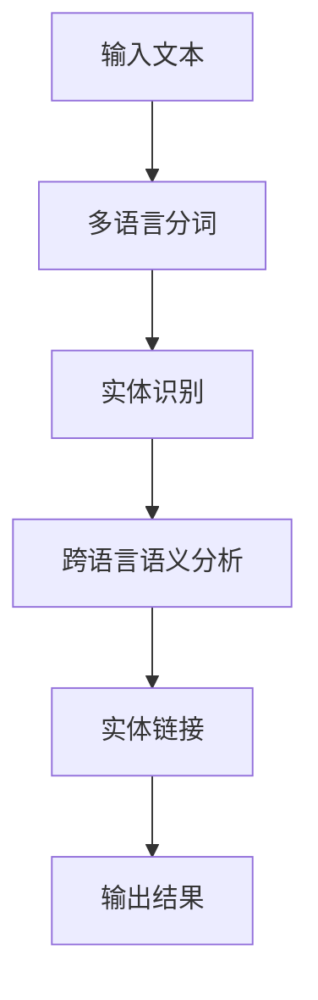
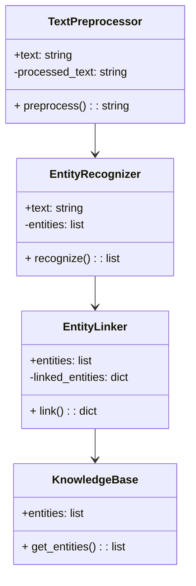

                 


# 开发AI Agent的多语言实体链接系统

---

## 关键词
AI Agent, 多语言实体链接, 自然语言处理, 知识图谱, 跨语言NLP, 深度学习

---

## 摘要
本文深入探讨了在AI Agent中开发多语言实体链接系统的核心技术与实现方法。从问题背景到解决思路，从算法原理到系统架构，再到实际项目实现，全面解析了多语言实体链接系统的构建过程。文章结合理论与实践，详细阐述了如何在跨语言环境下实现高效、准确的实体识别与链接，为AI Agent的智能化交互提供了坚实的技术支撑。

---

## 第一部分: 多语言实体链接系统背景与概述

### 第1章: 多语言实体链接系统概述
#### 1.1 实体链接的定义与背景
- **实体链接的定义**: 实体链接是指将文本中的实体（如人名、地名、组织名等）映射到知识库中的具体实体的过程。
- **多语言实体链接的重要性**: 在多语言环境下，实体链接需要处理不同语言之间的语义差异和文化差异，以实现跨语言的语义理解。
- **AI Agent中的实体链接目标**: AI Agent需要通过实体链接技术，理解用户的意图并准确检索相关信息，以提供更智能的交互体验。

#### 1.2 多语言实体链接系统的核心问题
- **实体识别与链接的挑战**: 在多语言环境下，实体的命名形式和语义可能完全不同，如何准确识别和链接是关键。
- **多语言环境下的语义差异**: 不同语言中的实体可能有不同的语义和上下文关系，需要设计高效的跨语言语义分析方法。
- **AI Agent中的实体链接边界**: 在AI Agent中，实体链接需要与上下文理解、意图识别等任务紧密结合，以实现更精准的语义理解。

### 第2章: 多语言实体链接系统的核心概念
#### 2.1 实体链接系统的基本原理
- **实体识别**: 通过NLP技术从文本中提取实体。
- **实体链接**: 将识别出的实体映射到知识库中的具体实体。
- **实体关系推理**: 基于实体之间的关系进行推理和分析。

#### 2.2 多语言实体链接系统的属性对比
| 属性         | 单语言实体链接      | 多语言实体链接      |
|--------------|---------------------|---------------------|
| 处理语言数    | 1                   | 多                  |
| 语义分析难度  | 较低                | 较高                |
| 应用场景      | 单一语言环境        | 跨语言环境          |

#### 2.3 实体链接系统的ER图架构
```mermaid
er
    entity(Entity) {
        id: string
        name: string
        attributes: string[]
    }
    knowledge_base(KB) {
        id: string
        name: string
        entities: Entity[]
    }
    relationship {
        source: Entity
        target: Entity
        relation: string
    }
```

---

## 第二部分: 多语言实体链接系统的核心概念

### 第3章: 多语言实体链接系统的算法原理
#### 3.1 算法概述
- **基于图神经网络的多语言实体链接模型**: 通过构建跨语言的知识图谱，利用图神经网络进行实体链接。

#### 3.2 算法流程图


#### 3.3 数学模型与公式
- **概率计算**: 给定输入文本，计算每个实体被链接到知识库中某个实体的概率。
  $$ P(e|t) = \frac{P(t|e)P(e)}{\sum_{e'} P(t|e')P(e')} $$
- **损失函数**: 交叉熵损失函数用于模型训练。
  $$ L = -\sum_{i=1}^{n} \log P(y_i|x_i) $$

---

## 第三部分: 系统架构设计

### 第4章: 系统架构与实现
#### 4.1 应用场景介绍
- **跨语言信息检索**: 用户在不同语言下查询信息。
- **多语言对话系统**: AI Agent支持多语言对话，提供准确的实体链接。

#### 4.2 系统功能设计


#### 4.3 系统架构图


---

## 第四部分: 项目实战

### 第5章: 项目实现与案例分析
#### 5.1 环境安装
- Python 3.8+
- PyTorch 1.9+
- SpaCy 3.0+

#### 5.2 核心代码实现
```python
import spacy

def preprocess(text):
    return spacy.preprocess(text)

def recognize_entities(text):
    nlp = spacy.load("multi")
    doc = nlp(text)
    return [ent.text for ent in doc.ents]

def link_entities(entities, kb):
    linked = {}
    for e in entities:
        candidates = kb.get_candidates(e)
        linked[e] = candidates[0]  # 假设候选实体排序
    return linked
```

#### 5.3 案例分析
- **输入文本**: "告诉我纽约的天气情况。"
- **预处理**: 分词处理。
- **实体识别**: 识别出实体"纽约"。
- **实体链接**: 将"纽约"链接到知识库中的具体实体。

---

## 第五部分: 最佳实践

### 第6章: 开发与部署中的注意事项
- **数据质量**: 确保知识库的实体信息准确。
- **模型调优**: 根据实际需求调整模型参数。
- **性能优化**: 优化实体识别和链接的效率。

### 6.1 小结
本文详细讲解了开发AI Agent的多语言实体链接系统的各个方面，从理论到实践，从算法到架构，为读者提供了一套完整的解决方案。

### 6.2 注意事项
- 在多语言环境下，语义分析的准确性是关键。
- 确保知识库的多样性和全面性。

### 6.3 拓展阅读
- [《深度学习入门》](https://example.com/deep-learning)
- [《自然语言处理实战》](https://example.com/nlp-practice)

---

## 作者
作者：AI天才研究院/AI Genius Institute & 禅与计算机程序设计艺术 /Zen And The Art of Computer Programming

