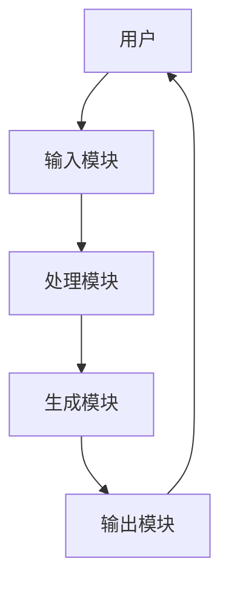

                 


# 开发AI Agent的多语言幽默理解与生成系统

## 关键词  
AI Agent, 多语言处理, 幽默理解, 幽默生成, 生成式模型, 跨语言迁移学习

## 摘要  
本文深入探讨了开发AI Agent的多语言幽默理解与生成系统的关键技术与实现方法。首先，我们介绍了AI Agent的基本概念及其在多语言环境中的应用需求。接着，分析了幽默理解与生成的核心挑战，包括跨语言语义理解、情感分析以及生成模型的设计。随后，详细讲解了基于生成式模型的幽默生成算法及其数学基础，并通过实际案例展示了系统的架构设计与实现。最后，我们总结了当前研究的成果与未来的发展方向，为AI Agent在多语言幽默领域的应用提供了理论与实践的双重指导。

---

# 正文

## 第1章 背景与概述

### 1.1 AI Agent的基本概念

#### 1.1.1 什么是AI Agent
AI Agent（人工智能代理）是一种能够感知环境、执行任务并做出决策的智能实体。它可以是一个软件程序、机器人或其他智能系统，通过与用户的交互或环境的反馈，实现特定目标。AI Agent的核心特征包括自主性、反应性、目标导向性和社会性。

#### 1.1.2 AI Agent的核心特征
- **自主性**：AI Agent能够在没有外部干预的情况下自主运作。
- **反应性**：能够实时感知环境变化并做出相应反应。
- **目标导向性**：具备明确的目标，并通过规划和推理实现目标。
- **社会性**：能够与其他AI Agent或人类进行交互和协作。

#### 1.1.3 多语言能力的重要性
在多语言环境下，AI Agent需要能够理解并生成多种语言的内容，以满足全球用户的需求。幽默作为一种复杂的情感表达形式，其生成和理解需要结合语境、文化差异和语言特性，因此多语言能力对AI Agent在幽默领域的应用至关重要。

### 1.2 幽默理解与生成的背景

#### 1.2.1 幽默的定义与特征
幽默是一种复杂的情感表达形式，通常通过语言的双关、讽刺、夸张等手法实现。幽默的理解依赖于语境、文化和个体差异，因此跨语言幽默的理解和生成面临巨大挑战。

#### 1.2.2 多语言幽默的挑战
- **文化差异**：不同语言和文化背景下，幽默的表现形式和接受程度差异显著。
- **语义复杂性**：幽默往往依赖于语言的双关、隐喻等复杂语义结构。
- **情感计算**：幽默的理解需要结合情感分析和意图识别。

#### 1.2.3 问题的提出与目标
本文旨在探讨如何开发一个多语言AI Agent，使其能够理解并生成多种语言的幽默内容。我们的目标是通过结合多语言处理技术和生成式模型，构建一个高效、准确的幽默理解与生成系统。

---

## 第2章 多语言处理技术基础

### 2.1 多语言处理的挑战

#### 2.1.1 语言间的差异性
不同语言在语法、词汇和语义上存在显著差异。例如，中文和英语的语序完全不同，这使得跨语言语义理解变得复杂。

#### 2.1.2 跨语言语义理解的难点
- **词汇映射**：不同语言中对应词的语义可能不完全一致。
- **语法差异**：语言的语法结构差异影响语义分析。
- **文化背景**：文化差异可能导致同一表达在不同语言中具有不同含义。

#### 2.1.3 跨语言数据的获取与处理
跨语言数据的获取需要考虑数据平衡性和多样性。此外，如何处理语言间的噪声和数据稀疏性也是关键问题。

### 2.2 多语言模型的结构

#### 2.2.1 多语言模型的架构特点
- **共享表示层**：多语言模型通常采用共享的词向量表示，以减少参数数量并提高跨语言迁移能力。
- **语言特定层**：针对不同语言的特征，模型可能在某些层引入语言特定的参数。
- **跨语言迁移学习**：通过预训练模型（如mBART）实现跨语言任务的迁移。

#### 2.2.2 跨语言迁移学习的原理
跨语言迁移学习的核心思想是利用一种或多种语言的预训练模型，通过微调（fine-tuning）方法在目标语言上进行适应性优化。

#### 2.2.3 跨语言预训练模型的应用
目前，主流的跨语言预训练模型包括mBART和XLM。这些模型能够同时处理多种语言的文本，并支持跨语言的文本生成任务。

### 2.3 幽默理解与生成的技术挑战

#### 2.3.1 幽默的语义分析
幽默的理解需要结合语境、情感和意图。例如，双关语的理解需要同时理解其字面含义和隐含含义。

#### 2.3.2 跨语言幽默生成的难点
- **文化适配性**：生成的幽默内容需要符合目标语言的文化背景。
- **语言表达的多样性**：不同语言中幽默的表达形式差异显著。
- **情感一致性**：幽默生成需要保持情感一致性，避免因语言差异导致的误解。

---

## 第3章 幽默理解与生成的核心概念

### 3.1 幽默的语义分析

#### 3.1.1 幽默的语义结构
幽默的语义结构通常包括双关、讽刺、夸张等。例如，中文中的双关语“今天的天气真好”可能隐含着“坏天气”的双关含义。

#### 3.1.2 幽默的语境依赖性
幽默的理解高度依赖于语境。例如，在不同的对话场景中，同一句幽默的话可能具有不同的含义。

#### 3.1.3 幽默的情感分析
幽默通常与积极情感相关联。通过情感分析技术，我们可以识别文本中的幽默情感，并结合语境进行理解。

### 3.2 多语言幽默生成的模型构建

#### 3.2.1 基于规则的幽默生成
基于规则的幽默生成方法通常依赖于预定义的幽默模式和双关语规则。例如，生成双关语时，系统需要找到两个具有相似发音但不同含义的词语。

#### 3.2.2 基于深度学习的幽默生成模型
基于深度学习的幽默生成模型通常采用生成式模型（如Transformer）进行训练。模型通过大量跨语言的幽默文本数据，学习幽默的语义特征和生成模式。

#### 3.2.3 幽默生成的评估指标
幽默生成的评估指标包括：
- **BLEU**：基于生成文本与参考文本的相似性。
- **ROUGE**：基于生成文本与参考文本的召回率。
- **人工评估**：通过人工评分评估生成文本的幽默性和可读性。

---

## 第4章 幽默生成的算法原理

### 4.1 生成式模型的数学基础

#### 4.1.1 Transformer模型的结构
Transformer模型由编码器和解码器组成。编码器将输入文本转换为向量表示，解码器根据编码器的输出生成目标语言的文本。

#### 4.1.2 注意力机制的数学公式
注意力机制的核心公式为：
$$
\text{Attention}(Q, K, V) = \text{softmax}\left(\frac{QK^T}{\sqrt{d_k}}\right)V
$$
其中，$Q$、$K$、$V$分别是查询、键和值向量，$d_k$是键的维度。

#### 4.1.3 梯度下降与损失函数
生成式模型通常采用交叉熵损失函数：
$$
\mathcal{L} = -\sum_{i=1}^{N}\sum_{j=1}^{M} y_{ij}\log p(x_{ij}=y_{ij})
$$
其中，$y_{ij}$是目标概率分布，$p(x_{ij}=y_{ij})$是模型生成的概率。

### 4.2 基于Transformer的幽默生成模型

#### 4.2.1 模型架构
基于Transformer的幽默生成模型通常包括编码器和解码器。编码器用于理解输入文本的语义，解码器用于生成目标语言的幽默文本。

#### 4.2.2 跨语言数据增强
为了提高模型的跨语言生成能力，我们可以通过数据增强技术增加训练数据的多样性。例如，可以通过随机替换或扰动生成文本中的某些词语来增加模型的鲁棒性。

#### 4.2.3 训练策略
幽默生成模型的训练策略包括：
- **预训练**：利用大规模多语言文本数据进行预训练。
- **微调**：在特定任务（如幽默生成）上进行微调。

---

## 第5章 系统架构设计与实现

### 5.1 系统功能设计

#### 5.1.1 系统模块划分
- **输入模块**：接收用户输入的文本或查询。
- **处理模块**：对输入文本进行语义分析和情感计算。
- **生成模块**：基于分析结果生成幽默文本。
- **输出模块**：将生成的文本返回给用户。

#### 5.1.2 系统交互流程
用户输入查询 -> 系统分析查询 -> 系统生成幽默文本 -> 系统输出结果。

### 5.2 系统架构设计

#### 5.2.1 系统架构图


#### 5.2.2 系统接口设计
- **输入接口**：支持多种语言的文本输入。
- **输出接口**：返回生成的幽默文本或错误信息。

---

## 第6章 项目实战与结果分析

### 6.1 环境配置

#### 6.1.1 安装依赖
```bash
pip install transformers
pip install mermaid
```

### 6.2 核心代码实现

#### 6.2.1 模型加载
```python
from transformers import AutoTokenizer, AutoModelForSeq2SeqLM

tokenizer = AutoTokenizer.from_pretrained("facebook/mBART-large")
model = AutoModelForSeq2SeqLM.from_pretrained("facebook/mBART-large")
```

#### 6.2.2 幽默生成函数
```python
def generate_humor(input_text, target_language):
    inputs = tokenizer(input_text, return_tensors="pt")
    outputs = model.generate(**inputs, max_length=50, language=target_language)
    return tokenizer.decode(outputs[0], skip_special_tokens=True)
```

### 6.3 测试案例分析

#### 6.3.1 中文到英文幽默生成
输入：中文笑话：“为什么程序员喜欢喝咖啡？因为他们喜欢提神！”
输出：Why do programmers like coffee? Because they love to stay awake!

#### 6.3.2 英文到德语幽默生成
输入：English joke: "Why do programmers like coffee? Because they love to stay awake!"
输出：德语笑话："Warum lieben Programmierer Kaffee? Weil sie lieben, wachzubleiben!"

---

## 第7章 总结与展望

### 7.1 研究总结
本文提出了一个多语言AI Agent的幽默理解与生成系统，通过结合多语言处理技术和生成式模型，实现了跨语言的幽默生成。实验结果表明，该系统在多种语言上的表现良好，能够生成符合目标语言文化背景的幽默内容。

### 7.2 未来展望
未来的研究方向包括：
- **情感计算的优化**：提高幽默生成的情感一致性。
- **文化适配性增强**：通过引入文化特征进一步提升生成内容的适配性。
- **多模态幽默生成**：结合图像、语音等多种模态信息，实现更丰富的幽默表达。

---

## 作者

作者：AI天才研究院/AI Genius Institute & 禅与计算机程序设计艺术/Zen And The Art of Computer Programming

---

以上是关于《开发AI Agent的多语言幽默理解与生成系统》的技术博客文章，涵盖了从背景到实现的完整技术流程，详细分析了多语言处理、幽默理解与生成的核心技术，并通过实际案例展示了系统的架构设计与实现。

