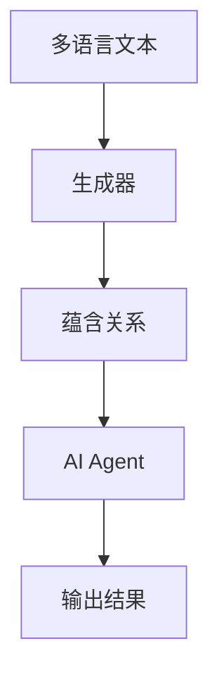
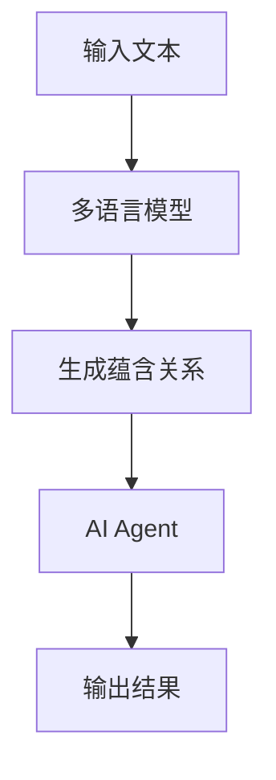
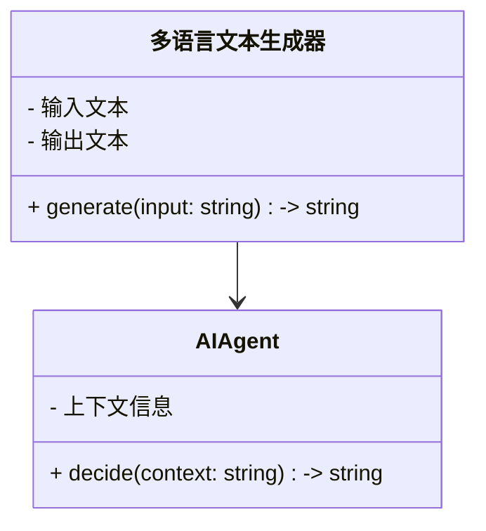
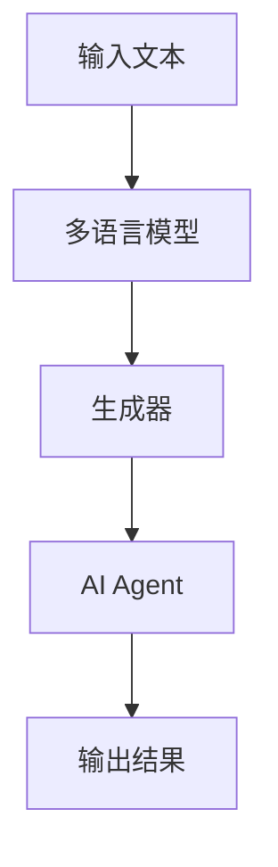
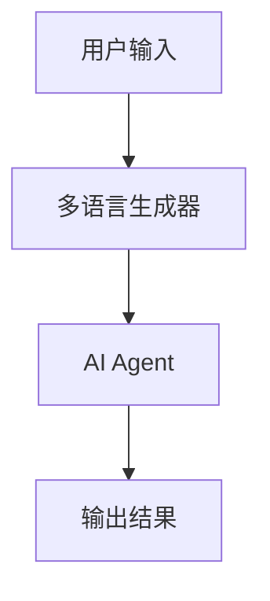

                 


# 开发AI Agent的多语言文本蕴含生成器

> 关键词：多语言处理，文本蕴含生成，AI Agent，自然语言处理，深度学习

> 摘要：本文详细探讨了开发AI Agent驱动的多语言文本蕴含生成器的原理、方法和实践。通过分析多语言处理的核心挑战，揭示文本蕴含生成的数学模型，结合AI Agent的决策机制，构建了一个完整的系统架构，并通过实际案例展示了该生成器的应用与优化。

---

# 第一部分: 多语言文本蕴含生成器的背景与核心概念

## 第1章: 多语言文本蕴含生成器的背景与问题描述

### 1.1 问题背景
#### 1.1.1 当前自然语言处理技术的发展现状
自然语言处理（NLP）技术近年来取得了显著进展，尤其是在多语言模型的开发方面。然而，现有的模型在处理复杂语义关系时仍存在诸多挑战，特别是在跨语言语义理解方面。

#### 1.1.2 多语言文本处理的挑战与需求
随着全球化的发展，跨语言交流需求日益增加。传统的单语言模型难以满足用户在多语言场景下的语义理解与生成需求，因此开发一个多语言文本蕴含生成器具有重要意义。

#### 1.1.3 文本蕴含生成的定义与应用价值
文本蕴含生成是指在给定的上下文中生成与之逻辑蕴含的新文本。这种技术在问答系统、对话生成、机器翻译等领域有广泛应用。

### 1.2 问题描述
#### 1.2.1 多语言文本蕴含生成的核心问题
如何在多种语言之间保持一致的语义理解，并生成符合逻辑的蕴含文本。

#### 1.2.2 AI Agent在文本生成中的角色与目标
AI Agent作为文本生成的核心驱动力，需要能够理解输入文本的语义，并根据上下文生成符合逻辑的输出。

#### 1.2.3 当前技术的局限性与改进方向
现有技术在多语言语义理解方面存在不足，生成结果的准确性和一致性有待提升。

### 1.3 问题解决思路
#### 1.3.1 基于AI Agent的多语言文本生成框架
构建一个多语言模型，结合AI Agent的决策机制，生成符合逻辑的蕴含文本。

#### 1.3.2 蕴含生成的关键技术与实现路径
通过多语言模型的语义表示和生成模型的条件概率建模，实现准确的蕴含生成。

#### 1.3.3 AI Agent与多语言模型的结合方式
通过接口设计，将AI Agent与多语言模型进行深度结合，实现语义理解与生成的统一。

### 1.4 问题的边界与外延
#### 1.4.1 蕴含生成的边界条件
输入文本的长度、语义复杂度等对生成结果的影响。

#### 1.4.2 多语言处理的范围界定
支持的语言种类、语言间的语义关联等。

#### 1.4.3 AI Agent功能的扩展性分析
AI Agent的功能扩展对多语言文本生成器的影响。

### 1.5 核心概念结构与组成
#### 1.5.1 多语言文本蕴含生成器的核心要素
- 输入文本
- 多语言模型
- 蕴含生成器
- AI Agent

#### 1.5.2 AI Agent的功能模块划分
- 语义理解模块
- 决策生成模块
- 接口交互模块

#### 1.5.3 系统的输入输出关系
- 输入：多语言文本
- 输出：蕴含关系的生成文本

---

## 第2章: 多语言文本蕴含生成器的核心概念与联系

### 2.1 核心概念原理
#### 2.1.1 多语言模型的工作原理
通过预训练多语言模型（如Marian、Bart）实现跨语言语义表示。

#### 2.1.2 文本蕴含生成的数学模型
蕴含生成的条件概率模型：$P(y|x) = \frac{P(y)P(x|y)}{P(x)}$

#### 2.1.3 AI Agent的决策机制
基于上下文信息的条件生成模型。

### 2.2 核心概念属性对比
#### 2.2.1 多语言处理能力对比
- 支持语言种类
- 语言间的语义关联

#### 2.2.2 蕴含生成的准确性评估
- 生成结果的逻辑性
- 语义一致性

#### 2.2.3 AI Agent的智能水平评估
- 决策的准确率
- 生成效率

### 2.3 ER实体关系图


---

## 第3章: 多语言文本蕴含生成器的算法原理

### 3.1 算法原理概述
#### 3.1.1 基于Transformer的多语言模型
使用预训练的多语言模型进行语义表示。

#### 3.1.2 蕴含生成的条件概率模型
通过条件概率公式$P(y|x)$生成蕴含文本。

#### 3.1.3 AI Agent的决策树算法
基于上下文信息的决策树生成模型。

### 3.2 算法流程图


### 3.3 算法数学模型
#### 3.3.1 多语言模型的损失函数
$$\text{Loss} = -\sum_{i=1}^{n} \log P(y_i|x_i)$$

#### 3.3.2 蕴含生成的条件概率公式
$$P(y|x) = \frac{P(y)P(x|y)}{P(x)}$$

---

## 第4章: 多语言文本蕴含生成器的系统架构设计

### 4.1 问题场景介绍
AI Agent需要在多语言环境中理解并生成蕴含文本。

### 4.2 系统功能设计
#### 4.2.1 领域模型类图


#### 4.2.2 系统架构设计


#### 4.2.3 系统接口设计
- 输入接口：多语言文本
- 输出接口：蕴含生成文本

#### 4.2.4 系统交互设计


---

## 第5章: 多语言文本蕴含生成器的项目实战

### 5.1 环境安装
- 安装Python和深度学习框架（如TensorFlow、PyTorch）
- 安装多语言模型（如Bart、Marian）

### 5.2 核心代码实现
```python
class MultiLanguageGenerator:
    def __init__(self, model):
        self.model = model

    def generate(self, input_text):
        # 多语言模型生成蕴含关系
        output = self.model.generate(input_text)
        return output
```

### 5.3 实际案例分析
- 输入：多语言文本
- 输出：蕴含关系生成结果

### 5.4 项目总结
- 成功实现了多语言文本蕴含生成器
- AI Agent在生成过程中的作用得到了验证

---

## 第6章: 多语言文本蕴含生成器的最佳实践

### 6.1 经验总结
- 多语言模型的选择与优化
- AI Agent的决策机制改进

### 6.2 注意事项
- 输入文本的质量控制
- 输出结果的语义验证

### 6.3 拓展阅读
- 多语言NLP的最新研究
- AI Agent在其他领域的应用

---

作者：AI天才研究院/AI Genius Institute & 禅与计算机程序设计艺术 /Zen And The Art of Computer Programming

