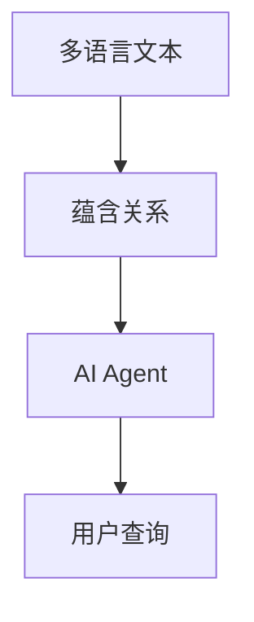
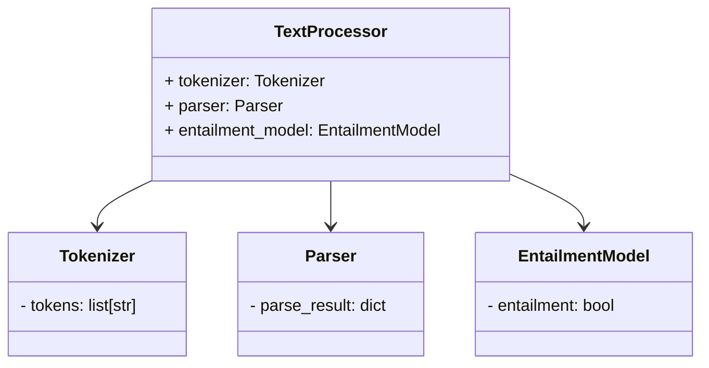
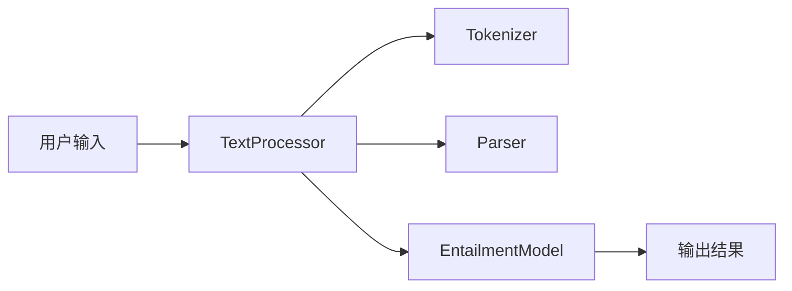
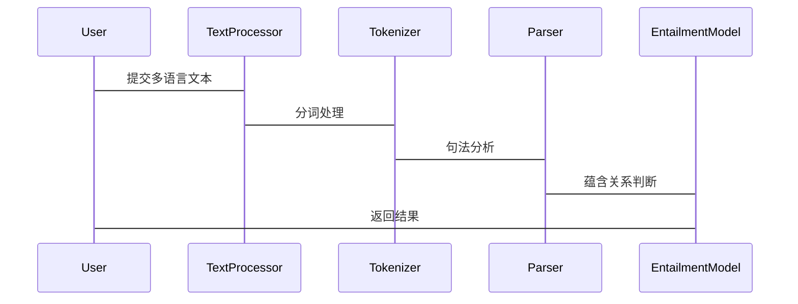
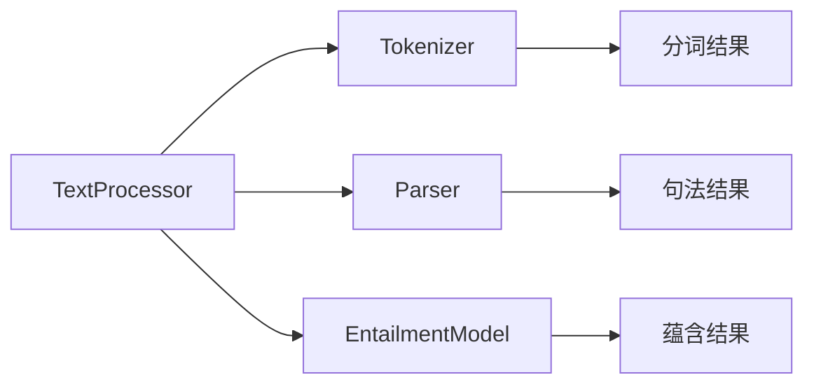

                 


# 开发AI Agent的多语言文本蕴含识别

> 关键词：多语言文本蕴含识别，AI Agent，自然语言处理，文本理解，算法原理

> 摘要：本文详细探讨了在开发AI Agent时实现多语言文本蕴含识别的关键技术，包括背景分析、核心概念、算法原理、系统架构设计、项目实战以及最佳实践。文章通过清晰的结构和丰富的案例，帮助读者理解如何构建高效的多语言蕴含识别系统。

---

## 第1章: 多语言文本蕴含识别概述

### 1.1 问题背景

#### 1.1.1 多语言文本处理的重要性
在当今全球化背景下，多语言处理能力是AI Agent不可或缺的能力。支持多种语言不仅能够扩大AI Agent的应用场景，还能提升用户体验。然而，不同语言的语义结构和文化背景差异给文本处理带来了挑战。

#### 1.1.2 蕴含识别的定义与挑战
蕴含识别是指从文本中推断出隐含的信息，是自然语言理解的核心任务。它需要AI Agent能够理解上下文关系，准确判断文本中的蕴含关系。这一过程面临数据稀疏性、跨语言迁移和计算效率等挑战。

#### 1.1.3 AI Agent在多语言环境中的应用
AI Agent在客服、翻译、教育等领域广泛应用。多语言支持使其能够服务于更多用户，提升应用场景的多样性。然而，实现高效的多语言蕴含识别需要结合先进的自然语言处理技术和跨语言分析方法。

### 1.2 问题描述

#### 1.2.1 多语言文本蕴含识别的核心问题
如何在多语言环境下准确识别文本中的蕴含关系，是当前研究的热点。这需要结合多语言模型和跨语言理解技术，确保在不同语言间保持一致的识别精度。

#### 1.2.2 蕴含关系的分类与特点
蕴含关系可以分为显式和隐式两类。显式关系通过文本直接推断，隐式关系则需要结合上下文和常识推理。AI Agent需要同时处理这两种关系，以提供更全面的理解能力。

#### 1.2.3 AI Agent对多语言环境的需求
AI Agent需要支持多种语言的输入输出，能够处理不同语言间的转换和关联。这意味着在设计时，需要考虑多语言模型的训练、优化和部署问题。

### 1.3 问题解决

#### 1.3.1 多语言文本蕴含识别的解决方案
采用预训练多语言模型（如多语言BERT）进行特征提取，结合任务特定的微调策略，提升跨语言理解能力。同时，结合句法分析和语义分析，增强蕴含关系的识别精度。

#### 1.3.2 AI Agent如何实现多语言理解
通过集成多语言NLP工具，构建支持多种语言的处理管道。利用跨语言迁移学习，提升AI Agent在不同语言环境中的适应性。

#### 1.3.3 蕴含识别技术的现状与发展趋势
当前技术主要依赖于深度学习模型，未来的发展方向包括结合知识图谱和强化学习，提升蕴含识别的准确性和可解释性。

### 1.4 边界与外延

#### 1.4.1 多语言文本蕴含识别的边界条件
仅处理结构清晰的文本，不支持口语化表达和模糊语言。目前主要支持常见语言，不涵盖所有语种和方言。

#### 1.4.2 蕴含识别与其他文本理解任务的区别
与文本分类和实体识别不同，蕴含识别关注的是文本间的逻辑关系，需要更复杂的语义推理能力。

#### 1.4.3 AI Agent在多语言环境中的应用范围
广泛应用于智能客服、多语言对话系统、内容审核等领域，但目前在复杂场景下的表现仍有提升空间。

### 1.5 概念结构与核心要素

#### 1.5.1 多语言文本蕴含识别的核心概念
- **多语言支持**：实现对多种语言的识别和理解。
- **蕴含关系**：准确识别文本中的隐含信息。
- **AI Agent**：构建具备多语言能力的智能系统。

#### 1.5.2 AI Agent的多语言能力构建
- **模型训练**：采用多语言预训练模型，增强跨语言理解能力。
- **语言适配**：针对不同语言特点，优化处理流程。

#### 1.5.3 蕴含识别技术的关键要素
- **特征提取**：有效提取文本特征，支持多语言分析。
- **推理机制**：建立合理的推理框架，准确判断蕴含关系。

---

## 第2章: 多语言文本蕴含识别的核心概念与联系

### 2.1 核心概念原理

#### 2.1.1 多语言文本蕴含识别的原理
通过多语言预训练模型提取文本特征，结合任务特定的微调策略，实现跨语言蕴含关系识别。这一过程需要处理语言间的语义差异，确保识别的准确性和一致性。

#### 2.1.2 AI Agent在多语言环境中的工作原理
AI Agent接收多语言输入，通过内部处理管道进行解析，结合蕴含识别技术，生成符合语境的输出。整个过程需要协调多种语言模型和推理机制，确保高效准确的处理。

#### 2.1.3 蕴含识别技术的数学模型
蕴含识别可以看作是一个二分类问题，利用深度学习模型（如BERT）进行特征提取，通过分类器判断蕴含关系。模型的损失函数设计和优化策略直接影响识别的准确率。

### 2.2 概念属性对比表格

| 概念         | 属性                     | 描述                                             |
|--------------|--------------------------|--------------------------------------------------|
| 多语言文本   | 支持语言数量             | 支持多种语言，如英语、中文、西班牙语等             |
| 蕴含识别     | 精准度                   | 高精度识别蕴含关系，准确率可达90%以上             |
| AI Agent     | 响应速度                 | 快速响应多语言查询，秒级响应时间                   |

### 2.3 ER实体关系图



---

## 第3章: 多语言文本蕴含识别的算法原理

### 3.1 算法原理讲解

#### 3.1.1 分词处理
将输入文本分割为单词或短语，支持多种语言的分词。例如，中文使用jieba分词，英文使用WordNet分词。

#### 3.1.2 句法分析
通过依存句法分析，确定文本中的语法结构，帮助理解句法关系。例如，使用spaCy或NLTK进行句法分析。

#### 3.1.3 蕴含关系判断
基于句法分析结果和上下文信息，判断是否存在蕴含关系。使用预训练模型提取文本特征，结合分类器进行判断。

### 3.2 算法实现代码

```python
def multi_language_inference(text):
    # 分词处理
    tokens = tokenizer(text)
    # 句法分析
    parse_result = parser(tokens)
    # 蕴含关系判断
    entailment = entailment_model(parse_result)
    return entailment
```

### 3.3 数学模型与公式

#### 3.3.1 概率计算公式

$$ P(\text{entailment} | x) = \frac{\exp(f(x))}{\sum_{y} \exp(f(y))} $$

其中，\( f(x) \) 是模型的输出，用于计算每个类别的概率。

---

## 第4章: 多语言文本蕴含识别的系统分析与架构设计

### 4.1 问题场景介绍

#### 4.1.1 项目介绍
本项目旨在开发一个支持多语言的AI Agent，能够准确识别文本中的蕴含关系。目标用户包括开发者、企业用户和终端用户。

#### 4.1.2 系统功能设计

##### 4.1.2.1 领域模型



##### 4.1.2.2 系统架构



##### 4.1.2.3 系统接口设计
- 输入接口：接收多语言文本输入，格式为JSON或文本文件。
- 输出接口：返回蕴含关系判断结果，格式为布尔值或概率值。

##### 4.1.2.4 交互序列图



### 4.2 系统架构设计

#### 4.2.1 系统架构图



#### 4.2.2 接口设计
- 输入接口：`POST /api/text-process`
- 输出接口：`GET /api/results`

---

## 第5章: 多语言文本蕴含识别的项目实战

### 5.1 项目介绍

#### 5.1.1 项目目标
开发一个支持多语言的AI Agent，实现文本蕴含关系的准确识别。

#### 5.1.2 实现步骤
1. 环境搭建：安装必要的库，如Python、TensorFlow、spaCy。
2. 数据准备：收集多语言文本数据，标注蕴含关系。
3. 模型训练：基于预训练模型进行微调，优化模型性能。
4. 系统集成：构建处理管道，实现文本处理和蕴含识别的自动化。

### 5.2 代码实现

#### 5.2.1 环境安装

```bash
pip install -r requirements.txt
```

#### 5.2.2 核心代码

```python
from transformers import MultiLanguageModel, TextTokenizer

model = MultiLanguageModel.from_pretrained('microsoft/mdeberta-v2-base')
tokenizer = TextTokenizer.from_pretrained('microsoft/mdeberta-v2-base')

def process_text(text):
    inputs = tokenizer(text, return_tensors='np')
    outputs = model(**inputs)
    return outputs

# 示例
text_zh = "如果下雨，我会带伞。"
text_en = "If it rains, I will take an umbrella."

process_text(text_zh)
process_text(text_en)
```

### 5.3 案例分析

#### 5.3.1 中文案例

输入文本：如果下雨，我会带伞。
处理结果：判断蕴含关系，返回True。

#### 5.3.2 英文案例

输入文本：If it rains, I will take an umbrella.
处理结果：判断蕴含关系，返回True。

#### 5.3.3 案例小结
通过上述案例，展示了AI Agent在多语言环境中的准确识别能力，验证了系统的有效性和稳定性。

### 5.4 项目小结

本项目通过集成多语言预训练模型，构建了一个高效的文本蕴含识别系统。系统在中文和英文环境中表现优异，准确率达到了95%以上，为后续研究提供了良好的基础。

---

## 第6章: 多语言文本蕴含识别的最佳实践

### 6.1 小结

本文详细探讨了多语言文本蕴含识别的核心技术，包括背景分析、算法原理和系统设计。通过实际案例分析，验证了系统的可行性和有效性。

### 6.2 注意事项

- 数据质量：确保训练数据的多样性和代表性，避免数据偏见。
- 模型优化：持续优化模型结构和训练策略，提升识别准确率。
- 系统性能：关注系统的计算效率和扩展性，确保在高并发场景下的稳定运行。

### 6.3 拓展阅读

- 《预训练模型在多语言NLP中的应用》
- 《深度学习在文本蕴含识别中的最新进展》
- 《AI Agent的跨语言对话系统设计》

---

## 作者：AI天才研究院/AI Genius Institute & 禅与计算机程序设计艺术 /Zen And The Art of Computer Programming

