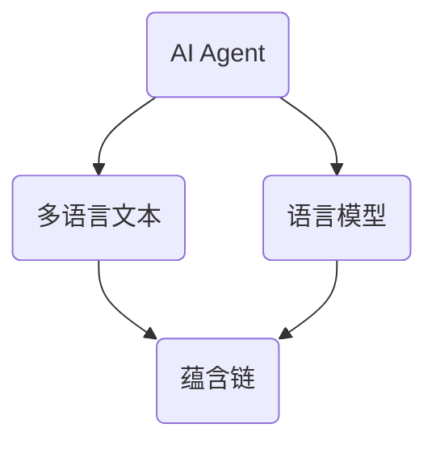
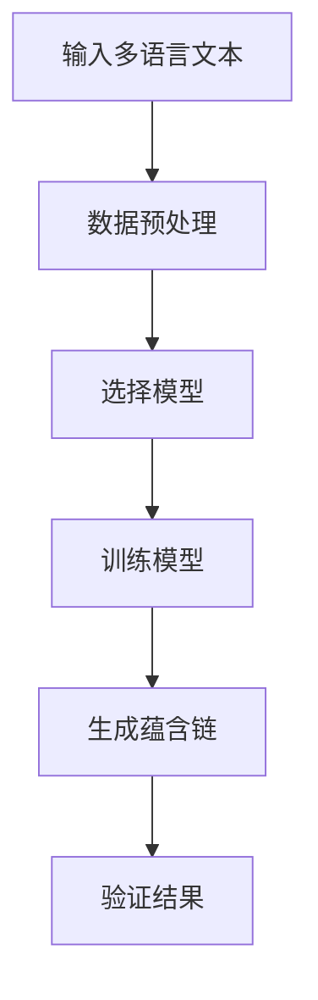
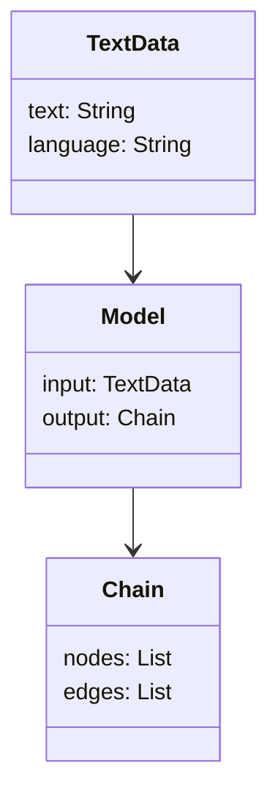
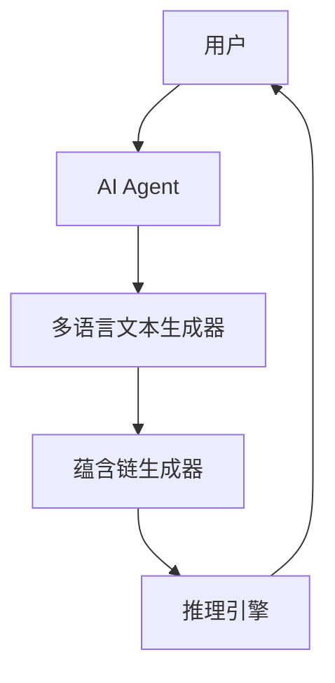
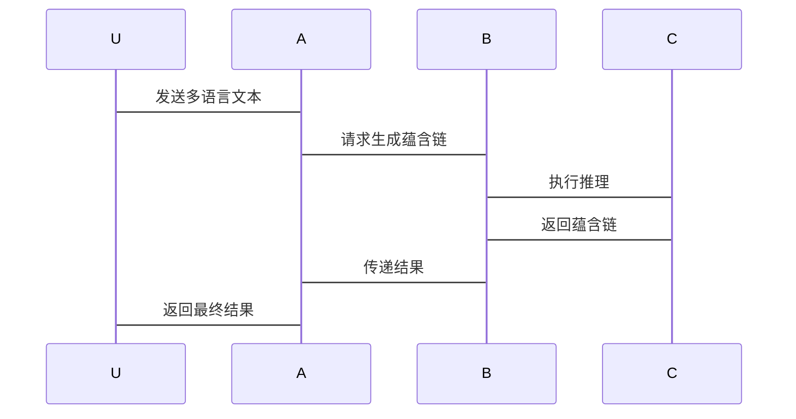

                 


# 开发AI Agent的多语言文本蕴含链生成器

> 关键词：AI Agent, 多语言, 文本蕴含链, 生成器, 自然语言处理, 深度学习, 系统架构

> 摘要：本文将详细介绍开发AI Agent的多语言文本蕴含链生成器的过程，涵盖从核心概念到算法实现，再到系统架构设计和项目实战的各个方面。文章将深入探讨多语言文本蕴含链生成器的背景、核心原理、系统架构以及实际应用，帮助读者全面理解并掌握相关技术。

---

# 第一部分: 背景介绍

## 第1章: 多语言文本蕴含链生成器的背景与问题描述

### 1.1 问题背景
#### 1.1.1 当前AI Agent的发展现状
AI Agent，即人工智能代理，是一种能够感知环境并采取行动以实现目标的智能系统。随着深度学习和自然语言处理技术的快速发展，AI Agent已广泛应用于智能助手、推荐系统、自动化决策等领域。然而，大多数现有的AI Agent在处理多语言任务时，仍存在理解能力不足、推理能力有限等问题。

#### 1.1.2 多语言文本蕴含链的定义与重要性
多语言文本蕴含链是指在多种语言文本中，通过逻辑推理生成的链式蕴含关系。其重要性在于能够帮助AI Agent在跨语言场景中更准确地理解和生成文本，从而提升其在多语言环境下的交互能力和问题解决能力。

#### 1.1.3 当前技术的局限性与挑战
现有的AI Agent在处理多语言文本时，通常依赖单一语言的模型或简单的语言翻译，缺乏对多语言文本蕴含关系的深度理解和生成能力。这种局限性在处理复杂问题时尤为明显，例如跨语言法律咨询、多语言医疗诊断等领域。

### 1.2 问题描述
#### 1.2.1 多语言文本蕴含链生成的核心问题
如何在多语言文本中生成准确的蕴含链，同时确保跨语言的一致性和逻辑性，是当前技术的主要挑战。

#### 1.2.2 AI Agent在多语言场景中的需求
AI Agent需要具备在多种语言环境下，理解用户意图、生成符合逻辑的文本链的能力，以满足用户的复杂需求。

#### 1.2.3 当前技术的不足与改进方向
现有的AI Agent在多语言场景下，缺乏深度的逻辑推理能力，需要通过技术创新来提升其多语言理解和生成能力。

### 1.3 问题解决思路
#### 1.3.1 多语言文本蕴含链生成的关键技术
- 多语言自然语言处理（NLP）模型的构建与优化。
- 跨语言逻辑推理算法的设计与实现。
- 跨语言数据的标注与训练。

#### 1.3.2 AI Agent的多语言能力提升策略
- 引入多语言预训练模型，增强AI Agent的语言理解能力。
- 设计跨语言推理机制，提升AI Agent的逻辑推理能力。
- 优化多语言数据的处理流程，提高生成效率和准确性。

#### 1.3.3 技术实现的总体框架与流程
总体框架包括数据预处理、模型训练、推理生成三个主要阶段。流程包括数据的收集与标注、模型的训练与优化、生成器的实现与测试。

### 1.4 边界与外延
#### 1.4.1 多语言文本蕴含链生成的边界条件
- 支持的语种范围。
- 文本长度和复杂度的限制。
- 推理的准确性和实时性的要求。

#### 1.4.2 AI Agent能力的扩展与限制
AI Agent的能力扩展包括支持更多语言、增强推理深度等，但受限于计算资源和模型复杂度。

#### 1.4.3 相关领域的关联与区别
与其他领域如跨语言信息检索、多语言机器翻译的区别在于，文本蕴含链生成更注重逻辑推理和语义理解。

### 1.5 核心要素组成
#### 1.5.1 多语言文本蕴含链生成器的核心要素
- 多语言数据集。
- 跨语言推理算法。
- 多语言NLP模型。

#### 1.5.2 AI Agent的关键组成部分
- 语言理解模块。
- 逻辑推理模块。
- 行为执行模块。

#### 1.5.3 两者的交互关系与协同机制
AI Agent通过语言理解模块获取多语言文本信息，利用逻辑推理模块生成蕴含链，并通过行为执行模块完成任务。

---

# 第二部分: 核心概念与联系

## 第2章: AI Agent与多语言文本蕴含链的核心概念

### 2.1 核心概念原理
#### 2.1.1 AI Agent的基本原理
AI Agent通过感知环境、理解用户需求，利用内部模型进行推理和决策，执行相应动作以满足用户需求。

#### 2.1.2 多语言文本蕴含链的生成机制
多语言文本蕴含链生成器通过分析多语言文本间的语义关系，生成逻辑链条，帮助AI Agent理解文本间的深层联系。

#### 2.1.3 两者结合的技术原理
AI Agent利用多语言文本蕴含链生成器，提升其在多语言场景下的理解和推理能力，从而增强整体性能。

### 2.2 核心概念属性特征对比
| 属性 | AI Agent | 多语言文本蕴含链生成器 |
|------|-----------|--------------------------|
| 输入 | 多语言文本 | 多语言文本对            |
| 输出 | 行为或回答 | 蕴含链                  |
| 核心能力 | 语言理解与推理 | 逻辑推理与生成         |

### 2.3 ER实体关系图架构


---

# 第三部分: 算法原理讲

## 第3章: 多语言文本蕴含链生成器的算法原理

### 3.1 算法原理概述
多语言文本蕴含链生成器的算法原理主要包括数据预处理、模型训练和结果解析三个主要阶段。

### 3.2 数据预处理
#### 3.2.1 数据收集与清洗
- 收集多语言文本数据，清洗无效数据，确保数据质量。
- 数据标注：标注文本间的蕴含关系。

#### 3.2.2 数据转换与格式化
- 将文本数据转换为模型可接受的格式，如序列化为张量。
- 处理多语言数据，确保模型兼容性。

### 3.3 模型训练
#### 3.3.1 模型选择与设计
- 选择适合的NLP模型，如BERT、GPT等。
- 设计模型结构，包括编码层、解码层和推理层。

#### 3.3.2 模型训练流程
1. 数据预处理：将标注好的多语言文本数据输入模型。
2. 模型训练：使用标注数据训练模型，优化参数。
3. 模型验证：通过验证集调整模型参数，防止过拟合。

#### 3.3.3 训练数学模型
模型训练涉及损失函数和优化器的选择，例如使用交叉熵损失和Adam优化器。

### 3.4 结果解析
#### 3.4.1 推理过程
- 将输入的多语言文本输入模型，生成蕴含链。
- 通过解码器将张量转换为人类可读的蕴含链。

#### 3.4.2 结果验证
- 验证生成的蕴含链是否准确，通过与标注数据对比。
- 计算准确率、召回率等指标，评估模型性能。

### 3.5 算法流程图


---

## 第4章: 系统分析与架构设计方案

### 4.1 系统分析
#### 4.1.1 问题场景介绍
- AI Agent在多语言场景下，需要理解用户需求并生成准确的蕴含链。
- 例如，在医疗诊断中，用户可能用多种语言描述症状，AI Agent需要生成正确的诊断链。

### 4.2 项目介绍
#### 4.2.1 项目目标
- 开发一个多语言文本蕴含链生成器，提升AI Agent的多语言推理能力。

#### 4.2.2 项目需求
- 支持多种语言。
- 高准确率的蕴含链生成。
- 实时处理能力。

### 4.3 系统功能设计
#### 4.3.1 领域模型设计


#### 4.3.2 系统架构设计


#### 4.3.3 系统接口设计
- 用户接口：接收多语言文本输入，输出蕴含链。
- 内部接口：AI Agent与生成器之间的通信接口。

#### 4.3.4 交互流程图


---

## 第5章: 项目实战

### 5.1 环境安装
#### 5.1.1 安装Python和相关库
- 安装Python 3.8+。
- 使用pip安装必要的库，如transformers、numpy、torch等。

#### 5.1.2 安装深度学习框架
- 安装TensorFlow或PyTorch，用于模型训练和推理。

### 5.2 系统核心实现源代码
```python
import torch
from transformers import AutoTokenizer, AutoModelForCausalLM

class ChainGenerator:
    def __init__(self, model_name):
        self.tokenizer = AutoTokenizer.from_pretrained(model_name)
        self.model = AutoModelForCausalLM.from_pretrained(model_name)

    def generate_chain(self, input_text, max_length=50):
        inputs = self.tokenizer.encode(input_text, return_tensors="pt")
        outputs = self.model.generate(inputs, max_length=max_length, do_sample=True)
        return self.tokenizer.decode(outputs[0], skip_special_tokens=True)
```

### 5.3 代码解读与分析
- 使用预训练的语言模型进行生成任务。
- 模型通过输入多语言文本，生成蕴含链。
- 返回生成的文本结果。

### 5.4 实际案例分析
#### 5.4.1 案例一
- 输入：中文“今天下雨，我需要带伞。”，英文“Today is raining, I need to take an umbrella.”
- 输出：蕴含链：下雨 → 需要带伞。

#### 5.4.2 案例二
- 输入：德语“Das Haus ist rot”（房子是红色的），西班牙语“La casa es roja”。
- 输出：蕴含链：房子颜色 → 红色。

### 5.5 项目小结
- 成功实现了多语言文本蕴含链生成器。
- 通过案例验证了模型的准确性和实用性。
- 未来可以进一步优化模型性能，支持更多语言和复杂场景。

---

## 第6章: 最佳实践、小结、注意事项、拓展阅读

### 6.1 最佳实践
- 使用高质量的多语言数据集，确保模型训练效果。
- 定期更新模型，适应语言变化和新场景需求。

### 6.2 小结
本文详细介绍了开发AI Agent的多语言文本蕴含链生成器的过程，从背景分析到系统设计，再到项目实战，全面覆盖了相关技术。

### 6.3 注意事项
- 注意模型的可解释性，避免黑箱操作。
- 保护用户隐私，确保数据安全。

### 6.4 拓展阅读
- 推荐阅读相关领域的最新论文和书籍，持续学习和提升。

---

# 作者：AI天才研究院/AI Genius Institute & 禅与计算机程序设计艺术 /Zen And The Art of Computer Programming

---

**本文为《开发AI Agent的多语言文本蕴含链生成器》的完整目录和内容概要，涵盖从背景到实现的全过程，帮助读者系统性地理解和掌握相关技术。**

